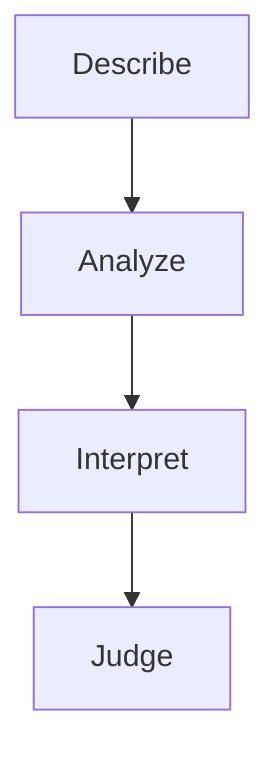

# Art Appreciation — การเห็นคุณค่าศิลปะ

Art appreciation (การเห็นคุณค่าศิลปะ) teaches children to look carefully, think deeply, and speak kindly about art: their own work, their classmates' work, and masterpieces from Thailand and the world. It is the heart of Standard ศ 1.2 (การวิเคราะห์ วิจารณ์ และเห็นคุณค่า).

## 1 | Grade Band Breakdown

| Grade | Key Content |
|---|---|
| ป.1–3 | Looking at art, telling what is seen, describing colors and shapes (พรรณนา) |
| ป.4–6 | Describing (พรรณนา) and analyzing (วิเคราะห์) artworks, comparing Thai and foreign art |
| ม.1–3 | The four steps of art criticism: describe, analyze, interpret, judge |
| ม.4–6 | Judging (วิจารณ์) art with reasons, appreciating art movements, visiting galleries (หอศิลป์) |

## 2 | The Four Steps of Criticism

From lower secondary, children learn a simple framework for talking about any artwork, based on art criticism theory (ทฤษฎีการวิจารณ์ศิลปะ):

1. Describing (พรรณนา): what do I see? List the subject, colors, lines, and shapes
2. Analyzing (วิเคราะห์): how is it arranged? Look at composition (องค์ประกอบ), balance, and technique
3. Interpreting (ตีความ): what does it mean? What mood or story does the artist express?
4. Judging (วิจารณ์): is it good art? Give reasons, not just "I like it" or "I don't"

## 3 | Appreciating Thai and World Art

| Source | Thai | What children learn |
|---|---|---|
| Temple murals | จิตรกรรมฝาผนัง | Stories of the Buddha told in paint |
| Thai crafts | งานประณีตศิลป์ | Skill and patience in baskets, lacquerware, and nielloware |
| Museums and galleries | พิพิธภัณฑ์และหอศิลป์ | How to behave and what to look for |
| World masterpieces | ผลงานชิ้นเอกของโลก | Paintings by famous artists from many countries |

Students compare Thai and foreign artworks on the same themes: how does a Thai mural and a Western painting each tell a story? Both approaches are valued, and children learn that there is no single correct answer in art.

## 4 | Art in Daily Life

Appreciation is not only for museums. Children learn to value the art around them: the design of a shop sign, the beauty of a monk's robe, the patterns on a grandmother's cloth (ผ้าซิ่น). Parents build appreciation by displaying the child's artwork at home, praising effort and ideas rather than only neatness, and asking open questions such as "what do you think the artist wanted to say?" (คิดว่าศิลปินต้องการสื่ออะไร). A family visit to a local gallery (หอศิลป์) or the National Museum (พิพิธภัณฑสถานแห่งชาติ) turns a weekend trip into a lesson.

## Key Thai Terminology

| Thai | English |
|---|---|
| การเห็นคุณค่าศิลปะ | Art appreciation |
| พรรณนา | Describing |
| วิเคราะห์ | Analyzing |
| ตีความ | Interpreting |
| วิจารณ์ | Judging, criticizing |
| ทฤษฎีการวิจารณ์ศิลปะ | Art criticism theory |
| หอศิลป์ | Art gallery |
| พิพิธภัณฑ์ | Museum |
| ผลงานชิ้นเอก | Masterpiece |
| รสนิยม | Taste, aesthetic judgment |
| ศิลปิน | Artist |
| องค์ประกอบ | Composition |

## Knowledge Connections

- [[08_Art_History]]: criticism needs history: knowing when and where art was made
- [[02_Painting]]: technique knowledge makes analysis sharper
- [[07_Thai_Traditional_Art]]: appreciating Thai art starts with understanding its symbols and stories
- [[01_Drawing]]: children who draw notice more details in others' work
- [[04_Design]]: everyday design is judged with the same four steps

## Related

- [[Arts - Overview|← Back to Arts BOK]]
- [[00_overview|Visual Arts Overview]]

## Sources

- Office of the Basic Education Commission (OBEC). Basic Education Core Curriculum B.E. 2551 (2008), revised B.E. 2560 (2017), Strand 1: Visual Arts (สาระที่ 1: ทัศนศิลป์), Standard ศ 1.2 (การวิเคราะห์ วิจารณ์ และเห็นคุณค่างานทัศนศิลป์).
- Institute for the Promotion of Teaching Science and Technology (IPST). Art education textbooks (หนังสือเรียนศิลปะ) for primary and secondary levels.
