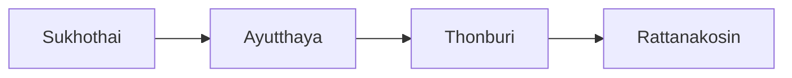

# Art History — ประวัติศาสตร์ศิลป์

Art history (ประวัติศาสตร์ศิลป์) helps children understand that every artwork was made in a time and place, and that Thai art belongs to a story stretching from Sukhothai (สุโขทัย) to the present day. It connects Standard ศ 1.2 with social studies, religion, and culture.

## 1 | Grade Band Breakdown

| Grade | Key Content |
|---|---|
| ป.1–3 | Art in daily life and the local community, art from the child's own province |
| ป.4–6 | Thai art periods: Sukhothai (สุโขทัย), Ayutthaya (อยุธยา), Thonburi (ธนบุรี), Rattanakosin (รัตนโกสินทร์) |
| ม.1–3 | World art movements: Renaissance (ยุคเรอเนซองส์), Impressionism (อิมเพรสชันนิสม์), modern art (ศิลปะสมัยใหม่) |
| ม.4–6 | Comparing Thai and international art, art heritage (มรดกทางศิลปวัฒนธรรม), famous artists |

## 2 | Thai Art Periods

| Period | Thai | Famous works |
|---|---|---|
| Sukhothai | สุโขทัย | The walking Buddha (พระพุทธรูปปางลีลา), celadon pottery |
| Ayutthaya | อยุธยา | Grand palace murals, bronze and crystal Buddhas, nielloware |
| Thonburi | ธนบุรี | Art that revived Ayutthaya traditions after 1767 |
| Rattanakosin | รัตนโกสินทร์ | Wat Phra Kaew (วัดพระแก้ว) murals, contemporary Thai art |

## 3 | World Art Movements

| Movement | Thai | What to know |
|---|---|---|
| Renaissance | ยุคเรอเนซองส์ | Realistic painting and sculpture in 14th to 16th century Europe; Leonardo da Vinci and Michelangelo |
| Impressionism | อิมเพรสชันนิสม์ | Loose brushwork and the study of light in 19th century France; Monet and Renoir |
| Modern art | ศิลปะสมัยใหม่ | New styles after 1900: Picasso, abstract art, Thai modernists such as Fua Haripitak (เฟื้อ หริพิทักษ์) |
| Contemporary art | ศิลปะร่วมสมัย | Art of today: video, installation, and Thai artists showing worldwide |

## 4 | Comparing Thai and World Art

Students learn to compare: how is a Thai mural different from a Renaissance fresco? Both tell religious stories, but Thai art is flat and decorative while Renaissance art seeks depth and realism. Comparing builds the vocabulary of art criticism and pride in both Thai heritage (มรดกทางศิลปวัฒนธรรม) and world culture. Famous artists and their lives are also studied, so children see that great art comes from practice, curiosity, and hard work.

## Key Thai Terminology

| Thai | English |
|---|---|
| ประวัติศาสตร์ศิลป์ | Art history |
| สุโขทัย | Sukhothai period |
| อยุธยา | Ayutthaya period |
| ธนบุรี | Thonburi period |
| รัตนโกสินทร์ | Rattanakosin period |
| ยุคเรอเนซองส์ | Renaissance |
| อิมเพรสชันนิสม์ | Impressionism |
| ศิลปะสมัยใหม่ | Modern art |
| ศิลปะร่วมสมัย | Contemporary art |
| มรดกทางศิลปวัฒนธรรม | Art and cultural heritage |
| พระพุทธรูปปางลีลา | Walking Buddha image |
| จิตรกรรมฝาผนัง | Mural painting |

## Knowledge Connections

- [[07_Thai_Traditional_Art]]: the same periods explain Thai patterns, painting, and architecture
- [[06_Art_Appreciation]]: history gives the context that criticism needs
- [[02_Painting]]: Impressionism is the story of painters changing how color is used
- [[03_Sculpture]]: Sukhothai and Ayutthaya sculptors made Thailand's most famous Buddha images
- [[01_Drawing]]: master drawings show how famous paintings began

## Related

- [[Arts - Overview|← Back to Arts BOK]]
- [[00_overview|Visual Arts Overview]]

## Sources

- Office of the Basic Education Commission (OBEC). Basic Education Core Curriculum B.E. 2551 (2008), revised B.E. 2560 (2017), Strand 1: Visual Arts (สาระที่ 1: ทัศนศิลป์), Standard ศ 1.2 (การวิเคราะห์ วิจารณ์ และเห็นคุณค่างานทัศนศิลป์).
- Fine Arts Department, Ministry of Culture. Thai art and heritage references (เอกสารศิลปวัฒนธรรม).
- Institute for the Promotion of Teaching Science and Technology (IPST). Art education textbooks (หนังสือเรียนศิลปะ) for primary and secondary levels.
