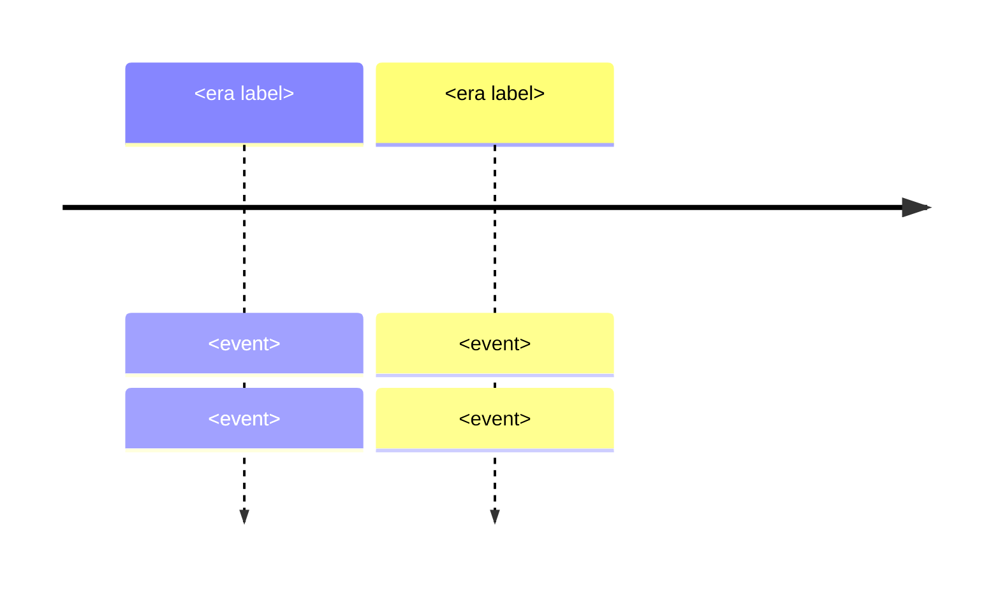

# Philosophy Notes: Shared Authoring Spec (for build subagents)

You are writing ONE or MORE topic notes for `F:/obsidian_note/general-knowledge/Philosophy/`. Read this whole file first, then follow it exactly.

## Audience and purpose

Adult general knowledge for a Thai family: lifelong reference, NOT exam prep. No grade bands, no course codes, no quizzes. Readable, warm, precise. Assume zero prior philosophy knowledge but an intelligent adult reader.

## Language

English narrative with Thai terms in parentheses on first introduction of each key term: "Stoicism (ลัทธิสโตอิก)". Thai must be correct Thai script only: no Chinese/Japanese characters anywhere.

## Note template (follow section order exactly)

````markdown
---
tags: [general-knowledge, philosophy, <3-6 topic-specific-lowercase-tags>]
source: "<canonical primary/secondary books used, see per-topic brief>"
created: 2026-09-05
---

# <NN> — <English Title> — <Thai Title>

> *"<One memorable quote or one-line thesis from the tradition, in English>"*

<1-2 paragraph opening: what this topic is and why an adult should care. Thai terms in parens.>

---

## 1 | Historical Context

<When, where, who. What the world looked like and what problem these thinkers were responding to. 2-3 short paragraphs or a compact table.>

## 2 | Core Concepts

<The meat. Use tables heavily: | Concept | Thai | Meaning | Example |. One sub-section (###) per major idea/thinker as fits. Aim for 3-6 sub-sections or tables.>

## 3 | Timeline



## 4 | Key Thinkers and Ideas

<Table: | Thinker | Dates | Big Idea | Must-Know Work | then 1 short paragraph per thinker (2-4 sentences).>

## 5 | Thai Terminology

| Thai | English | Notes |
|---|---|---|
<8-14 rows, the terms this note introduces>

## 6 | Why It Matters Today

<3-4 concrete adult-life examples: media arguments, workplace decisions, parenting, AI-era questions, Thai daily life. Tie to Thai context where natural (Buddhism, Sufficiency Economy/พอเพียง, Thai civics).>

## 7 | Further Reading

- <2-4 books, from the per-topic brief below or canonically correct. Format: *Title* by Author: why to read it.>

## Related

- [[Philosophy/00_overview|← Philosophy Overview]]
- [[<NN-1 or previous note in track>]]
- [[<next note>]]
- [[<cross-vault target, see link list below>]]
````

## Hard formatting rules

1. Colons (:) everywhere, NEVER em-dashes (—) in body text or tables. Exception: the H1 title uses " — " separators as shown in the template.
2. Mermaid only, no ASCII diagrams. Obsidian-safe mermaid: use `flowchart` not `graph`; NO parentheses, ampersands, or numbered dots ("1.") inside node labels; quote all labels `["like this"]`. `timeline` blocks are allowed: `Era : event : event`.
3. Tables over paragraphs wherever structure exists.
4. Wikilinks: use the short filename form exactly as given, e.g. `[[04_Plato]]`. For cross-vault links use folder-qualified form, e.g. `[[Science/Fundamental/01_Scientific_Method|Scientific Method]]`. Obsidian resolves these.
5. Self-contained: a reader who never opened another note gets full value from this one.
6. Every wikilink target must be one from the VERIFIED TARGET LIST below or a Philosophy note filename (`NN_PascalName`). Do not invent link targets.
7. Single backslashes if you use any LaTeX (rare here). Prefer plain text.
8. No quiz questions, no exercises, no "In this lesson you will learn" phrasing. This is reference prose, not a course.

## VERIFIED TARGET LIST (cross-vault wikilinks, copy the link text exactly)

- `[[Science/Fundamental/01_Scientific_Method|the Scientific Method note]]`
- `[[Science/Advance/Computer Science/12_Digital_Citizenship]]`
- `[[Science/Advance/Computer Science/07_Data_Structures]]`
- `[[Science/Advance/Computer Science/01_Computational_Thinking]]`
- `[[Science/Advance/Computer Science/11_Artificial_Intelligence]]`
- `[[Mathematics/Advance/01_Sets_and_Logic]]`
- `[[Mathematics/Advance/21_Mathematical_Reasoning]]`
- `[[Social Studies/01 Religion/01_Buddhist_Principles|Buddhist Principles]]`
- `[[Social Studies/01 Religion/03_Other_Religions|Other Religions]]`
- `[[Social Studies/01 Religion/04_Moral_Reasoning|Moral Reasoning]]`
- `[[Social Studies/02 Civics/01_Democracy_and_Government|Democracy and Government]]`
- `[[Social Studies/02 Civics/06_Government_Structure|Government Structure]]`
- `[[Social Studies/02 Civics/12_Media_Literacy|Media Literacy]]`
- `[[Social Studies/03 Economics/03_Sufficiency_Economy_Philosophy|Sufficiency Economy Philosophy]]`
- `[[Social Studies/03 Economics/05_Economic_Systems|Economic Systems]]`
- `[[Social Studies/03 Economics/10_Economic_Indicators|Economic Indicators]]`
- `[[Social Studies/04 History/02_World_History_and_Civilizations|World History and Civilizations]]`
- `[[ภาษาไทย/การอ่าน/07_การอ่านวิเคราะห์|การอ่านวิเคราะห์]]`
- `[[Health-PE/01 Health Education/04_Mental_Health|Mental Health]]`
- `[[work-careers-Technology/05 Technology/21_Digital_Citizenship]]`
- `[[work-careers-Technology/04 Career Education/16_Work_Ethics|Work Ethics]]`

Philosophy sibling notes: 01_What_Is_Philosophy, 02_Pre_Socratic_Philosophers, 03_Socrates_and_the_Socratic_Method, 04_Plato, 05_Aristotle, 06_Hellenistic_Philosophy, 07_Medieval_Philosophy, 08_Islamic_and_Jewish_Philosophy, 09_Renaissance_and_Humanism, 10_Rationalism, 11_Empiricism, 12_Enlightenment_and_Social_Contract, 13_Kant_and_German_Idealism, 14_Utilitarianism_and_Ethical_Theories, 15_Existentialism, 16_Pragmatism, 17_Analytic_Philosophy, 18_Political_Philosophy_and_Justice, 19_Philosophy_of_Science, 20_Eastern_Philosophy_Beyond_Thailand, 21_Philosophy_of_Mind_and_AI, 22_Applied_Ethics_Today

## Quality bar

- 8-15 KB per note (roughly 1,200-1,800 words of substance). Not stubs, not bloated.
- Historically and philosophically accurate: get dates, works, and doctrines right. When traditions have standard scholarly dates, use conventional ones (e.g. c. 470-399 BCE for Socrates).
- Neutral on contested questions (religion, politics): present arguments, not verdicts. Say "defenders reply..." rather than taking sides.
- Compare with Thai Buddhist concepts where genuinely illuminating (e.g. non-self vs personal identity, Stoic equanimity vs อุเบกขา, sufficient economy vs moderation) but do not force parallels or claim identities.
- After writing each file: re-read your own file and fix any em-dash outside H1, any ASCII diagram, any unverified wikilink.
