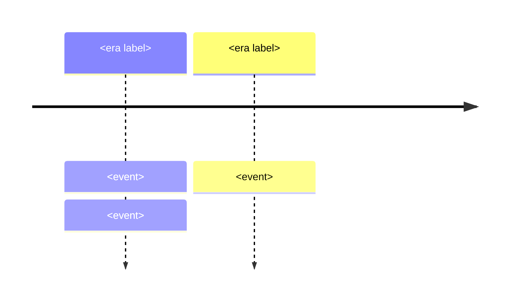

# World Literature Notes: Shared Authoring Spec (for build subagents)

You are writing ONE OR MORE topic notes for `F:/obsidian_note/general-knowledge/World Literature/`. Read this whole file first, then follow it exactly. You are building part of a 22-note domain; other agents are building the other numbers. Only create the files assigned to you.

## Audience and purpose

Adult general knowledge for a Thai family: lifelong reference, NOT exam prep. No grade bands, no course codes, no quizzes. Readable, warm, precise. Assume zero prior literature background but an intelligent adult reader. The goal is to give the reader the taste, shape, and meaning of great works: what happens, who wrote it, why it still speaks.

## Language

English narrative with Thai terms in parentheses on first introduction of each key term: "tragedy (โศกนาฏกรรม)". Thai must be correct Thai script only: NO Chinese/Japanese/Korean characters anywhere, and no Latin letters glued inside Thai words (e.g. ควam is forbidden; it must be ความ).

## Note template (follow section order exactly)

````markdown
---
tags: [general-knowledge, world-literature, <3-6 topic-specific-lowercase-tags>]
source: "<the works themselves; standard English translations consulted; see per-topic brief>"
created: 2026-09-06
---

# <NN> — <English Title> — <Thai Title>

> *"<One memorable short quote from one of the works, in English translation>"*

<1-2 paragraph opening: what this note covers and why an adult should care. Thai terms in parens.>

---

## 1 | The Works at a Glance

| Detail | Info |
|---|---|
| **Author** | <name, dates> |
| **Published** | <year(s), original language> |
| **Genre** | <genre(s), Thai in parens> |
| **Setting** | <when and where the story happens> |
| **Famous translations** | <2-3 English translations; note if Thai editions exist, e.g. "Thai editions available" without inventing publisher names> |

<One short paragraph: the author's life context that matters for the work.>

## 2 | Story and Structure

<The plot, told as a story. Use ### sub-sections per act/part/book when the work has that structure (musical-note style: "### Act 1: ..."). End with a compact characters table: | Character | Role | One line |. Do NOT spoil without warning: it is fine and expected to tell the whole story, but flag the climax with a note like "Spoilers follow: this note tells the whole story." at the top of section 2.>

## 3 | Key Passages

<2-3 short quoted passages (blockquotes) that show the work's voice. English translation of the original, followed by a Thai free rendering in a nested blockquote, then one line on why the passage matters. The Thai rendering is yours: keep it faithful and natural, marked (แปลอิสระ) if it is your own rendering rather than a published translation.>

## 4 | Themes and Style

<One table: | Theme | Thai | How the work treats it | with 4-8 rows. Then 1-2 paragraphs on the work's style: voice, structure, famous techniques (e.g. stream of consciousness, irony, chorus).>

## 5 | Timeline



<Events: the work's publication, the author's key dates, and 2-4 surrounding historical or literary events that orient it.>

## 6 | Thai Terminology

| Thai | English | Notes |
|---|---|---|
<8-14 rows, the literary terms this note introduces>

## 7 | Why It Matters Today

<3-4 concrete adult-life or contemporary-culture examples: a film/series/game that retells it, a modern political or social debate it illuminates, a parenting or teaching angle, a Thai connection where natural (รามเกียรติ์↔Ramayana for epics, Thai soap operas for tragedy, Buddhist ideas for inner-struggle novels: only where genuinely illuminating, never forced).>

## 8 | Further Reading

- <2-4 books or editions. Format: *Title* by Author: why to read it. Include at least one modern readable translation or companion.>

## Related

- [[World Literature/00_overview|← World Literature Overview]]
- [[<previous note>]]
- [[<next note>]]
- [[<cross-vault targets from the per-topic brief below>]]
````

## Hard formatting rules

1. Colons (:) everywhere, NEVER em-dashes (—) in body text or tables. Exception: the H1 title uses " — " separators as shown in the template.
2. Mermaid only, no ASCII diagrams. Obsidian-safe mermaid: use `flowchart` not `graph`; NO parentheses, ampersands, or numbered dots ("1.") inside node labels; quote all labels `["like this"]`. `timeline` blocks are allowed: `Era : event : event`.
3. Tables over paragraphs wherever structure exists.
4. Wikilinks: use the exact strings from the VERIFIED TARGET LIST or the sibling-note list below. Do not invent link targets. Sibling notes use the bare filename `[[04_Roman_Literature]]`.
5. Self-contained: a reader who never opened another note gets full value from this one.
6. Single backslashes if you use any LaTeX (rare here). Prefer plain text.
7. No quiz questions, no exercises, no "In this lesson you will learn" phrasing. Reference prose, not a course.
8. Quotes: keep each quoted passage under ~40 words (standard fair-use scale). Prefer works in the public domain for longer quotes. Attribute every quote to its work.
9. The oralita_md musical vault is a DIFFERENT vault: do NOT wikilink it. Mention it in prose only, e.g. "the vault's musical notes for Les Misérables live in the oralita_md vault (personal/musical/Les Miserable/)".
10. Neutral on contested questions (religion, politics): describe what works say and why they mattered; do not take sides on real-world debates.
11. Accuracy: get dates, titles, and plot facts right. Use conventional scholarly dates (e.g. Homer c. 8th century BCE, Gilgamesh c. 2100-1200 BCE compiled, Dante 1265-1321). When a date is uncertain say "c.".

## Sibling notes (exact filenames, use bare-name wikilinks)

01_How_to_Read_Literature, 02_Ancient_Epics, 03_Greek_Drama, 04_Roman_Literature, 05_Dante_and_the_Medieval_World, 06_Shakespeare, 07_Cervantes_and_the_Early_Novel, 08_Enlightenment_Literature, 09_Goethe_and_German_Literature, 10_Russian_Literature, 11_French_19th_Century, 12_English_19th_Century, 13_American_Classics, 14_Modernism, 15_Dystopian_Fiction, 16_Magical_Realism_and_Latin_America, 17_Asian_Literature, 18_African_and_Middle_Eastern_Literature, 19_Poetry_of_the_World, 20_Childrens_Classics_and_Folk_Tales, 21_ASEAN_and_Southeast_Asian_Literature, 22_Literary_Movements_Overview

Note: 21 and 22 exist and are part of the domain (user approved all 22).

## VERIFIED TARGET LIST (cross-vault wikilinks, copy the link text exactly)

Philosophy (all exist on disk):
- `[[Philosophy/07_Medieval_Philosophy|Medieval Philosophy]]`
- `[[Philosophy/12_Enlightenment_and_Social_Contract|Enlightenment and Social Contract]]`
- `[[Philosophy/13_Kant_and_German_Idealism|Kant and German Idealism]]`
- `[[Philosophy/15_Existentialism|Existentialism]]`
- `[[Philosophy/17_Analytic_Philosophy|Analytic Philosophy]]`

Social Studies (all exist on disk):
- `[[Social Studies/02 Civics/12_Media_Literacy|Media Literacy]]`
- `[[Social Studies/04 History/02_World_History_and_Civilizations|World History and Civilizations]]`
- `[[Social Studies/04 History/12_Ancient_Civilizations|Ancient Civilizations]]`
- `[[Social Studies/04 History/13_SE_Asian_History|SE Asian History]]`

Art (all exist on disk):
- `[[Art/03 Performing Arts/03_Creative_Drama|Creative Drama]]`
- `[[Art/03 Performing Arts/04_Performance_Production|Performance Production]]`

ภาษาไทย (all exist on disk):
- `[[ภาษาไทย/การอ่าน/07_การอ่านวิเคราะห์|การอ่านวิเคราะห์]]`
- `[[ภาษาไทย/การอ่าน/12_การอ่านวรรณคดีและวรรณกรรม|การอ่านวรรณคดีและวรรณกรรม]]`
- `[[ภาษาไทย/วรรณคดีและวรรณกรรม/การวิเคราะห์วรรณคดี/01_การวิเคราะห์องค์ประกอบ|การวิเคราะห์องค์ประกอบ]]`
- `[[ภาษาไทย/วรรณคดีและวรรณกรรม/การวิเคราะห์วรรณคดี/02_วรรณคดีวิจักษณ์|วรรณคดีวิจักษณ์]]`
- `[[ภาษาไทย/วรรณคดีและวรรณกรรม/นิทานและตำนาน/01_นิทานพื้นบ้าน|นิทานพื้นบ้าน]]`
- `[[ภาษาไทย/วรรณคดีและวรรณกรรม/นิทานและตำนาน/03_นิทานอีสป|นิทานอีสป]]`
- `[[ภาษาไทย/วรรณคดีและวรรณกรรม/สมัยรัตนโกสินทร์/01_รามเกียรติ์|รามเกียรติ์]]`
- `[[ภาษาไทย/วรรณคดีและวรรณกรรม/สมัยอยุธยา/04_กาพย์เห่เรือ|กาพย์เห่เรือ]]`
- `[[ภาษาไทย/หลักการใช้ภาษาไทย/19_กาพย์|กาพย์]]`
- `[[ภาษาไทย/หลักการใช้ภาษาไทย/20_กลอน|กลอน]]`
- `[[ภาษาไทย/หลักการใช้ภาษาไทย/22_ฉันท์|ฉันท์]]`

Forward contracts (World Religions and Mythology domain: planned, not built yet: link anyway, exactly these names):
- `[[02_Christianity]]`
- `[[12_What_Is_Mythology]]`
- `[[13_Greek_Mythology]]`
- `[[16_Mesopotamian_Mythology]]`
- `[[17_Hindu_Mythology]]`
- `[[18_East_Asian_Mythology]]`
- `[[19_Universal_Mythic_Archetypes]]`

## Quality bar

- 8-15 KB per note (roughly 1,200-1,800 words of substance). Not stubs, not bloated.
- The plot summary is the heart: a reader who has not read the book should finish section 2 understanding the whole story and caring about it.
- Historically accurate: dates, attributions, and publication facts right.
- After writing each file: re-read your own file and fix any em-dash outside H1, any ASCII diagram, any unverified wikilink, any Latin-mid-Thai corruption, any CJK character.

## Per-topic briefs

### 01 — How to Read Literature
Filename: 01_How_to_Read_Literature.md. Title: "01 — How to Read Literature — วิธีอ่านวรรณกรรม".
The gateway note: the reading toolkit itself. Plot (โครงเรื่อง), character (ตัวละคร), theme (แก่นเรื่อง), style (ลีลาการเขียน); how to notice symbolism and point of view; the difference between reading for plot and reading for meaning; why stories matter for adults (empathy, memory, moral imagination). Reference the works later notes will use. Cross-links: การวิเคราะห์องค์ประกอบ, วรรณคดีวิจักษณ์, การอ่านวรรณคดีและวรรณกรรม, การอ่านวิเคราะห์, and forward to 02 and 06 as examples. Further reading: *The Well-Educated Mind* (Bauer), *How to Read Literature Like a Professor* (Foster), *How to Read a Book* (Adler).

### 02 — Ancient Epics
Filename: 02_Ancient_Epics.md. Title: "02 — Ancient Epics — มหากาพย์โบราณ".
Gilgamesh (c. 2100 BCE, oldest story we know; Enkidu, the flood, the search for immortality), the Iliad (Achilles' rage, Hector, honor), the Odyssey (the long way home, cunning). The epic (มหากาพย์) form: oral tradition, meter, the hero's journey (เส้นทางของวีรบุรุษ) as a preview of Campbell. Cross-links: 16_Mesopotamian_Mythology, 13_Greek_Mythology, Ancient Civilizations, รามเกียรติ์ (the Thai epic as bridge), 01. Key passage: the opening lines of the Iliad, or Gilgamesh mourning Enkidu.

### 03 — Greek Drama
Filename: 03_Greek_Drama.md. Title: "03 — Greek Drama — ละครกรีก".
The birth of theatre in the Dionysia festival: Sophocles' Oedipus Rex (โศกนาฏกรรม: the pattern of hubris, reversal, recognition), Euripides' Medea, Aristophanes' Lysistrata (สุขนาฏกรรม). Catharsis (การปลดปล่อยอารมณ์), chorus, the three unities, fate vs choice. Cross-links: Creative Drama, Performance Production, 13_Greek_Mythology, 02. Key passage: Oedipus' blindness speech or the messenger scene.

### 04 — Roman Literature
Filename: 04_Roman_Literature.md. Title: "04 — Roman Literature — วรรณกรรมโรมัน".
Virgil's Aeneid (the empire's founding story: Aeneas, Dido, duty pietas), Ovid's Metamorphoses (myth as change; the book Shakespeare and painters raided), a nod to Horace and Catullus for poetry. Roman literature as Greek inheritance re-forged for empire; literature as propaganda and as resistance. Cross-links: 13_Greek_Mythology, Ancient Civilizations, 02, 03. Key passage: the death of Dido, or Aeneas in the underworld.

### 05 — Dante and the Medieval World
Filename: 05_Dante_and_the_Medieval_World.md. Title: "05 — Dante and the Medieval World — ดันเตกับโลกยุคกลาง".
The Divine Comedy's structure (Inferno, Purgatorio, Paradiso: terza rima, 100 cantos, the number three), Inferno highlights (Paolo and Francesca, Ulysses, the frozen traitors), Virgil as guide. Chaucer's Canterbury Tales as the other medieval voice: pilgrimage, estates satire, the Wife of Bath. The medieval cosmos: everything in its place. Cross-links: 02_Christianity (forward), Philosophy/07_Medieval_Philosophy, World History and Civilizations, 04. Key passage: "Abandon all hope, ye who enter here" (and note the famous mistranslation nuance) or the Francesca episode.

### 06 — Shakespeare
Filename: 06_Shakespeare.md. Title: "06 — Shakespeare — เชกสเปียร์".
Hamlet as the deep dive (the play within the play, "To be or not to be", delay and conscience) plus Macbeth (ambition, the blood that will not wash off), and the sonnets (Sonnet 18, Sonnet 116). Blank verse, soliloquy (บทพูดเดี่ยว), the Globe. Why every generation re-stages him. Cross-links: Creative Drama, Performance Production, 05, 07. Thai note: Shakespeare in Thai translation (พระเจ้าช้างเผือก etc.) exists; mention the tradition of stage adaptations without inventing specifics. Key passage: "To be or not to be" with Thai rendering.

### 07 — Cervantes and the Early Novel
Filename: 07_Cervantes_and_the_Early_Novel.md. Title: "07 — Cervantes and the Early Novel — เซร์บันเตสกับนวนิยายยุคแรก".
Don Quixote (1605/1615): the first modern novel; a man who reads too many chivalric romances sets out as a knight. The windmills scene as the emblem of reality vs illusion (โลกจริงกับจินตนาการ); Sancho Panza as the earth to Quixote's air; how the novel form was born (prose, everyday speech, mixed voices). Cross-links: 15_Existentialism (later echoes), 01, 06. Key passage: the windmills.

### 08 — Enlightenment Literature
Filename: 08_Enlightenment_Literature.md. Title: "08 — Enlightenment Literature — วรรณกรรมยุคเรืองปัญญา".
Voltaire's Candide ("the best of all possible worlds" shredded by satire), Swift's Gulliver's Travels and A Modest Proposal (satire's deadpan), Defoe's Robinson Crusoe (reason, labor, empire). Satire (วรรณกรรมเสียดสี) as the Enlightenment's weapon: reason against optimism, injustice, and cant. Cross-links: Philosophy/12_Enlightenment_and_Social_Contract, World History and Civilizations, 07. Key passage: the end of Candide, "we must cultivate our garden" (Il faut cultiver notre jardin) with Thai rendering.

### 09 — Goethe and German Literature
Filename: 09_Goethe_and_German_Literature.md. Title: "09 — Goethe and German Literature — เกอเทอกับวรรณกรรมเยอรมัน".
Faust (Part One): the scholar who sells his soul to Mephistopheles for one moment worth eternity; Gretchen. The Sorrows of Young Werther: the romantic storm that swept Europe. Sturm und Drang (พายุและแรงขับ) and the romantic bargain: knowledge, love, and what they cost. Cross-links: Philosophy/13_Kant_and_German_Idealism (same era), 10_Russian_Literature (inheritors), 08. Key passage: Faust's wager, or "Two souls, alas, dwell in my breast".

### 10 — Russian Literature
Filename: 10_Russian_Literature.md. Title: "10 — Russian Literature — วรรณกรรมรัสเซีย".
The soul at war with itself. Tolstoy: War and Peace's scale and Anna Karenina's first sentence and doomed love. Dostoevsky: Crime and Punishment (Raskolnikov's murder, the psychology of guilt, Sonya) and the Brothers Karamazov (the Grand Inquisitor). Chekhov: the short story's quiet ache. Cross-links: Philosophy/15_Existentialism (Dostoevsky's influence), 09, 11. Key passage: the beginning of Anna Karenina, or the Grand Inquisitor's argument.

### 11 — French 19th Century
Filename: 11_French_19th_Century.md. Title: "11 — French 19th Century — วรรณกรรมฝรั่งเศสศตวรรษที่ 19".
Hugo's Les Misérables (Jean Valjean, Javert, the barricades; the bishop's candlesticks) — note in prose that the vault's musical notes for Les Misérables live in the oralita_md vault (personal/musical/Les Miserable/), NO wikilink. Balzac's La Comédie humaine (society as a system), Flaubert's Madame Bovary (realism's masterpiece: the provincial dreamer). Realism (สัจนิยม): the novel as microscope on society. Cross-links: 10, 12, World History and Civilizations. Key passage: the bishop and Jean Valjean, or Emma Bovary's end.

### 12 — English 19th Century
Filename: 12_English_19th_Century.md. Title: "12 — English 19th Century — วรรณกรรมอังกฤษศตวรรษที่ 19".
Austen's Pride and Prejudice (irony, the marriage plot, Elizabeth Bennet), Dickens' Great Expectations or A Tale of Two Cities (London's injustice, unforgettable characters), the Brontës: Jane Eyre (the plain heroine's moral self) and Wuthering Heights (passion against the moor). Manners, injustice, passion: the novel takes over England. Cross-links: 11, 13, English Skill is the same vault? NO: English Skill lives in the same general-knowledge vault (English Skill/ folder) but its notes are links to the GitHub repo; do not wikilink them. Use only prose mention. Key passage: the first line of Pride and Prejudice.

### 13 — American Classics
Filename: 13_American_Classics.md. Title: "13 — American Classics — วรรณกรรมอเมริกันคลาสสิก".
Two generations: the 19th century (Melville's Moby-Dick, Twain's Huckleberry Finn, Poe's short stories and the birth of detective/horror fiction) and the 20th (Fitzgerald's The Great Gatsby, Hemingway's The Old Man and the Sea, Steinbeck's Of Mice and Men or Grapes of Wrath). The American voice: frontier, money, the dream and its shadow. Cross-links: World History and Civilizations, 12, 14. Key passage: the last line of The Great Gatsby ("So we beat on, boats against the current..."), or Call me Ishmael.

### 14 — Modernism
Filename: 14_Modernism.md. Title: "14 — Modernism — วรรณกรรมสมัยใหม่นิยม".
The mind turned inward after WWI. Kafka's Metamorphosis (Gregor Samsa wakes as an insect: the entry point), Joyce's Ulysses (one day, stream of consciousness กระแสสำนึก), Woolf's Mrs Dalloway and To the Lighthouse, Eliot's The Waste Land ("April is the cruellest month"). Modernism's bets: interiority, fragmentation, myth as structure. Cross-links: Philosophy/17_Analytic_Philosophy (same era of doubt), 15, 16, 13. Key passage: the first lines of The Metamorphosis.

### 15 — Dystopian Fiction
Filename: 15_Dystopian_Fiction.md. Title: "15 — Dystopian Fiction — วรรณกรรมดิสโทเปีย".
Warnings from the future: Orwell's 1984 (Newspeak, Big Brother, doublethink) and Animal Farm; Huxley's Brave New World (pleasure as control); Bradbury's Fahrenheit 451 (burning books); Golding's Lord of the Flies (civilization's skin). Dystopia (ดิสโทเปีย) vs utopia (ยูโทเปีย); surveillance, language control, and why these books keep being banned and read. Cross-links: Social Studies/02 Civics/12_Media_Literacy (media and information control), 14, 13. Key passage: "War is Peace. Freedom is Slavery. Ignorance is Strength."

### 16 — Magical Realism and Latin America
Filename: 16_Magical_Realism_and_Latin_America.md. Title: "16 — Magical Realism and Latin America — สัจนิยมมหัศจรรย์กับลาตินอเมริกา".
García Márquez's One Hundred Years of Solitude (Macondo, the Buendías, the ice, the ending; the door-note), Borges' labyrinths and libraries, Allende's The House of the Spirits. Magical realism (สัจนิยมมหัศจรรย์): the fantastic told with a straight face as the real. Cross-links: 19_Universal_Mythic_Archetypes (forward), 14, 18. Key passage: the first sentence of One Hundred Years of Solitude (the ice scene).

### 17 — Asian Literature
Filename: 17_Asian_Literature.md. Title: "17 — Asian Literature — วรรณกรรมเอเชีย".
Japan: Murakami (Norwegian Wood: memory and loss), Kawabata (Snow Country: beauty and distance), Bashō's haiku (the form: 5-7-5, the season word). India: Tagore's Gitanjali (the first non-European Nobel in literature, 1913). China: Mo Yan (Red Sorghum). The neighbor traditions: how close to and far from Thai letters. Cross-links: 18_East_Asian_Mythology (forward: Journey to the West), การอ่านวรรณคดีและวรรณกรรม, 17_Hindu_Mythology (forward), 19. Key passage: one Bashō haiku with Thai rendering, and a line from Gitanjali.

### 18 — African and Middle Eastern Literature
Filename: 18_African_and_Middle_Eastern_Literature.md. Title: "18 — African and Middle Eastern Literature — วรรณกรรมแอฟริกาและตะวันออกกลาง".
Achebe's Things Fall Apart (Okonkwo; the arrival of the colonizers from inside the village: the door-note), Mahfouz's Cairo Trilogy (the first Arabic Nobel, 1988), Adichie's Half of a Yellow Sun, Gibran's The Prophet (the beloved book of aphorisms). Postcolonial voices: who tells the story. Cross-links: World History and Civilizations, 16, 15. Key passage: the opening of Things Fall Apart.

### 19 — Poetry of the World
Filename: 19_Poetry_of_the_World.md. Title: "19 — Poetry of the World — กวีนิพนธ์ของโลก".
One short poem per poet, each with Thai rendering: Rumi (the ecstatic love poem, translated widely), Whitman ("Song of Myself": the self that contains multitudes), Dickinson (the compressed lightning), Neruda (the odes), Baudelaire (Les Fleurs du mal: beauty in the modern city). How poetry works: meter, image, the line; how it differs across languages; what is lost and gained in translation (การแปล). Cross-links: กาพย์, กลอน, ฉันท์ (Thai poetic forms contrasted), กาพย์เห่เรือ, 17. Key passages: the poems themselves.

### 20 — Childrens Classics and Folk Tales
Filename: 20_Childrens_Classics_and_Folk_Tales.md. Title: "20 — Children's Classics and Folk Tales — วรรณกรรมเยาวชนคลาสสิกและนิทานพื้นบ้าน".
Aesop's fables (the fox and the grapes: the moral in miniature), Grimm's collected folktales (their dark original forms), Andersen's literary fairy tales (The Little Mermaid, The Ugly Duckling), the Arabian Nights (Scheherazade's thousand-and-one strategy). Why these stories survive; reading aloud; the parent-child track's favorite note. Cross-links: นิทานอีสป (Aesop is in the Thai curriculum: the bridge), นิทานพื้นบ้าน, 12_What_Is_Mythology (forward), 02. Key passage: the frame story of the Arabian Nights.

### 21 — ASEAN and Southeast Asian Literature
Filename: 21_ASEAN_and_Southeast_Asian_Literature.md. Title: "21 — ASEAN and Southeast Asian Literature — วรรณกรรมอาเซียนและเอเชียตะวันออกเฉียงใต้".
Neighbors beyond Thailand: Vietnam (Nguyen Du's The Tale of Kieu: the national epic), Myanmar (Ma Ma Lay and the colonial-era novel), Indonesia (Pramoedya Ananta Toer's Buru Quartet), the Philippines (Rizal's Noli Me Tangere: a novel that helped start a revolution). Shared epic roots (Ramayana variants across the region, linking to รามเกียรติ์). Cross-links: SE Asian History, รามเกียรติ์, 17_Hindu_Mythology (forward), 17. Key passage: the opening of The Tale of Kieu.

### 22 — Literary Movements Overview
Filename: 22_Literary_Movements_Overview.md. Title: "22 — Literary Movements Overview — แผนที่ขบวนการวรรณกรรม".
Romanticism → Realism → Naturalism → Modernism → Postmodernism as ONE map (the reading of the whole folder in a single timeline). One table: | Movement | Thai | When | What it believed | Key works in this vault |. A mermaid flowchart connecting them. Cross-links: every sibling note via the table, 01, and World History. Note that it doubles as the folder's chronological spine.
