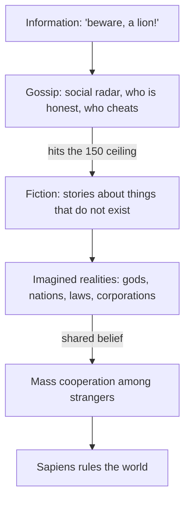

> *Source: Sapiens: A Brief History of Humankind by Yuval Noah Harari (HarperCollins, 2015), Chapter 2 "The Tree of Knowledge", PDF pp. 27–47 (printed pp. unknown)*

# 02: The Tree of Knowledge

## Key Idea

This chapter answers the question Chapter 1 left hanging: what changed about 70,000 years ago that turned a marginal ape into the planet's dominant species? The answer is deliberately unsettling: not bigger brains, sharper tools, or even language as such, a parrot can reproduce every word we say. What Sapiens alone acquired was language pointed at things that do not exist: spirits, gods, nations, corporations, rights. When enough people sincerely believe the same invented thing, strangers who have never met can trust one another, cooperate, and build at a scale no other animal can approach.

The chapter proceeds in layers. Two commonsense theories of language, that it shares information about the world, and that it exists for social gossip, prove necessary but insufficient. The decisive layer is the third: speech about fictions, which lets humans construct imagined realities. To prove this is no tale about ancient tribes, Harari tests it on the most modern object at hand, the Peugeot car company. A corporation has no physical existence, it survives the scrapping of every car and the death of every employee, yet a judge's signature can dissolve it, and still it coordinates 200,000 strangers. The machinery that builds a Peugeot is the machinery that built the first tribe: a story everyone agrees to act upon.

This chapter supplies the book's master concept. Everything that follows, farming, empires, money, religion, capitalism, science, is the further history of imagined realities and of the struggle to make millions believe them. It also redraws the boundary between biology and history: genes set the arena; stories decide the game. Hold on to that distinction and the rest of *Sapiens* reads as one long variation on it.

## Key Concepts

### Imagined realities

Things that exist only in collective imagination, gods, nations, money, human rights, laws, corporations, which scholars call fictions, social constructs, or imagined realities. An imagined reality is not a lie: the liar knows the truth, whereas an imagined reality is sincerely believed by everyone, and while that belief lasts it exerts real force in the world. Because millions can share them, imagined realities are the only known basis for mass cooperation among strangers; their rise produced the dual reality we have inhabited since the revolution, the imagined half now holding the objective half's fate.

### Gossip and the 150 threshold

Language as social radar. Survival depends on knowing who is honest and who cheats, and bands grew by exchanging such gossip, the much-maligned ability that is in fact essential for cooperation in numbers. But gossip has a measured ceiling of about 150 individuals: below it, intimacy and reputation hold a group together; above it, they cannot. The threshold makes the chapter's argument quantitative, past 150, only fiction can bind strangers, and quietly explains later inventions: kings, law books, writing.

### Legal fictions and the limited liability company

The chapter's proof that fiction is not a primitive leftover: the corporation. Peugeot SA owns property, pays taxes, and stands trial, yet no car, employee, manager, or shareholder constitutes it, and a judge can erase it without touching the physical world. It was invented out of necessity: risk that choked enterprise until people imagined companies independent of owners. The irony survives in the name, "corporation," from *corpus* ("body"), labels exactly what such legal persons lack.

### The fast lane of cultural evolution

The payoff of myth-based cooperation: revise the stories and you revise society within years, not millennia. Other animals need genetic change, chimps cannot vote out the alpha male; *Homo erectus*' tools stood still for close to two million years. Sapiens swapped five political systems within one Berliner's lifetime, and celibate elites such as the Catholic priesthood openly contradict natural selection, the Church enduring through transmitted stories, not genes. This is the mechanism behind the biology–history division: genes set the arena's parameters, history is the game, and the Cognitive Revolution is when history declared its independence.

## Memorable Quotes

> "There are no gods in the universe, no nations, no money, no human rights, no laws, and no justice outside the common imagination of human beings." (PDF p. 35)

> "Unlike lying, an imagined reality is something that everyone believes in, and as long as this communal belief persists, the imagined reality exerts force in the world." (PDF p. 39)

> "The Cognitive Revolution is accordingly the point when history declared its independence from biology." (PDF p. 44)

## Connections

- [[01_An_Animal_of_No_Significance]]: answers the question Chapter 1 left hanging: what turned a marginal ape into earth's dominant species
- [[03_A_Day_in_the_Life_of_Adam_and_Eve]]: this chapter ends by promising a look at how the lion-man's people lived; the next chapter delivers it
- [[06_Building_Pyramids]]: the imagined-reality mechanism at state scale: strangers cooperating for decades on the myth of a living god
- [[07_Memory_Overload]]: the wall at 150 outgrown: writing arrives when myth and memory can no longer carry society's information
- [[08_There_Is_No_Justice_in_History]]: justice and human rights, declared imaginary here, meet real power there
- [[10_The_Scent_of_Money]]: money, listed here among things that exist only in collective imagination, becomes the great fiction that makes trade among strangers possible
- [[Sapiens - Overview]]: navigation, chapter map, and reading paths

## Takeaway

Sapiens' superpower is shared fiction: believe the same story as enough strangers and cooperation has no natural size limit, that is why we rule the world while other apes do not.
