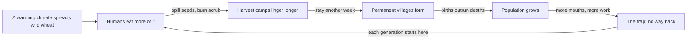

> *Source: Sapiens: A Brief History of Humankind by Yuval Noah Harari (HarperCollins, 2015), Chapter 5 "History's Biggest Fraud", PDF pp. 84–104 (printed pp. unknown)*

# 05: History's Biggest Fraud

## Key Idea

The standard story runs like this: at some point our ancestors grew smart enough to decipher nature's secrets, domesticated wheat and sheep, and gladly swapped the harsh wandering life for the settled comforts of farming. Chapter 5 dismantles that story. Harari's counter-claim is deliberately scandalous: the Agricultural Revolution was history's biggest fraud, not a leap forward but a trap. Farmers worked harder than foragers, ate worse, and died more often from starvation, disease and violence, while the plants they served ended up the true winners of the deal. Domestication ran in the wrong direction: the plants domesticated us.

To make the reframe stick, Harari arms us with two mental tools he will reuse across the book. The first is the wheat's-eye view, judging the revolution by evolutionary currency (copies of DNA) rather than human happiness, and noticing how badly the two diverge. The second is the luxury trap: small, sensible, short-sighted choices compounding into misery with no exit, because no single step was ever the fatal one. Both explain not just ancient Jericho but our own inboxes.

## The Argument

- **The baseline and the wheat's-eye view.** For 2.5 million years every human lineage fed itself by gathering and hunting. Around 10,000 years ago the experiment began in the Levant, China, and Central America. Today over 90 per cent of our calories still come from plants domesticated between 9500 and 3500 BC. Ten millennia ago wheat was one unremarkable wild grass; today it covers 2.25 million square kilometres. Its method was not to feed humans well but to command their labour: clearing fields, weeding under a scorching sun, lugging water, hauling dung. Bodies evolved to climb apple trees and run after gazelles paid the price in spines, knees, necks and arches. The word domesticate comes from *domus* (house), and the species living indoors is us.

- **What wheat never delivered.** Not a better diet: cereals are poor in minerals, hard to digest, ruinous for teeth. Not security: farmers leaned on a single staple, so one failed rain killed peasants by the millions. Not peace: fields and granaries cannot be walked away from, so farmers stayed and fought, studies of simple farming societies attribute about 15 per cent of deaths to violence. Evolution keeps accounts in copies of DNA: around 13,000 BC the Jericho oasis supported at most a roaming band of a hundred; by 8500 BC it held a cramped, disease-ridden village of a thousand.

- **The Luxury Trap.** Nothing happened at once. Foragers flourished in the Middle East for 50,000 years without agriculture. Then a warming climate let wild wheat spread, and humans ate more of it. Harvest camps stretched from weeks to permanent villages. The Natufians (12,500–9500 BC) were still hunter-gatherers who built stone houses and ground wild grain; their descendants began sowing, hoeing, weeding, and step by step the foragers became farmers. Every stage looked like common sense; compounded, the improvements became a millstone. When the plan backfired, exit was gone: change had crept in over generations and population growth had burned the boats.

- **Göbekli Tepe.** Science prefers cold economic explanations, but Göbekli Tepe (excavated from 1995 in south-eastern Turkey) complicates the story: its oldest stratum shows no houses, only monumental circles of engraved pillars up to seven tons and five metres tall, built around 9500 BC by hunter-gatherers. Something cultural, presumably religious, demanding enough that thousands of foragers from many bands cooperated over years. Thirty kilometres away, einkorn wheat was first domesticated. The temple may well have come first, and the village grown up around it: farming may have begun to feed a shrine, not to fill stomachs.

- **Victims of the revolution.** Livestock repaid humans with meat, milk, eggs, wool, and in DNA terms the deal triumphed: about a billion sheep, a billion pigs, more than a billion cattle and over 25 billion chickens. But evolutionary success is an incomplete measure: chickens that could live twelve years are slaughtered at weeks; bulls that would roam prairies pull ploughs under the whip; dairy calves are killed at birth. That gap between species-level success and individual suffering is the chapter's most important lesson, and the pattern of everything to come: collective power rising, paid for in individual misery.

## Key Concepts

### The Luxury Trap

The mechanism that makes the fraud possible. The revolution was never a decision, it was a staircase of small, sensible steps (eat more of this abundant grain; sow it deeper; stay another week for the harvest), each improving life as its choosers understood it, compounding into a way of life nobody would have chosen. Luxuries become necessities and spawn new obligations, and by the time the costs are visible the population has grown and the old life is unreachable. The chapter's modern parables, the overworked graduate, the email inbox, show the trap still open.

### Evolutionary success vs individual suffering

Evolution's currency is copies of DNA, not happiness: a species succeeds the way a company succeeds, by its balance of copies, and 1,000 copies always beat 100. Judged that way the revolution was glorious, a billion sheep, 25 billion chickens, a thousand cramped villagers where a hundred healthy foragers once roamed. Judged as individual experience it was ruin. This discrepancy is the book's master lens: every later era of collective power will be examined for what it cost the individuals inside it.

### Göbekli Tepe and the temple-first hypothesis

A hilltop shrine in south-eastern Turkey, built around 9500 BC by hunter-gatherers: monumental circles of engraved pillars up to seven tons, requiring thousands of foragers from many bands to cooperate over years, evidence that complex, organised belief preceded agriculture. Einkorn wheat was first domesticated thirty kilometres away, which suggests the temple came first and the village grew up around it: farming may have begun to feed a shrine, not to fill stomachs.

## Memorable Quotes

> "The Agricultural Revolution was history's biggest fraud." (PDF p. 87)

> "We did not domesticate wheat. It domesticated us." (PDF p. 88)

> "One of history's few iron laws is that luxuries tend to become necessities and to spawn new obligations." (PDF p. 94)

## Connections

- [[03_A_Day_in_the_Life_of_Adam_and_Eve]]: the forager life this chapter judges the better deal is described there, in its richness and its costs
- [[06_Building_Pyramids]]: Göbekli Tepe's monument-first religion foreshadows the imagined orders that mobilise the surplus of agrarian societies
- [[13_The_Secret_of_Success]]: nobody plotted the Agricultural Revolution; Chapter 13 generalises that blindness into the unpredictability of all history
- [[19_And_They_Lived_Happily_Ever_After]]: the chapter's closing question, does collective power buy individual happiness?, becomes the book's final examination of modern affluence
- [[Sapiens - Overview]]: navigation, chapter map, and reading paths

## Takeaway

Agriculture was not a triumph that freed us, it was a trap that fed more of us worse, and its true measure is copies of DNA, not happiness.
