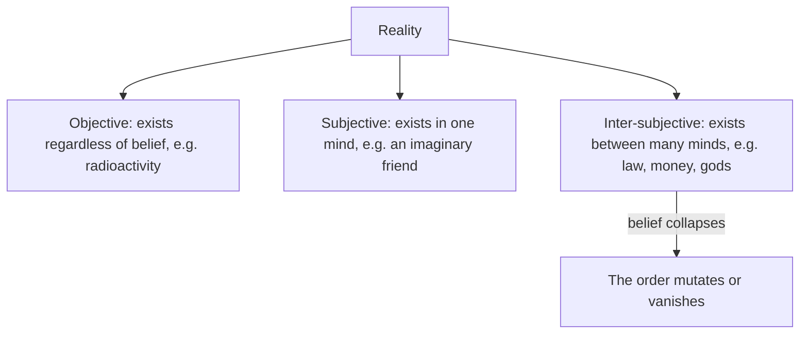

> *Source: Sapiens: A Brief History of Humankind by Yuval Noah Harari (HarperCollins, 2015), Chapter 6 "Building Pyramids", PDF pp. 105–126 (printed pp. unknown)*

# 06: Building Pyramids

## Key Idea

The Agricultural Revolution did not merely change what humans ate; it changed who humans obeyed. Chapter 5 showed the trap that locked farmers into harder lives than foragers ever knew; Chapter 6 follows the surplus those farmers produced, the share of every harvest that rulers, priests and bureaucrats skimmed off, and asks what it paid for. The answer is civilisation itself: palaces, wars, art and philosophy, cities and empires of millions. But food alone could never hold such societies together. Humans evolved to cooperate in small bands, and a few millennia of farming had not grown us an instinct for mass cooperation. The glue that binds a million strangers, Harari argues, is the same substance that once let a few hundred foragers trade seashells: shared myth, grown up.

This chapter is where Harari names, defines and dissects that concept, completing the argument begun in Chapter 2: fiction was the trick that let Sapiens cooperate in unprecedented numbers, and here it proves to be the load-bearing structure of every kingdom and empire. It also builds the book's ontological toolkit, objective, subjective and inter-subjective, later applied to money, empires, religions and nations.

## The Argument

- **Agriculture shrank space and the surplus changed who ate.** Foragers ranged over dozens of square kilometres; farmers spent their days in a small field and their nights in a cramped structure. The future arrived as a taskmaster: farmers had to produce more than they consumed and stockpile reserves. Everywhere, rulers and elites sprang up to live off the peasants' forfeited food. Those surpluses fuelled politics, wars, art and philosophy. Until the late modern era more than 90 per cent of humans were peasants, and the tiny minority they fed are the cast of written history.

- **The escalator of scale.** Jericho around 8500 BC held a few hundred people; Çatalhöyük reached 5,000–10,000 by 7000 BC; cities of tens of thousands appeared in the Fertile Crescent during the fifth and fourth millennia BC. In 3100 BC the lower Nile Valley was united into the first Egyptian kingdom; around 2250 BC Sargon the Great forged the first empire, Akkad. In 221 BC the Qin dynasty united China, taxing 40 million subjects; Rome at its zenith taxed up to 100 million people. But feeding a million subjects does not teach them how to divide land and water or settle disputes. The root problem is biological: humans evolved for millions of years in bands of a few dozen, and a few millennia were not enough to evolve an instinct for mass cooperation.

- **Two sacred texts, one sleight of hand.** To show how myths hold empires up, Harari examines the Code of Hammurabi of c. 1776 BC and the American Declaration of Independence of 1776 AD. The code presents itself as justice dictated by the gods, then prices humans into two genders and three classes. The Declaration proclaims all men created equal. Both claim universal, eternal principles. And both, says Harari, are wrong: universal justice exists only in the fertile imagination of Sapiens. Equality is no less a myth than hierarchy, evolution runs on difference; biology knows no Creator, no rights and no liberty. To the reply that believing in equality enables a stable society, Harari answers: exactly, that is what an imagined order is.

- **Belief is the maintenance contract.** An imagined order is fragile where a natural order is not: gravity will work tomorrow whether or not anyone believes in it, but a myth vanishes with its last believer. Keeping an order alive takes continuous effort, coercion by armies, police, courts and prisons, and sincere believers. A single priest often does the work of a hundred soldiers more cheaply. Even the elite must believe: a thorough cynic would not even be greedy, and cynics do not build empires.

## Key Concepts

### Imagined order

The social order of any large society, sustained neither by ingrained instincts nor by personal acquaintance, but by belief in shared myths. We believe in a particular order not because it is objectively true but because believing enables us to cooperate effectively; imagined orders are neither evil conspiracies nor useless mirages, but the only way large numbers of humans can cooperate.

### Inter-subjective reality

Harari's three-storey ontology. Objective phenomena exist independently of human belief, radioactivity was dangerous long before Marie Curie. Subjective phenomena exist only in one individual's consciousness, a child's imaginary friend vanishes when the child stops believing. Inter-subjective phenomena exist in the communication network linking many consciousnesses: law, money, gods and nations. If most people stop believing in the dollar, the phenomenon mutates or disappears.

### The biological translation

Harari's method for exposing an imagined order: rewrite its sacred sentence in the language of biology. "Created" becomes "evolved"; "created equal" becomes "evolved differently," since evolution is based on difference. "Endowed by their Creator" becomes "born," for there is only a blind, purposeless evolutionary process. There are no rights in biology, only organs, abilities and characteristics.

## Memorable Quotes

> "History is something that very few people have been doing while everyone else was ploughing fields and carrying water buckets." (PDF p. 108)

> "When we break down our prison walls and run towards freedom, we are in fact running into the more spacious exercise yard of a bigger prison." (PDF p. 126)

## Connections

- [[02_The_Tree_of_Knowledge]]: the fictional language that first let Sapiens cooperate here grows into the imagined orders holding empires together
- [[05_Historys_Biggest_Fraud]]: the surplus that trapped peasants in Chapter 5 here feeds elites and finances every imagined order
- [[07_Memory_Overload]]: orders this size outgrow human memory, forcing the invention of external storage
- [[08_There_Is_No_Justice_in_History]]: Hammurabi's graded worth of humans preview Chapter 8's claim that justice itself is imagined
- [[10_The_Scent_of_Money]]: money is named here among history's inter-subjective drivers
- [[Sapiens - Overview]]: navigation, chapter map, and reading paths

## Takeaway

Every pyramid ever raised, of stone or of statute, stands on a shared myth, so the real work of civilisation is not building but believing.
