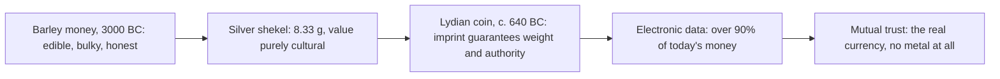

> *Source: Sapiens: A Brief History of Humankind by Yuval Noah Harari (HarperCollins, 2015), Chapter 10 "The Scent of Money", PDF pp. 179–194 (printed pp. unknown)*

# 10: The Scent of Money

## Key Idea

Money looks like the most solidly material thing in our lives, yet this chapter's central claim is that money was never really about matter. Coins, cowry shells and computer bytes are only costumes; money itself is an agreement. Harari defines it as anything people are willing to use to represent systematically the value of other things for exchange, and he insists this makes money an **inter-subjective reality**, real because enough people imagine it together, like gods, nations and laws. Money converts matter into mind: the worth never lives in the object's chemistry, colour or shape, only in shared belief. It needed no technological breakthrough, a purely mental revolution, repeated independently in many times and places.

The chapter's sharper point is that money was the first *universal* imagined order. Languages, laws and religions stayed local, but the belief in gold crossed every frontier, the Aztecs could not see why anyone starved for a metal too soft for tools and too heavy to eat. Enemies who slaughtered each other over ultimate truth happily used each other's coins; Roman silver circulated in markets thousands of kilometres from any legion; today more than ninety per cent of the world's money has no physical form at all.

This matters for the book's argument because money lets millions of strangers cooperate without sharing a culture, the quiet infrastructure behind every later story of markets, empires and industry. But Harari refuses a simple celebration: the same convertibility that unites humanity corrodes honour, loyalty and love. Money, cursed for millennia as the root of all evil, is at once the apogee of human tolerance and a solvent of every community that tried to hold it out.

## The Argument

- **A disease of the heart and the problem prosperity created.** When Cortés invaded Mexico in 1519, the Aztecs quickly noticed the strangers' obsession with a yellow metal they used only for jewellery, ordinary purchases were paid in cocoa beans or bolts of cloth. Asked why gold mattered so much, Cortés spoke of a disease of the heart curable only with gold. The obsession was not Spanish but Afro-Asian: three centuries earlier, his ancestors had waged a bloody war of religion against the Muslim kingdoms of Iberia, yet the victorious Christians minted coins inscribed in flowing Arabic script with the Muslim declaration of faith, issued even by Catholic bishops and happily handled by God-fearing Christians. Muslim merchants returned the favour, doing business in Florentine florins and Venetian ducats. People who agreed about nothing else already agreed about money.

- **An idea wearing different costumes and trust as the mint.** Money compares values, exchanges goods and stores wealth, and the costumes it wears are nearly infinite. Cowry shells served as currency for some 4,000 years across Africa, South Asia, East Asia and Oceania. Cigarettes became the money of prisons and POW camps. And the pattern has flipped today: in 2006 the world's money totalled about $60 trillion, yet coins and banknotes made up less than $6 trillion, more than ninety per cent exists only as electronic data. Why trade a fertile rice paddy for a handful of useless shells? Because the farmer trusted that strangers in the next province would accept the shells too: money is a system of mutual trust, the most universal and efficient one ever devised. That trust is manufactured by a long network of political, social and economic relations.

- **From shekel to signature and the gospel of gold.** That breakthrough was the silver shekel of ancient Mesopotamia, fixed at 8.33 grams of metal, not a coin. Coinage proper began around 640 BC, when King Alyattes of Lydia struck the first coins: standardised lumps of precious metal whose imprint did two things, declared the exact quantity of metal and named the authority guaranteeing it. The imprint was a political signature, the king's personal word that the disc held what it claimed, so counterfeiting was treated not as fraud but as lese-majesty, a breach of sovereignty, typically punished by torture and death. Roman confidence in the denarius outran the legions: in the first century AD the coin was accepted in Indian markets. Why did everyone converge on gold rather than barley or cowries? Because where trade connects two regions, merchants arbitrage price differences until values equalise, the mere fact that Mediterranean people coveted gold was enough to make Indians value it. Belief in money is contagious even across hatred.

## Key Concepts

### Money as an inter-subjective reality

Money is anything people are willing to use to represent systematically the value of other things for exchange. It is a psychological construct, not a material one, its power lies in shared imagination, which is why it has worn so many costumes (cowry shells, cigarettes, electronic bytes) and why inventing it needed no technology.

### Trust: the raw material of money

Every currency is minted from trust: the farmer's confidence that strangers elsewhere will accept his shells, the citizen's confidence rooted in neighbours, kings and priests who all demand the same tokens. Because money's substrate is social, finance is political, crises track political developments, markets sway with trader sentiment.

### The gospel of gold

The belief system that converted the world: once trade connects two regions, arbitrage equalises the value of transportable goods, so one culture's esteem for gold makes another value it too, belief in money is contagious across every other divide. The result was a single transnational monetary zone that unified Afro-Asia and then the globe. Money's tolerance is real but conditional: it asks nothing of you except that you believe others believe.

## Memorable Quotes

> "Because I and my companions suffer from a disease of the heart which can be cured only with gold." (PDF p. 179)

> "Money is accordingly a system of mutual trust, and not just any system of mutual trust: money is the most universal and most efficient system of mutual trust ever devised." (PDF p. 187)

## Connections

- [[05_Historys_Biggest_Fraud]]: the agricultural surplus produced the cities and full-time specialists whose exchange problem money was invented to solve
- [[07_Memory_Overload]]: barley money and writing were born together in Sumer around 3000 BC as twin administrative technologies
- [[09_The_Arrow_of_History]]: a single monetary zone is one of the forces that bent history toward global unification
- [[11_Imperial_Visions]]: the chapter ends on the role of steel, and Cortés' conquest shows money and empire advancing together
- [[16_The_Capitalist_Creed]]: trust in money, most of it now pure electronic data, is the substrate on which the capitalist faith in future growth is built
- [[Sapiens - Overview]]: navigation, chapter map, and reading paths

## Takeaway

Money conquered the world not because gold is valuable, but because value is whatever strangers can be made to trust, and the same trust that unites humanity is the one we fear will corrode it.
