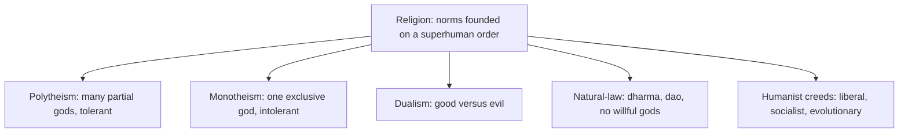

> *Source: Sapiens: A Brief History of Humankind by Yuval Noah Harari (HarperCollins, 2015), Chapter 12 "The Law of Religion", PDF pp. 216–243 (printed pp. unknown)*

# 12: The Law of Religion

## Key Idea

Modern ears hear "religion" and think of division, sectarian wars, persecution, holy hatred. Harari asks you to reverse the sign: religion has been the third great unifier of humankind, doing on the level of belief what money did for exchange and empires for politics. Every social order and hierarchy is an imagined order, and imagined structures are fragile, the larger the society, the more fragile. Religion's decisive historical role was to anchor those fragile structures in superhuman authority, so that at least some fundamental laws sit beyond challenge.

The chapter's audacious move is its definition: a religion is a system of human norms and values founded on a belief in a superhuman order. Two consequences follow: Buddhism is a religion even though gods are marginal to it, and Soviet Communism was no less a religion than Islam. From that vantage the last three centuries, supposedly the age of secularism, become an age of intense religious fervour and the bloodiest wars of religion in history.

## The Argument

- **Religion as universal anchor.** Every imagined order needs something to make its laws feel inevitable rather than arbitrary. Religion supplies that anchor by claiming its norms come from a superhuman order, not human whims but cosmic truth. This lets strangers cooperate across vast territories because they share not just rules but the conviction that those rules are non-negotiable. Most ancient religions were local cults; universal missionary religions appear only in the first millennium BC, Buddhism, Christianity, Islam, a revolution comparable to universal empires and universal money in unifying humankind.

- **Polytheism's tolerance and monotheism's intolerance.** Polytheism's inner logic: the many gods stood beneath one supreme power (Fate, Olodumare, Atman) utterly disinterested, while partial gods with interests and biases can be dealt with. Since other people's gods evidently work for them, polytheism breeds tolerance, no missionary empires, no heresy hunts: the structural opposite of monotheism. Monotheism was born when devotees promoted a patron god to sole supreme power while still treating him as biased and dealable. Its intolerance is structural, any other faith implies your truth is partial, yet saints smuggled the gods back in: the goddess Brigid was simply baptised into St Brigit.

- **Dualism and natural-law religion.** Dualism posits two independent powers, good and evil. It cleanly solves the Problem of Evil (an evil power is loose in the world) but trips on the Problem of Order (who decrees the laws of the cosmic war?). Zoroastrianism, Gnosticism and Manichaeanism were the main dualist faiths, and monotheism absorbed their Devil, body/soul split and heaven and hell. Natural-law religions locate the superhuman order in natural laws rather than divine wills, Jainism, Buddhism, Daoism, Confucianism, Stoicism, leaving gods, if any, bound by nature like everything else. Buddhism's dharma, suffering arises from craving; liberation from craving ends suffering, is held as universal as E = mc².

- **Humanism and its three sects.** The worship of Homo sapiens' unique, sacred nature. Liberal humanism sanctifies each individual's inner voice (human rights as commandments; built on the Christian soul). Socialist humanism sanctifies the species collectively (equality as the supreme commandment). Evolutionary humanism, the Nazis, treats humanity as mutable and steers evolution toward superman; alone among the three it broke from monotheism.

## Key Concepts

### Religion and universal missionary religions

A system of human norms and values founded on a belief in a superhuman order. Two criteria: the order is not a product of human whims (football fails), and it grounds binding norms (ghost-belief fails). Superhuman is not supernatural: Buddhist laws of nature and Marxist laws of history are superhuman yet godless, the lever that makes Buddhism and Communism religions.

### Polytheism's tolerance and monotheism's intolerance

Polytheism's inner logic: the many gods stood beneath one supreme power utterly disinterested, while partial gods with interests and biases can be dealt with; dividing up total power yields many deities. Since other people's gods evidently work for them, polytheism breeds tolerance, the structural opposite of monotheism. Monotheism's intolerance is structural, any other faith implies your truth is partial.

### Humanism and its three sects

The worship of Homo sapiens' unique, sacred nature. Liberal humanism sanctifies each individual's inner voice (human rights as commandments). Socialist humanism sanctifies the species collectively (equality as the supreme commandment). Evolutionary humanism, the Nazis, treats humanity as mutable and steers evolution toward superman; alone among the three it broke from monotheism.

## Memorable Quotes

> "Today religion is often considered a source of discrimination, disagreement and disunion. Yet, in fact, religion has been the third great unifier of humankind, alongside money and empires." (PDF p. 217)

> "Syncretism might, in fact, be the single great world religion." (PDF p. 230)

## Connections

- [[09_The_Arrow_of_History]]: religion completes the trio of universal forces, money, empires, religion, driving history toward unity
- [[10_The_Scent_of_Money]]: money was the first universal imagined order; religion universalises the same trick and adds superhuman authority
- [[11_Imperial_Visions]]: religion gave empires superhuman legitimacy; tolerant polytheist empires contrast with conversion-driven monotheist ones
- [[16_The_Capitalist_Creed]]: capitalism is named here the most successful of the modern religions, deferred to its own chapter
- [[20_The_End_of_Homo_Sapiens]]: the closing clash between the humanist sacred self and biology, plus revived superhuman ambitions, hands off to the book's finale
- [[Sapiens - Overview]]: navigation, chapter map, and reading paths

## Takeaway

Religion is not the opposite of social order, it is the superhuman glue that held imagined orders together; the creeds we call secular never stopped using it.
