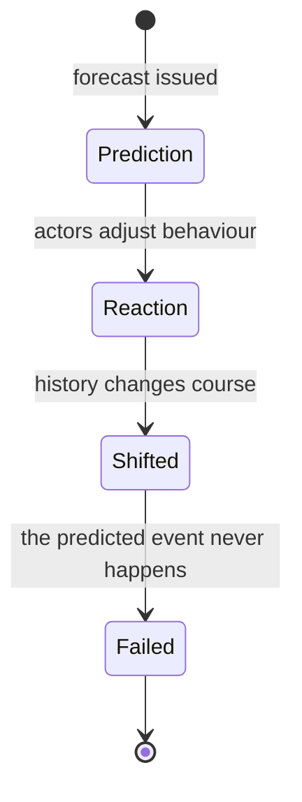

> *Source: Sapiens: A Brief History of Humankind by Yuval Noah Harari (HarperCollins, 2015), Chapter 13 "The Secret of Success", PDF pp. 244–251 (printed pp. unknown)*

# 13: The Secret of Success

## Key Idea

The previous chapters traced how commerce, empires, and universal religions pulled every human population into a single web. It's easy to slip into thinking this unification was inevitable. Chapter 13 stops the story to attack that comfort. Its subject is not an event inside history but the nature of history itself, whether the way things turned out was inevitable, and what "success" in history actually means.

Harari's answer comes in two parts. First, the **hindsight fallacy**: because every moment is a crossroads, outcomes that look inevitable in retrospect were genuinely uncertain while still in the future. Second, **"Blind Clio"**: history's choices are not made for the benefit of humans; success means success at making copies of oneself, regardless of what those copies do to their carriers. The chapter thereby turns a story about how we got here into a warning against reading that story backwards.

## The Argument

- **Unification was likely; this particular world was not.** The drift from many small cultures to a single global society was probably inevitable, commerce, empires, and universal religions eventually brought virtually every Sapiens into today's world. But a unified world may have been likely; *this particular* world was not. Why is English widespread and not Danish? Why are there about 2 billion Christians and 1.25 billion Muslims, but only 150,000 Zoroastrians? If we could rewind to ten thousand years ago and run the process again, would monotheism always rise and dualism always decline?

- **The hindsight fallacy and the Constantine test.** A single travelled road leads from the past to the present, but myriad paths fork into the future. At the beginning of the fourth century AD the Roman Empire faced a wide horizon of religious possibilities. Constantine could have kept polytheism, but he wanted a single religion to unify his realm. His menu was broad: Manichaeism, Mithraism, the cults of Isis or Cybele, Zoroastrianism, Judaism, even Buddhism. Why Jesus? Historians can describe *how* Christianity took over; they cannot explain *why* this possibility was realised. That is the discipline's boundary. Some scholars offer deterministic accounts, reducing Christianity to biological or economic forces. Most historians are sceptical, and Harari sharpens this: the better you know a historical period, the harder it becomes to explain why things happened one way and not another.

- **Level-two chaos and why we study history.** History cannot be explained deterministically and cannot be predicted, because it is chaotic: so many forces interact that tiny variations produce huge differences. Worse, history is a "level two" chaotic system. Level-one chaos (the weather) does not react to predictions about it. Level-two chaos reacts to predictions, so it can never be predicted accurately. Markets are the stock example: an infallible program predicting oil at $100 tomorrow would send traders rushing to buy today, pushing the price to $100 today instead. Politics is likewise second-order chaotic. Critics who fault Sovietologists for missing 1989 or Middle East experts for missing the Arab Spring are being unfair: revolutions are, by definition, unpredictable, a predictable revolution never erupts. So why study history? Not to predict the future. Its purpose is to widen our horizons, to realise that our present situation is not written in nature, and to see that more possibilities lie before us than we imagine.

- **Blind Clio and cultures as parasites.** We cannot explain history's choices, but we can say something important: they are not made for the benefit of humans. There is no proof that human well-being improves as history rolls along, no proof that Christianity was better than Manichaeism or that the Arab Empire served people better than the Sassanids. Because there is no objective scale of benefit. Different cultures define the good differently, and we have no yardstick to judge between them. A growing number of scholars picture cultures as mental infections or parasites, with humans as their unwitting hosts. Like viruses, ideas live inside minds, multiply, and spread from host to host, feeding on their carriers, weakening them, and sometimes killing them, and as long as a host lives long enough to pass the parasite along, the parasite cares nothing for the host's condition.

- **The most momentous choice.** History proceeds from one junction to the next, choosing for some mysterious reason first this path, then that. Around AD 1500 it made its most momentous choice: the Scientific Revolution. It began in western Europe, a large peninsula on the western tip of Afro-Asia that until then had played no important role. Why there, and not in China or India? Why then, rather than two centuries earlier or three later? We don't know; dozens of theories have been proposed, none particularly convincing. The horizon of possibilities is wide, and most are never realised: history could conceivably have run without Christianity, without a Roman Empire, without gold coins, and without the Scientific Revolution.

## Key Concepts

### The hindsight fallacy

Hindsight reads the single travelled road as if it were the only road. Shallow knowledge leaves only the realised outcome visible, which then looks inevitable; deep knowledge exposes the many futures contemporaries genuinely faced. Its methodological consequence: historians can reconstruct *how* Christianity took over Rome, but cannot say *why* that option won out over Manichaeism.

### Level-two chaos

Chaotic systems that react to predictions about themselves, markets, politics, revolutions, can never be predicted accurately, because a credible prediction changes the behaviour it predicts. The concept redefines the use of history: since history cannot be a predictive science, we study it instead to widen our horizons and to unlearn the feeling that the present was inevitable.

### Memes and the parasite view of culture

If organic evolution runs on the replication of genes, cultural evolution runs on the replication of memes, units of cultural information whose success is measured purely by their own spread, not by their effect on hosts. The parasite metaphor makes success in history a property of ideas rather than of people.

### Blind Clio

Clio, the muse of history, appears here blind: history's choices are made with no regard for human well-being. Because cultures define the good differently, no objective yardstick exists for ranking outcomes. The spread of money, empires, and religions testifies to the reproductive fitness of memes, not to human flourishing.

## Memorable Quotes

> "It is an iron rule of history that what looks inevitable in hindsight was far from obvious at the time." (PDF p. 246)

> "We study history not to know the future but to widen our horizons, to understand that our present situation is neither natural nor inevitable." (PDF p. 248)

## Connections

- [[09_The_Arrow_of_History]]: the chapter opens on the very unification ch9 described as history's arrow, then asks whether its particular shape was ever inevitable
- [[12_The_Law_of_Religion]]: Constantine's gamble replays ch12's imperial monotheism as one contingent choice among many cults
- [[08_There_Is_No_Justice_in_History]]: "Blind Clio" extends ch8's imagined orders: hierarchies are accidents of power, with no nature or justice behind them
- [[14_The_Discovery_of_Ignorance]]: the chapter ends at the Scientific Revolution asking why Europe and why then, the question ch14 takes up
- [[19_And_They_Lived_Happily_Ever_After]]: the claim that history disregards individual happiness is exactly what ch19 tests
- [[Sapiens - Overview]]: navigation, chapter map, and reading paths

## Takeaway

History's winners win the contest of spreading themselves, not the contest of goodness, and every "inevitable" certainty we live by was once just one fork among many, chosen for reasons no one can name.
