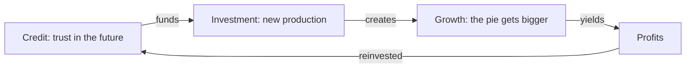

> *Source: Sapiens: A Brief History of Humankind by Yuval Noah Harari (HarperCollins, 2015), Chapter 16 "The Capitalist Creed", PDF pp. 311–338 (printed pp. unknown)*

# 16: The Capitalist Creed

## Key Idea

The last two chapters introduced two engines of the modern age, science, which learned to admit its ignorance, and empire, which carried European power around the globe. This chapter installs the third, and Harari's first provocation is that it is not really money: money is ancient. What is modern is a belief about time, that the future will be richer than the present, and that we may build today on income not yet earned. That belief, institutionalised as **credit**, turned a static economy into one growing "like a hormone-soused teenager."

The second provocation is the title: capitalism is a **creed**, not merely an economic system. It began as a theory about how money works and became an ethic that tells people how to behave, raise children, even think, economic growth is the supreme good. Adam Smith's scandalous claim, greed is good, egoism is altruism, rewired Western morality, while credit, science and empire spun one another's "magic circles" until they remade the planet.

Why it matters: the science and empire of Chapter 15 ran on capital and are unintelligible without it, yet the same trust that funded laboratories and fleets financed the slave trade, the Opium Wars and the Congo's horrors, killing "out of cold indifference," not hatred. The chapter ends asking whether the pie can grow forever, and for whom, inviting us to treat capitalism as a chosen faith rather than a law of nature.

## Key Concepts

### Credit: trust in the future

The special money of the modern age. Ordinary money represents things that exist; credit represents imaginary goods, things that do not yet exist, on the assumption that future resources will be far more abundant than present ones. Harari's phrase: credit enables us "to build the present at the expense of the future." Its sole backing is trust, which is why banks may lend ten dollars for every dollar they hold. Credit matters because it is the mechanism by which faith becomes factories, and why economic history is, at bottom, a history of belief.

### The capitalist creed

What capitalism became once it outgrew economics. It began as a theory, both descriptive and prescriptive, and gradually became an ethic, teachings about how people should behave, educate their children and even think. Its principal tenet: economic growth is the supreme good, or at least a proxy for it, because justice, freedom and even happiness all depend on growth. Its founding distinction gives the system its name: **capital** is money and goods invested in production, while mere wealth is buried or wasted, so the reinvesting entrepreneur is its saint, and the pyramid-building pharaoh or the pirate burying coins is not. The concept matters because it reframes capitalism as a faith, something to examine and doubt, like any creed, rather than a background law of nature.

### The myth of the free market and the capitalist hell

The free-market doctrine, keep politics out, cut taxes and regulation, let markets run, is today's most common variant of the creed; in its extreme form, Harari argues, it is as naïve as belief in Santa Claus. There is no market free of political bias, and trust in the future must be protected by state-backed police, courts and jails. The hell: monopolies and collusion defeat competition, and greed curdles into slavery. The concept carries the chapter's moral verdict: growth unrestrained by other ethical considerations leads to catastrophe, and capitalism's signature sin is cold indifference, not hatred.

## Memorable Quotes

> "It sounds like a giant Ponzi scheme, doesn't it? But if it's a fraud, then the entire modern economy is a fraud." (PDF p. 313)

> "The profits of production must be reinvested in increasing production." (PDF p. 318)

> "Capitalism has killed millions out of cold indifference coupled with greed." (PDF p. 336)

## Connections

- [[05_Historys_Biggest_Fraud]]: the chapter closes suspecting that modern growth, like agriculture, may turn out to be "a colossal fraud"
- [[10_The_Scent_of_Money]]: credit extends money's imagined order from present things to future ones; both rest on nothing but shared trust
- [[14_The_Discovery_of_Ignorance]]: the idea of progress that fuels the creed is the economic translation of admitting ignorance and investing in research
- [[15_The_Marriage_of_Science_and_Empire]]: capital funds the science-and-empire machine, and scientists foot the bill; the Bengal famine discussed there returns as capitalism's crime
- [[Sapiens - Overview]]: navigation, chapter map, and reading paths

## Takeaway

The modern world runs on one great act of faith, that tomorrow's pie will be bigger than today's, and whether that faith builds paradise or proves a colossal fraud is still an open question.
