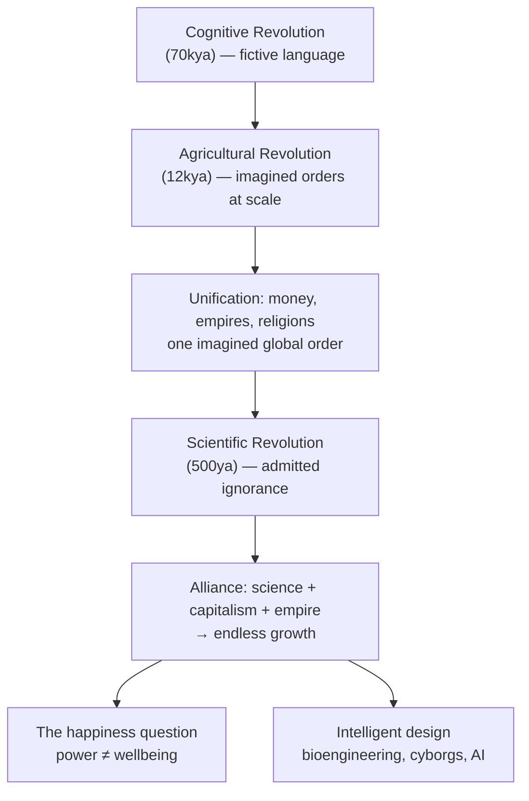

# Sapiens — Overview

> **Source:** *Sapiens: A Brief History of Humankind* by Yuval Noah Harari (HarperCollins, 2015; PDFDrive/calibre e-book conversion, 439 PDF pages)

## What Is This?

This vault summarizes **Sapiens: A Brief History of Humankind**, Yuval Noah Harari's big-history account of how an insignificant African ape became the dominant force on the planet — and what that story says about where we are heading.

The book is not a conventional history book. It is a chain of provocative arguments, one per chapter, held together by a single spine: **history is driven by our unique ability to create and believe shared fictions** — imagined orders such as gods, nations, money, corporations, and human rights. Three revolutions power the plot: the **Cognitive Revolution** (~70,000 years ago) gave us language for fiction; the **Agricultural Revolution** (~12,000 years ago) made us multiply at the cost of individual suffering; the **Scientific Revolution** (~500 years ago) admitted ignorance and, allied with capitalism and empire, launched endless growth. Harari's verdict along the way: collective power and individual happiness have often moved in opposite directions, and the species that became "a god" still does not know what it wants.

Each of the 20 chapter notes below captures one chapter's thesis, argument, concepts, and memorable quotes. Sources cite **PDF page numbers** (this conversion has no printed folio numbers; printed pages are unknown).

## Chapter Map

### Part One — The Cognitive Revolution (PDF pp. 10–82)

| Note | Thesis in one line | Source |
|---|---|---|
| [[01_An_Animal_of_No_Significance]] | Before ~70kya humans were marginal animals; the genus *Homo* once had many sibling species | Ch 1, PDF pp. 11–26 |
| [[02_The_Tree_of_Knowledge]] | The Cognitive Revolution: fictive language let Sapiens cooperate in large, flexible groups | Ch 2, PDF pp. 27–47 |
| [[03_A_Day_in_the_Life_of_Adam_and_Eve]] | Forager life as the "original affluent society" — and the source of our bodies' mismatches | Ch 3, PDF pp. 48–70 |
| [[04_The_Flood]] | Sapiens' first conquest: the megafauna extinctions that came with global colonization | Ch 4, PDF pp. 71–82 |

### Part Two — The Agricultural Revolution (PDF pp. 83–167)

| Note | Thesis in one line | Source |
|---|---|---|
| [[05_Historys_Biggest_Fraud]] | Agriculture was a luxury trap that domesticated us — history's biggest fraud | Ch 5, PDF pp. 84–104 |
| [[06_Building_Pyramids]] | Large societies run on imagined orders; elites live inside the same fictions as peasants | Ch 6, PDF pp. 105–126 |
| [[07_Memory_Overload]] | Writing and mathematics were invented to store what brains could not: the first databases | Ch 7, PDF pp. 127–140 |
| [[08_There_Is_No_Justice_in_History]] | Imagined orders are not neutral: they encode hierarchies (gender, race, class) as "natural" | Ch 8, PDF pp. 141–167 |

### Part Three — The Unification of Humankind (PDF pp. 168–251)

| Note | Thesis in one line | Source |
|---|---|---|
| [[09_The_Arrow_of_History]] | History moves toward unity; cultures change through internal contradictions | Ch 9, PDF pp. 169–178 |
| [[10_The_Scent_of_Money]] | Money is the most successful story ever told: universal convertibility by trust | Ch 10, PDF pp. 179–194 |
| [[11_Imperial_Visions]] | Empires spread the package of political order + culture, for better and worse | Ch 11, PDF pp. 195–215 |
| [[12_The_Law_of_Religion]] | Religion gave universal laws and a superhuman order — from animism to monotheism | Ch 12, PDF pp. 216–243 |
| [[13_The_Secret_of_Success]] | History is chaotic and non-deterministic — don't mistake hindsight for inevitability | Ch 13, PDF pp. 244–251 |

### Part Four — The Scientific Revolution (PDF pp. 252–419)

| Note | Thesis in one line | Source |
|---|---|---|
| [[14_The_Discovery_of_Ignorance]] | Science's breakthrough: admitting ignorance and building on "I don't know" | Ch 14, PDF pp. 253–280 |
| [[15_The_Marriage_of_Science_and_Empire]] | European empires bankrolled discovery; science repaid them with conquest | Ch 15, PDF pp. 281–310 |
| [[16_The_Capitalist_Creed]] | Capitalism is a creed of future growth; credit is faith in tomorrow | Ch 16, PDF pp. 311–338 |
| [[17_The_Wheels_of_Industry]] | The Industrial Revolution + energy + capitalism produced endless growth — and its victims | Ch 17, PDF pp. 339–354 |
| [[18_A_Permanent_Revolution]] | Modernity's deal: give up meaning for power; the disenchantment that followed | Ch 18, PDF pp. 355–380 |
| [[19_And_They_Lived_Happily_Ever_After]] | The happiness question: are we actually better off than our ancestors? | Ch 19, PDF pp. 381–401 |
| [[20_The_End_of_Homo_Sapiens]] | The next frontier: intelligent design — bioengineering, cyborgs, and non-organic life | Ch 20, PDF pp. 402–419 |

The short **Afterword** (PDF pp. 420–421) recaps the whole argument: humans became gods, but irresponsible, dissatisfied gods who don't know what they want. It is folded into this overview's Core Ideas.

## How the Book's Argument Fits Together

## Reading Paths

| Your Goal | Start Here |
|---|---|
| **The whole story (book order)** | [[01_An_Animal_of_No_Significance]] → … → [[20_The_End_of_Homo_Sapiens]] |
| **Fast tour of the core argument (5 notes)** | [[02_The_Tree_of_Knowledge]] → [[05_Historys_Biggest_Fraud]] → [[10_The_Scent_of_Money]] → [[16_The_Capitalist_Creed]] → [[20_The_End_of_Homo_Sapiens]] |
| **Why we believe what we believe** | [[02_The_Tree_of_Knowledge]] → [[06_Building_Pyramids]] → [[09_The_Arrow_of_History]] → [[12_The_Law_of_Religion]] |
| **Economics & growth lens** | [[10_The_Scent_of_Money]] → [[16_The_Capitalist_Creed]] → [[17_The_Wheels_of_Industry]] |
| **Power, empire & politics lens** | [[11_Imperial_Visions]] → [[13_The_Secret_of_Success]] → [[15_The_Marriage_of_Science_and_Empire]] → [[18_A_Permanent_Revolution]] |
| **Happiness & meaning lens** | [[03_A_Day_in_the_Life_of_Adam_and_Eve]] → [[08_There_Is_No_Justice_in_History]] → [[19_And_They_Lived_Happily_Ever_After]] |
| **Human nature & biology** | [[01_An_Animal_of_No_Significance]] → [[03_A_Day_in_the_Life_of_Adam_and_Eve]] → [[04_The_Flood]] |
| **The future / AI & biotech** | [[20_The_End_of_Homo_Sapiens]] + [[14_The_Discovery_of_Ignorance]] |

## Core Ideas

1. **History began with fiction.** About 70,000 years ago Sapiens acquired language that could talk about things that do not exist — enabling flexible, large-scale cooperation among strangers ([[02_The_Tree_of_Knowledge]]).
2. **Imagined orders run every large society.** Laws, nations, money, corporations, and human rights exist only in our shared imagination — yet they shape reality ([[06_Building_Pyramids]]).
3. **The Agricultural Revolution was a trap.** It multiplied collective power while often worsening individual lives — the "luxury trap" that locked us into farming ([[05_Historys_Biggest_Fraud]]).
4. **History unified the world through three vehicles: money, empires, and religions.** Each is an imagined order that strangers could share ([[10_The_Scent_of_Money]], [[11_Imperial_Visions]], [[12_The_Law_of_Religion]]).
5. **History has no direction and no guarantees.** Chaos and contingency rule; "success" explanations after the fact are myths ([[13_The_Secret_of_Success]]).
6. **The Scientific Revolution rests on admitted ignorance.** Modern science, unlike all earlier traditions, treasures "I don't know" and turns it into research programs ([[14_The_Discovery_of_Ignorance]]).
7. **Science married empire and capitalism.** Each funded the others; the result was the European conquest of the globe and the modern growth economy ([[15_The_Marriage_of_Science_and_Empire]], [[16_The_Capitalist_Creed]]).
8. **More power has not meant more happiness.** Collective capability and individual wellbeing repeatedly moved in opposite directions ([[19_And_They_Lived_Happily_Ever_After]]).
9. **We are now gods — and we don't know what we want.** The next history may be intelligent design: bioengineered, cyborg, or non-organic life ([[20_The_End_of_Homo_Sapiens]]).

## Related

- *Homo Deus* (Harari's sequel) — the 21st-century agenda of immortality, bliss, and divinity; not yet in this vault
- Science / big-history notes in the wider vault — the layered-cosmos frame (physics → chemistry → biology → history)
- Economics & finance vaults — for the capitalism chapters' modern resonance

---

*Vault generated from Sapiens: A Brief History of Humankind (HarperCollins, 2015). 20 chapter notes + this overview. PDF pages cited; printed page numbers unavailable in the source conversion (unknown).*
