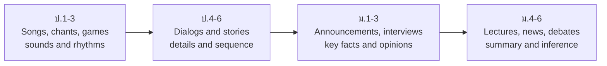

# Listening and Speaking — การฟังและการพูด

> *"Before you can read or write a language, you must be able to hear it and say it."*

Listening and speaking (การฟังและการพูด) is where every English learner starts, and where Thai students face the biggest gap: Thailand is an EFL country, so many students meet English mostly on paper. The curriculum responds deliberately — in ป.1–3 English is primarily a **listening-and-speaking subject** built from songs, games, chants, and dialogs about daily life, with reading and writing introduced only after sounds are established. By ม.4–6 the same skills have grown into academic presentations, structured debates, and job interviews.

## 1 | Grade Band Breakdown

| Grade | Key Content |
|---|---|
| **ป.1–3** | Classroom language and teacher commands, greetings and self-introduction, colors/numbers/animals/food/family vocabulary, following one- and two-step instructions; songs, chants, and games as the main delivery vehicle |
| **ป.4–6** | Sustained conversation on daily-life topics, asking and answering in interviews, retelling short stories, expressing likes and dislikes, phone manner; O-NET ป.6 listening (pictures, short dialogs) |
| **ม.1–3** | Conversations and short monologues (announcements, interviews, stories), noting key details (who/what/when/where), initiating and sustaining dialog, expressing and justifying opinions, short presentations |
| **ม.4–6** | Lectures, news, documentaries, films; summarizing main ideas and inferred attitudes; formal presentations, panel discussions, debates; negotiation and job interview skills |

## 2 | The Four-Stage Listening Progression

## 3 | Communication Functions by Grade Band

| Function | ป.1–3 | ป.4–6 | ม.1–3 | ม.4–6 |
|---|---|---|---|---|
| **Greetings** | Hello. My name is... | How was your weekend? | Nice to meet you — have we met? | Formal: May I introduce... |
| **Requests** | May I go to the toilet? | Could you pass...? | Would you mind + Ving? | Polite negotiation of conflict |
| **Opinions** | I like / I don't like | I think... because... | In my opinion... giving reasons | Justify, concede, rebut in debate |
| **Descriptions** | This is my family | Describing people and places | Describing processes and events | Presenting data, comparing options |
| **Instructions** | Follow one-step commands | Give two-step instructions | Give and check multi-step instructions | Briefing and delegating tasks |

## 4 | Listening Strategies Taught Across Bands

| Strategy | Thai | What it means | English Skill cross-link |
|---|---|---|---|
| Listening for gist | การฟังจับใจความ | First pass for the main idea, not every word | [[35 Note-Taking for Listening]] |
| Listening for detail | การฟังจับรายละเอียด | Names, numbers, times, prices | [[34 Reading Question Strategies]] |
| Predicting | การคาดคะเน | Use title, pictures, and first sentences to predict content | [[32 Skimming & Scanning]] |
| Inferring attitude | การสรุปความรู้สึกของผู้พูด | Happy? annoyed? sarcastic? | [[33 Inference & Implied Meaning]] |
| Note-taking while listening | การจดบันทึกขณะฟัง | Keywords, abbreviations, two-column notes | [[35 Note-Taking for Listening]] |

## 5 | The Thai Classroom Reality

| Challenge | Thai | What teachers actually do |
|---|---|---|
| Minimal exposure to English outside class | ปริมาณการสัมผัสภาษาน้อย | TPR (Total Physical Response), songs, and pair drills to build a spoken environment |
| Fear of losing face when speaking | กลัวเสียฟ้า | Pair work before public speaking; error correction after, not during |
| Thai final-consonant habits | การออกเสียงท้ายคำ | Minimal pairs (cat/cap), clap-on-final-sound drills → [[26 Pronunciation Guide]] |
| Single accent exposure | การฟังสำเนียงเดียว | Multiple accents (British, American, ASEAN) by ม.ปลาย → [[37 Accent Recognition]] |

## 6 | Real-World Examples

- **O-NET ป.6 / ม.3 / ม.6** — listening sections use short dialogs and announcements; speaking is assessed in class, not nationally
- **Speech and debate contests** — งานแข่งขันทักษะวิชาการทางไกล และการแข่งขันพูดภาษาอังกฤษ for ม.ปลาย students
- **ASEAN communication** — English is the working language of ASEAN meetings, tourism, and regional trade
- **Workplace interviews** — job interviews in international companies and hotels, especially in tourism provinces

## 7 | Thai Terminology

| Thai | English |
|---|---|
| การฟัง | Listening |
| การพูด | Speaking |
| การสนทนา | Conversation |
| การแนะนำตัว | Self-introduction |
| การแสดงความคิดเห็น | Expressing opinions |
| การนำเสนอ | Presentation |
| การโต้วาที | Debate |
| การสัมภาษณ์งาน | Job interview |
| บทบาทสมมติ | Role play |
| การฟังจับใจความ | Listening for main idea |

## 8 | Cross-Links

- [[00_overview|Strand 1 Overview (BOK)]]
- [[51 Reading|Reading]] — listening vocabulary feeds into reading
- [[52 Writing|Writing]] — speaking structure becomes paragraph structure
- [[25 Thai-English Common Mistakes|Thai Speaker Challenges]] — pronunciation traps
- [[../../body-of-knowledge/English/English - Overview|English BOK Overview]]
