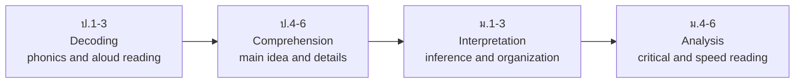

# Reading — การอ่าน

> *"Reading is the skill Thai students can most easily grow outside the classroom — every text is a free teacher."*

Reading (การอ่าน) in the English curriculum begins only after listening and speaking are underway: ป.1–3 starts with the Latin alphabet, letter-sound relationships (phonics), and reading aloud simple words and sentences. From ป.4 onward reading becomes a source of new language — signs, stories, dialogs, advertisements — and by ม.ปลาย students read academic texts, news articles, and literature, and answer exam questions that require inference rather than word matching. Because Thai is written with its own script, English reading for Thai students involves building a **second writing system from zero**, which is why the early years move carefully.

## 1 | Grade Band Breakdown

| Grade | Key Content |
|---|---|
| **ป.1–3** | Alphabet recognition and phonics, reading aloud words and simple sentences, sight words, picture-word matching, very short stories with teacher support |
| **ป.4–6** | Short passages, dialogs, and stories; main idea and supporting details; vocabulary from context; reading signs, labels, and menus; skimming and scanning introduced |
| **ม.1–3** | Longer texts: advertisements, articles, letters, short fiction; inference and implied meaning; text organization; O-NET ม.3 reading question types |
| **ม.4–6** | Academic texts, news, editorials, literature extracts; critical reading (fact vs opinion, author's purpose); speed reading under exam conditions; summary writing from texts |

## 2 | The Reading Growth Path

## 3 | Text Types by Grade Band

| Band | Text types students meet |
|---|---|
| **ป.1–3** | Picture books, word cards, chants and song lyrics, single sentences |
| **ป.4–6** | Short stories, dialogs, postcards, menus, signs, simple instructions |
| **ม.1–3** | Advertisements, magazine articles, emails and letters, fables and short stories |
| **ม.4–6** | News reports, editorials, academic passages, literature, technical instructions |

## 4 | Core Reading Strategies

| Strategy | Thai | What it means | English Skill cross-link |
|---|---|---|---|
| Skimming | การอ่านแบบข้ามเพื่อจับใจความ | Fast pass for the gist | [[32 Skimming & Scanning]] |
| Scanning | การอ่านแบบกวาดตาหาข้อมูล | Hunt for specific facts: names, dates, numbers | [[32 Skimming & Scanning]] |
| Context clues | การเดาความหมายจากบริบท | Guess new words from surrounding words | [[29 Word Families]] |
| Inference | การอ่านระหว่างบรรทัด | What the text implies but does not say | [[33 Inference & Implied Meaning]] |
| Identifying text structure | การวิเคราะห์โครงสร้างข้อความ | Cause-effect, compare, problem-solution layouts | [[43 Coherence & Cohesion]] |

## 5 | O-NET Reading Question Types

| Question type | Skill tested | Bands |
|---|---|---|
| Vocabulary in context | Meaning of a word as used in the passage | ป.6, ม.3, ม.6 |
| Main idea / topic | Identify what the passage is mostly about | ป.6, ม.3, ม.6 |
| Detail / factual | Locate stated facts | ป.6, ม.3, ม.6 |
| Inference | Conclude from evidence in the text | ม.3, ม.6 |
| Reference (pronoun/phrase) | Identify what "it/they/this" points to | ม.3, ม.6 |
| Conversation completion | Choose the best dialog response | ม.3, ม.6 |

## 6 | The Thai Classroom Reality

| Challenge | Thai | What teachers actually do |
|---|---|---|
| New script from zero | ระบบการเขียนต่างชุด | Phonics drills, alphabet songs, tracing in ป.1 |
| Word-by-word translation habit | การแปลทีละคำ | Train chunk reading: meaning in phrases, not single words |
| Dictionary overuse | การเปิดพจนานุกรมทุกคำ | Set a limit: guess from context first, check after |
| Little reading material at home | ขาดวัสดุอ่านนอกห้องเรียน | Graded readers, free reading corners, online stories |

## 7 | Thai Terminology

| Thai | English |
|---|---|
| การอ่าน | Reading |
| การอ่านออกเสียง | Reading aloud |
| การอ่านจับใจความ | Reading for main idea |
| การอ่านความเข้าใจ | Reading comprehension |
| การเดาความหมายจากบริบท | Guessing from context |
| การอ่านแบบข้าม (skim) | Skimming |
| การอ่านแบบหาข้อมูลเฉพาะ (scan) | Scanning |
| การอ่านเชิงวิเคราะห์ | Analytical reading |
| วรรณกรรมเยาวชน | Children's/young-adult literature |
| แบบอ่านตามระดับ | Graded readers |

## 8 | Cross-Links

- [[00_overview|Strand 1 Overview (BOK)]]
- [[50 Listening and Speaking|Listening and Speaking]] — spoken vocabulary is the base for reading
- [[52 Writing|Writing]] — reading models become writing models
- [[54 Vocabulary|Vocabulary]] — reading is the main source of new words
- [[32 Skimming & Scanning|English Skill: Reading Skills]] — deep-dive strategies
- [[../../body-of-knowledge/English/English - Overview|English BOK Overview]]
