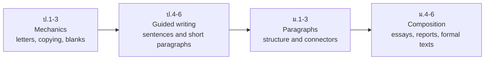
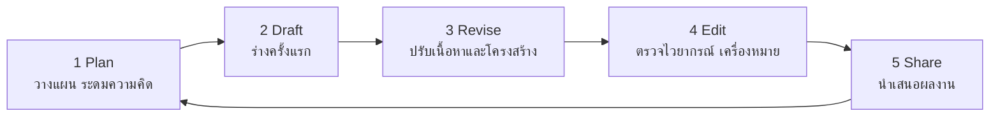

# Writing — การเขียน

> *"Writing is the last skill to arrive and the first one exams and employers demand."*

Writing (การเขียน) enters the English curriculum after listening, speaking, and basic reading. In ป.1–3 it means forming letters and copying words; in ป.4–6 students write guided sentences, short messages, and simple paragraphs; ม.ต้น adds letters, emails, and descriptive paragraphs with connectors; ม.ปลาย brings essays, reports, summaries, formal emails, and resumes. Thai students write English with two extra burdens — English spelling (Thai spelling is far more regular) and spacing/capitalization conventions Thai script does not use — so the curriculum builds writing mechanics and expression side by side.

## 1 | Grade Band Breakdown

| Grade | Key Content |
|---|---|
| **ป.1–3** | Letter formation and tracing, copying words and short sentences, writing own name and simple personal data, fill-in-the-blank with picture support |
| **ป.4–6** | Guided sentence writing, short paragraphs (3–5 sentences), personal information forms, simple messages, postcards, and invitations; joining sentences with and/but |
| **ม.1–3** | Paragraph structure (topic sentence + supporting details), informal letters and emails, describing people/places/events, narrative writing, using common connectors |
| **ม.4–6** | Multi-paragraph essays, formal letters and emails, reports, summaries of texts, resume/CV writing, data description (IELTS Task 1 style) |

## 2 | The Writing Growth Path

## 3 | Text Types by Grade Band

| Band | Writing tasks students produce |
|---|---|
| **ป.1–3** | Traced and copied words, name cards, labeled pictures, one-line answers |
| **ป.4–6** | Personal profiles, short messages, postcards, invitations, guided paragraphs |
| **ม.1–3** | Informal emails and letters, descriptive and narrative paragraphs, questionnaires |
| **ม.4–6** | Essays (opinion, cause-effect), formal emails, incident/summary reports, resumes |

## 4 | The Process Writing Cycle

From ม.ต้น the curriculum expects students to treat writing as a process, not a one-shot task:

## 5 | Writing Mechanics Thai Students Must Build

| Mechanic | Thai challenge | Practice focus |
|---|---|---|
| Spacing between words | Thai script has no spaces between words | Count-word spacing drills in ป.1–3 |
| Capitalization | Thai has no capital letters | Sentence starts, names, days, "I" → [[23 Capitalization Rules]] |
| Punctuation | Thai uses spacing, not commas/periods, the same way | Sentence boundaries, commas in lists → [[22 Punctuation]] |
| Spelling | Thai spelling is highly regular; English is not | Word families, spelling rules, high-frequency words |
| Sentence order | Thai is also SVO, but modifiers differ | Keep subject-verb-object visible → [[08 Sentence Structure]] |

## 6 | Common Writing Errors by Band

| Band | Top errors | Fix strand in English Skill |
|---|---|---|
| **ป.4–6** | Missing articles, missing be in Thai-style sentences ("She teacher"), no capital letters | [[01 Parts of Speech]], [[02 Articles]] |
| **ม.1–3** | Subject-verb agreement, tense mixing, run-on sentences | [[03 Subject-Verb Agreement]], [[05 12 English Tense Overview]] |
| **ม.4–6** | Weak paragraphing, informal register in formal tasks, translation-style long sentences | [[40 Essay Structure]], [[31 Register & Formality]], [[24 Parallel Structure]] |

## 7 | Thai Terminology

| Thai | English |
|---|---|
| การเขียน | Writing |
| การเขียนคำและประโยค | Writing words and sentences |
| ย่อหน้า | Paragraph |
| ประโยคความเดียว / ความรวม / ความซ้อน | Simple / compound / complex sentence |
| การเขียนจดหมาย | Letter writing |
| การเขียนรายงาน | Report writing |
| การเขียนเรียงความ | Essay writing |
| การสรุปความ | Summary writing |
| การเขียนตามลำดับขั้นตอน | Process writing |
| สะกดคำ | Spelling |

## 8 | Cross-Links

- [[00_overview|Strand 1 Overview (BOK)]]
- [[51 Reading|Reading]] — reading provides the models writing imitates
- [[53 Grammar|Grammar]] — grammar accuracy is judged in writing first
- [[40 Essay Structure|English Skill: Academic Writing]] — essays, IELTS/TOEFL tasks
- [[../../body-of-knowledge/English/English - Overview|English BOK Overview]]
