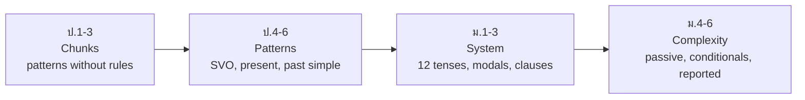

# Grammar — หลักการใช้ภาษา (ไวยากรณ์)

> *"Grammar is not the goal of the Thai English curriculum — it is the scaffolding that makes communication accurate."*

The Basic Education Core Curriculum treats grammar (หลักการใช้ภาษา) as a tool inside communication, not a standalone subject: early years absorb sentence patterns through songs, chants, and dialogs long before any rule is named. Formal grammar teaching concentrates in ม.1–6, moving from sentence patterns and basic tenses to complex structures. This note maps the official grammar progression; the deep, rule-by-rule explanations live in [[English Skill Content|English Skill]] sections 01-15, cross-linked below.

## 1 | Grade Band Breakdown

| Grade | Key Content |
|---|---|
| **ป.1–3** | No explicit rules — chunks and patterns: "I am...", "This is...", "I can...", question words, plural -s absorbed through use |
| **ป.4–6** | Basic sentence patterns (SVO), present simple and continuous, adverbs of frequency, comparatives, past simple introduced, prepositions of place and time |
| **ม.1–3** | All 12 tenses in sequence, modals, question and negative formation, connectors, gerunds vs infinitives, relative clauses begin |
| **ม.4–6** | Passive voice, conditionals, reported speech, advanced clause structure, causatives, subjunctive patterns ("If I were..."), register-appropriate structures |

## 2 | The Grammar Progression

## 3 | Grammar Topics in Teaching Sequence

| Stage | Topics | English Skill deep-dive |
|---|---|---|
| ป.4–6 | be-verbs, present simple/continuous, plurals, articles, comparatives, prepositions | [[01 Parts of Speech]], [[02 Articles]], [[20 Prepositions]] |
| ม.1–3 | 12 tenses, modals, questions/negatives, conjunctions, gerund/infinitive | [[05 12 English Tense Overview]], [[12 Modals]], [[10 Question Formation]], [[13 Gerunds vs Infinitives]] |
| ม.4–6 | Passive, conditionals, reported speech, relative clauses, causatives | [[06 Active vs Passive Voice]], [[16 Conditionals]], [[18 Reported Speech]], [[15 Causative Verbs]] |

## 4 | How Thai Curriculum Teaches Grammar: PPP

| Stage | Thai | What happens |
|---|---|---|
| Presentation | การนำเสนอ | Teacher shows the pattern in a meaningful context (dialog, story) |
| Practice | การฝึก | Controlled drills: fill-in, substitution, transformation |
| Production | การนำไปใช้ | Free use: role play, paragraph writing, interview tasks |

## 5 | Grammar Points Thai Speakers Find Hardest

| Difficulty | Why (Thai interference) | English Skill fix |
|---|---|---|
| Articles a/an/the | Thai has no articles | [[02 Articles]] |
| Subject-verb agreement | Thai verbs never change form | [[03 Subject-Verb Agreement]] |
| Tense marking | Time words carry tense in Thai, not verbs | [[05 12 English Tense Overview]], [[07 Verb Forms]] |
| Plural -s | Thai nouns are not marked for number | [[04 Countable vs Uncountable Nouns]] |
| Prepositions | One Thai word maps to many English prepositions | [[20 Prepositions]] |
| Sentence connectors | Thai strings clauses with และ/แต่ freely | [[19 Conjunctions]], [[21 Transition Words]] |

## 6 | Thai Terminology

| Thai | English |
|---|---|
| ไวยากรณ์ | Grammar |
| หลักการใช้ภาษา | Language use principles |
| ชนิดของคำ | Parts of speech |
| ประธาน / กริยา / กรรม | Subject / verb / object |
| กาล (ปัจจุบัน อดีต อนาคต) | Tense (present, past, future) |
| โครงสร้างประโยค | Sentence structure |
| ประโยคเงื่อนไข | Conditional sentence |
| ประโยคผันเป็นคำพูดของผู้อื่น | Reported speech |
| ประโยคถูกกระทำ (passive) | Passive voice |
| คำเชื่อม | Conjunction / connector |

## 7 | Cross-Links

- [[00_overview|Strand 1 Overview (BOK)]]
- [[52 Writing|Writing]] — grammar accuracy shows in writing
- [[54 Vocabulary|Vocabulary]] — grammar patterns and words are learned together
- [[English Skill Content|English Skill]] — the rule-by-rule reference sections 01-15
- [[25 Thai-English Common Mistakes|Thai-English Common Mistakes]] — interference patterns in one place
- [[../../body-of-knowledge/English/English - Overview|English BOK Overview]]
