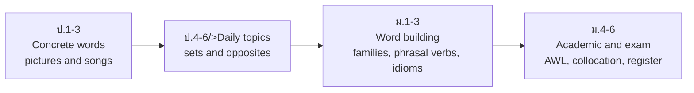

# Vocabulary — คลังคำศัพท์

> *"Grammar builds the frame; vocabulary fills the house. A learner with 2,000 words and weak grammar communicates more than one with perfect grammar and 200 words."*

Vocabulary (คำศัพท์) is the only curriculum element that runs through every grade band from day one. ป.1–3 learns concrete first words (colors, numbers, family, animals, food) through pictures and songs; ป.4–6 expands into daily-life topic sets and simple word building; ม.ต้น adds phrasal verbs, idioms, and word families; ม.ปลาย layers the Academic Word List, collocation awareness, and register-sensitive word choice. The national syllabus keeps a core vocabulary of roughly 3,000 word families across basic education — enough for everyday communication and the base for exam English.

## 1 | Grade Band Breakdown

| Grade | Key Content |
|---|---|
| **ป.1–3** | First concrete sets: colors, numbers, shapes, animals, food, family, body, toys, school objects; learned with pictures, actions, and songs |
| **ป.4–6** | Daily-life topics (weather, clothes, places in town, occupations, time, hobbies); synonyms and opposites; simple word building (un-, -er); personal picture dictionaries |
| **ม.1–3** | Topic clusters (travel, media, environment); phrasal verbs; common idioms; word families (noun/verb/adjective/adverb); prefixes and suffixes systematically |
| **ม.4–6** | Academic Word List families; collocations; connotation and register (formal vs informal); exam vocabulary (O-NET ม.6, IELTS, TOEFL, TOEIC); Thai-English false friends |

## 2 | The Vocabulary Growth Path

## 3 | Vocabulary Size Targets

| Band | Approximate target | What it enables |
|---|---|---|
| ป.1–3 | ~300–500 words | Classroom survival, self-introduction, simple wants |
| ป.4–6 | ~1,000–1,500 words | Daily conversation, short texts, O-NET ป.6 |
| ม.1–3 | ~2,000–2,500 words | General texts, O-NET ม.3, media English |
| ม.4–6 | ~3,000+ families | Academic and workplace English, all major exams |

*Figures are planning guides from the national core vocabulary list; schools adjust pacing.*

## 4 | How Words Are Taught to Stick

| Technique | Thai | Example |
|---|---|---|
| Realia and pictures | สื่อของจริงและภาพ | Hold up fruit when teaching apple, banana |
| Total Physical Response | การเรียนรู้ผ่านการเคลื่อนไหว | Stand up. Touch your head. Jump! |
| Songs and chants | บทเพลงและคำทำนายซ้ำ | Days-of-the-week chant; spelling songs |
| Word walls and notebooks | สำนวนคำบนผนังห้อง | Personal picture dictionary per topic |
| Spaced repetition | การทบทวนเว้นระยะ | Revisit each set: 1 day, 1 week, 1 month later |
| Use in context | ใช้ในบริบทจริง | New word must appear in a spoken or written sentence |

## 5 | Vocabulary Challenges for Thai Learners

| Challenge | Thai | English Skill fix |
|---|---|---|
| False friends and direct translation | การแปลตรงตัว | [[27 False Friends & Direct Translation Pitfalls]] |
| Wrong collocations | คำที่มาคู่กันผิด | [[30 Collocations]] — "make a decision," not "do a decision" |
| One register fits all | ใช้คำเดิมทุกสถานการณ์ | [[31 Register & Formality]] — kids vs children |
| Word-by-word guessing | การเดาทีละคำ | [[29 Word Families]] — build meaning from roots and affixes |
| Exam vocabulary gaps | ศัพท์สอบไม่พอ | [[28 Academic Word List]] — 570 families for academic texts |

## 6 | Thai Terminology

| Thai | English |
|---|---|
| คำศัพท์ | Vocabulary |
| คลังคำ | Word bank / lexicon |
| คำเหมือน / คำตรงข้าม | Synonym / antonym |
| การสร้างคำ | Word formation |
| คำราชาศัพท์ (register analogy) | Formal register vocabulary |
| สำนวน | Idiom |
| กริยาวลี | Phrasal verb |
| คำที่มักมาด้วยกัน | Collocation |
| ความหมายตามบริบท | Contextual meaning |
| ศัพท์วิชาการ | Academic vocabulary |

## 7 | Cross-Links

- [[00_overview|Strand 1 Overview (BOK)]]
- [[51 Reading|Reading]] — reading is the main source of new vocabulary
- [[53 Grammar|Grammar]] — words are learned inside sentence patterns
- [[28 Academic Word List|English Skill: Vocabulary Building]] — AWL, word families, collocations, register
- [[46 Business Vocabulary|English Skill: TOEIC Business Vocabulary]]
- [[../../body-of-knowledge/English/English - Overview|English BOK Overview]]
