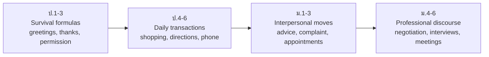

# Social Formulas and Functions — สำนวนการสื่อสารในชีวิตประจำวัน

> *"Knowing 'water' is vocabulary; knowing 'Could I have some water, please?' is communication."*

A function (หน้าที่ทางภาษา) is what you DO with language: requesting, inviting, apologizing, refusing, thanking, telephoning. The Thai curriculum weaves a functional syllabus through every band, because Thai and English perform these acts differently — Thai politeness runs on ครับ/ค่ะ particles, while English politeness runs on fixed formulas, modal verbs, and question shapes. This note tracks the functional syllabus across grades, from simple exchanges in ป.1 to negotiation and complaint handling in ม.ปลาย.

## 1 | Grade Band Breakdown

| Grade | Key Functions |
|---|---|
| **ป.1–3** | Greetings and farewells, introducing self, thanking, apologizing simply, asking permission (May I...?), asking and telling how you feel |
| **ป.4–6** | Making suggestions (Let's / How about...?), inviting and accepting/declining, asking for and giving directions, shopping language, telephone basics, asking for help |
| **ม.1–3** | Making polite requests (Would you mind...?), complaining politely, making appointments, agreeing and disagreeing, giving advice (should / If I were you), narrating past events |
| **ม.4–6** | Formal negotiation, handling complaints in service contexts, job interview question-answer patterns, presenting and defending a position, summarizing a discussion |

## 2 | The Functional Growth Path

## 3 | Function Families with Grade Bands

| Function family | Example formulas | Bands |
|---|---|---|
| **Greetings / leave-taking** | Hi / Hello / Good morning; See you later | ป.1–ม.6 |
| **Gratitude** | Thanks / Thank you very much / I really appreciate it | ป.1–ม.6 |
| **Apology** | Sorry / I'm so sorry / I apologize for... | ป.1–ม.6 |
| **Permission / requests** | May I...? / Could you...? / Would you mind...? | ป.1–ม.6 (rising formality) |
| **Invitation** | Would you like to...? / How about...? / Do you fancy...? | ป.4–ม.6 |
| **Directions** | Go straight, turn left / It's opposite the bank | ป.4–ม.6 |
| **Shopping** | How much is it? / Can I get...? / I'd like to return this | ป.4–ม.6 |
| **Telephone** | May I speak to...? / Hold on, please / I'll call back | ป.4–ม.6 |
| **Advice / suggestion** | You should... / If I were you... / Have you tried...? | ม.1–3 |
| **Complaint** | Excuse me, there seems to be a problem... / I'd like a refund | ม.1–3 |
| **Agreement / disagreement** | Exactly / I'm afraid I disagree / That's a fair point, but... | ม.1–3 |
| **Opinion + justification** | In my view... / The main reason is... / What evidence supports...? | ม.4–6 |
| **Negotiation** | Would you consider...? / Let's meet halfway / If you..., then we... | ม.4–6 |
| **Interview answers** | I would say my strengths are... / Could you tell me more about the role? | ม.4–6 |

## 4 | Politeness: Thai vs English Systems

| Aspect | Thai | English | Classroom implication |
|---|---|---|---|
| Politeness marker | ครับ / ค่ะ / นะ particles | No particles — politeness lives in words | Teach modal + please formulas explicitly |
| Directness | Indirect hints preferred | Direct requests acceptable with softeners | Practice "Could you possibly..." structures |
| Saying no | Refusing directly is face-threatening | "I'm afraid..." + reason is polite | Drill refusal formulas with reasons |
| Apologizing | ขอโทษ covers most cases | Gradient: sorry → I'm terribly sorry → I apologize | Match formula to severity |
| Titles | พี่/น้อง kinship terms | Mr/Ms + name; first names after invitation | Explain when each is appropriate |

## 5 | Classroom Activities That Teach Functions

| Activity | Thai | Functions practiced |
|---|---|---|
| Role play | การแสดงบทบาทสมมติ | Shopping, restaurant, doctor visits, hotels |
| Information gap | เกมข้อมูลต่างกัน | Asking and telling, clarifying |
| Dialog building | การสร้างบทสนทนา | Substitution in fixed frames |
| Telephone relay | เกมส่งต่อข้อความ | Phone formulas, listening for detail |
| Debate | การโต้วาที | Opinion, agreement/disagreement, rebuttal |
| Simulation | การจำลองสถานการณ์ | Job interviews, complaint desks, negotiations |

## 6 | Common Thai-Speaker Errors in Functions

| Error | Example | Fix |
|---|---|---|
| Particle translation | "Yes na ka" / "Thank you ka" in English speech | Keep particle systems separate → [[25 Thai-English Common Mistakes]] |
| Too direct | "Give me water." | Add softeners: Could I have...? → [[31 Register & Formality]] |
| Over-apologizing or under-apologizing | "Sorry" for everything, or silence when wrong | Match formula to severity |
| Yes as agreement to facts | "You're not coming?" "Yes." (meaning: no, I'm not) | Answer the content, not the form → [[25 Thai-English Common Mistakes]] |

## 7 | Thai Terminology

| Thai | English |
|---|---|
| หน้าที่ทางภาษา | Language function |
| สำนวนเชิงสังคม | Social formulas |
| การทักทาย | Greeting |
| การขออนุญาต | Asking permission |
| การขอร้อง | Request |
| การชักชวน | Invitation |
| การขอโทษ | Apology |
| การบ่นอุบาทว์ / การร้องเรียน | Complaint |
| การเจรจาต่อรอง | Negotiation |
| ความสุภาพ | Politeness |
| สำนวนรับโทรศัพท์ | Telephone phrases |

## 8 | Cross-Links

- [[00_overview|Strand 1 Overview (BOK)]]
- [[50 Listening and Speaking|Listening and Speaking]] — functions are performed through the audio-oral skills
- [[56 Holidays and Festivals|Holidays and Festivals]] — cultural occasions where formulas appear
- [[59 Digital Etiquette|Digital Etiquette]] — written digital functions
- [[English Skill Content|English Skill]] — register and communication practice
- [[../../body-of-knowledge/English/English - Overview|English BOK Overview]]
