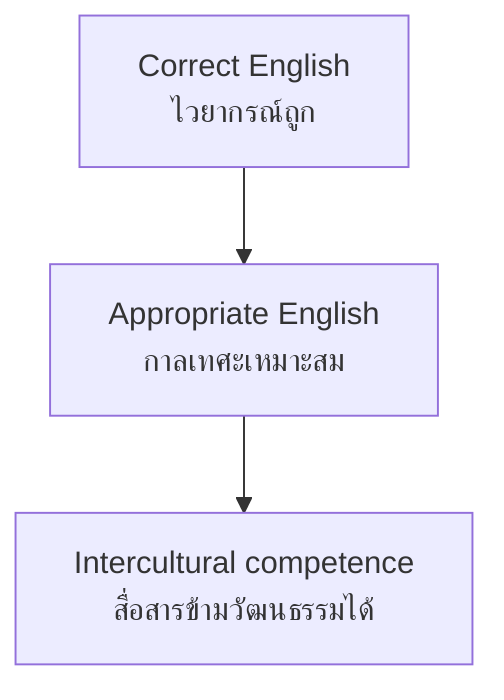

# Language and Culture — ภาษาและวัฒนธรรม

> **Strand:** สาระที่ 2 | **Concept Areas:** 6 | **Duration:** 12 years (ป.1–ม.6)
> **Standards covered:** อ 2.1 (understand language-culture relationship of native speakers; use language appropriate to time, place, occasion), อ 2.2 (courteous participation in intercultural exchange)

## Overview

Strand 2 (ภาษาและวัฒนธรรม) teaches that language cannot be separated from the culture of its speakers. The OBEC standards ask students to understand native-speaker cultures, use language with appropriate social etiquette (กาลเทศะ — the right words for the right time, place, occasion, and person), and participate courteously in intercultural exchange — including presenting Thai culture in English. The strand starts with festivals and magic words in primary and matures into intercultural analysis and digital etiquette in secondary.

## Concept Areas

| # | Concept Area | Thai | ป.1–3 | ป.4–6 | ม.1–3 | ม.4–6 |
|---|---|---|---|---|---|---|
| 07 | [[56 Holidays and Festivals]] | วันสำคัญและเทศกาล | Festival songs, Halloween, Christmas | Major festivals, dates, symbols | Origins, comparisons | Cross-cultural analysis |
| 08 | [[57 Social Etiquette]] | มารยาททางสังคม | Magic words | Table manners, gifts | Small talk, norms | Business etiquette |
| 09 | [[58 Intercultural Communication]] | การสื่อสารระหว่างวัฒนธรรม | — | — | Direct/indirect, gestures | Dimensions, shock, repair |
| 10 | [[59 Digital Etiquette]] | มารยาทในโลกออนไลน์ | — | — | Email basics, posting | Formal registers, footprint |
| 11 | [[60 Language and Thai Culture]] | ภาษากับวัฒนธรรมไทย | Naming Thai things | Customs in sentences | Explaining Thai culture | Comparative presentations |
| 12 | [[61 World Englishes]] | ภาษาอังกฤษหลากหลายรูปแบบ | — | — | UK/US differences | Varieties, ASEAN, intelligibility |

## Official Standard Mapping

| Standard | Thai | Our Concept Areas |
|---|---|---|
| อ 2.1 | เข้าใจความสัมพันธ์ระหว่างภาษาและวัฒนธรรมของเจ้าของภาษา และนำมาใช้ได้เหมาะสมกับกาลเทศะ | 07 Holidays and Festivals, 08 Social Etiquette, 09 Intercultural Communication, 12 World Englishes |
| อ 2.2 | มีมารยาททางสังคมในการสื่อสาร และแลกเปลี่ยนข้อมูล แสดงความรู้และทัศนะความคิดเห็น | 08 Social Etiquette, 10 Digital Etiquette, 11 Language and Thai Culture |

## The Culture Strand's Core Principle

Grammar alone is not enough: "Give me the salt" is grammatically perfect and socially rude. Strand 2 supplies what grammar cannot — the judgment of what to say, to whom, when, and where.

## Progress Tracker

| # | Concept Area | Status | Files Created | Notes |
|---|---|---|---|---|
| 07 | Holidays and Festivals | ✅ Done | `56 Holidays and Festivals.md` | |
| 08 | Social Etiquette | ✅ Done | `57 Social Etiquette.md` | |
| 09 | Intercultural Communication | ✅ Done | `58 Intercultural Communication.md` | |
| 10 | Digital Etiquette | ✅ Done | `59 Digital Etiquette.md` | |
| 11 | Language and Thai Culture | ✅ Done | `60 Language and Thai Culture.md` | |
| 12 | World Englishes | ✅ Done | `61 World Englishes.md` | |

**Completion: 6/6 (100%) ✅**

## Related

- [[English - Overview|← Back to English BOK]]
- [[../16 Language for Communication/00_overview|Strand 1: Language for Communication]]
- [[../18 Language and Other Learning Areas/00_overview|Strand 3: Language and Other Learning Areas]]
- [[../19 Language and Community and the World/00_overview|Strand 4: Language and Community and the World]]
