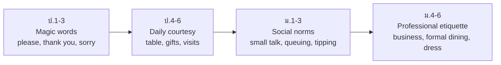

# Social Etiquette and Customs — มารยาททางสังคมและขนบธรรมเนียม

> *"Grammar makes a sentence correct; etiquette makes it appropriate. 'Give me the salt' is English — but it is not polite English."*

Standard อ 2.1 requires students to use language appropriate to time, place, occasion, and person (ใช้ภาษาสัมพันธ์กับกาลเทศะ); standard อ 2.2 adds courteous behavior (มารยาททางสังคม) in communication. The curriculum builds this from please/thank-you habits in ป.ต้น to dining etiquette, gift customs, and formal occasion behavior by ม.ปลาย — always with the Thai-English comparison in view, because Thai politeness rules do not transfer word-for-word.

## 1 | Grade Band Breakdown

| Grade | Key Content |
|---|---|
| **ป.1–3** | Magic words (please, thank you, excuse me, sorry), greeting adults vs friends, classroom politeness, table words |
| **ป.4–6** | Polite requests and refusals, table manners (Western dining basics), gift-giving occasions, visiting a foreign friend's house, interrupting politely |
| **ม.1–3** | Formal vs informal occasions, queuing culture, tipping culture, punctuality norms, small talk topics (safe vs unsafe), honoring elders in Western settings |
| **ม.4–6** | Business etiquette, dining in formal settings, dress codes, diplomatic courtesy, cross-cultural misreadings and how to repair them |

## 2 | Etiquette Domains Across Bands

## 3 | Key Etiquette Contrasts: Thailand vs English-Speaking Countries

| Situation | Thai norm | English-speaking norm | Language tie-in |
|---|---|---|---|
| Greeting | ไหว้ (wai), hierarchical | Handshake, eye contact, first names | "How do you do?" / "Nice to meet you" |
| beckoning | Palm down, fingers waving | Palm up finger curl (rude in Thailand!) | Non-verbal culture matters |
| Pointing at people | Avoid; use whole hand or lips | Extended finger is normal but blunt | "Excuse me, could you show me...?" |
| Smiling | Smile to smooth everything (Land of Smiles) | Smile = friendliness; silence can seem cold | Small talk formulas |
| Saying no directly | Avoid, hint instead | Acceptable with softener: "I'm afraid..." | Refusal formulas |
| Feet and head | Feet lowest, head sacred | No strong rule | Avoid pointing feet at people |
| Tipping | Not customary | Expected (US especially) | Restaurant dialog vocabulary |
| Queuing | Flexible | Strict — jumping is serious rudeness | "Are you in the queue?" |

## 4 | Small Talk: Safe and Unsafe Topics

| Safe topics | Topic areas to avoid (with strangers) |
|---|---|
| Weather, food, travel, sports, hobbies, films, weekends | Salary and money, age, weight, marital status, religion, politics (in mixed company) |

Small talk formulas progress by band: ป.4–6 (Nice weather today!), ม.1–3 (Have you seen...? / Did you catch the game?), ม.4–6 (maintaining, exiting: "Well, it was lovely talking to you").

## 5 | Classroom Activities

| Activity | Thai | Band |
|---|---|---|
| Politeness role play (shop, restaurant) | บทบาทสมมติการสุภาพ | ป.4–6 |
| Manners matching game (do/don't cards) | เกมจับคู่มารยาท | ป.1–3 |
| Dining etiquette simulation | จำลองบนโต๊ะอาหาร | ม.1–3 |
| Business lunch role play | สมมติเหตุการณ์อาหารธุรกิจ | ม.4–6 |

## 6 | Common Thai-Speaker Etiquette Gaps

| Gap | Example | Fix |
|---|---|---|
| Translating particle politeness | "Give me water, na" | Use request formulas → [[../16 Language for Communication/55 Functions and Notions|Functions and Notions]] |
| Missing small talk | Silence at the table | Teach topic cards and follow-up questions |
| Over-familiarity with elders/strangers | First names immediately | Learn title + surname conventions |
| Not exiting conversations | Walking away silently | Closing formulas: "Excuse me, I should get going" |

## 7 | Thai Terminology

| Thai | English |
|---|---|
| มารยาททางสังคม | Social etiquette |
| ขนบธรรมเนียมประเพณี | Customs and traditions |
| กาลเทศะ | Time, place, and occasion appropriateness |
| ความสุภาพ | Politeness / courtesy |
| มารยาทบนโต๊ะอาหาร | Table manners |
| การต้อนรับ | Hospitality |
| การให้ของขวัญ | Gift giving |
| การพูดคุยเรื่องสัพเพเหระ | Small talk |
| การเข้าแถวคอย | Queuing |
| มารยาททางธุรกิจ | Business etiquette |

## 8 | Cross-Links

- [[00_overview|Strand 2 Overview (BOK)]]
- [[56 Holidays and Festivals|Holidays and Festivals]] — etiquette at celebrations
- [[58 Intercultural Communication|Intercultural Communication]] — deeper culture analysis
- [[../16 Language for Communication/55 Functions and Notions|Functions and Notions]] — polite formulas
- [[../../body-of-knowledge/English/English - Overview|English BOK Overview]]
