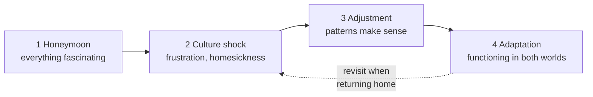

# Intercultural Communication — การสื่อสารระหว่างวัฒนธรรม

> *"The same sentence can be polite in Bangkok and rude in London. Culture decides."*

Intercultural communication (การสื่อสารระหว่างวัฒนธรรม) appears in the middle and upper bands of the curriculum: ม.ต้น students learn how communication styles differ (direct vs indirect, high-context vs low-context), and ม.ปลาย analyzes why misunderstanding happens and how to repair it. For Thai students this note is practical, not theoretical — it explains daily frictions (Why do foreigners say exactly what they think? Why do they find Thai smiles confusing?) and builds strategies for communicating across cultures without losing one's own identity.

## 1 | Grade Band Breakdown

| Grade | Key Content |
|---|---|
| **ม.1–3** | Concept of culture (visible vs invisible), direct vs indirect styles, high-context vs low-context communication, personal space, gestures that differ across cultures |
| **ม.4–6** | Cultural dimensions (individualism vs collectivism, power distance, uncertainty avoidance), stereotypes vs generalizations, culture shock stages, strategies: accommodation, clarification, repair |

## 2 | Direct vs Indirect Communication

| Dimension | Direct / low-context (US, Australia, Germany) | Indirect / high-context (Thailand, Japan) |
|---|---|---|
| Meaning location | Words carry most meaning | Context, relationship, tone carry meaning |
| Saying no | "No, I can't make it" | "I'll try" / silence / changing subject |
| Disagreement | Stated openly: "I see it differently" | Softened: "That's interesting, but..." |
| Criticism | Given plainly, meant constructively | Cushioned heavily or delivered via third party |
| Silence | Uncomfortable — fill it | Comfortable — thinking time |

**Classroom implication:** both styles are correct *inside their own system*; the skill is switching, not judging.

## 3 | Culture Shock and Adjustment

| Stage | What it feels like | Classroom use |
|---|---|---|
| Honeymoon | Excitement with the new culture | Predict: "What will be fun at first?" |
| Culture shock | Irritation at differences, fatigue | Normal for exchange students and migrant workers |
| Adjustment | Patterns become predictable | Discuss coping strategies |
| Adaptation | Bicultural comfort | Goal of intercultural learning |

## 4 | Gestures and Body Language Comparison

| Gesture | Thailand | Western countries |
|---|---|---|
| Beckoning | Palm down, fingers wave | Palm up, finger curl |
| Pointing at person | Whole hand or chin | Index finger (blunt) |
| Head touch | Serious taboo | Neutral or affectionate |
| Smile | Diffuses awkwardness | Signals happiness |
| OK sign | Acceptable | Acceptable (rude in Brazil — teach caution) |
| Nodding | Agreement | Agreement (but can be acknowledgement, not agreement) |

## 5 | Strategies for Successful Intercultural Communication

| Strategy | Thai | Example |
|---|---|---|
| Ask, don't assume | ถาม อย่าเดา | "In Thailand we usually... How is it in your country?" |
| Watch and mirror | สังเกตและทำตาม | Match formality level of the host |
| Repair misunderstandings | แก้ไขความเข้าใจผิด | "I'm sorry — in my culture, that means..." |
| Tolerate ambiguity | ยอมรับความไม่แน่นอน | Not every act has a clean explanation |
| Keep identity | รักษาอัตลักษณ์ของตน | Adapt behavior; keep your values |

## 6 | Thai Terminology

| Thai | English |
|---|---|
| การสื่อสารระหว่างวัฒนธรรม | Intercultural communication |
| วัฒนธรรมที่มองเห็น / มองไม่เห็น | Visible / invisible culture |
| การสื่อสารแบบตรง / ตรงกันข้าม | Direct / indirect communication |
| ภาพเหมารวม | Stereotype |
| ความตึงเครียดทางวัฒนธรรม | Culture shock |
| การปรับตัว | Adaptation |
| ระยะห่างทางสังคม | Personal space |
| ภาษาท่า | Body language / gestures |
| ความเข้าใจผิด | Misunderstanding |
| มุมมองจากภายใน / ภายนอก | Emic / etic perspective |

## 7 | Cross-Links

- [[00_overview|Strand 2 Overview (BOK)]]
- [[57 Social Etiquette|Social Etiquette and Customs]] — etiquette in action
- [[61 World Englishes|World Englishes]] — cultures behind English varieties
- [[60 Language and Thai Culture|Language and Thai Culture]] — presenting Thai culture
- [[../../body-of-knowledge/English/English - Overview|English BOK Overview]]
