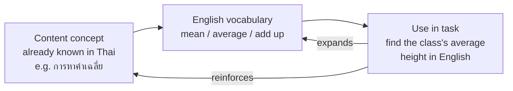

# Language and Other Learning Areas — ภาษากับกลุ่มสาระอื่น

> **Strand:** สาระที่ 3 | **Concept Areas:** 6 | **Duration:** 12 years (ป.1–ม.6)
> **Standard covered:** อ 3.1 (use English to search for, collect, and apply knowledge from other learning areas; use English as a tool for lifelong learning)

## Overview

Strand 3 (ภาษากับกลุ่มสาระอื่น) is the Thai curriculum's version of **CLIL** — Content and Language Integrated Learning. Students use English as the tool for learning content from mathematics, science, social studies, arts, health, and technology. The logic is practical: the concepts already exist in the students' minds (in Thai); English supplies the vocabulary and language patterns to access the same knowledge in the world's dominant academic language — and to continue learning with it after school.

## Concept Areas

| # | Concept Area | Thai | ป.1–3 | ป.4–6 | ม.1–3 | ม.4–6 |
|---|---|---|---|---|---|---|
| 13 | [[62 English for Mathematics]] | ภาษาอังกฤษกับคณิตศาสตร์ | Numbers, shapes, operations | Fractions, measurement, tables | Word problems, graphs | Algebra, statistics, data description |
| 14 | [[63 English for Science]] | ภาษาอังกฤษกับวิทยาศาสตร์ | Animals, body, weather | Habitats, experiments basics | Lab language, procedures | Academic texts, research language |
| 15 | [[64 English for Social Studies]] | ภาษาอังกฤษกับสังคมศึกษา | Community places | Continents, maps | ASEAN, civics, history | Current affairs, country profiles |
| 16 | [[65 English for Arts and Music]] | ภาษาอังกฤษกับศิลปะและดนตรี | Colors, songs, instruments | Genres, describing art | Interpretation, reviews | Thai arts presentations |
| 17 | [[66 English for Health and PE]] | ภาษาอังกฤษกับสุขศึกษาและพลศึกษา | Body parts, TPR games | Sports rules, illness | Fitness, injuries | Health issues, commentary |
| 18 | [[67 English for Technology]] | ภาษาอังกฤษกับเทคโนโลยี | (via apps and games) | (devices informally) | Devices, internet, safety | Coding, AI tools, tech news |

## How CLIL Works in This Strand

Each subject bridge follows the same pattern: concept first (in any language), vocabulary second, integrated task third — the language grows on the backbone of known content.

## Progress Tracker

| # | Concept Area | Status | Files Created | Notes |
|---|---|---|---|---|
| 13 | English for Mathematics | ✅ Done | `62 English for Mathematics.md` | |
| 14 | English for Science | ✅ Done | `63 English for Science.md` | |
| 15 | English for Social Studies | ✅ Done | `64 English for Social Studies.md` | |
| 16 | English for Arts and Music | ✅ Done | `65 English for Arts and Music.md` | |
| 17 | English for Health and PE | ✅ Done | `66 English for Health and PE.md` | |
| 18 | English for Technology | ✅ Done | `67 English for Technology.md` | |

**Completion: 6/6 (100%) ✅**

## Related

- [[English - Overview|← Back to English BOK]]
- [[../16 Language for Communication/00_overview|Strand 1: Language for Communication]]
- [[../17 Language and Culture/00_overview|Strand 2: Language and Culture]]
- [[../19 Language and Community and the World/00_overview|Strand 4: Language and Community and the World]]
