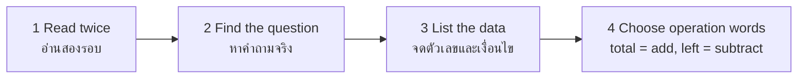

# English for Mathematics — ภาษาอังกฤษกับคณิตศาสตร์

> *"Math is a language of its own — and Thai students already study it. English just changes the words, not the logic."*

Standard อ 3.1 asks students to use English to search, collect, and apply knowledge from other learning areas. Mathematics is the most natural bridge because the underlying concepts are already familiar: numbers, operations, shapes, and data. The English task is vocabulary and language patterns — reading a word problem, describing a graph, explaining a solution. This CLIL (Content and Language Integrated Learning) approach means math class vocabulary doubles as English practice, and English class gains real content.

## 1 | Grade Band Breakdown

| Grade | Key Content |
|---|---|
| **ป.1–3** | Number words 0–100, counting songs, shapes (circle, square, triangle), simple addition/subtraction language (plus, minus, equals), more/less |
| **ป.4–6** | Four operations vocabulary, fractions (half, quarter), measurement units (cm, kg, liter), time and money expressions, reading simple tables and pictographs |
| **ม.1–3** | Word problems (multi-step), geometry vocabulary (angle, perimeter, area), percentage and ratio language, reading bar/line graphs, math instructions (calculate, solve, simplify) |
| **ม.4–6** | Academic math language: function, variable, equation, derivative; describing trends in data (IELTS Task 1 style); statistics vocabulary (mean, median, probability); writing solution explanations |

## 2 | The Math-English Vocabulary Core

| Category | Key terms | Bands |
|---|---|---|
| Numbers and operations | add, subtract, multiply, divide, sum, product, quotient | ป.1–ม.3 |
| Fractions and decimals | half, quarter, numerator, denominator, decimal point | ป.4–ม.3 |
| Geometry | angle, triangle, perimeter, area, volume, parallel, perpendicular | ป.4–ม.6 |
| Algebra | variable, equation, solve for x, substitute, factor | ม.1–ม.6 |
| Data and statistics | graph, chart, average, mean, median, probability, trend | ม.1–ม.6 |
| Process verbs | calculate, solve, estimate, simplify, prove, round off | ม.1–ม.6 |

## 3 | Language Patterns for Talking About Math

| Function | Pattern | Example |
|---|---|---|
| Stating a calculation | number + operation + number = result | Twelve plus eight equals twenty. |
| Describing a graph trend | subject + verb of change + adverb | Sales **rose sharply** in 2024. → [[41 IELTS Task 1 - Describing Data]] |
| Comparing quantities | comparative + than / as...as | Bangkok's population is **larger than** Chiang Mai's. |
| Explaining a solution | First..., then..., so... | First we **subtract** 5 from both sides, then we **divide** by 2. |
| Word problem phrases | Each, in total, left, twice as many | "If each box holds 12 eggs, how many eggs are in 5 boxes **in total**?" |

## 4 | Reading a Word Problem: The 4-Step Frame

| Signal word | Usually means | Thai |
|---|---|---|
| in total, altogether, sum | addition | รวม |
| left, remains, fewer | subtraction | เหลือ |
| each, per, times, product | multiplication | คูณ / ต่อ |
| shared equally, divided among, quotient | division | หาร |

## 5 | Classroom Activities

| Activity | Thai | Band |
|---|---|---|
| Number bingo and count-along songs | บิงโกตัวเลข | ป.1–3 |
| Math vocabulary matching cards | บัตรคำคณิตศาสตร์ | ป.4–6 |
| Word problem relay (solve + explain in English) | แข่งแก้โจทย์แล้วอธิบายเป็นภาษาอังกฤษ | ม.1–3 |
| Graph description mini-presentations | นำเสนอการอ่านกราฟ | ม.4–6 |

## 6 | Common Errors

| Error | Example | Fix |
|---|---|---|
| Number confusion | "fifteen" vs "fifty" (stress difference) | Listen-and-circle drills; stress the -teen |
| Operation mistranslation | "how many left" answered by adding | Train signal-word table above |
| Describing trends with wrong verbs | "The graph goes up" (vague) | Use rise/increase/climb + adverbs → [[41 IELTS Task 1 - Describing Data]] |
| Reading math symbols aloud | "x2" as "x two" | Teach: x squared, x cubed, square root of |

## 7 | Thai Terminology

| Thai | English |
|---|---|
| บวก / ลบ / คูณ / หาร | Add / subtract / multiply / divide |
| ผลรวม | Sum / total |
| เศษส่วน | Fraction |
| เส้นรอบรูป / พื้นที่ / ปริมาตร | Perimeter / area / volume |
| ตัวแปร | Variable |
| สมการ | Equation |
| กราฟ / แผนภูมิ | Graph / chart |
| ค่าเฉลี่ย | Average / mean |
| ความน่าจะเป็น | Probability |
| โจทย์ปัญหา | Word problem |

## 8 | Cross-Links

- [[00_overview|Strand 3 Overview (BOK)]]
- [[63 English for Science|English for Science]] — same CLIL method
- [[41 IELTS Task 1 - Describing Data|English Skill: Describing Data]] — graph language in depth
- [[../../body-of-knowledge/Mathematics/00_Fundamental Mathematics - Overview|Fundamental Mathematics (BOK)]] — the content side
- [[../../body-of-knowledge/English/English - Overview|English BOK Overview]]
