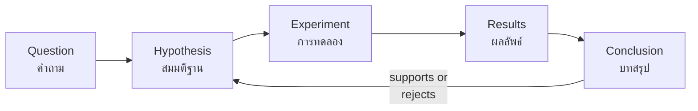

# English for Science — ภาษาอังกฤษกับวิทยาศาสตร์

> *"Science already speaks English: most textbooks above ม.ปลาย level, every serious journal, and the entire internet of research."*

Standard อ 3.1 connects English to science content: naming things scientifically, describing experiments, and reading science texts. For Thai students this strand is the on-ramp to STEM higher education — university science textbooks are in English, and the กสพท. admission path assumes science-English literacy. The curriculum builds it gently: animal/plant/body words in primary, lab processes and experiment language in ม.ต้น, and scientific articles with technical vocabulary in ม.ปลาย.

## 1 | Grade Band Breakdown

| Grade | Key Content |
|---|---|
| **ป.1–3** | Animals, plants, body parts, weather words; describing with simple adjectives (big, small, hot, cold) |
| **ป.4–6** | Habitats, life cycles, states of matter, simple experiments (observe, mix, measure); science vocabulary from IPST-style lessons in English |
| **ม.1–3** | Lab equipment and safety language, writing simple procedures (first, next, then, finally), describing results, reading short science articles |
| **ม.4–6** | Academic science texts, research summaries, hypothesis-evidence-conclusion language, presenting experiments, science news analysis |

## 2 | The Science-English Vocabulary Core

| Category | Key terms | Bands |
|---|---|---|
| Living things | mammal, insect, habitat, photosynthesis, cell, organism | ป.1–ม.6 |
| Matter and energy | solid, liquid, gas, melt, evaporate, energy, force | ป.4–ม.6 |
| Earth and space | planet, orbit, gravity, climate, earthquake | ป.4–ม.6 |
| Lab and process | beaker, measure, observe, record, predict, conclude, variable | ม.1–ม.6 |
| Academic science | hypothesis, evidence, data, analyze, theory, research | ม.4–ม.6 |

## 3 | The Experiment Report Frame

| Section | English patterns | Thai |
|---|---|---|
| Aim | The purpose of this experiment is to... | วัตถุประสงค์ |
| Materials | We used a beaker, a thermometer, and... | อุปกรณ์ |
| Method | First... Next... Then... After that... Finally... | วิธีทดลอง |
| Results | We observed that... The temperature rose by... | ผลการทดลอง |
| Conclusion | The results show that... / Our hypothesis was supported because... | สรุปผล |

## 4 | Reading Science Texts: Strategy Shifts

| Challenge | Strategy |
|---|---|
| Long technical words | Break into parts: photo- + -synthesis; micro- + -organism → [[29 Word Families]] |
| Greek/Latin roots | bio = life, geo = earth, hydro = water, therm = heat — one root unlocks 20 words |
| Passive voice everywhere | "Water is heated to 100°C" — passive is the science norm → [[06 Active vs Passive Voice]] |
| Cause-effect chains | Signal words: because, therefore, as a result, leads to → [[21 Transition Words]] |
| Data statements | "increased by 15%", "three times higher than" → [[41 IELTS Task 1 - Describing Data]] |

## 5 | Classroom Activities

| Activity | Thai | Band |
|---|---|---|
| Animal classification games | เกมจำแนกสัตว์ | ป.1–3 |
| Label-the-diagram (plant, volcano, eye) | ติดป้ายชื่อในแผนภาพ | ป.4–6 |
| Write the lab procedure from pictures | เขียนขั้นตอนทดลองจากภาพ | ม.1–3 |
| Science news jigsaw reading | อ่านข่าววิทยาศาสตร์แบบจิ๊กซอว์ | ม.4–6 |
| Mini research presentation | นำเสนองานวิจัยเล็ก | ม.4–6 |

## 6 | Why This Strand Matters Most for กสพท. Students

| Stage | English requirement |
|---|---|
| ม.ปลาย science program | Textbook supplements and problem sets increasingly in English |
| University (medicine, engineering, science) | Textbooks, lectures, labs, and exams largely in English |
| Research career | Publications, conferences, and collaboration entirely in English |
| Admission (กสพท. / TCAS) | Some programs test English; portfolio activities may be in English |

## 7 | Thai Terminology

| Thai | English |
|---|---|
| วิทยาศาสตร์ | Science |
| การทดลอง | Experiment |
| สมมติฐาน | Hypothesis |
| อุปกรณ์ทดลอง | Lab equipment / apparatus |
| ผลการทดลอง | Results |
| บทสรุป | Conclusion |
| ตัวแปรต้น / ตัวแปรตาม | Independent / dependent variable |
| เซลล์ | Cell |
| การสังเคราะห์แสง | Photosynthesis |
| งานวิจัย | Research |

## 8 | Cross-Links

- [[00_overview|Strand 3 Overview (BOK)]]
- [[62 English for Mathematics|English for Mathematics]] — same CLIL approach
- [[06 Active vs Passive Voice|English Skill: Passive Voice]] — the voice of science writing
- [[../../body-of-knowledge/Science/00_Fundamental Science - Overview|Science (BOK)]] — the content side
- [[../../body-of-knowledge/English/English - Overview|English BOK Overview]]
