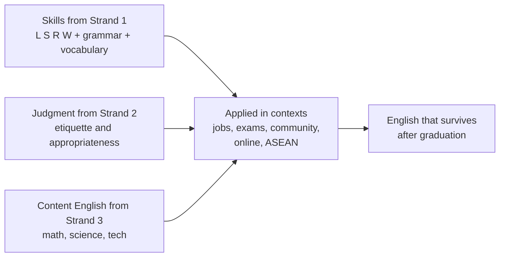

# Language and Community and the World — ภาษากับชุมชนและโลก

> **Strand:** สาระที่ 4 | **Concept Areas:** 6 | **Duration:** 12 years (ป.1–ม.6)
> **Standards covered:** อ 4.1 (use English in real-life situations in community and the world), อ 4.2 (use English as the basis for further education, careers, and lifelong learning)

## Overview

Strand 4 (ภาษากับชุมชนและโลก) is where classroom English meets the outside world: helping a tourist, working a job, passing an exam, joining the ASEAN conversation, and keeping English alive after graduation. The OBEC standards frame it as real-life application (อ 4.1) and gateway to further education and careers (อ 4.2). It concentrates in the upper bands — community English from ม.ต้น, careers, exams, and lifelong-learning skills in ม.ปลาย — though its spirit (English is for real life) runs through the whole curriculum.

## Concept Areas

| # | Concept Area | Thai | ป.1–3 | ป.4–6 | ม.1–3 | ม.4–6 |
|---|---|---|---|---|---|---|
| 19 | [[68 English for Careers]] | ภาษาอังกฤษเพื่ออาชีพ | — | — | Occupations, duties | Job ads, CV, interviews, workplace |
| 20 | [[69 English for Exams]] | ภาษาอังกฤษเพื่อการสอบ | — | O-NET ป.6 basics | O-NET ม.3 | O-NET ม.6, A-Level, IELTS, TOEFL, TOEIC |
| 21 | [[70 English Online]] | ภาษาอังกฤษกับโลกออนไลน์ | — | (via apps) | Search, dictionaries, videos | Credibility, MOOCs, AI tools |
| 22 | [[71 English in the Community]] | ภาษาอังกฤษในชุมชน | — | — | Directions, signs, markets | Tourist help, local information |
| 23 | [[72 ASEAN English]] | ภาษาอังกฤษกับอาเซียน | — | — | Members, capitals, facts | Community pillars, regional mobility |
| 24 | [[73 Lifelong English]] | ภาษาอังกฤษตลอดชีวิต | — | — | Media habits, notebooks | Maintenance planning, CEFR goals |

## How the Real-World Strand Works

Strand 4 re-uses everything the other strands build and points it at real life — the curriculum's own statement that English is not a school subject but a life tool.

## Progress Tracker

| # | Concept Area | Status | Files Created | Notes |
|---|---|---|---|---|
| 19 | English for Careers | ✅ Done | `68 English for Careers.md` | |
| 20 | English for Exams | ✅ Done | `69 English for Exams.md` | |
| 21 | English Online | ✅ Done | `70 English Online.md` | |
| 22 | English in the Community | ✅ Done | `71 English in the Community.md` | |
| 23 | ASEAN English | ✅ Done | `72 ASEAN English.md` | |
| 24 | Lifelong English | ✅ Done | `73 Lifelong English.md` | |

**Completion: 6/6 (100%) ✅**

## Related

- [[English - Overview|← Back to English BOK]]
- [[../16 Language for Communication/00_overview|Strand 1: Language for Communication]]
- [[../17 Language and Culture/00_overview|Strand 2: Language and Culture]]
- [[../18 Language and Other Learning Areas/00_overview|Strand 3: Language and Other Learning Areas]]
