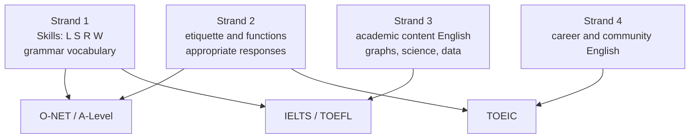

# English for Exams — ภาษาอังกฤษเพื่อการสอบ

> *"Exams are the gate: O-NET for the system, IELTS/TOEFL/TOEIC for the world beyond it."*

Standard อ 4.2 names lifelong learning and further education as goals — and in Thailand's system, those goals are reached through examinations. The curriculum itself references the major tests: O-NET measures the national curriculum at ป.6/ม.3/ม.6, while international tests (IELTS, TOEFL, TOEIC) and university tests (CU-TEP, TU-GET) gate scholarships, university programs, and employment. This note maps each exam to its role, structure, and the strand/skill preparation it demands.

## 1 | The Thai Exam Landscape

| Exam | Level | Administered by | Role |
|---|---|---|---|
| **O-NET** | ป.6, ม.3, ม.6 | สทศ. (NIETS) | National achievement test of the basic-education curriculum |
| **A-Level English** | ม.6 | สทศ. / ทปอ. | Subject-level test in TCAS admissions (portfolio/quiz rounds) |
| **TGAT** | ม.6 | สทศ. | Aptitude component of TCAS (includes English usage) |
| **IELTS** | ม.4–6+ | British Council/IDP | International: study abroad, scholarships, some Thai programs |
| **TOEFL** | ม.4–6+ | ETS | International: US-oriented academic admission |
| **TOEIC** | ม.4–6+ | ETS | Workplace English: company requirements in Thailand |
| **CU-TEP** | ม.6+ | Chulalongkorn | Chula admission and general proficiency |
| **TU-GET** | ม.6+ | Thammasat | Thammasat admission and proficiency |

## 2 | O-NET English Structure (ม.6)

| Section | Coverage | Skills from the 4 strands |
|---|---|---|
| Listening | Short dialogs, announcements | Strand 1 — Listening |
| Reading | Passages with vocabulary/main-idea/inference items | Strand 1 — Reading, Vocabulary |
| Conversation | Dialogue completion, functional language | Strand 1 — Functions; Strand 2 — etiquette |
| Grammar | Sentence completion, error identification | Strand 1 — Grammar |
| Writing-lite | Occasional items on structure and ordering | Strand 1 — Writing |

**Item style:** 4-choice multiple choice; vocabulary from the core list; conversation items test pragmatic (polite/appropriate) responses — Strand 2 knowledge directly changes scores.

## 3 | International Tests at a Glance

| Test | Skills | Format | Best for |
|---|---|---|---|
| IELTS | L, R, W, S | Paper/computer; band 0–9; Academic & General | UK/AU/NZ universities; Thai scholarship programs |
| TOEFL iBT | L, R, W, S | Computer; score 0–120 | US universities; academic English proof |
| TOEIC | L, R (+ S, W optional) | Paper; score 10–990 | Employers in Thailand and Japan/Korea |
| CU-TEP / TU-GET | R, L, W | Paper | Specific university requirements |

## 4 | How the Four Strands Feed Each Test

## 5 | Preparation Priorities by Target

| Target | Priority order |
|---|---|
| O-NET ม.3 / ม.6 | Core vocabulary → grammar accuracy → reading strategies → conversation formulas |
| IELTS Academic | AWL vocabulary → essay writing → listening note-taking → speaking templates |
| TOEFL | Note-taking (integrated tasks) → academic vocabulary → structured speaking |
| TOEIC | Business vocabulary → Part 5 grammar speed → Part 7 scanning speed |

## 6 | Common Errors

| Error | Impact | Fix |
|---|---|---|
| Studying test tricks before language | Plateau at low band | Build vocabulary and grammar first → [[English Skill Content]] |
| Ignoring O-NET conversation items | Easy points lost | Drill polite-response patterns → [[55 Functions and Notions]] |
| Unfamiliar formats | Time panic on test day | Practice with official sample papers |
| No timing plan | Unfinished sections | Section timing strategy → [[44 Time Management]] |

## 7 | Thai Terminology

| Thai | English |
|---|---|
| การสอบวัดผลทางการศึกษาระดับชาติ | National educational test (O-NET) |
| คะแนนสอบ | Exam score |
| มาตราส่วนคะแนน (แบนด์) | Band score |
| การสอบวัดความสามารถภาษาอังกฤษ | English proficiency test |
| ข้อสอบปรนัย | Multiple-choice items |
| การจัดเวลาในการสอบ | Exam time management |
| ตัวอย่างข้อสอบ | Sample papers / past papers |
| การเตรียมสอบ | Test preparation |
| ผลคะแนนสอบ | Test result |
| เกณฑ์การให้คะแนน | Scoring criteria |

## 8 | Cross-Links

- [[00_overview|Strand 4 Overview (BOK)]]
- [[73 Lifelong English|Lifelong English]] — exams as one step in continued learning
- [[44 Time Management|English Skill: Exam Strategies]]
- [[45 Scoring Criteria|English Skill: Scoring Criteria]]
- [[../../body-of-knowledge/English/English - Overview|English BOK Overview]]
