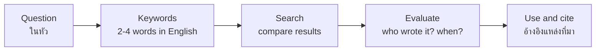

# English Online — ภาษาอังกฤษกับโลกออนไลน์

> *"The internet is the only place a Thai student in Chiang Rai can talk to the whole world for free — in English."*

English Online covers using the internet in English: searching effectively, using online dictionaries and translators wisely, learning with videos, apps, and AI tools, and communicating online in English. The curriculum treats online English as both a **tool for learning English** (อ 4.2 lifelong learning) and a **skill in itself** (อ 4.1 using English in real digital environments).

## 1 | Grade Band Breakdown

| Grade | Key Content |
|---|---|
| **ม.1–3** | Searching in English (keywords, not questions), online dictionaries vs translators, educational videos (YouTube, Khan Academy), basic learning apps, safe account habits |
| **ม.4–6** | Evaluating English websites (credibility), MOOCs and online courses, language-exchange communities, AI chatbots as practice partners, managing digital identity in English |

## 2 | The Online Learning Toolkit

| Tool type | Examples | Best use | Watch out |
|---|---|---|---|
| Search engines | Google, Bing | Keyword search in English | Thai-style full-sentence queries fail |
| Online dictionaries | Cambridge, Oxford, Longdo | Meaning, pronunciation, examples | Machine translation for single words is weaker |
| Translators | Google Translate, DeepL | Quick gist of long text | Sentence-level errors; never for submitting work |
| Video platforms | YouTube, TED-Ed | Listening practice with subtitles | Passive watching ≠ learning |
| Learning apps | Duolingo, Quizlet | Daily vocabulary habit | Game streaks ≠ real communication |
| AI chatbots | ChatGPT, Gemini | Conversation practice, corrections, explanations | Verify facts; don't let it write your homework |
| MOOCs | Coursera, edX, Thai MOOC | Subject learning in English | Requires self-discipline |

## 3 | Searching in English: The Keyword Method

| Thai search habit | English search habit |
|---|---|
| Full question: "What is the tallest mountain in the world?" | Keywords: `tallest mountain world` |
| One long phrase | 2–4 content words |
| Thai keywords for English content | English keywords for English sources |
| First result trusted | Compare 2–3 sources |

## 4 | Using AI Chatbots to Learn English (ม.ปลาย)

| Practice | Prompt pattern | What it trains |
|---|---|---|
| Conversation partner | "Chat with me about [topic] at B1 level and correct my mistakes." | Fluency + accuracy |
| Explanation on demand | "Explain present perfect vs past simple with Thai-relevant examples." | Grammar clarity |
| Rewrite my writing | "Improve this email to my teacher. Keep my meaning." | Register and style |
| Quiz me | "Give me 10 O-NET style vocabulary questions." | Exam readiness |

**Rules of use:** treat AI output as a draft to check, not truth to copy; follow your school's rules; never submit AI writing as your own → [[59 Digital Etiquette]].

## 5 | Evaluating English Websites

| Check | Question |
|---|---|
| Source | Who published it? (.gov/.edu/.ac.th more reliable than random blogs) |
| Date | Is it current or outdated? |
| Purpose | Inform, sell, or persuade? |
| Cross-check | Do 2+ independent sources agree? |

## 6 | Common Errors

| Error | Example | Fix |
|---|---|---|
| Translator dependence | Submitting Google-translated essays | Write simply yourself; use translator to check, not replace |
| Copy-paste plagiarism | Wikipedia text pasted as homework | Summarize and cite → [[59 Digital Etiquette]] |
| Trusting the first result | One blog becomes "fact" | Cross-check at least two sources |
| Passive consumption | Videos on autoplay = zero production | Pair every video with a written or spoken response |

## 7 | Thai Terminology

| Thai | English |
|---|---|
| ภาษาอังกฤษออนไลน์ | English online |
| การค้นหาข้อมูล | Searching for information |
| คำสำคัญ | Keywords |
| พจนานุกรมออนไลน์ | Online dictionary |
| โปรแกรมแปลภาษา | Machine translation |
| การเรียนรู้ออนไลน์ | Online learning |
| หลักสูตรออนไลน์เปิดกว้าง | MOOC |
| ผู้ช่วยปัญญาประดิษฐ์ | AI assistant / chatbot |
| การประเมินความน่าเชื่อถือ | Credibility evaluation |
| การลอกเลียนงานผู้อื่น | Plagiarism |

## 8 | Cross-Links

- [[00_overview|Strand 4 Overview (BOK)]]
- [[73 Lifelong English|Lifelong English]] — online tools power lifelong learning
- [[59 Digital Etiquette|Digital Etiquette (Strand 2)]] — behavior rules online
- [[67 English for Technology|English for Technology (Strand 3)]] — tech vocabulary
- [[../../body-of-knowledge/English/English - Overview|English BOK Overview]]
