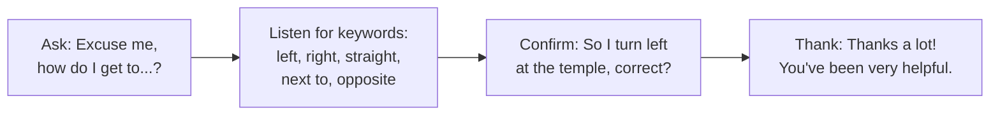

# English in the Community — ภาษาอังกฤษในชุมชน

> *"For a Thai student, the first real English test is a lost tourist asking for directions — no multiple choice, no dictionary."*

Standard อ 4.1 moves English out of the classroom into real life: helping tourists, reading signs and announcements, asking for and giving information in the community, and participating in community activities that use English. In tourism-heavy Thailand this strand has immediate, visible use — and it feeds national programs like Thailand's tourism-village and "English for tourists" initiatives.

## 1 | Grade Band Breakdown

| Grade | Key Content |
|---|---|
| **ม.1–3** | Giving simple directions, reading street signs and public signs, transportation vocabulary, shopping and market interactions, emergency phrases |
| **ม.4–6** | Tourist assistance conversations, reading menus/timetables/notices, local information (attractions, festivals), community service with foreign visitors, handling problems politely |

## 2 | Core Community Situations

| Situation | Key language | Band |
|---|---|---|
| Directions | Go straight / turn left at the / It's next to / on your right | ม.1–3 |
| Transportation | Which bus goes to...? / single or return? / next train | ม.1–3 |
| Shopping and markets | How much is it? / Can you give me a discount? / bag, please | ม.1–3 |
| Restaurant | A table for two / I'll have the... / Could we have the bill? | ม.1–3 |
| Reading notices | No parking / Sold out / Departures delayed / Opening hours | ม.1–3 |
| Tourist help | Where are you trying to go? / I'll show you / Watch your step | ม.4–6 |
| Emergencies | Call an ambulance! / I need help / Where is the nearest hospital? | ม.1–3 |

## 3 | The Directions Toolkit

| Landmark type | English pattern |
|---|---|
| Temple | Go past the temple; it's on your left. |
| Intersection | Turn right at the second intersection. |
| Distance | It's about a five-minute walk. |
| Location | It's opposite the 7-Eleven / behind the school. |

## 4 | Reading Public Signs: Categories

| Sign category | Examples | Reading skill |
|---|---|---|
| Prohibition | No Smoking, No Entry, Keep Off the Grass | No + V-ing / noun |
| Warning | Wet Floor, Beware of Dogs, High Voltage | Imperative and caution words |
| Information | Departures, Check-in, Exit, First Aid | Vocabulary recognition |
| Hours and rules | Open 9 a.m.–6 p.m., Closed on Mondays | Time expressions |
| Direction | This Way Up, To the Gates, Arrows | Spatial vocabulary |

## 5 | Community English Activities in Thai Schools

| Activity | Thai | Band |
|---|---|---|
| Sign-hunt homework (photograph and translate 10 signs) | ล่าป้ายภาษาอังกฤษ | ม.1–3 |
| Role play: tourist at the market/temple | บทบาทสมมตินักท่องเที่ยว | ม.1–3 |
| Community map project (label in English + directions) | ทำแผนที่ชุมชนภาษาอังกฤษ | ม.1–3 |
| English corner at school events | มุมภาษาอังกฤษ | ม.ทุกช่วง |
| Homestay / tour-guide day with real visitors | ฝึกเป็นมัคคุเทศก์ | ม.4–6 |

## 6 | Common Errors

| Error | Example | Fix |
|---|---|---|
| Directions without sequence words | "Left, shop, right." | First/then/after that + full sentences |
| Overuse of "very" | "very very far" | far / quite far / about 2 kilometers |
| Direct translation of place names | "Temple of Dawn" only | Standard English names: Wat Arun (Temple of Dawn) |
| Panic silence | Freezing when asked | Survival formulas: "Sorry, could you repeat that?" / "One moment, please." |

## 7 | Thai Terminology

| Thai | English |
|---|---|
| ภาษาอังกฤษในชุมชน | English in the community |
| การบอกทิศทาง | Giving directions |
| ป้ายสาธารณะ | Public signs |
| นักท่องเที่ยว | Tourist |
| ตลาด | Market |
| การขนส่งสาธารณะ | Public transportation |
| เหตุฉุกเฉิน | Emergency |
| การช่วยเหลือ | Assistance / helping |
| จุดสังเกต | Landmark |
| ชุมชนท่องเที่ยว | Tourism community |

## 8 | Cross-Links

- [[00_overview|Strand 4 Overview (BOK)]]
- [[68 English for Careers|English for Careers]] — tourism careers build on this
- [[60 Language and Thai Culture|Language and Thai Culture]] — explaining local culture
- [[72 ASEAN English|ASEAN English]] — regional visitors
- [[../../body-of-knowledge/English/English - Overview|English BOK Overview]]
