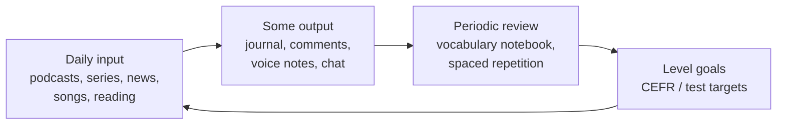

# Lifelong English — ภาษาอังกฤษตลอดชีวิต

> *"School gives you 12 years of English. Life after school gives you the rest — if you keep the engine running."*

Standard อ 4.2 makes lifelong learning (การเรียนรู้ตลอดชีวิต) an explicit goal: students should leave school able to **maintain and grow** their English without a teacher. This is the strategic answer to Thailand's known pattern — students study English for 12 years and lose much of it within a few years of leaving school when daily use stops. This note covers maintenance strategies, media English, and continued learning pathways.

## 1 | Grade Band Breakdown

| Grade | Key Content |
|---|---|
| **ม.1–3** | Self-study habits: daily exposure routines, keeping a vocabulary notebook, using media in English (songs, series, games) |
| **ม.4–6** | Maintenance planning after graduation, reading news and articles independently, consuming English media deliberately, self-assessment (CEFR self-check), lifelong learning pathways |

## 2 | Why English Fades After School (and How to Fight It)

| Cause of loss | Counter-strategy |
|---|---|
| No daily use | Build small daily rituals: 10 minutes of English media, a diary line, a song |
| No necessity | Tie English to passion: gaming, football, cooking, K-pop/fandom, travel |
| No environment | Create one: phone in English, English playlists, follow English creators |
| No goals | Set level goals (CEFR B1, TOEIC 600, IELTS 5.5) and dates |
| No feedback | AI chatbots, language exchange, online writing communities |

## 3 | The Maintenance Portfolio

| Component | Minimum effective dose |
|---|---|
| Input | 15–30 min/day: series episode, podcast, articles, reading |
| Output | 3–5 sentences written or 2 min spoken, 3+ times/week |
| Vocabulary | Review notebook weekly; new words need 5+ encounters |
| Assessment | One practice test or CEFR self-check per year |

## 4 | Media English Pathways

| Media type | Examples | Skill trained |
|---|---|---|
| Streaming series | Start with subtitles, rewatch key scenes | Listening, informal language |
| News | BBC Learning English, VOA Learning English, Bangkok Post | Reading, current vocabulary |
| Music | Lyrics study of favorite songs | Connected speech, vocabulary |
| Gaming | English servers, English guides | Reading speed, community chat |
| Social media | Follow English educators and creators | Micro-learning habits |
| Books | Graded readers → young adult → originals | Reading stamina |

## 5 | After-Graduation Pathways

| Pathway | What it offers |
|---|---|
| University English courses | Required courses + English-medium programs |
| International test targets | IELTS/TOEFL for scholarships; TOEIC for jobs |
| Online courses (MOOCs) | Subject + language together → [[70 English Online]] |
| Language exchange | Conversation practice with partners worldwide |
| Work environment | Tourism, international companies, remote work in English |
| Certification | CEFR-aligned certificates, teacher training (for some) |

## 6 | Self-Assessment: CEFR for Lifelong Learners

| CEFR level | "Can-do" example |
|---|---|
| A2 | Can describe my background and immediate needs in simple terms |
| B1 | Can deal with most situations while traveling; can write simple connected text |
| B2 | Can understand the main ideas of complex text; can interact with fluency and spontaneity |
| C1 | Can use English flexibly for social, academic, and professional purposes |

## 7 | Thai Terminology

| Thai | English |
|---|---|
| การเรียนรู้ตลอดชีวิต | Lifelong learning |
| การเรียนรู้ด้วยตนเอง | Self-directed learning |
| การบำรุงรักษาภาษา | Language maintenance |
| สื่อภาษาอังกฤษ | English media |
| สมุดจดคำศัพท์ | Vocabulary notebook |
| การทบทวนเว้นระยะ | Spaced repetition |
| เป้าหมายระดับภาษา | Language level goal |
| การประเมินตนเอง | Self-assessment |
| การแลกเปลี่ยนภาษา | Language exchange |
| สื่อการเรียนรู้ออนไลน์ | Online learning resources |

## 8 | Cross-Links

- [[00_overview|Strand 4 Overview (BOK)]]
- [[70 English Online|English Online]] — the toolkit for self-study
- [[69 English for Exams|English for Exams]] — level goals need tests
- [[54 Vocabulary|Vocabulary (Strand 1)]] — the notebook habit starts here
- [[../../body-of-knowledge/English/English - Overview|English BOK Overview]]
