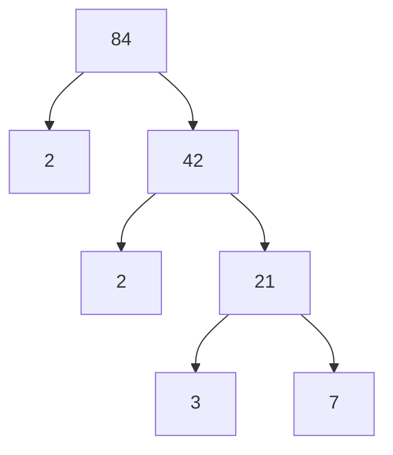

---
tags:
  - mathematics
  - fundamental
  - number-theory
  - factors
  - ipst
source: "IPST (สสวท.) Fundamental Mathematics Curriculum, B.E. 2551 (2008, revised 2560/2017)"
created: 2026-07-22
course_codes: ["ค121", "ค122", "ค123", "ค211", "ค212", "ค213"]
---

# Factors, Multiples, and Number Theory — ตัวประกอบ ตัวคูณ และทฤษฎีจำนวน

> *"Every integer is either a prime or can be uniquely expressed as a product of primes — this is the fundamental theorem that unlocks all of number theory."*

Understanding the multiplicative structure of numbers through factors, multiples, prime factorization, GCD, and LCM. This topic builds foundational number theory knowledge essential for working with fractions, simplifying expressions, and advancing to algebra.

---

## 1 | Grade Band Breakdown

### ป.1–3 (Grades 1–3)

| Grade | Scope | Key Skills |
|---|---|---|
| **ป.3** | Informal foundations | Concept of "making equal groups" — groundwork for understanding factors as ways to group objects equally; even/odd numbers introduced |

### ป.4–6 (Grades 4–6)

| Grade | Scope | Key Skills |
|---|---|---|
| **ป.4** | Factors, multiples, primes | Multiples (พหุคูณ) and factors (ตัวประกอบ); finding all factors of a number; prime numbers up to 100; prime factorization using factor trees |
| **ป.5** | Divisibility, factorization | Divisibility rules for 2, 3, 5, 9, 10; prime factorization by division method; expressing numbers as products of prime factors |
| **ป.6** | GCD and LCM | ห.ร.ม. (GCD) and ค.ร.น. (LCM); solving problems using GCD and LCM; relationship: a × b = GCD(a,b) × LCM(a,b) |

### ม.1–3 (Grades 7–9)

| Grade | Scope | Key Skills |
|---|---|---|
| **ม.1** | Euclidean algorithm | Review and extension; Euclidean algorithm for GCD; prime factorization of larger numbers; applications in fraction simplification |
| **ม.2** | Extended theory | Divisibility tests extended; infinitude of primes; factorization of algebraic expressions; exponent rules with prime factorization |
| **ม.3** | Advanced concepts | Perfect squares and cubes; index notation with prime factors; introduction to modular arithmetic (remainders) |

---

## 2 | Key Terminology

| Thai | English | Notes |
|---|---|---|
| ตัวประกอบ | Factor | a is a factor of b if b ÷ a has no remainder |
| จำนวนเฉพาะ | Prime number | Natural number > 1 with exactly two factors |
| จำนวนประกอบ | Composite number | Natural number > 1 with more than two factors |
| การแยกตัวประกอบ | Prime factorization | Expressing a number as a product of primes |
| ตัวประกอบเฉพาะ | Prime factor | A factor that is prime |
| ตัวคูณร่วมน้อย (ค.ร.น.) | Least Common Multiple (LCM) | Smallest number that is a multiple of all given numbers |
| ตัวหารร่วมมาก (ห.ร.ม.) | Greatest Common Divisor (GCD) | Largest number that divides all given numbers |
| พหุคูณ | Multiple | b is a multiple of a if b = a × k for some integer k |
| การหารลงตัว | Divisibility | a divides b if remainder = 0 |
| แผนภูมิต้นไม้ตัวประกอบ | Factor tree | Visual method for prime factorization |
| ขั้นตอนวิธีแบบยุคลิด | Euclidean algorithm | Efficient method for finding GCD |

---

## 3 | Key Concepts & Properties

### 3.1 Factor and Multiple Definitions

| Term | Definition | Example |
|---|---|---|
| **Factor** | a is a factor of b if b = a × k (k ∈ ℤ) | 4 is a factor of 12 because 12 = 4 × 3 |
| **Multiple** | b is a multiple of a if b = a × k (k ∈ ℤ) | 12 is a multiple of 4 |

### 3.2 The Fundamental Theorem of Arithmetic

> **Every integer greater than 1 can be expressed uniquely as a product of prime numbers** (up to the order of factors).

$$	\text{Example: } 60 = 2^2 	\times 3 	\times 5$$

### 3.3 Divisibility Rules

| Divisible by | Rule | Example |
|---|---|---|
| **2** | Last digit is 0, 2, 4, 6, or 8 | 348 → last digit 8 ✓ |
| **3** | Sum of digits divisible by 3 | 471 → 4+7+1=12, 12÷3=4 ✓ |
| **4** | Last two digits divisible by 4 | 5,324 → 24÷4=6 ✓ |
| **5** | Last digit is 0 or 5 | 385 → last digit 5 ✓ |
| **6** | Divisible by both 2 AND 3 | 732 → even AND 7+3+2=12÷3=4 ✓ |
| **8** | Last three digits divisible by 8 | 5,128 → 128÷8=16 ✓ |
| **9** | Sum of digits divisible by 9 | 8,127 → 8+1+2+7=18, 18÷9=2 ✓ |
| **10** | Last digit is 0 | 450 → last digit 0 ✓ |

### 3.4 Prime Factorization Methods

**Method A: Factor Tree (แผนภูมิต้นไม้)**

> **Result:** 84 = 2 × 2 × 3 × 7 = **2² × 3 × 7**

**Method B: Division Method**

| Step | Division | Quotient |
|---|---|---|
| 1 | 84 ÷ 2 | 42 |
| 2 | 42 ÷ 2 | 21 |
| 3 | 21 ÷ 3 | 7 |
| 4 | 7 ÷ 7 | 1 |

> **Result:** 84 = **2² × 3 × 7**

### 3.5 GCD (ห.ร.ม.) Methods

**Method A — List all factors:**
- Factors of 48: 1, 2, 3, 4, 6, 8, 12, 16, 24, 48
- Factors of 72: 1, 2, 3, 4, 6, 8, 9, 12, 18, 24, 36, 72
- Common factors: 1, 2, 3, 4, 6, 8, 12, 24
- **GCD = 24**

**Method B — Prime factorization:**
- 48 = 2⁴ × 3
- 72 = 2³ × 3²
- GCD = 2³ × 3¹ = 24 (take **lowest** power of each common prime)

**Method C — Euclidean algorithm:**
- 72 ÷ 48 = 1 remainder 24
- 48 ÷ 24 = 2 remainder 0
- **GCD = 24**

### 3.6 LCM (ค.ร.น.) Methods

**Method A — List multiples:**
- Multiples of 12: 12, 24, 36, 48, 60, 72...
- Multiples of 18: 18, 36, 54, 72...
- **LCM = 36**

**Method B — Prime factorization:**
- 12 = 2² × 3
- 18 = 2 × 3²
- LCM = 2² × 3² = 36 (take **highest** power of each prime)

**Method C — Using GCD:**
- $$	ext{LCM}(a, b) = rac{a 	imes b}{	ext{GCD}(a, b)}$$

### 3.7 The GCD-LCM Relationship

$$ \boxed{	\text{GCD}(a, b) 	\times 	\text{LCM}(a, b) = a 	\times b}$$

---

## 4 | Common Problem Types

### Type 1: Finding All Factors
> Find all factors of 36.

$$36 = 1 	\times 36 = 2 	\times 18 = 3 	\times 12 = 4 	\times 9 = 6 	\times 6$$

**Answer:** 1, 2, 3, 4, 6, 9, 12, 18, 36

### Type 2: Prime Factorization
> Prime factorize 84.

**Answer:** 84 = 2² × 3 × 7

### Type 3: Finding GCD
> Find GCD(48, 72).

Using prime factorization:
- 48 = 2⁴ × 3
- 72 = 2³ × 3²
- GCD = 2³ × 3 = **24**

### Type 4: Finding LCM
> Find LCM(12, 18).

Using prime factorization:
- 12 = 2² × 3
- 18 = 2 × 3²
- LCM = 2² × 3² = **36**

### Type 5: Word Problem — LCM
> Two bells ring every 12 and 18 minutes respectively. If they ring together now, when will they ring together again?

**Solution:** Find LCM(12, 18) = 36 minutes

### Type 6: Word Problem — GCD
> A rectangular floor is 48 m by 72 m. What is the largest possible size of square tiles that can cover it without cutting?

**Solution:** GCD(48, 72) = 24 — tiles of side length 24 m

---

## 5 | Cross-Links

- [[01_Numbers_and_Numeration]] — Prime/composite classification
- [[02_Arithmetic_Operations]] — Division with remainder is foundational
- [[05_Fractions]] — Simplifying fractions using GCD; common denominators using LCM
- [[04_Integers]] — Factors and multiples extend to negative numbers
- [[11_Basic_Algebra]] — Factoring algebraic expressions (prime factorization analogy)
