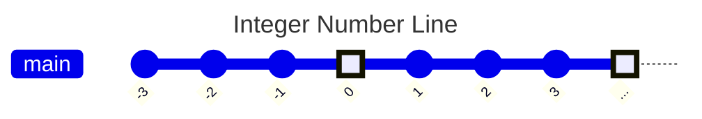

---
tags:
  - mathematics
  - fundamental
  - integers
  - negative-numbers
  - ipst
source: "IPST (สสวท.) Fundamental Mathematics Curriculum, B.E. 2551 (2008, revised 2560/2017)"
created: 2026-07-22
course_codes: ["ค122", "ค123", "ค211", "ค212", "ค213"]
---

# Integers — จำนวนเต็ม

> *"The invention of negative numbers was one of the great conceptual leaps in mathematics — it turned subtraction into addition and opened the door to algebra."*

Integers extend the number system to include negative numbers and zero. Students learn to represent, compare, order, and perform all four operations with integers, building the essential foundation for algebra, coordinate geometry, and all higher mathematics.

---

## 1 | Grade Band Breakdown

### ป.1–3 (Grades 1–3)

| Grade | Scope | Key Skills |
|---|---|---|
| **ป.1–ป.3** | Not formally introduced | Students work only with positive whole numbers. Informal exposure may occur through temperature or elevator floors |

### ป.4–6 (Grades 4–6)

| Grade | Scope | Key Skills |
|---|---|---|
| **ป.5** | Introduction to negatives | Real-world contexts (temperature, debt, below sea level); reading and writing negative numbers |
| **ป.6** | Number line, basic ± | Comparing and ordering integers on a number line (เส้นจำนวน); using `>`, `<`, `=` with integers; adding/subtracting integers using number line model |

### ม.1–3 (Grades 7–9)

| Grade | Scope | Key Skills |
|---|---|---|
| **ม.1** | Full formal treatment | Definition: ℤ = {..., −3, −2, −1, 0, 1, 2, 3, ...}; absolute value (ค่าสัมบูรณ์); all four operations; properties; opposite numbers (จำนวนตรงข้าม) |
| **ม.2** | Powers, equations | Powers of integers; order of operations with integers; solving equations involving integers |
| **ม.3** | Integer exponents | Scientific notation with positive and negative exponents; review within real number operations |

---

## 2 | Key Terminology

| Thai | English | Notes |
|---|---|---|
| จำนวนเต็ม | Integer | ℤ = {..., −3, −2, −1, 0, 1, 2, 3, ...} |
| จำนวนเต็มบวก | Positive integer | Numbers greater than 0 |
| จำนวนเต็มลบ | Negative integer | Numbers less than 0 |
| ศูนย์ | Zero | Neither positive nor negative |
| จำนวนตรงข้าม | Opposite / Additive inverse | For a, the opposite is −a |
| ค่าสัมบูรณ์ | Absolute value | Distance from 0 on number line; \|a\| |
| เส้นจำนวน | Number line | Visual representation |
| เครื่องหมายบวก/ลบ | Positive/negative sign | `+` or `−` before a number |
| การเปรียบเทียบจำนวนเต็ม | Comparing integers | Using `>`, `<`, `=` |

---

## 3 | Key Concepts & Properties

### 3.1 The Integer Set

The set of integers is defined as:

$$\mathbb{Z} = \{\ldots, -3, -2, -1, 0, 1, 2, 3, \ldots\}$$

Numbers increase from **left to right**. Zero is highlighted as the origin. Dots at both ends indicate the set extends infinitely.

### 3.2 Absolute Value (ค่าสัมบูรณ์)

The absolute value of a number is its **distance from zero** on the number line — always non-negative.

| Expression | Value | Reason |
|---|---|---|
| \|5\| | 5 | 5 units from 0 |
| \|−5\| | 5 | 5 units from 0 |
| \|0\| | 0 | 0 units from 0 |

> |a| = a when a ≥ 0, and |a| = −a when a < 0

### 3.3 Opposite Numbers (จำนวนตรงข้าม)

The **opposite** (or additive inverse) of a number a is −a, such that:

$$a + (-a) = 0$$

| Number | Opposite | Sum |
|---|---|---|
| 7 | −7 | 7 + (−7) = 0 |
| −3 | 3 | (−3) + 3 = 0 |
| 0 | 0 | 0 + 0 = 0 |

### 3.4 Comparison of Integers

| Comparison | Thai | Meaning |
|---|---|---|
| −5 < −2 | −5 น้อยกว่า −2 | −5 is further left on number line |
| −3 < 1 | −3 น้อยกว่า 1 | All negatives < positives |
| 0 > −1 | 0 มากกว่า −1 | Zero is greater than any negative |

### 3.5 Integer Operations — Sign Rules

#### Addition (การบวก)

| Type | Rule | Example |
|---|---|---|
| (+) + (+) | Add absolute values, keep positive | 5 + 3 = 8 |
| (−) + (−) | Add absolute values, keep negative | (−5) + (−3) = −8 |
| (+) + (−) | Subtract smaller absolute value from larger; sign of larger | 5 + (−3) = 2 |
| (−) + (+) | Same as above | (−5) + 3 = −2 |

#### Subtraction (การลบ)

**Key rule: Subtraction = Adding the opposite**

$$a - b = a + (-b)$$

| Expression | Convert | Result |
|---|---|---|
| 8 − 5 | 8 + (−5) | 3 |
| 5 − 8 | 5 + (−8) | −3 |
| 6 − (−4) | 6 + 4 | 10 |
| (−3) − (−7) | (−3) + 7 | 4 |

#### Multiplication and Division (การคูณและการหาร)

| Signs | Result | Mnemonic |
|---|---|---|
| (+) × (+) | (+) | Same signs → Positive |
| (−) × (−) | (+) | Same signs → Positive |
| (+) × (−) | (−) | Different signs → Negative |
| (−) × (+) | (−) | Different signs → Negative |

**Same rule applies to division.** The product/quotient is:
- **Positive** when signs are the same
- **Negative** when signs are different

| Expression | Sign Analysis | Result |
|---|---|---|
| 6 × (−3) | (+) × (−) | −18 |
| (−4) × (−5) | (−) × (−) | 20 |
| (−12) ÷ 3 | (−) ÷ (+) | −4 |
| (−20) ÷ (−4) | (−) ÷ (−) | 5 |
| (−4) × (−3) × (−2) | (−)×(−)= (+), (+) × (−) | −24 |

### 3.6 Closure Properties

| Operation | Are integers closed? |
|---|---|
| Addition | ✅ Yes |
| Subtraction | ✅ Yes |
| Multiplication | ✅ Yes |
| Division | ❌ No (3 ÷ 2 = 1.5, not an integer) |

---

## 4 | Common Problem Types

### Type 1: Ordering Integers
> Arrange from least to greatest: −7, 3, −1, 0, −4, 5

**Answer:** −7, −4, −1, 0, 3, 5

### Type 2: Integer Addition
> (−15) + 8 = ?

Signs differ: \|−15\| = 15, \|8\| = 8. 15 − 8 = 7. Sign of larger absolute value (negative): **−7**

### Type 3: Integer Subtraction
> (−6) − (−9) = ?

Convert: (−6) + 9 = **3**

### Type 4: Integer Multiplication
> (−4) × (−3) × (−2) = ?

(−4) × (−3) = 12, then 12 × (−2) = **−24**

### Type 5: Absolute Value
> \|−12\| + \|7\| − \|−5\| = ?

12 + 7 − 5 = **14**

### Type 6: Word Problem
> A submarine is at −250 m (below sea level). It rises 80 m, then descends 120 m. What is its final depth?

$$-250 + 80 + (-120) = -250 + 80 - 120 = -290$$

**Answer:** −290 m (290 m below sea level)

---

## 5 | Cross-Links

- [[01_Numbers_and_Numeration]] — Natural numbers are a subset of integers (ℕ ⊂ ℤ)
- [[02_Arithmetic_Operations]] — Basic operation fluency with whole numbers
- [[05_Fractions]] — Operations extend to negative fractions
- [[07_Rational_Numbers]] — Integers as a subset of rational numbers (ℤ ⊂ ℚ)
- [[11_Basic_Algebra]] — Solving equations with integers; generalizing sign rules
- [[16_Coordinate_Plane]] — x and y axes extend into negative regions
