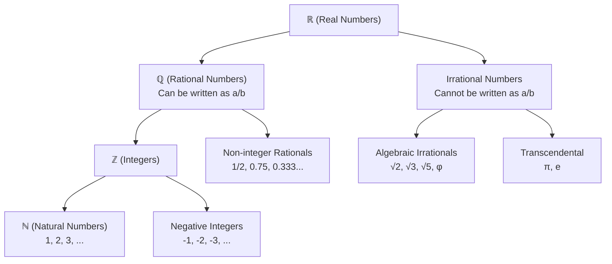

---
tags:
  - mathematics
  - fundamental
  - rational-numbers
  - irrational-numbers
  - real-numbers
  - ipst
source: "IPST (สสวท.) Fundamental Mathematics Curriculum, B.E. 2551 (2008, revised 2560/2017)"
created: 2026-07-22
course_codes: ["ค211", "ค212", "ค213"]
---

# Rational Numbers — จำนวนตรรกยะ

> *"Between any two rational numbers, there are infinitely many more — yet there are still gaps that only irrational numbers can fill. This is the beautiful tension at the heart of the real number system."*

Rational numbers unify fractions, decimals, integers, and percentages under a single number system. This topic formalizes the definition, explores the relationship between rational and irrational numbers, and establishes the foundation for the real number system (ℝ).

---

## 1 | Grade Band Breakdown

### ป.1–3 (Grades 1–3)
- Not formally introduced. Students work with whole numbers and begin basic fractions.

### ป.4–6 (Grades 4–6)
- Implicit understanding through fraction-decimal conversions; recognition that some fractions like 1/3 produce repeating decimals.

### ม.1–3 (Grades 7–9)

| Grade | Scope | Key Skills |
|---|---|---|
| **ม.1** | Definition and representation | Rational numbers (จำนวนตรรกยะ) defined as a/b where a, b ∈ ℤ, b ≠ 0; expressing terminating and repeating decimals as fractions; comparing and ordering rational numbers; number line representation |
| **ม.2** | Operations and properties | Operations with rational numbers; properties (closed under +, −, ×, ÷); density property — between any two rationals there exists another rational |
| **ม.3** | Irrationals and real numbers | Introduction to irrational numbers (จำนวนอตรรกยะ); distinction: rationals CAN be written as a/b, irrationals CANNOT; examples (√2, π, e); real numbers (ℝ) = ℚ ∪ irrationals; rational approximation of irrationals |

---

## 2 | Key Terminology

| Thai | English | Notes |
|---|---|---|
| จำนวนตรรกยะ | Rational number | Can be written as a/b, b ≠ 0 |
| จำนวนอตรรกยะ | Irrational number | Cannot be written as a/b |
| จำนวนจริง | Real number | Union of rational and irrational |
| เศษส่วนของจำนวนเต็ม | Ratio of integers | The form a/b |
| รากที่สอง | Square root | √x, the number whose square is x |
| พาย (π) | Pi | 3.14159... (irrational) |
| การประมาณค่า | Approximation | Rationals can approximate irrationals |

---

## 3 | Key Concepts & Properties

### 3.1 Rational Number Definition

> A **rational number** is any number that can be written as **a/b** where **a** and **b** are integers and **b ≠ 0**.

All of these ARE rational numbers:
**All of these ARE rational numbers:**

| Form | Example | Why Rational |
|---|---|---|
| Fraction | 1/2, −3/4, 7/3 | Directly in the form a/b |
| Terminating decimal | 0.5, 0.375 | 0.5 = 1/2, 0.375 = 3/8 |
| Repeating decimal | 0.\overline{3}, 0.\overline{45} | 0.\overline{3} = 1/3, 0.\overline{45} = 5/11 |
| Integer | 4, −7, 0 | 4 = 4/1, −7 = −7/1, 0 = 0/1 |
| Percentage | 50%, 12.5% | 50% = 1/2, 12.5% = 1/8 |

### 3.3 Converting Repeating Decimals to Fractions

**Example:** Convert $$0.\overline{3}$$ to a fraction.

$$\begin{aligned}
\text{Let } x &= 0.\overline{3} = 0.333\ldots \\
10x &= 3.333\ldots \\
10x - x &= 3.333\ldots - 0.333\ldots \\
9x &= 3 \\
x &= \frac{3}{9} = \frac{1}{3}
\end{aligned}$$

### 3.3 Properties of Rational Numbers

| Property | Status | Meaning |
|---|---|---|
| Closed under +, −, × | ✅ | Sum/difference/product of two rationals is rational |
| Closed under ÷ | ✅ (except by 0) | Quotient of two rationals (b ≠ 0) is rational |
| Density | ✅ Dense | Between any two rationals, there are infinitely many rationals |
| Completeness | ❌ NOT complete | Gaps exist — filled by irrationals |

### 3.4 Irrational Numbers

**Definition:** A number that CANNOT be expressed as a/b where a and b are integers (b ≠ 0).

| Number | Why Irrational | Approximate Value |
|---|---|---|
| √2 | If √2 = a/b, leads to contradiction | 1.41421356... |
| √3 | Same proof as √2 | 1.73205081... |
| π (Pi) | Proven irrational by Lambert (1761) | 3.14159265... |
| e (Euler's number) | Proven irrational by Euler | 2.71828182... |
| φ (Golden ratio) | (1+√5)/2 — contains √5 which is irrational | 1.61803399... |

**Key distinction:**

| | Rational | Irrational |
|---|---|---|
| **Written as a/b?** | ✅ Yes | ❌ No |
| **Decimal expansion** | Terminates or repeats | Non-terminating AND non-repeating |
| **Examples** | 1/2, 0.75, 0.333... | √2, π, e |

### 3.5 The Real Number System (ℝ)

---

## 4 | Common Problem Types

### Type 1: Classify as Rational
> Is 0.75 a rational number? Explain.

**Answer:** Yes. 0.75 = 75/100 = 3/4, which is in the form a/b.

### Type 2: Repeating Decimal to Fraction
> Convert 0.\overline{6} to a fraction.

Let x = 0.666..., then 10x = 6.666..., 9x = 6, x = 6/9 = **2/3**.

### Type 3: Classify Numbers
> Classify each as rational or irrational: √16, √5, 0.\overline{3}, π.

| Number | Classification | Reason |
|---|---|---|
| √16 = 4 | Rational | Can be written as 4/1 |
| √5 | Irrational | Cannot be written as a/b |
| 0.\overline{3} = 1/3 | Rational | Can be written as a/b |
| π | Irrational | Proven; not expressible as a/b |

### Type 4: Ordering on Number Line
> Arrange on number line: −3/2, 1/2, −1, 2.5, 0

**Answer:** −1.5, −1, 0, 0.5, 2.5

### Type 5: Density Property
> Find a rational number between 1/3 and 1/2.

**Answer:** 5/12 (since 1/3 = 4/12 and 1/2 = 6/12, so 5/12 is between them)

---

## 5 | Cross-Links

- [[04_Integers]] — Integers are a subset of rational numbers (ℤ ⊂ ℚ)
- [[05_Fractions]] — Primary representation of rational numbers
- [[06_Decimals]] — Decimal representation of rational numbers
- [[08_Percentages]] — Rational numbers expressed as per hundred
- [[11_Basic_Algebra]] — Rational expressions and equations
- [[17_Sets]] — The set hierarchy: ℕ ⊂ ℤ ⊂ ℚ ⊂ ℝ
- [[01_Numbers_and_Numeration]] — Numbers at the most fundamental level
