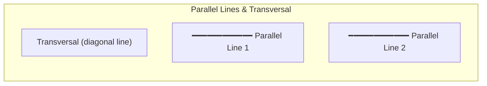

---
tags:
  - mathematics
  - fundamental
  - geometry
  - shapes
  - ipst
source: "IPST (สสวท.) Fundamental Mathematics Curriculum, B.E. 2551 (2008, revised 2560/2017)"
created: 2026-07-22
course_codes: ["ค111", "ค112", "ค113", "ค121", "ค122", "ค123", "ค211", "ค212", "ค213"]
---

# Geometry: Shapes and Properties — เรขาคณิต

> *"Geometry is the study of shape, space, and form — the visual foundation of mathematics. It trains the mind to see patterns in space the way arithmetic trains it to see patterns in number."*

Geometry develops spatial reasoning through the study of 2D and 3D shapes, their properties, and relationships. Students progress from recognizing basic shapes to analyzing angle relationships, symmetry, congruence, and similarity — building the geometric intuition essential for trigonometry, calculus, and engineering.

---

## 1 | Grade Band Breakdown

### ป.1–3 (Grades 1–3)

| Grade | Scope | Key Skills |
|---|---|---|
| **ป.1** | Basic 2D shapes | Circle (วงกลม), square (สี่เหลี่ยมจัตุรัส), rectangle (สี่เหลี่ยมผืนผ้า), triangle (สามเหลี่ยม) — recognizing, naming, and drawing |
| **ป.2** | Basic 3D shapes | Cube (ลูกบาศก์), sphere (ทรงกลม), cylinder (ทรงกระบอก), cone (กรวย) — recognizing in real-world objects |
| **ป.3** | Shape properties | Counting sides, vertices (จุดยอด), edges (ขอบ); classifying shapes by properties; symmetry (สมมาตร) — mirror images |

### ป.4–6 (Grades 4–6)

| Grade | Scope | Key Skills |
|---|---|---|
| **ป.4** | Angles and triangles | Types of angles (acute, right, obtuse — มุมแหลม, มุมฉาก, มุมป้าน); measuring angles with protractor; triangle types (equilateral, isosceles, scalene) |
| **ป.5** | Quadrilaterals and symmetry | Properties of quadrilaterals (square, rectangle, parallelogram, rhombus, trapezoid); lines of symmetry; rotational symmetry |
| **ป.6** | Lines and congruence | Parallel (ขนาน) and perpendicular (ตั้งฉาก) lines; congruent shapes (รูปที่เท่ากันทุกประการ); similar shapes — same shape, different size |

### ม.1–3 (Grades 7–9)

| Grade | Scope | Key Skills |
|---|---|---|
| **ม.1** | Angle relationships | Complementary angles (มุมประกอบฉาก) — sum = 90°; supplementary angles (มุมประชิด) — sum = 180°; vertically opposite angles (มุมตรงข้าม); parallel lines and transversals — corresponding, alternate, interior angles |
| **ม.2** | Geometric constructions | Compass-and-straightedge constructions; polygon classification; interior/exterior angle sums; circle geometry intro |
| **ม.3** | Advanced geometry | Pythagoras' theorem; trigonometric ratios (intro); circles — chords, tangents, arcs; proofs in geometry |

---

## 2 | Key Terminology

| Thai | English | Notes |
|---|---|---|
| รูปทรงเรขาคณิต | Geometric shape | 2D or 3D |
| รูปสองมิติ | 2D shape | Length and width only |
| รูปสามมิติ | 3D shape | Has depth |
| จุดยอด | Vertex | Corner point |
| ด้าน | Side / Edge | Line segment of a shape |
| มุม | Angle | Space between two intersecting lines |
| มุมฉาก (90°) | Right angle | Square corner |
| มุมแหลม (< 90°) | Acute angle | Sharp angle |
| มุมป้าน (> 90°) | Obtuse angle | Wide angle |
| มุมตรง (180°) | Straight angle | Flat line |
| เส้นขนาน | Parallel lines | Never intersect |
| เส้นตั้งฉาก | Perpendicular lines | Intersect at 90° |
| สมมาตร | Symmetry | Balanced proportions |
| รูปคล้าย | Similar shape | Same shape, different size |
| รูปเท่ากันทุกประการ | Congruent shape | Same shape AND size |
| ทฤษฎีบทพีทาโกรัส | Pythagoras' theorem | a² + b² = c² |

---

## 3 | Key Concepts

### 3.1 2D Shapes — Properties

| Shape | Sides | Angles | Symmetry |
|---|---|---|---|
| **Triangle** (สามเหลี่ยม) | 3 | Sum = 180° | Up to 3 lines |
| **Square** (สี่เหลี่ยมจัตุรัส) | 4 equal | 4 right angles | 4 lines |
| **Rectangle** (สี่เหลี่ยมผืนผ้า) | 2 pairs equal | 4 right angles | 2 lines |
| **Parallelogram** (สี่เหลี่ยมด้านขนาน) | 2 pairs equal, parallel | Opposite equal | 0 lines (point symmetry) |
| **Rhombus** (สี่เหลี่ยมขนมเปียกปูน) | 4 equal | Opposite equal | 2 lines |
| **Trapezoid** (สี่เหลี่ยมคางหมู) | 1 pair parallel | Varies | Varies |
| **Circle** (วงกลม) | ∞ (continuous) | 360° total | Infinite |

### 3.2 Angle Relationships (ม.1)

| Relationship | Definition | Sum |
|---|---|---|
| **Complementary** | Two angles forming a right angle | 90° |
| **Supplementary** | Two angles forming a straight line | 180° |
| **Vertically opposite** | Formed by intersecting lines | Equal |
| **Adjacent** | Share a common side | — |
| **Angles on a line** | Angles that form a straight line | 180° |
| **Angles at a point** | Angles around a point | 360° |

### 3.3 Parallel Lines and Transversals (ม.1)

When a transversal cuts two parallel lines:

| Angle Pair | Relationship |
|---|---|
| **Corresponding angles** | Equal (same position relative to transversal) |
| **Alternate interior angles** | Equal (inside, opposite sides) |
| **Alternate exterior angles** | Equal (outside, opposite sides) |
| **Interior angles on same side** | Supplementary — **sum = 180°** |

### 3.4 Pythagoras' Theorem (ทฤษฎีบทพีทาโกรัส) — ม.3

For a right triangle with legs a, b and hypotenuse c:

$$\boxed{a^2 + b^2 = c^2}$$

| a | b | c (hypotenuse) |
|---|---|---|
| 3 | 4 | 5 |
| 5 | 12 | 13 |
| 6 | 8 | 10 |
| 8 | 15 | 17 |

### 3.5 Triangle Classification

| By Sides | By Angles |
|---|---|
| **Equilateral** — 3 equal sides | **Acute** — all angles < 90° |
| **Isosceles** — 2 equal sides | **Right** — one angle = 90° |
| **Scalene** — no equal sides | **Obtuse** — one angle > 90° |

### 3.6 Polygons — Angle Sums

| Polygon | Sides (n) | Interior Angle Sum |
|---|---|---|
| Triangle | 3 | 180° |
| Quadrilateral | 4 | 360° |
| Pentagon | 5 | 540° |
| Hexagon | 6 | 720° |
| n-gon | n | (n − 2) × 180° |

---

## 4 | Common Problem Types

### Type 1: Find Missing Angle
> In a triangle, two angles are 45° and 75°. Find the third.

180° − (45° + 75°) = 180° − 120° = **60°**

### Type 2: Parallel Lines
> In parallel lines cut by a transversal, if one alternate interior angle is 65°, what is the other?

Alternate interior angles are equal: **65°**.

### Type 3: Pythagoras
> Find the hypotenuse of a right triangle with legs 6 and 8.

$$c^2 = 6^2 + 8^2 = 36 + 64 = 100, \quad c = \sqrt{100} = \mathbf{10}$$

### Type 4: Polygon Angle Sum
> What is the sum of interior angles of a hexagon?

(6 − 2) × 180° = 4 × 180° = **720°**

---

## 5 | Cross-Links

- [[13_Measurement]] — Measuring lengths and angles
- [[14_Area_and_Perimeter]] — Computing areas and perimeters of shapes
- [[15_Volume_and_Surface_Area]] — Extending to 3D
- [[16_Coordinate_Plane]] — Geometry in the coordinate system
- [[09_Ratios_and_Proportions]] — Scale factors and similar figures
