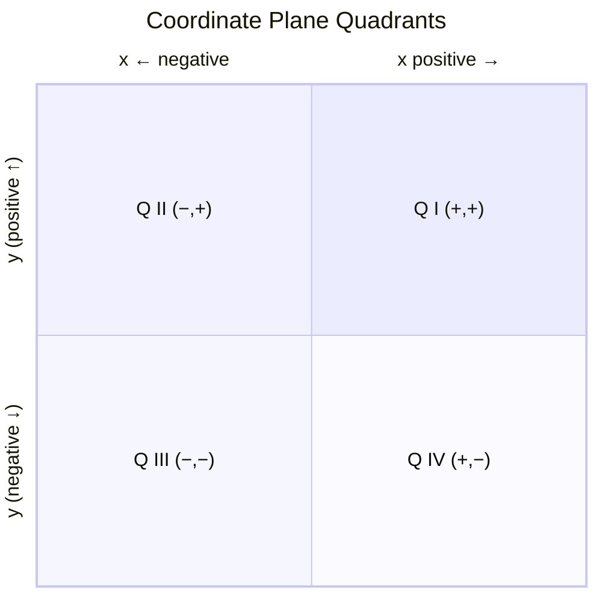

---
tags:
  - mathematics
  - fundamental
  - coordinate-plane
  - graphing
  - ipst
source: "IPST (สสวท.) Fundamental Mathematics Curriculum, B.E. 2551 (2008, revised 2560/2017)"
created: 2026-07-22
course_codes: ["ค122", "ค123", "ค211", "ค212", "ค213"]
---

# Coordinate Plane — ระนาบพิกัด

> *"Descartes' coordinate plane is arguably the single most powerful idea in mathematics — it unites algebra and geometry, turning equations into pictures and shapes into numbers."*

The coordinate plane (or Cartesian plane) is a 2D grid system that allows positions to be described by ordered pairs (x, y). Students progress from plotting points in the first quadrant to working in all four quadrants and graphing linear relationships.

---

## 1 | Grade Band Breakdown

### ป.1–3 (Grades 1–3)
- Not formal. Informal foundations: grid-based games, "row and column" thinking.

### ป.4–6 (Grades 4–6)

| Grade | Scope | Key Skills |
|---|---|---|
| **ป.4** | First quadrant | Introducing the coordinate plane — x-axis (horizontal), y-axis (vertical); plotting points with positive coordinates (x, y); reading coordinates from a graph |
| **ป.5** | Patterns on grid | Plotting multiple points; connecting points to form shapes; reading and interpreting simple line graphs |
| **ป.6** | Graph interpretation | Reading bar, line, and pie charts; extrapolating and interpolating from graphs |

### ม.1–3 (Grades 7–9)

| Grade | Scope | Key Skills |
|---|---|---|
| **ม.1** | Four quadrants | Extending to negative coordinates; all four quadrants; plotting points (x, y) where x, y can be any integer |
| **ม.2** | Linear graphing | Graphing linear equations y = mx + c; finding slope (ความชัน) and intercepts (จุดตัดแกน); distance between two points |
| **ม.3** | Advanced graphing | Midpoint formula; graphing quadratic functions; parabolas; systems of equations on coordinate plane |

---

## 2 | Key Terminology

| Thai | English | Notes |
|---|---|---|
| ระนาบพิกัด | Coordinate plane | Cartesian plane (ระบบพิกัดฉาก) |
| แกน x | x-axis | Horizontal axis |
| แกน y | y-axis | Vertical axis |
| จุดกำเนิด | Origin | (0, 0) — where axes intersect |
| คู่อันดับ | Ordered pair | (x, y) — a point's coordinates |
| จตุภาค | Quadrant | One of four sections of coordinate plane |
| ความชัน | Slope / Gradient | m in y = mx + c |
| จุดตัดแกน | Intercept | Where graph crosses axis |
| กราฟเส้นตรง | Linear graph | Straight-line graph |
| ระยะทางระหว่างจุด | Distance between points | d = √[(x₂−x₁)² + (y₂−y₁)²] |
| จุดกึ่งกลาง | Midpoint | M = ((x₁+x₂)/2, (y₁+y₂)/2) |

---

## 3 | Key Concepts

### 3.1 The Four Quadrants

| Quadrant | x sign | y sign | Example |
|---|---|---|---|
| **I** | + | + | (3, 4) |
| **II** | − | + | (−3, 4) |
| **III** | − | − | (−3, −4) |
| **IV** | + | − | (3, −4) |

### 3.2 Plotting Points

To plot (x, y):
1. Start at origin (0, 0)
2. Move x units horizontally (right if +, left if −)
3. Move y units vertically (up if +, down if −)

### 3.3 Slope (ความชัน) — ม.2

> Slope = rise ÷ run = (y₂ − y₁) ÷ (x₂ − x₁)

| Slope | Meaning | Visual |
|---|---|---|
| m > 0 | Line rises | `/` (uphill left to right) |
| m < 0 | Line falls | `\` (downhill left to right) |
| m = 0 | Horizontal line | `—` (flat) |
| m = undefined | Vertical line | `\|` (straight up) |

### 3.4 Linear Equation — Slope-Intercept Form

> y = mx + c

Where:
- **m** = slope — steepness and direction
- **c** = y-intercept — where line crosses y-axis

**Example:** y = 2x + 3
- Slope m = 2: for every 1 unit right, go up 2
- y-intercept c = 3: crosses y-axis at (0, 3)

### 3.5 Distance and Midpoint — ม.3

**Distance between two points (x₁, y₁) and (x₂, y₂):**

> d = √[(x₂ − x₁)² + (y₂ − y₁)²]

**Example:** Distance between (−1, 3) and (4, 15):
> d = √[(4−(−1))² + (15−3)²] = √[5² + 12²] = √[25 + 144] = √169 = **13**

**Midpoint of two points:**

> M = ((x₁ + x₂)/2, (y₁ + y₂)/2)

**Example:** Midpoint of (2, 5) and (8, 11):
> M = ((2+8)/2, (5+11)/2) = **(5, 8)**

---

## 4 | Common Problem Types

### Type 1: Plot Points
> Plot: (2, 5), (−3, 4), (0, −2), (−1, −3)

**Answer:** Points in QI, QII, on y-axis, QIII respectively.

### Type 2: Find Slope
> Find the slope of the line through (1, 2) and (5, 10).

m = (10 − 2) ÷ (5 − 1) = 8 ÷ 4 = **2**

### Type 3: Write Equation
> Write equation of line through (0, 3) with slope 2.

y = 2x + 3. Check: at x = 0, y = 3 ✓; at x = 1, y = 5 ✓.

### Type 4: Distance
> Find distance between (−1, 3) and (4, 15).

d = √[(4−(−1))² + (15−3)²] = √(25 + 144) = √169 = **13**

### Type 5: Midpoint
> Find midpoint of (2, 6) and (8, 4).

M = ((2+8)/2, (6+4)/2) = **(5, 5)**

---

## 5 | Cross-Links

- [[04_Integers]] — Negative coordinates in QII, QIII, QIV
- [[11_Basic_Algebra]] — Equations produce graphs
- [[10_Patterns_and_Algebraic_Thinking]] — Patterns seen in graphs
- [[12_Geometry_Shapes]] — Shapes on the coordinate plane
- [[09_Ratios_and_Proportions]] — Slope as a rate of change
