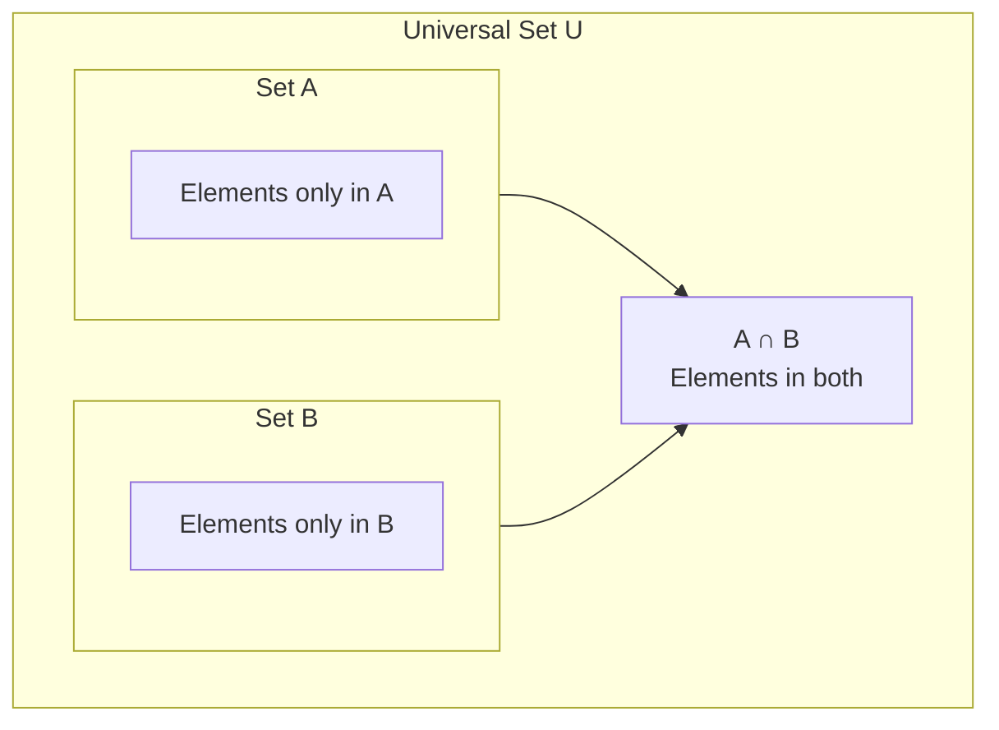

---
tags:
  - mathematics
  - fundamental
  - sets
  - venn-diagrams
  - ipst
source: "IPST (สสวท.) Fundamental Mathematics Curriculum, B.E. 2551 (2008, revised 2560/2017)"
created: 2026-07-22
course_codes: ["ค211", "ค212", "ค213"]
---

# Sets — เซต

> *"Set theory is the foundation of modern mathematics — a language for talking about collections, membership, and relationships between groups of things."*

Sets provide the formal language for talking about collections of objects. Introduced at the lower secondary level, set notation, operations, and Venn diagrams become essential tools for probability, statistics, logic, and all higher mathematics.

---

## 1 | Grade Band Breakdown

### ป.1–3 (Grades 1–3)
- Informal: sorting and classifying objects by attributes (color, shape, size).

### ป.4–6 (Grades 4–6)
- Informal grouping; classifying numbers (even/odd, prime/composite); using Venn diagrams to organize information without formal notation.

### ม.1–3 (Grades 7–9)

| Grade | Scope | Key Skills |
|---|---|---|
| **ม.1** | Set fundamentals | Set notation — roster form {a, b, c}, set-builder form {x \| condition}; universal set (U); empty set (∅); subset (⊂); element membership (∈); cardinality n(A) |
| **ม.2** | Set operations | Union (A ∪ B), intersection (A ∩ B), complement (A'); difference (A − B); Venn diagrams (2 and 3 sets); solving problems with Venn diagrams |
| **ม.3** | Set applications | Sets in probability (sample space as set); sets in algebra (solution sets); sets in geometry (locus of points) |

---

## 2 | Key Terminology

| Thai | English | Symbol |
|---|---|---|
| เซต | Set | { } |
| สมาชิก | Element / Member | ∈ |
| เอกภพสัมพัทธ์ | Universal set | U |
| เซตว่าง | Empty set | ∅ or { } |
| สับเซต | Subset | ⊂ or ⊆ |
| ยูเนียน | Union | ∪ |
| อินเตอร์เซกชัน | Intersection | ∩ |
| คอมพลีเมนต์ | Complement | A' or Aᶜ |
| ผลต่าง | Difference | A − B |
| การเขียนแบบแจกแจงสมาชิก | Roster form | {1, 2, 3} |
| การเขียนแบบบอกเงื่อนไข | Set-builder form | {x \| condition} |
| จำนวนสมาชิก | Cardinality | n(A) |
| แผนภาพเวนน์ | Venn diagram | Visual representation |

---

## 3 | Key Concepts

### 3.1 Ways to Describe a Set

**Roster form (แจกแจงสมาชิก):**
$$A = \{1, 2, 3, 4, 5\}$$

**Set-builder form (บอกเงื่อนไข):**
$$A = \{x \mid x \text{ is a natural number and } 1 \leq x \leq 5\}$$

### 3.2 Set Notation

| Notation | Meaning | Example |
|---|---|---|
| a ∈ A | a is an element of A | 3 ∈ {1, 2, 3} |
| a ∉ A | a is NOT an element of A | 5 ∉ {1, 2, 3} |
| A ⊂ B | A is a subset of B | {1, 2} ⊂ {1, 2, 3} |
| ∅ | Empty set (no elements) | { } |
| n(A) | Number of elements in A | n({a, b, c}) = 3 |

### 3.3 Set Operations

| Operation | Definition | Venn Diagram |
|---|---|---|
| **Union (∪)** | All elements in A OR B (or both) | Overlapping circles — all area |
| **Intersection (∩)** | Elements in BOTH A AND B | Overlapping circles — middle only |
| **Complement (A')** | Elements in U NOT in A | Everything outside circle A |
| **Difference (A−B)** | Elements in A but NOT in B | A minus the overlap |

### 3.4 Venn Diagrams

**Reading a Venn diagram:**
- **A ∪ B** (Union): Everything in A, B, or both
- **A ∩ B** (Intersection): Only the overlapping region
- **A'** (Complement): Everything outside A (but inside U)
- **A − B** (Difference): A minus the overlap

### 3.5 Cardinality Formula for Two Sets

> n(A ∪ B) = n(A) + n(B) − n(A ∩ B)

**Example:** In a class of 40 students, 25 like math, 20 like science, and 10 like both. How many like at least one?

> n(Math ∪ Science) = 25 + 20 − 10 = **35 students**.

---

## 4 | Common Problem Types

### Type 1: Set Membership
> Given A = {2, 4, 6, 8}. Is 6 ∈ A? Is 5 ∈ A?

6 ∈ A ✓. 5 ∉ A.

### Type 2: Union and Intersection
> A = {1, 2, 3, 4}, B = {3, 4, 5, 6}. Find A ∪ B and A ∩ B.

A ∪ B = {1, 2, 3, 4, 5, 6}. A ∩ B = {3, 4}.

### Type 3: Complement
> U = {1, 2, 3, 4, 5, 6, 7, 8}, A = {2, 4, 6}. Find A'.

A' = {1, 3, 5, 7, 8} — all elements in U not in A.

### Type 4: Venn Diagram Problem
> Of 100 students: 45 play football, 35 play basketball, 20 play both. How many play neither?

n(F ∪ B) = 45 + 35 − 20 = 60. Play neither = 100 − 60 = **40 students**.

### Type 5: Three-Set Venn
> Given: n(U)=100, n(A)=40, n(B)=35, n(C)=30, n(A∩B)=15, n(A∩C)=12, n(B∩C)=10, n(A∩B∩C)=5.

Use the inclusion-exclusion principle or Venn diagram to solve.

---

## 5 | Cross-Links

- [[01_Numbers_and_Numeration]] — Number sets (ℕ, ℤ, ℚ, ℝ)
- [[07_Rational_Numbers]] — Set hierarchy: ℕ ⊂ ℤ ⊂ ℚ ⊂ ℝ
- [[18_Statistics_Data_Handling]] — Sets in data classification
- [[19_Probability]] — Sample space as a set; events as subsets
- [[11_Basic_Algebra]] — Solution sets of equations
