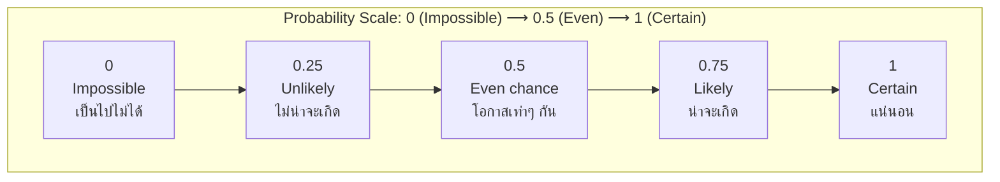

---
tags:
  - mathematics
  - fundamental
  - probability
  - chance
  - ipst
source: "IPST (สสวท.) Fundamental Mathematics Curriculum, B.E. 2551 (2008, revised 2560/2017)"
created: 2026-07-22
course_codes: ["ค123", "ค211", "ค212", "ค213"]
---

# Probability — ความน่าจะเป็น

> *"Probability is the mathematics of uncertainty — it quantifies our intuition about chance and equips us to make rational decisions in an unpredictable world."*

Probability moves students from deterministic thinking (one right answer) to probabilistic thinking (a range of possible outcomes with different likelihoods). Students progress from describing events as certain, likely, or impossible to calculating theoretical and experimental probabilities.

---

## 1 | Grade Band Breakdown

### ป.1–3 (Grades 1–3)
- Informal: language of chance — "certain" (แน่นอน), "likely" (อาจจะ), "unlikely" (ไม่น่าจะ), "impossible" (เป็นไปไม่ได้).

### ป.4–6 (Grades 4–6)

| Grade | Scope | Key Skills |
|---|---|---|
| **ป.4** | Chance vocabulary | Classifying events; spinners and dice experiments; recording outcomes |
| **ป.5** | Simple experiments | Experimental probability from repeated trials; recognizing "fair" vs "unfair"; probability as fraction |
| **ป.6** | Theoretical probability | Sample space (แซมเปิลสเปซ); theoretical probability = favorable/total outcomes; comparing theoretical vs experimental |

### ม.1–3 (Grades 7–9)

| Grade | Scope | Key Skills |
|---|---|---|
| **ม.1** | Formal probability | Probability of simple events: P(A) = n(A)/n(S); complementary events P(A') = 1 − P(A); probability scale 0 to 1 |
| **ม.2** | Compound events | Probability of compound events using tree diagrams and tables; "and" (intersection) vs "or" (union) |
| **ม.3** | Conditional probability | Conditional probability intro: P(A\|B); independent vs dependent events; applications |

---

## 2 | Key Terminology

| Thai | English | Notes |
|---|---|---|
| ความน่าจะเป็น | Probability | Likelihood of an event (0 to 1) |
| การทดลองสุ่ม | Random experiment | Process with uncertain outcome |
| แซมเปิลสเปซ | Sample space (S) | Set of all possible outcomes |
| เหตุการณ์ | Event (A, B...) | Subset of sample space |
| ผลลัพธ์ | Outcome | A single possible result |
| เหตุการณ์ที่แน่นอน | Certain event | P = 1 (always happens) |
| เหตุการณ์ที่เป็นไปไม่ได้ | Impossible event | P = 0 (never happens) |
| ความน่าจะเป็นเชิงทฤษฎี | Theoretical probability | From reasoning, not experiment |
| ความน่าจะเป็นเชิงการทดลอง | Experimental probability | From actual trials |
| เหตุการณ์ประกอบ | Compound event | Multiple events combined |

---

## 3 | Key Concepts

### 3.1 The Probability Scale

### 3.2 Theoretical Probability

> P(event) = (Number of favorable outcomes) ÷ (Total number of possible outcomes)

**Example:** Rolling a fair six-sided die.

> P(rolling a 4) = 1/6
> P(rolling an even) = 3/6 = **1/2**

### 3.3 Complementary Events

> P(not A) = 1 − P(A)

**Example:** P(rolling NOT a 6) = 1 − 1/6 = **5/6**.

### 3.4 Sample Space

| Experiment | Sample Space S | n(S) |
|---|---|---|
| **Coin toss** | {H, T} | 2 |
| **Two coin tosses** | {HH, HT, TH, TT} | 4 |
| **Rolling a die** | {1, 2, 3, 4, 5, 6} | 6 |

### 3.5 Probability Rules (ม.2)

**The "OR" rule (addition — mutually exclusive events):**

$$P(A \	ext{ or } B) = P(A) + P(B)$$

If events are **not** mutually exclusive:

$$P(A \	ext{ or } B) = P(A) + P(B) - P(A \	ext{ and } B)$$

**The "AND" rule (multiplication — independent events):**

$$P(A \	ext{ and } B) = P(A) \	imes P(B)$$

### 3.6 Conditional Probability (ม.3)

$$P(A|B) = \rac{P(A \	ext{ and } B)}{P(B)}$$

"The probability of A, given that B has happened."

---

## 4 | Common Problem Types

### Type 1: Simple Probability
> A bag has 5 red and 3 blue marbles. P(red)?

n(S) = 8. P(red) = 5/8 = **0.625**.

### Type 2: Complementary Event
> P(rain) = 0.3. P(no rain)?

P(no rain) = 1 − 0.3 = **0.7**.

### Type 3: Two Independent Events
> Flip a coin AND roll a die. P(heads and 6)?

P(H) = 1/2, P(6) = 1/6. P(H AND 6) = 1/2 × 1/6 = **1/12**.

### Type 4: Card Probability
> From a standard 52-card deck, P(heart or king)?

P(heart) = 13/52, P(king) = 4/52, P(heart AND king) = 1/52 (king of hearts).
P(heart OR king) = 13/52 + 4/52 − 1/52 = 16/52 = **4/13**.

### Type 5: Conditional — Marbles Without Replacement
> Bag has 4 red, 6 blue. Draw two without replacement. P(both red)?

P(1st red) = 4/10 = 2/5. P(2nd red \| 1st red) = 3/9 = 1/3. P(both red) = 2/5 × 1/3 = **2/15**.

---

## 5 | Cross-Links

- [[05_Fractions]] — Probability expressed as fractions
- [[06_Decimals]] — Decimal and percent forms of probability
- [[08_Percentages]] — Probability as percentage (e.g., 30% chance)
- [[17_Sets]] — Sample space as a set; events as subsets
- [[18_Statistics_Data_Handling]] — Experimental probability from data
- [[02_Arithmetic_Operations]] — Counting favorable outcomes
