---
tags:
  - mathematics
  - advance
  - functions
  - domain
  - range
  - ipst
source: "IPST (สสวท.) Mathematics Curriculum B.E. 2551 (2008, revised 2560/2017)"
created: 2026-07-30
course_codes: ["ค301"]
---

# Functions — ฟังก์ชัน

> *"A function is a rule that assigns to each input exactly one output — the central concept of modern mathematics."*

Functions are the unifying concept that connects algebra, geometry, and calculus. This topic formalizes the notion of a function, explores various types (linear, quadratic, polynomial, rational, piecewise), and introduces composition and inverse functions. Understanding functions is essential for all subsequent mathematics.

---

## 1 | Course Coverage

### ม.4 (ค301)

| Semester | Scope | Key Skills |
|---|---|---|
| **Semester 2** | Function fundamentals | Definition; domain and range; function notation $f(x)$; vertical line test |
| **Semester 2** | Types of functions | Linear, quadratic, polynomial, rational, absolute value, step functions |
| **Semester 2** | Operations on functions | $(f+g)(x)$, $(f-g)(x)$, $(fg)(x)$, $(f/g)(x)$ |
| **Semester 2** | Composition of functions | $(f \circ g)(x) = f(g(x))$; domain of composition |
| **Semester 2** | Inverse functions | Definition; finding inverses; horizontal line test; $(f^{-1} \circ f)(x) = x$ |
| **Semester 2** | Piecewise functions | Definition; graphing; evaluating; domain/range |

---

## 2 | Key Terminology

| Thai | English | Symbol |
|---|---|---|
| ฟังก์ชัน | Function | $f: A \to B$ |
| โดเมน | Domain | $D_f$ |
| เรนจ์ | Range | $R_f$ |
| ฟังก์ชันประกอบ | Composition | $f \circ g$ |
| ฟังก์ชันผกผัน | Inverse function | $f^{-1}$ |
| ฟังก์ชันเชิงเส้น | Linear function | $f(x) = mx + b$ |
| ฟังก์ชันกำลังสอง | Quadratic function | $f(x) = ax^2 + bx + c$ |
| ฟังก์ชันพหุนาม | Polynomial function | $P(x) = a_n x^n + ... + a_0$ |
| ฟังก์ชันตรรกยะ | Rational function | $f(x) = \frac{P(x)}{Q(x)}$ |
| ฟังก์ชันทีละส่วน | Piecewise function | Defined by cases |
| การทดสอบเส้นดิ่ง | Vertical line test | Confirms function |
| การทดสอบเส้นนอน | Horizontal line test | Confirms one-to-one |

---

## 3 | Key Concepts

### Function Family Map

```mermaid
flowchart TD
    FUNC["Function f: A → B"] --> POLY["Polynomial Family"]
    FUNC --> RAT["Rational\nf&#40;x&#41; = P&#40;x&#41; / Q&#40;x&#41;"]
    FUNC --> ABS["Absolute Value\nf&#40;x&#41; = |x|"]
    FUNC --> PW["Piecewise\nDefined by cases"]
    POLY --> CONST["Constant\ndegree 0"]
    POLY --> LINEAR["Linear\ndegree 1: mx + b"]
    POLY --> QUAD["Quadratic\ndegree 2: ax² + bx + c"]
    POLY --> CUBIC["Cubic and higher\ndegree 3+"]
```

### 3.1 Definition of a Function

A **function** $f: A \to B$ is a relation that assigns to each element $x \in A$ exactly one element $f(x) \in B$.

- **Domain ($D_f$):** Set of all valid inputs
- **Range ($R_f$):** Set of all outputs
- **Codomain ($B$):** Set containing the range

**Vertical Line Test:** A graph represents a function if and only if every vertical line intersects it at most once.

### 3.2 Finding Domains

**Polynomial functions:** $D_f = \mathbb{R}$ (all real numbers)

**Rational functions:** Exclude values that make denominator zero
$$f(x) = \frac{1}{x-2} \Rightarrow D_f = \mathbb{R} \setminus \{2\}$$

**Square root functions:** Require non-negative radicand
$$f(x) = \sqrt{x-3} \Rightarrow x - 3 \geq 0 \Rightarrow D_f = [3, \infty)$$

**Combined restrictions:**
$$f(x) = \frac{\sqrt{x-1}}{x-2}$$
- $x - 1 \geq 0 \Rightarrow x \geq 1$
- $x - 2 \neq 0 \Rightarrow x \neq 2$
- $D_f = [1, 2) \cup (2, \infty)$

### 3.3 Common Function Types

**Linear:** $f(x) = mx + b$
- Graph: straight line
- Domain: $\mathbb{R}$
- Range: $\mathbb{R}$ (if $m \neq 0$)

**Quadratic:** $f(x) = ax^2 + bx + c$
- Graph: parabola
- Vertex: $x = -\frac{b}{2a}$
- Domain: $\mathbb{R}$
- Range: $[f(-b/2a), \infty)$ if $a > 0$, or $(-\infty, f(-b/2a)]$ if $a < 0$

**Absolute value:** $f(x) = |x|$
- Graph: V-shape
- Domain: $\mathbb{R}$
- Range: $[0, \infty)$

### 3.4 Operations on Functions

Given $f(x)$ and $g(x)$:

$$(f + g)(x) = f(x) + g(x)$$
$$(f - g)(x) = f(x) - g(x)$$
$$(fg)(x) = f(x) \cdot g(x)$$
$$\left(\frac{f}{g}\right)(x) = \frac{f(x)}{g(x)}, \quad g(x) \neq 0$$

**Domain of operations:** Intersection of domains, excluding zeros of denominator for division.

### 3.5 Composition of Functions

$$(f \circ g)(x) = f(g(x))$$

**Example:** $f(x) = x^2$, $g(x) = 2x + 1$
$$(f \circ g)(x) = f(2x+1) = (2x+1)^2 = 4x^2 + 4x + 1$$
$$(g \circ f)(x) = g(x^2) = 2x^2 + 1$$

> **Note:** Composition is NOT commutative: $f \circ g \neq g \circ f$ in general.

**Domain of $f \circ g$:** All $x$ in $D_g$ such that $g(x) \in D_f$.

### 3.6 Inverse Functions

A function $f$ has an inverse $f^{-1}$ if and only if $f$ is **one-to-one** (passes the horizontal line test).

**Properties:**
- $(f^{-1} \circ f)(x) = x$ for all $x \in D_f$
- $(f \circ f^{-1})(x) = x$ for all $x \in D_{f^{-1}}$
- $D_{f^{-1}} = R_f$ and $R_{f^{-1}} = D_f$

**Finding the inverse:**
1. Replace $f(x)$ with $y$
2. Swap $x$ and $y$
3. Solve for $y$
4. Replace $y$ with $f^{-1}(x)$

**Example:** $f(x) = 2x + 3$
1. $y = 2x + 3$
2. $x = 2y + 3$
3. $y = \frac{x-3}{2}$
4. $f^{-1}(x) = \frac{x-3}{2}$

### 3.7 Piecewise Functions

$$f(x) = \begin{cases} x^2 & \text{if } x < 0 \\ 2x + 1 & \text{if } x \geq 0 \end{cases}$$

**Evaluating:**
- $f(-2) = (-2)^2 = 4$ (use first piece since $-2 < 0$)
- $f(3) = 2(3) + 1 = 7$ (use second piece since $3 \geq 0$)

---

## 4 | Common Problem Types

### Type 1: Finding Domain
> Find the domain of $f(x) = \frac{1}{\sqrt{x-4}}$.

**Solution:** 
- $x - 4 > 0$ (strict inequality because it's in denominator)
- $x > 4$
- $D_f = (4, \infty)$

### Type 2: Function Composition
> Given $f(x) = 3x - 1$ and $g(x) = x^2 + 2$, find $(f \circ g)(2)$.

**Solution:** 
$g(2) = 4 + 2 = 6$
$f(6) = 18 - 1 = 17$
$(f \circ g)(2) = 17$

### Type 3: Finding Inverse
> Find the inverse of $f(x) = \frac{2x+1}{x-3}$.

**Solution:**
$y = \frac{2x+1}{x-3} \Rightarrow x = \frac{2y+1}{y-3}$
$x(y-3) = 2y+1 \Rightarrow xy - 3x = 2y + 1 \Rightarrow xy - 2y = 3x + 1$
$y(x-2) = 3x+1 \Rightarrow y = \frac{3x+1}{x-2}$
$f^{-1}(x) = \frac{3x+1}{x-2}$

### Type 4: Piecewise Evaluation
> $f(x) = \begin{cases} x+1 & \text{if } x < 0 \\ x^2 & \text{if } 0 \leq x < 3 \\ 2x-1 & \text{if } x \geq 3 \end{cases}$
> Find $f(-2)$, $f(2)$, and $f(5)$.

**Solution:**
- $f(-2) = -2 + 1 = -1$ (first piece)
- $f(2) = 2^2 = 4$ (second piece)
- $f(5) = 2(5) - 1 = 9$ (third piece)

### Type 5: One-to-One Test
> Is $f(x) = x^2$ one-to-one?

**Solution:** No. $f(2) = f(-2) = 4$, so different inputs give the same output. Fails horizontal line test.

---

## 5 | Cross-Links

- [[01_Sets_and_Logic]] — Functions as relations (subsets of Cartesian products)
- [[02_Real_Numbers_and_Inequalities]] — Domains defined by inequalities
- [[06_Exponential_and_Logarithmic_Functions]] — Important function family
- [[07_Trigonometric_Functions]] — Periodic functions
- [[14_Limits_and_Continuity]] — Continuity of functions
- [[15_Differentiation]] — Derivatives of functions
