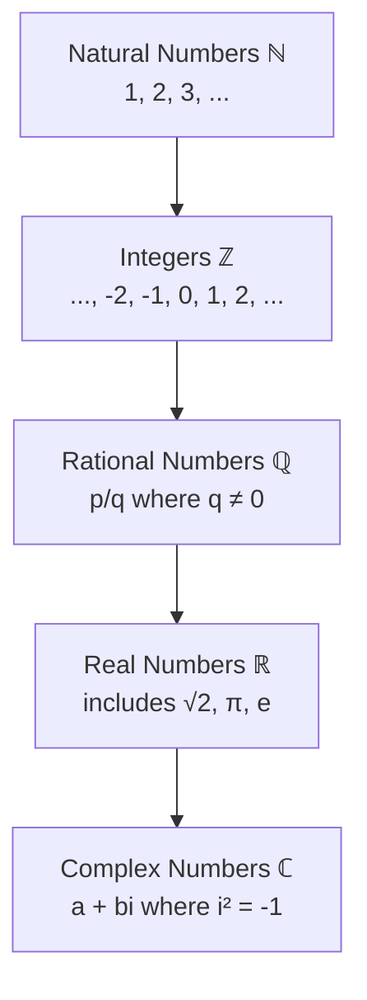

---
tags:
  - mathematics
  - advance
  - complex-numbers
  - ipst
source: "IPST (สสวท.) Mathematics Curriculum B.E. 2551 (2008, revised 2560/2017)"
created: 2026-07-30
course_codes: ["ค302"]
---

# Complex Numbers — จำนวนเชิงซ้อน

> *"The imaginary unit i opens a door to a world where every polynomial has roots and every rotation has a formula."*

Complex numbers extend the real number system to include solutions to equations like $x^2 + 1 = 0$. This topic introduces the imaginary unit $i$, arithmetic of complex numbers, the complex plane, polar form, and De Moivre's theorem — tools essential for engineering, physics, and advanced mathematics.

---

## 1 | Course Coverage

### ม.5 (ค302)

| Semester | Scope | Key Skills |
|---|---|---|
| **Semester 1** | Complex number basics | Definition $a + bi$; real and imaginary parts; equality; complex conjugate |
| **Semester 1** | Arithmetic operations | Addition, subtraction, multiplication, division of complex numbers |
| **Semester 1** | Complex plane | Argand diagram; modulus; argument; geometric interpretation |
| **Semester 1** | Polar form | $r(\cos\theta + i\sin\theta)$; conversion between rectangular and polar |
| **Semester 1** | De Moivre's Theorem | $(\cos\theta + i\sin\theta)^n = \cos(n\theta) + i\sin(n\theta)$ |
| **Semester 1** | Roots of complex numbers | Finding $n$th roots; roots of unity |

---

## 2 | Key Terminology

| Thai | English | Symbol |
|---|---|---|
| จำนวนเชิงซ้อน | Complex number | $z = a + bi$ |
| หน่วยจินตภาพ | Imaginary unit | $i = \sqrt{-1}$ |
| ส่วนจริง | Real part | $\text{Re}(z) = a$ |
| ส่วนจินตภาพ | Imaginary part | $\text{Im}(z) = b$ |
| สังยุค | Complex conjugate | $\bar{z} = a - bi$ |
| ค่าสัมบูรณ์ | Modulus | $|z| = \sqrt{a^2 + b^2}$ |
| อาร์กิวเมนต์ | Argument | $\arg(z) = \theta$ |
| รูปเชิงขั้ว | Polar form | $r(\cos\theta + i\sin\theta)$ |
| ทฤษฎีบทเดอมัวฟ์ | De Moivre's Theorem | — |

---

## 3 | Key Concepts

### Number System Hierarchy

### 3.1 Definition

A **complex number** is $z = a + bi$ where $a, b \in \mathbb{R}$ and $i^2 = -1$.

- $a$ = real part: $\text{Re}(z)$
- $b$ = imaginary part: $\text{Im}(z)$
- If $b = 0$: $z$ is real
- If $a = 0$: $z$ is purely imaginary

**Equality:** $a + bi = c + di \iff a = c$ and $b = d$

### 3.2 Arithmetic Operations

**Addition:**
$$(a + bi) + (c + di) = (a + c) + (b + d)i$$

**Subtraction:**
$$(a + bi) - (c + di) = (a - c) + (b - d)i$$

**Multiplication:**
$$(a + bi)(c + di) = (ac - bd) + (ad + bc)i$$

**Division:**
$$\frac{a + bi}{c + di} = \frac{(a + bi)(c - di)}{(c + di)(c - di)} = \frac{(ac + bd) + (bc - ad)i}{c^2 + d^2}$$

> **Key technique:** Multiply numerator and denominator by the conjugate of the denominator.

### 3.3 Complex Conjugate

$$\bar{z} = a - bi$$

**Properties:**
- $z \cdot \bar{z} = a^2 + b^2 = |z|^2$
- $\overline{z + w} = \bar{z} + \bar{w}$
- $\overline{zw} = \bar{z} \cdot \bar{w}$
- $z + \bar{z} = 2a$ (real)
- $z - \bar{z} = 2bi$ (imaginary)

### 3.4 Modulus and Argument

**Modulus (absolute value):**
$$|z| = |a + bi| = \sqrt{a^2 + b^2}$$

Geometrically: distance from origin to point $(a, b)$ on complex plane.

**Argument:**
$$\arg(z) = \theta = \tan^{-1}\left(\frac{b}{a}\right)$$

The angle from positive real axis to the line from origin to $z$. Must consider the quadrant.

### 3.5 Polar Form

$$z = a + bi = r(\cos\theta + i\sin\theta) = r\text{cis}\,\theta$$

where $r = |z|$ and $\theta = \arg(z)$.

**Conversion:**
- Rectangular → Polar: $r = \sqrt{a^2 + b^2}$, $\theta = \tan^{-1}(b/a)$
- Polar → Rectangular: $a = r\cos\theta$, $b = r\sin\theta$

**Multiplication in polar form:**
$$z_1 \cdot z_2 = r_1 r_2 \text{cis}(\theta_1 + \theta_2)$$

**Division in polar form:**
$$\frac{z_1}{z_2} = \frac{r_1}{r_2} \text{cis}(\theta_1 - \theta_2)$$

### 3.6 De Moivre's Theorem

$$[r(\cos\theta + i\sin\theta)]^n = r^n(\cos(n\theta) + i\sin(n\theta))$$

**Example:** Find $(1 + i)^8$

Polar form: $1 + i = \sqrt{2}\text{cis}(\pi/4)$
$$(1 + i)^8 = (\sqrt{2})^8 \text{cis}(8 \cdot \pi/4) = 16 \text{cis}(2\pi) = 16(1 + 0i) = 16$$

### 3.7 Roots of Complex Numbers

The $n$th roots of $z = r\text{cis}\,\theta$:

$$w_k = r^{1/n} \text{cis}\left(\frac{\theta + 2k\pi}{n}\right), \quad k = 0, 1, 2, ..., n-1$$

**Example:** Find the cube roots of $8$.

$8 = 8\text{cis}(0)$
$$w_k = 2\text{cis}\left(\frac{0 + 2k\pi}{3}\right), \quad k = 0, 1, 2$$

- $w_0 = 2\text{cis}(0) = 2$
- $w_1 = 2\text{cis}(2\pi/3) = -1 + i\sqrt{3}$
- $w_2 = 2\text{cis}(4\pi/3) = -1 - i\sqrt{3}$

---

## 4 | Common Problem Types

### Type 1: Complex Arithmetic
> Compute $(3 + 2i)(1 - 4i)$.

**Solution:** $3(1) + 3(-4i) + 2i(1) + 2i(-4i) = 3 - 12i + 2i - 8i^2$
$= 3 - 10i + 8 = 11 - 10i$

### Type 2: Complex Division
> Simplify $\frac{2 + 3i}{1 - i}$.

**Solution:** Multiply by conjugate:
$\frac{(2+3i)(1+i)}{(1-i)(1+i)} = \frac{2 + 2i + 3i + 3i^2}{1 + 1} = \frac{2 + 5i - 3}{2} = \frac{-1 + 5i}{2}$

### Type 3: Modulus and Argument
> Find $|z|$ and $\arg(z)$ for $z = -1 + i\sqrt{3}$.

**Solution:**
$|z| = \sqrt{1 + 3} = 2$
$\theta = \tan^{-1}(-\sqrt{3}/1)$ in Q2: $\theta = 2\pi/3$

### Type 4: De Moivre's Theorem
> Compute $(1 + i)^{10}$.

**Solution:** $1 + i = \sqrt{2}\text{cis}(\pi/4)$
$(1+i)^{10} = (\sqrt{2})^{10}\text{cis}(10\pi/4) = 32\text{cis}(5\pi/2) = 32\text{cis}(\pi/2) = 32i$

### Type 5: Finding Roots
> Find all 4th roots of $-16$.

**Solution:** $-16 = 16\text{cis}(\pi)$
$w_k = 2\text{cis}\left(\frac{\pi + 2k\pi}{4}\right)$, $k = 0,1,2,3$
$w_0 = 2\text{cis}(\pi/4) = \sqrt{2} + i\sqrt{2}$
$w_1 = 2\text{cis}(3\pi/4) = -\sqrt{2} + i\sqrt{2}$
$w_2 = 2\text{cis}(5\pi/4) = -\sqrt{2} - i\sqrt{2}$
$w_3 = 2\text{cis}(7\pi/4) = \sqrt{2} - i\sqrt{2}$

---

## 5 | Cross-Links

- [[02_Real_Numbers_and_Inequalities]] — Real number system extension
- [[07_Trigonometric_Functions]] — Polar form uses trig
- [[11_Matrices_and_Determinants]] — Complex matrices
- [[16_Integration]] — Contour integrals (advanced)
