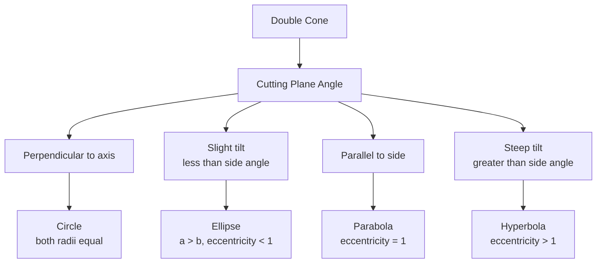

---
tags:
  - mathematics
  - advance
  - analytic-geometry
  - conics
  - ipst
source: "IPST (สสวท.) Mathematics Curriculum B.E. 2551 (2008, revised 2560/2017)"
created: 2026-07-30
course_codes: ["ค302"]
---

# Analytic Geometry — เรขาคณิตวิเคราะห์

> *"Analytic geometry bridges algebra and geometry — every curve is an equation, every equation is a curve."*

Analytic geometry uses algebraic equations to describe geometric objects in the coordinate plane. This topic covers lines, circles, and conic sections (parabolas, ellipses, hyperbolas) — foundational for physics (orbital mechanics), engineering (antenna design), and computer graphics.

---

## 1 | Course Coverage

### ม.5 (ค302)

| Semester | Scope | Key Skills |
|---|---|---|
| **Semester 1** | Lines | Slope; point-slope form; slope-intercept form; parallel and perpendicular lines; distance from point to line |
| **Semester 1** | Circles | Standard form $(x-h)^2 + (y-k)^2 = r^2$; general form; completing the square |
| **Semester 1** | Parabolas | Vertex form; focus and directrix; standard equations; graphing |
| **Semester 1** | Ellipses | Standard form; center, vertices, foci; eccentricity |
| **Semester 1** | Hyperbolas | Standard form; center, vertices, foci, asymptotes |
| **Semester 1** | Conic identification | Discriminant test; completing the square to standard form |

---

## 2 | Key Terminology

| Thai | English | Symbol |
|---|---|---|
| เรขาคณิตวิเคราะห์ | Analytic geometry | — |
| ความชัน | Slope | $m$ |
| วงกลม | Circle | $(x-h)^2 + (y-k)^2 = r^2$ |
| พาราโบลา | Parabola | $y = ax^2 + bx + c$ |
| วงรี | Ellipse | $\frac{x^2}{a^2} + \frac{y^2}{b^2} = 1$ |
| ไฮเพอร์โบลา | Hyperbola | $\frac{x^2}{a^2} - \frac{y^2}{b^2} = 1$ |
| จุดโฟกัส | Focus | $F$ |
| เส้นไดเรกตริกซ์ | Directrix | Directrix line |
| จุดศูนย์กลาง | Center | $(h, k)$ |
| จุดยอด | Vertex | — |
| ความเยื้องศูนย์กลาง | Eccentricity | $e$ |
| เส้นกำกับ | Asymptote | — |

---

## 3 | Key Concepts

### The Conic Section Family

### 3.1 Lines

**Slope:**
$$m = \frac{y_2 - y_1}{x_2 - x_1}$$

**Point-slope form:**
$$y - y_1 = m(x - x_1)$$

**Slope-intercept form:**
$$y = mx + b$$

**General form:**
$$Ax + By + C = 0$$

**Parallel lines:** $m_1 = m_2$

**Perpendicular lines:** $m_1 \cdot m_2 = -1$

**Distance from point $(x_0, y_0)$ to line $Ax + By + C = 0$:**
$$d = \frac{|Ax_0 + By_0 + C|}{\sqrt{A^2 + B^2}}$$

### 3.2 Circles

**Standard form:**
$$(x - h)^2 + (y - k)^2 = r^2$$
Center: $(h, k)$, Radius: $r$

**General form:**
$$x^2 + y^2 + Dx + Ey + F = 0$$

**Converting general to standard:** Complete the square for $x$ and $y$.

**Example:** $x^2 + y^2 - 4x + 6y - 12 = 0$
$(x^2 - 4x + 4) + (y^2 + 6y + 9) = 12 + 4 + 9$
$(x - 2)^2 + (y + 3)^2 = 25$
Center: $(2, -3)$, Radius: $5$

### 3.3 Parabolas

**Vertical parabola (opens up/down):**
$$(x - h)^2 = 4p(y - k)$$
- Vertex: $(h, k)$
- Focus: $(h, k + p)$
- Directrix: $y = k - p$
- Opens up if $p > 0$, down if $p < 0$

**Horizontal parabola (opens left/right):**
$$(y - k)^2 = 4p(x - h)$$
- Vertex: $(h, k)$
- Focus: $(h + p, k)$
- Directrix: $x = h - p$

**Standard quadratic form:**
$$y = ax^2 + bx + c$$
Vertex: $x = -\frac{b}{2a}$

### 3.4 Ellipses

**Standard form (horizontal major axis):**
$$\frac{(x-h)^2}{a^2} + \frac{(y-k)^2}{b^2} = 1 \quad (a > b)$$

- Center: $(h, k)$
- Vertices: $(h \pm a, k)$
- Co-vertices: $(h, k \pm b)$
- Foci: $(h \pm c, k)$ where $c^2 = a^2 - b^2$
- Major axis length: $2a$
- Minor axis length: $2b$
- Eccentricity: $e = c/a$ ($0 < e < 1$)

### 3.5 Hyperbolas

**Standard form (horizontal transverse axis):**
$$\frac{(x-h)^2}{a^2} - \frac{(y-k)^2}{b^2} = 1$$

- Center: $(h, k)$
- Vertices: $(h \pm a, k)$
- Foci: $(h \pm c, k)$ where $c^2 = a^2 + b^2$
- Asymptotes: $y - k = \pm \frac{b}{a}(x - h)$
- Eccentricity: $e = c/a$ ($e > 1$)

**Vertical transverse axis:**
$$\frac{(y-k)^2}{a^2} - \frac{(x-h)^2}{b^2} = 1$$

### 3.6 Conic Section Identification

Given general second-degree equation:
$$Ax^2 + Bxy + Cy^2 + Dx + Ey + F = 0$$

**Discriminant:** $\Delta = B^2 - 4AC$

| Condition | Conic Type |
|---|---|
| $B^2 - 4AC < 0$ | Ellipse (or circle if $A = C$ and $B = 0$) |
| $B^2 - 4AC = 0$ | Parabola |
| $B^2 - 4AC > 0$ | Hyperbola |

---

## 4 | Common Problem Types

### Type 1: Line Equation
> Find the equation of the line through $(2, 3)$ perpendicular to $y = 2x + 1$.

**Solution:** Given line has slope $m = 2$. Perpendicular slope: $m_{\perp} = -1/2$
$y - 3 = -\frac{1}{2}(x - 2) \Rightarrow y = -\frac{1}{2}x + 4$

### Type 2: Circle from General Form
> Find center and radius of $x^2 + y^2 + 6x - 8y + 9 = 0$.

**Solution:** Complete the square:
$(x^2 + 6x + 9) + (y^2 - 8y + 16) = -9 + 9 + 16$
$(x + 3)^2 + (y - 4)^2 = 16$
Center: $(-3, 4)$, Radius: $4$

### Type 3: Parabola Properties
> Find vertex, focus, and directrix of $(x - 2)^2 = 8(y + 1)$.

**Solution:** Form: $(x-h)^2 = 4p(y-k)$
$h = 2, k = -1, 4p = 8 \Rightarrow p = 2$
- Vertex: $(2, -1)$
- Focus: $(2, -1 + 2) = (2, 1)$
- Directrix: $y = -1 - 2 = -3$

### Type 4: Ellipse Properties
> Find vertices and foci of $\frac{x^2}{25} + \frac{y^2}{9} = 1$.

**Solution:** $a^2 = 25 \Rightarrow a = 5$, $b^2 = 9 \Rightarrow b = 3$
$c^2 = 25 - 9 = 16 \Rightarrow c = 4$
- Vertices: $(\pm 5, 0)$
- Foci: $(\pm 4, 0)$

### Type 5: Hyperbola Asymptotes
> Find asymptotes of $\frac{(x-1)^2}{16} - \frac{(y+2)^2}{9} = 1$.

**Solution:** Center: $(1, -2)$, $a = 4$, $b = 3$
Asymptotes: $y + 2 = \pm \frac{3}{4}(x - 1)$
$y = \frac{3}{4}x - \frac{11}{4}$ and $y = -\frac{3}{4}x + \frac{5}{4}$

### Type 6: Conic Identification
> Identify the conic: $4x^2 + 9y^2 - 16x + 18y - 11 = 0$.

**Solution:** $A = 4, B = 0, C = 9$
$\Delta = 0 - 4(4)(9) = -144 < 0$
Since $\Delta < 0$ and $A \neq C$: **Ellipse**

---

## 5 | Cross-Links

- [[Fundamental/16_Coordinate_Plane]] — Coordinate geometry foundation
- [[13_Vectors]] — Vector representation of conics
- [[15_Differentiation]] — Tangent lines to curves
- [[01_Physics - Overview]] — Projectile motion (parabolas), orbits (ellipses)
