---
tags:
  - mathematics
  - advance
  - limits
  - continuity
  - calculus
  - ipst
source: "IPST (สสวท.) Mathematics Curriculum B.E. 2551 (2008, revised 2560/2017)"
created: 2026-07-30
course_codes: ["ค302"]
---

# Limits and Continuity — ลิมิตและความต่อเนื่อง

> *"Calculus begins with the limit — the mathematical microscope that sees the infinitely small."*

The limit is the foundational concept of calculus. It describes the behavior of a function as the input approaches a specific value, without actually reaching it. This topic covers limit evaluation techniques, continuity, and the theorems that connect them. Mastering limits is essential before approaching derivatives and integrals.

---

## 1 | Course Coverage

### ม.5 (ค302)

| Semester | Scope | Key Skills |
|---|---|---|
| **Semester 2** | Limit concept | Intuitive and formal definition; left-hand and right-hand limits; graphical interpretation |
| **Semester 2** | Limit laws | Sum, difference, product, quotient, power rules |
| **Semester 2** | Evaluating techniques | Direct substitution; factoring; rationalizing; common denominator; simplification |
| **Semester 2** | Indeterminate forms | $0/0$, $\infty/\infty$, $\infty - \infty$; strategies for resolving |
| **Semester 2** | Limits at infinity | Horizontal asymptotes; end behavior of functions |
| **Semester 2** | Special limits | $\lim_{\theta \to 0} \frac{\sin\theta}{\theta} = 1$; squeeze theorem |
| **Semester 2** | Continuity | Definition; types of discontinuity; intermediate value theorem |

---

## 2 | Key Terminology

| Thai | English | Symbol |
|---|---|---|
| ลิมิต | Limit | $\lim_{x \to a} f(x)$ |
| ลิมิตด้านซ้าย | Left-hand limit | $\lim_{x \to a^-} f(x)$ |
| ลิมิตด้านขวา | Right-hand limit | $\lim_{x \to a^+} f(x)$ |
| ความต่อเนื่อง | Continuity | Continuous |
| จุดไม่ต่อเนื่อง | Discontinuity | Jump, removable, infinite |
| รูปยังไม่กำหนด | Indeterminate form | $0/0$, $\infty/\infty$ |
| เส้น asymptote แนวนอน | Horizontal asymptote | $y = L$ |
| ทฤษฎีบท sandwich | Squeeze theorem | — |
| ทฤษฎีบทค่ากลาง | Intermediate Value Theorem | IVT |

---

## 3 | Key Concepts

### Continuity Decision Flow

```mermaid
flowchart TD
    START["Is f&#40;a&#41; defined?"] -->|No| DISC1["Discontinuity at x = a"]
    START -->|Yes| Q2["Does lim x→a f&#40;x&#41; exist?"]
    Q2 -->|No| DISC2["Jump or Infinite Discontinuity"]
    Q2 -->|Yes| Q3["Does lim x→a f&#40;x&#41; = f&#40;a&#41;?"]
    Q3 -->|No| REMOV["Removable Discontinuity\nhole in the graph"]
    Q3 -->|Yes| CONT["Continuous at x = a"]
```

### 3.1 Definition of a Limit

$$\lim_{x \to a} f(x) = L$$

means $f(x)$ can be made arbitrarily close to $L$ by taking $x$ sufficiently close to $a$ (but $x \neq a$).

**The limit exists if and only if:**
$$\lim_{x \to a^-} f(x) = \lim_{x \to a^+} f(x) = L$$

### 3.2 Limit Laws

If $\lim_{x \to a} f(x)$ and $\lim_{x \to a} g(x)$ exist:

| Rule | Formula |
|---|---|
| Sum | $\lim[f(x) + g(x)] = \lim f(x) + \lim g(x)$ |
| Difference | $\lim[f(x) - g(x)] = \lim f(x) - \lim g(x)$ |
| Product | $\lim[f(x) \cdot g(x)] = \lim f(x) \cdot \lim g(x)$ |
| Quotient | $\lim\frac{f(x)}{g(x)} = \frac{\lim f(x)}{\lim g(x)}$, if $\lim g(x) \neq 0$ |
| Power | $\lim[f(x)]^n = [\lim f(x)]^n$ |
| Root | $\lim\sqrt[n]{f(x)} = \sqrt[n]{\lim f(x)}$ |
| Constant | $\lim c = c$ |
| Identity | $\lim_{x \to a} x = a$ |

### 3.3 Evaluating Techniques

**Direct substitution:**
$$\lim_{x \to 2} (3x^2 - 5x + 1) = 3(4) - 10 + 1 = 3$$

**Factoring (when $0/0$):**
$$\lim_{x \to 3} \frac{x^2 - 9}{x - 3} = \lim_{x \to 3} \frac{(x+3)(x-3)}{x-3} = \lim_{x \to 3} (x+3) = 6$$

**Rationalizing (when $0/0$ with square roots):**
$$\lim_{x \to 0} \frac{\sqrt{x+4} - 2}{x}$$

Multiply by conjugate:
$$= \lim_{x \to 0} \frac{(x+4) - 4}{x(\sqrt{x+4} + 2)} = \lim_{x \to 0} \frac{x}{x(\sqrt{x+4} + 2)} = \frac{1}{4}$$

### 3.4 Limits at Infinity

**Rational functions — leading term analysis:**

$$\lim_{x \to \infty} \frac{a_n x^n + ...}{b_m x^m + ...}$$

| Degree | Limit |
|---|---|
| $n < m$ | $0$ |
| $n = m$ | $\frac{a_n}{b_m}$ |
| $n > m$ | $\pm\infty$ |

**Example:**
$$\lim_{x \to \infty} \frac{3x^2 + 2x - 1}{2x^2 - 5} = \frac{3}{2}$$

### 3.5 Special Trigonometric Limit

$$\lim_{\theta \to 0} \frac{\sin\theta}{\theta} = 1$$

**Corollaries:**
$$\lim_{\theta \to 0} \frac{1 - \cos\theta}{\theta} = 0$$
$$\lim_{\theta \to 0} \frac{\tan\theta}{\theta} = 1$$

**Example:**
$$\lim_{x \to 0} \frac{\sin(5x)}{3x} = \lim_{x \to 0} \frac{\sin(5x)}{5x} \cdot \frac{5x}{3x} = 1 \cdot \frac{5}{3} = \frac{5}{3}$$

### 3.6 Squeeze Theorem

If $g(x) \leq f(x) \leq h(x)$ near $a$ and $\lim_{x \to a} g(x) = \lim_{x \to a} h(x) = L$, then $\lim_{x \to a} f(x) = L$.

**Classic application:** Proving $\lim_{\theta \to 0} \frac{\sin\theta}{\theta} = 1$ using $\cos\theta \leq \frac{\sin\theta}{\theta} \leq 1$.

### 3.7 Continuity

$f(x)$ is **continuous** at $x = a$ if:
1. $f(a)$ is defined
2. $\lim_{x \to a} f(x)$ exists
3. $\lim_{x \to a} f(x) = f(a)$

**Types of discontinuity:**

| Type | Description | Example |
|---|---|---|
| Removable (hole) | Limit exists but $\neq f(a)$ or $f(a)$ undefined | $\frac{x^2-1}{x-1}$ at $x = 1$ |
| Jump | Left and right limits exist but differ | Step functions |
| Infinite | Function approaches $\pm\infty$ | $\frac{1}{x}$ at $x = 0$ |

### 3.8 Intermediate Value Theorem

If $f$ is continuous on $[a, b]$ and $k$ is any value between $f(a)$ and $f(b)$, then there exists at least one $c \in (a, b)$ such that $f(c) = k$.

**Application:** Showing equations have solutions. If $f$ changes sign on $[a, b]$, then $f(c) = 0$ for some $c$.

---

## 4 | Common Problem Types

### Type 1: Direct Substitution
> Evaluate $\lim_{x \to -1} (2x^3 - x + 4)$.

**Solution:** $2(-1) - (-1) + 4 = -2 + 1 + 4 = 3$

### Type 2: Factoring
> Evaluate $\lim_{x \to 4} \frac{x^2 - 16}{x^2 - 3x - 4}$.

**Solution:** Factor: $\frac{(x-4)(x+4)}{(x-4)(x+1)} = \frac{x+4}{x+1}$
$\lim_{x \to 4} \frac{x+4}{x+1} = \frac{8}{5}$

### Type 3: Rationalizing
> Evaluate $\lim_{x \to 1} \frac{\sqrt{x} - 1}{x - 1}$.

**Solution:** $\frac{\sqrt{x} - 1}{x - 1} = \frac{\sqrt{x}-1}{(\sqrt{x}-1)(\sqrt{x}+1)} = \frac{1}{\sqrt{x}+1}$
$\lim_{x \to 1} \frac{1}{\sqrt{x}+1} = \frac{1}{2}$

### Type 4: Trig Limit
> Evaluate $\lim_{x \to 0} \frac{\sin(3x)}{\tan(2x)}$.

**Solution:** $\frac{\sin(3x)}{\tan(2x)} = \frac{\sin(3x)}{\sin(2x)/\cos(2x)} = \frac{\sin(3x)\cos(2x)}{\sin(2x)}$
$= \frac{\sin(3x)}{3x} \cdot \frac{2x}{\sin(2x)} \cdot \frac{3x\cos(2x)}{2x} \to 1 \cdot 1 \cdot \frac{3}{2} = \frac{3}{2}$

### Type 5: Limit at Infinity
> Evaluate $\lim_{x \to \infty} \frac{5x^3 - 2x + 1}{x^3 + 7}$.

**Solution:** Degrees equal ($n = m = 3$):
$\lim = \frac{5}{1} = 5$

### Type 6: Continuity
> Find $k$ so that $f(x) = \begin{cases} x^2 + 1 & x \leq 2 \\ 3x + k & x > 2 \end{cases}$ is continuous.

**Solution:** Left limit: $\lim_{x \to 2^-} = 4 + 1 = 5$
Right limit: $\lim_{x \to 2^+} = 6 + k$
For continuity: $6 + k = 5 \Rightarrow k = -1$

---

## 5 | Cross-Links

- [[05_Functions]] — Function behavior and types
- [[07_Trigonometric_Functions]] — Trig limits
- [[15_Differentiation]] — Derivative defined as a limit
- [[16_Integration]] — Definite integral defined as a limit of Riemann sums
