---
tags:
  - mathematics
  - advance
  - differentiation
  - derivatives
  - calculus
  - ipst
source: "IPST (สสวท.) Mathematics Curriculum B.E. 2551 (2008, revised 2560/2017)"
created: 2026-07-30
course_codes: ["ค302"]
---

# Differentiation — การหาอนุพันธ์

> *"The derivative measures change — how fast, how steep, how sensitive. It is calculus in action."*

Differentiation is the process of finding the derivative, which measures the instantaneous rate of change of a function. This topic covers derivative rules, implicit differentiation, and applications including optimization, related rates, and curve analysis. It is the central tool of differential calculus.

---

## 1 | Course Coverage

### ม.5 (ค302)

| Semester | Scope | Key Skills |
|---|---|---|
| **Semester 2** | Derivative definition | Limit definition; secant vs tangent; differentiability |
| **Semester 2** | Basic rules | Power rule, constant rule, sum/difference, product rule, quotient rule |
| **Semester 2** | Chain rule | Composite functions; nested derivatives |
| **Semester 2** | Trig derivatives | $\frac{d}{dx}\sin x$, $\cos x$, $\tan x$, etc. |
| **Semester 2** | Exp and log derivatives | $\frac{d}{dx}e^x = e^x$; $\frac{d}{dx}\ln x = \frac{1}{x}$ |
| **Semester 2** | Implicit differentiation | Finding $dy/dx$ when $y$ is not isolated |
| **Semester 2** | Applications | Rate of change; maxima/minima; related rates; optimization |

---

## 2 | Key Terminology

| Thai | English | Symbol |
|---|---|---|
| อนุพันธ์ | Derivative | $f'(x)$, $\frac{dy}{dx}$, $\frac{d}{dx}$ |
| การหาอนุพันธ์ | Differentiation | Process of finding derivative |
| อัตราการเปลี่ยนแปลง | Rate of change | $dy/dx$ |
| เส้นสัมผัส | Tangent line | Line touching curve at one point |
| ค่าสูงสุด | Maximum | Highest point |
| ค่าต่ำสุด | Minimum | Lowest point |
| จุดวิกฤต | Critical point | Where $f'(x) = 0$ or undefined |
| อนุพันธ์อ้อม | Implicit differentiation | $dy/dx$ without solving for $y$ |
| อัตราส่วนที่เกี่ยวข้อง | Related rates | Connected rates of change |

---

## 3 | Key Concepts

### Optimization Decision Flow

```mermaid
flowchart TD
    START["Find f prime&#40;x&#41;"] --> CRIT["Set f prime&#40;x&#41; = 0\nFind critical points"]
    CRIT --> TEST["Choose test method"]
    TEST --> FIRST["First Derivative Test\nCheck sign changes around c"]
    TEST --> SECOND["Second Derivative Test\nEvaluate f double-prime at c"]
    FIRST --> MAX1["+ to minus sign: Local Max"]
    FIRST --> MIN1["minus sign to +: Local Min"]
    SECOND --> MAX2["f double-prime &#60; 0: Local Max"]
    SECOND --> MIN2["f double-prime &#62; 0: Local Min"]
    SECOND --> INCONCL["f double-prime = 0: Inconclusive\nUse First Derivative Test"]
```

### 3.1 Definition of the Derivative

$$f'(x) = \lim_{h \to 0} \frac{f(x+h) - f(x)}{h}$$

**Geometric interpretation:** $f'(a)$ is the slope of the tangent line to $f(x)$ at $x = a$.

**Tangent line equation:** $y - f(a) = f'(a)(x - a)$

### 3.2 Differentiation Rules

**Power rule:**
$$\frac{d}{dx}[x^n] = nx^{n-1}$$

**Constant rule:**
$$\frac{d}{dx}[c] = 0$$

**Sum/Difference:**
$$\frac{d}{dx}[f \pm g] = f' \pm g'$$

**Product rule:**
$$(fg)' = f'g + fg'$$

**Quotient rule:**
$$\left(\frac{f}{g}\right)' = \frac{f'g - fg'}{g^2}$$

**Chain rule:**
$$\frac{d}{dx}[f(g(x))] = f'(g(x)) \cdot g'(x)$$

### 3.3 Derivatives of Common Functions

| Function | Derivative |
|---|---|
| $c$ (constant) | $0$ |
| $x^n$ | $nx^{n-1}$ |
| $e^x$ | $e^x$ |
| $a^x$ | $a^x \ln a$ |
| $\ln x$ | $\frac{1}{x}$ |
| $\log_a x$ | $\frac{1}{x \ln a}$ |
| $\sin x$ | $\cos x$ |
| $\cos x$ | $-\sin x$ |
| $\tan x$ | $\sec^2 x$ |
| $\csc x$ | $-\csc x \cot x$ |
| $\sec x$ | $\sec x \tan x$ |
| $\cot x$ | $-\csc^2 x$ |

### 3.4 Implicit Differentiation

When $y$ cannot be isolated, differentiate both sides with respect to $x$, treating $y$ as a function of $x$.

**Example:** Find $\frac{dy}{dx}$ for $x^2 + y^2 = 25$.

Differentiate both sides:
$$2x + 2y \frac{dy}{dx} = 0$$
$$\frac{dy}{dx} = -\frac{x}{y}$$

### 3.5 Finding Maxima and Minima

**Step 1:** Find $f'(x)$

**Step 2:** Set $f'(x) = 0$ to find critical points

**Step 3:** Test using:

**First Derivative Test:**

| Sign change of $f'(x)$ at critical point | Result |
|---|---|
| $+$ → $-$ | Local maximum |
| $-$ → $+$ | Local minimum |
| No sign change | Neither (inflection) |

**Second Derivative Test:**

| $f''(c)$ | Result |
|---|---|
| $f''(c) > 0$ | Local minimum |
| $f''(c) < 0$ | Local maximum |
| $f''(c) = 0$ | Inconclusive |

### 3.6 Related Rates

When multiple quantities change over time, relate their rates using the chain rule.

**Example:** A balloon is being inflated. The radius increases at $2$ cm/s. How fast is the volume changing when $r = 5$ cm?

$$V = \frac{4}{3}\pi r^3$$
$$\frac{dV}{dt} = 4\pi r^2 \frac{dr}{dt} = 4\pi(25)(2) = 200\pi \text{ cm}^3/\text{s}$$

### 3.7 Optimization

To find maximum or minimum values:

1. Identify the objective function
2. Express it in one variable (using a constraint)
3. Find critical points
4. Verify maximum/minimum

**Example:** Find the dimensions of the rectangle with maximum area that can be enclosed with 40 m of fencing.

Constraint: $2l + 2w = 40 \Rightarrow w = 20 - l$
Objective: $A = l \cdot w = l(20-l) = 20l - l^2$
$\frac{dA}{dl} = 20 - 2l = 0 \Rightarrow l = 10$
$w = 10$. Maximum area is a $10 \times 10$ square.

---

## 4 | Common Problem Types

### Type 1: Power Rule
> Differentiate $f(x) = 5x^3 - 2x^2 + 7x - 3$.

**Solution:** $f'(x) = 15x^2 - 4x + 7$

### Type 2: Product Rule
> Differentiate $f(x) = x^2 \sin x$.

**Solution:** $f'(x) = 2x\sin x + x^2\cos x$

### Type 3: Quotient Rule
> Differentiate $f(x) = \frac{3x + 1}{x^2 + 2}$.

**Solution:** $f'(x) = \frac{3(x^2+2) - (3x+1)(2x)}{(x^2+2)^2} = \frac{3x^2+6-6x^2-2x}{(x^2+2)^2} = \frac{-3x^2-2x+6}{(x^2+2)^2}$

### Type 4: Chain Rule
> Differentiate $f(x) = (3x^2 + 1)^5$.

**Solution:** $f'(x) = 5(3x^2+1)^4 \cdot 6x = 30x(3x^2+1)^4$

### Type 5: Implicit Differentiation
> Find $\frac{dy}{dx}$ for $xy + y^2 = x^3$.

**Solution:** Product rule on $xy$:
$y + x\frac{dy}{dx} + 2y\frac{dy}{dx} = 3x^2$
$\frac{dy}{dx}(x + 2y) = 3x^2 - y$
$\frac{dy}{dx} = \frac{3x^2 - y}{x + 2y}$

### Type 6: Tangent Line
> Find tangent line to $y = x^3 - 2x$ at $x = 1$.

**Solution:** $f(1) = 1 - 2 = -1$, $f'(x) = 3x^2 - 2$, $f'(1) = 1$
Tangent: $y - (-1) = 1(x - 1) \Rightarrow y = x - 2$

### Type 7: Optimization
> Find two positive numbers whose sum is 20 and whose product is maximum.

**Solution:** $x + y = 20$, maximize $P = xy$
$y = 20 - x$, $P = x(20-x) = 20x - x^2$
$P' = 20 - 2x = 0 \Rightarrow x = 10$, $y = 10$
Max product = $100$

---

## 5 | Cross-Links

- [[14_Limits_and_Continuity]] — Derivative is a limit
- [[05_Functions]] — Analyzing function behavior
- [[16_Integration]] — Integration reverses differentiation
- [[12_Analytic_Geometry]] — Tangent lines to conics
- [[01_Physics - Overview]] — Velocity, acceleration, related rates
