---
tags:
  - mathematics
  - advance
  - probability
  - counting
  - ipst
source: "IPST (สสวท.) Mathematics Curriculum B.E. 2551 (2008, revised 2560/2017)"
created: 2026-07-30
course_codes: ["ค302"]
---

# Probability — ความน่าจะเป็น

> *"Probability is the mathematics of uncertainty — quantifying what we cannot know with certainty."*

This topic extends the basic probability concepts from fundamental mathematics to advanced counting techniques, conditional probability, and Bayes' theorem. These tools are essential for statistics, data science, machine learning, and risk analysis.

---

## 1 | Course Coverage

### ม.5 (ค302)

| Semester | Scope | Key Skills |
|---|---|---|
| **Semester 2** | Counting principles | Multiplication rule; permutations; combinations |
| **Semester 2** | Probability basics | Sample space; events; classical and empirical probability |
| **Semester 2** | Set operations in probability | Union; intersection; complement; mutually exclusive events |
| **Semester 2** | Conditional probability | $P(A|B)$; independent events; multiplication rule |
| **Semester 2** | Law of total probability | Partitioning sample space |
| **Semester 2** | Bayes' Theorem | Updating beliefs with evidence; prior/posterior |

---

## 2 | Key Terminology

| Thai | English | Symbol |
|---|---|---|
| ความน่าจะเป็น | Probability | $P(A)$ |
| ปริภูมิตัวอย่าง | Sample space | $S$ |
| เหตุการณ์ | Event | $A, B, C$ |
| เหตุการณ์ไม่เกิดร่วม | Mutually exclusive | $A \cap B = \emptyset$ |
| การเรียงสับเปลี่ยน | Permutation | $P(n,r)$ or ${}^nP_r$ |
| การจัดหมู่ | Combination | $C(n,r)$ or $\binom{n}{r}$ |
| แฟกทอเรียล | Factorial | $n!$ |
| ความน่าจะเป็นแบบมีเงื่อนไข | Conditional probability | $P(A\|B)$ |
| เหตุการณ์อิสระ | Independent events | $P(A \cap B) = P(A)P(B)$ |
| ทฤษฎีบทเบส์ | Bayes' Theorem | — |

---

## 3 | Key Concepts

### Counting Problem Decision Flow

```mermaid
flowchart TD
    START["Counting Problem"] --> Q1["Does order matter?"]
    Q1 -->|Yes| Q2["All items used?"]
    Q1 -->|No| COMB["Combination\nC&#40;n,r&#41; = n! / r!&#40;n-r&#41;!"]
    Q2 -->|Yes| PERM_ALL["Full Permutation\nP&#40;n,n&#41; = n!"]
    Q2 -->|No| PERM_PART["Partial Permutation\nP&#40;n,r&#41; = n! / &#40;n-r&#41;!"]
    PERM_PART --> Q3["Repetition allowed?"]
    Q3 -->|Yes| REP["n^r"]
    Q3 -->|No| PERM_PART
```

### 3.1 Counting Principles

**Multiplication rule:** If task 1 can be done in $m$ ways and task 2 in $n$ ways, both together can be done in $m \times n$ ways.

**Permutation (order matters):**
$$P(n, r) = \frac{n!}{(n-r)!}$$

**Combination (order doesn't matter):**
$$C(n, r) = \binom{n}{r} = \frac{n!}{r!(n-r)!}$$

**Examples:**
- Ways to arrange 5 books on a shelf: $5! = 120$
- Ways to choose 3 students from 10: $\binom{10}{3} = 120$
- Ways to select president/secretary from 10: $P(10, 2) = 90$

### 3.2 Basic Probability

**Classical probability:**
$$P(A) = \frac{\text{number of favorable outcomes}}{\text{total number of outcomes}}$$

**Properties:**
- $0 \leq P(A) \leq 1$
- $P(S) = 1$
- $P(\emptyset) = 0$
- $P(A') = 1 - P(A)$

**Addition rule:**
$$P(A \cup B) = P(A) + P(B) - P(A \cap B)$$

If mutually exclusive: $P(A \cup B) = P(A) + P(B)$

### 3.3 Conditional Probability

$$P(A|B) = \frac{P(A \cap B)}{P(B)}, \quad P(B) > 0$$

**Multiplication rule:**
$$P(A \cap B) = P(B) \cdot P(A|B)$$

**Independent events:** $A$ and $B$ are independent if:
$$P(A|B) = P(A)$$
Equivalently: $P(A \cap B) = P(A) \cdot P(B)$

### 3.4 Law of Total Probability

If $B_1, B_2, ..., B_n$ partition $S$:
$$P(A) = \sum_{i=1}^n P(B_i) \cdot P(A|B_i)$$

### 3.5 Bayes' Theorem

$$P(B_j|A) = \frac{P(B_j) \cdot P(A|B_j)}{\sum_{i=1}^n P(B_i) \cdot P(A|B_i)}$$

**Two-event form:**
$$P(B|A) = \frac{P(B)P(A|B)}{P(A)}$$

**Example:** A disease affects 1% of population. A test is 95% accurate (detects disease 95% of the time when present, false positive 5% of the time when absent). Given a positive test, what is the probability of having the disease?

$$P(D|+) = \frac{P(D)P(+|D)}{P(D)P(+|D) + P(D')P(+|D')}$$
$$= \frac{(0.01)(0.95)}{(0.01)(0.95) + (0.99)(0.05)} = \frac{0.0095}{0.0095 + 0.0495} = \frac{0.0095}{0.059} \approx 0.161$$

So even with a positive test, only about **16%** chance of having the disease.

---

## 4 | Common Problem Types

### Type 1: Permutations
> How many ways can 5 people sit in 3 chairs?

**Solution:** $P(5, 3) = \frac{5!}{2!} = 60$

### Type 2: Combinations
> How many committees of 4 can be formed from 10 people?

**Solution:** $\binom{10}{4} = \frac{10!}{4!6!} = 210$

### Type 3: Basic Probability
> A card is drawn from a standard deck. Find probability it is a king or a heart.

**Solution:** $P(K) = 4/52$, $P(H) = 13/52$, $P(K \cap H) = 1/52$
$P(K \cup H) = \frac{4+13-1}{52} = \frac{16}{52} = \frac{4}{13}$

### Type 4: Conditional Probability
> Given $P(A) = 0.4$, $P(B) = 0.5$, $P(A \cup B) = 0.7$. Find $P(A|B)$.

**Solution:** $P(A \cap B) = P(A) + P(B) - P(A \cup B) = 0.4 + 0.5 - 0.7 = 0.2$
$P(A|B) = \frac{0.2}{0.5} = 0.4$

### Type 5: Independent Events
> A coin is tossed 3 times. Find probability of exactly 2 heads.

**Solution:** $\binom{3}{2}(0.5)^2(0.5)^1 = 3 \times 0.125 = 0.375$

### Type 6: Bayes' Theorem
> Factory 1 produces 60% of items, Factory 2 produces 40%. Defective rates: 2% and 5%. Given a defective item, probability from Factory 2?

**Solution:**
$P(F_2|D) = \frac{(0.40)(0.05)}{(0.60)(0.02) + (0.40)(0.05)} = \frac{0.020}{0.012 + 0.020} = \frac{0.020}{0.032} = 0.625$

---

## 5 | Cross-Links

- [[Fundamental/17_Sets]] — Set operations in probability
- [[Fundamental/19_Probability]] — Basic probability concepts
- [[18_Probability_Distributions]] — Random variables and distributions
- [[19_Statistics]] — Statistical inference builds on probability
- [[01_Sets_and_Logic]] — Formal set operations
