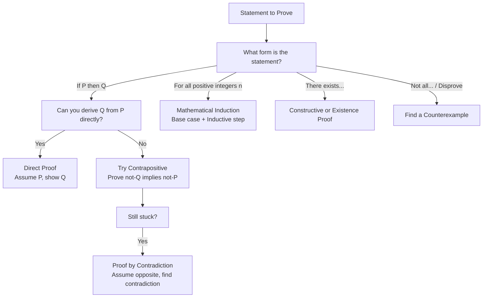

---
tags:
  - mathematics
  - advance
  - proof
  - reasoning
  - ipst
source: "IPST (สสวท.) Mathematics Curriculum B.E. 2551 (2008, revised 2560/2017)"
created: 2026-07-30
course_codes: ["ค303"]
---

# Mathematical Reasoning — การให้เหตุผลทางคณิตศาสตร์

> *"Mathematics is not about calculation — it is about proof. A proof is an argument that convinces."*

Mathematical reasoning formalizes how mathematicians think and argue. This topic covers proof techniques (direct, contradiction, contrapositive, induction), strategies for approaching proofs, and the logical structure underlying all mathematics.

---

## 1 | Course Coverage

### ม.6 (ค303)

| Semester | Scope | Key Skills |
|---|---|---|
| **Semester 2** | Proof fundamentals | Definitions, axioms, theorems; structure of a proof |
| **Semester 2** | Direct proof | Assume hypothesis, derive conclusion |
| **Semester 2** | Proof by contrapositive | Prove $\sim q \to \sim p$ instead of $p \to q$ |
| **Semester 2** | Proof by contradiction | Assume negation, derive contradiction |
| **Semester 2** | Mathematical induction | Base case + inductive step (extended from ค301) |
| **Somester 2** | Existence and uniqueness | Proving something exists and is the only one |
| **Semester 2** | Counterexamples | Disproving by finding one example that fails |

---

## 2 | Key Terminology

| Thai | English | Notes |
|---|---|---|
| บทพิสูจน์ | Proof | Logical argument |
| สัจพจน์ | Axiom | Assumed truth |
| ทฤษฎีบท | Theorem | Proven statement |
| บทแทรก | Lemma | Helper theorem |
| บทสืบเนื่อง | Corollary | Direct consequence |
| การพิสูจน์ตรง | Direct proof | $p \to q$ directly |
| การพิสูจน์อ้อม | Indirect proof | Contrapositive or contradiction |
| ข้อความตรงกันข้าม | Contrapositive | $\sim q \to \sim p$ |
| การพิสูจน์โดยการขัดแย้ง | Proof by contradiction | Assume $\sim q$, find contradiction |
| การอุปนัยเชิงคณิตศาสตร์ | Mathematical induction | Base case + inductive step |
| ตัวอย่างค้าน | Counterexample | Example that disproves |

---

## 3 | Key Concepts

### Proof Technique Selection Guide

### 3.1 Structure of Mathematics

| Level | Term | Description |
|---|---|---|
| Starting point | **Axiom/Postulate** | Accepted without proof |
| Definitions | **Definition** | Precise meaning of terms |
| Main results | **Theorem** | Proven using axioms and definitions |
| Helper results | **Lemma** | Proven to help prove a theorem |
| Consequences | **Corollary** | Follows directly from a theorem |

### 3.2 Direct Proof

**Structure:** Assume $p$ is true. Show $q$ follows.

**Example:** Prove: If $n$ is odd, then $n^2$ is odd.

**Proof:** Assume $n$ is odd. Then $n = 2k + 1$ for some integer $k$.
$$n^2 = (2k+1)^2 = 4k^2 + 4k + 1 = 2(2k^2 + 2k) + 1$$
Since $2k^2 + 2k$ is an integer, $n^2$ has the form $2m + 1$, which is odd. $\blacksquare$

### 3.3 Proof by Contrapositive

**Structure:** Instead of $p \to q$, prove $\sim q \to \sim p$ (logically equivalent).

**Example:** Prove: If $n^2$ is even, then $n$ is even.

**Contrapositive:** If $n$ is odd, then $n^2$ is odd. (Proved above.)

### 3.4 Proof by Contradiction

**Structure:** Assume $\sim q$ (the negation of what we want). Derive a contradiction.

**Classic Example:** Prove $\sqrt{2}$ is irrational.

**Proof:** Assume $\sqrt{2}$ is rational. Then $\sqrt{2} = a/b$ where $a, b$ are integers with no common factor (reduced fraction).

Squaring: $2 = a^2/b^2 \Rightarrow a^2 = 2b^2$

So $a^2$ is even, hence $a$ is even. Let $a = 2c$.
$(2c)^2 = 2b^2 \Rightarrow 4c^2 = 2b^2 \Rightarrow b^2 = 2c^2$

So $b^2$ is even, hence $b$ is even.

But then $a$ and $b$ are both even, contradicting that they have no common factor. $\blacksquare$

### 3.5 Mathematical Induction (Extended)

**Prove $P(n)$ for all $n \geq n_0$:**

1. **Base case:** Show $P(n_0)$ is true.
2. **Inductive step:** Assume $P(k)$ (inductive hypothesis). Show $P(k+1)$.

**Example:** Prove $1 + 3 + 5 + ... + (2n-1) = n^2$.

**Base ($n=1$):** $1 = 1^2$ ✓

**Inductive step:** Assume $1 + 3 + ... + (2k-1) = k^2$.

$1 + 3 + ... + (2k-1) + (2k+1) = k^2 + (2k+1) = (k+1)^2$ ✓

### 3.6 Counterexamples

To disprove "For all $x$, $P(x)$", find ONE counterexample.

**Example:** Disprove: "For all integers $n$, $n^2 + n + 41$ is prime."

**Counterexample:** $n = 41$: $41^2 + 41 + 41 = 41(41 + 2) = 41 \times 43$, which is composite.

### 3.7 Existence and Uniqueness

**Existence:** Show at least one solution exists.

**Uniqueness:** Assume two solutions $x_1$ and $x_2$, show $x_1 = x_2$.

---

## 4 | Common Problem Types

### Type 1: Direct Proof
> Prove: The sum of two even integers is even.

**Proof:** Let $m = 2a$ and $n = 2b$. Then $m + n = 2a + 2b = 2(a+b)$, which is even. $\blacksquare$

### Type 2: Contrapositive
> Prove: If $3n + 2$ is odd, then $n$ is odd.

**Contrapositive:** If $n$ is even, then $3n + 2$ is even.
Let $n = 2k$. $3(2k) + 2 = 6k + 2 = 2(3k+1)$, which is even. $\blacksquare$

### Type 3: Contradiction
> Prove: There is no greatest integer.

**Proof:** Assume there is a greatest integer $N$. Then $N + 1$ is an integer greater than $N$. Contradiction. $\blacksquare$

### Type 4: Induction
> Prove: $2^n > n$ for all $n \geq 1$.

**Base ($n=1$):** $2 > 1$ ✓
**Inductive step:** Assume $2^k > k$. Then $2^{k+1} = 2 \cdot 2^k > 2k = k + k \geq k + 1$ (for $k \geq 1$). $\blacksquare$

### Type 5: Counterexample
> Is $n^2 + n + 11$ always prime for $n \geq 0$?

**Solution:** $n = 11$: $121 + 11 + 11 = 143 = 11 \times 13$. Not prime. **No.**

### Type 6: Biconditional
> Prove: $n$ is odd if and only if $n^2$ is odd.

**Solution:**
($\Rightarrow$) If $n$ is odd, $n^2$ is odd. (Direct proof, shown above.)
($\Leftarrow$) If $n^2$ is odd, $n$ is odd. (Contrapositive, shown above.)
$\blacksquare$

---

## 5 | Cross-Links

- [[01_Sets_and_Logic]] — Logical connectives, quantifiers, truth tables
- [[08_Sequences_and_Series]] — Mathematical induction
- [[02_Real_Numbers_and_Inequalities]] — Proof properties of real numbers
- [[20_Discrete_Mathematics]] — Graph theory proofs
