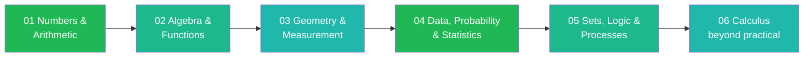

---
tags:
  - mathematics
  - cheatsheet
  - index
level: "Zero to Calculus"
sources: ["[[Fundamental/01_Numbers_and_Numeration|Fundamental notes]]", "[[Advance/01_Sets_and_Logic|Advance notes]]"]
created: 2026-10-02
---

# Math Cheat Sheet — Index

> *"Like a boardgame playbook: only the rules you need to play, from zero to practical, with calculus as the expansion pack."*

This folder distills the full Mathematics note collection (`Fundamental/` + practical `Advance/` topics) into **6 merged rulebooks**. Each rulebook contains only foundational rules: formulas, properties, identities, step-algorithms, and small value tables, each with a short example and a "when to use" hint.

Read them in chain order: each note links to the previous and next one.

---

## The Chain: Zero to Practical (and Beyond)

| # | Rulebook | Covers | Level |
|---|---|---|---|
| 01 | [[01_Numbers_and_Arithmetic]] | Numeration, four operations, factors & multiples, integers, fractions, decimals, rational numbers, percentages, ratios & proportions | Zero: the number foundation |
| 02 | [[02_Algebra_and_Functions]] | Patterns, variables & expressions, equations, inequalities, exponent/log rules, compound interest | The language of math |
| 03 | [[03_Geometry_and_Measurement]] | Shapes & angles, units & conversion, perimeter & area, volume & surface area, coordinate plane | Space and measure |
| 04 | [[04_Data_Probability_and_Statistics]] | Data handling, mean/median/mode, counting rules, probability rules, distributions in brief | Reading the world |
| 05 | [[05_Sets_Logic_and_Processes]] | Set notation & operations, Venn diagrams, logic connectives, problem-solving strategies | The rulebook about rulebooks |
| 06 | [[06_Calculus]] | Limits & continuity, derivative rules, optimization & related rates, integration techniques, Fundamental Theorem, separable differential equations | Beyond practical: the math of change |
| 07 | [[07_Roadmap]] | The whole journey as one dependency map: counting numbers → calculus, every node clickable into its rulebook | Meta: the map of all maps |

---

## How to Use These Cheat Sheets

1. **Start at 01** if you are rebuilding from zero; jump anywhere if you just need a rule.
2. Each rule has: **the rule** (formula/property), **a short example**, and a **when-to-use hint**.
3. Full explanations, grade-band breakdowns, and word-problem practice live in the source notes under `Fundamental/` and `Advance/`: each cheat sheet links back to them in its `sources` frontmatter and section headers.
4. Thai rule names appear in parentheses so you can cross-reference with IPST (สสวท.) textbooks.

---

## Chain Navigation

⬅ *(start)* · ➡ [[01_Numbers_and_Arithmetic]] · 🗺 [[07_Roadmap]]
