---
tags:
  - mathematics
  - cheatsheet
  - numbers
  - arithmetic
level: "Zero: the number foundation"
sources: ["[[Fundamental/01_Numbers_and_Numeration]]", "[[Fundamental/02_Arithmetic_Operations]]", "[[Fundamental/03_Factors_Multiples_and_Number_Theory]]", "[[Fundamental/04_Integers]]", "[[Fundamental/05_Fractions]]", "[[Fundamental/06_Decimals]]", "[[Fundamental/07_Rational_Numbers]]", "[[Fundamental/08_Percentages]]", "[[Fundamental/09_Ratios_and_Proportions]]"]
created: 2026-10-02
---

# Numbers & Arithmetic — Cheat Sheet

> *Every rule you need to move numbers around: place value, operations, factors, signs, fractions, decimals, percents, ratios.*

## 1 | Number Systems & Place Value (จำนวนและการนับ)

### 1.1 Number-set hierarchy

```mermaid
flowchart TD
    R["ℝ Real numbers &#40;จำนวนจริง&#41;"]
    Q["ℚ Rational &#40;จำนวนตรรกยะ&#41;\nwrite as a/b, b ≠ 0"]
    IQ["Irrational &#40;จำนวนอตรรกยะ&#41;\n√2, π, e"]
    Z["ℤ Integers &#40;จำนวนเต็ม&#41;"]
    N["ℕ Natural &#40;จำนวนนับ&#41;\n1, 2, 3, ..."]
    F["Non-integer rationals\n1/2, 0.75, 0.333..."]
    R --> Q
    R --> IQ
    Q --> Z
    Q --> F
    Z --> N
```

*When to use:* classifying a number or predicting its decimal behavior.

### 1.2 Place value (ค่าประจำหลัก) & expanded form (การกระจายจำนวน)

$$\text{Digit value} = \text{digit} \times 10^{\text{position}}$$

Whole-number places, leftward from ones (หลักหน่วย, $$10^0$$): tens (หลักสิบ, $$10^1$$), hundreds (หลักร้อย, $$10^2$$), thousands (หลักพัน, $$10^3$$), ten-thousands (หลักหมื่น, $$10^4$$), hundred-thousands (หลักแสน, $$10^5$$), millions (หลักล้าน, $$10^6$$). Right of the decimal point: tenths (หลักส่วนสิบ, $$10^{-1}$$), hundredths (หลักส่วนร้อย), thousandths (หลักส่วนพัน).

*Example:* in 3,456,789 the digit 4 is in the หลักแสน place → 400,000. Expanded form: $$3{,}456 = (3 \times 10^3) + (4 \times 10^2) + (5 \times 10^1) + (6 \times 10^0)$$.
*When to use:* reading/writing large numbers, identifying digit value.

### 1.3 Rounding (การปัดเศษ)

| Digit to the right of target | Action |
|---|---|
| ≥ 5 | Round up: target digit + 1, zero out the rest |
| < 5 | Round down: keep target digit, zero out the rest |

*Example:* 38,462 to nearest thousand: hundreds digit 4 < 5 → **38,000**.
*When to use:* estimation (การประมาณค่า) and checking reasonableness.

### 1.4 Comparing numbers

Compare digits from the **leftmost** place; the first differing digit decides.
*Example:* 4,728 > 4,719 because 2 > 1 at the tens place.
*When to use:* ordering numbers with `>`, `<`, `=`.

### 1.5 Even / odd, prime / composite

| Term | Rule |
|---|---|
| Even (จำนวนคู่) | Last digit 0, 2, 4, 6, 8: divisible by 2 |
| Odd (จำนวนคี่) | Last digit 1, 3, 5, 7, 9 |
| Prime (จำนวนเฉพาะ) | Natural number > 1 with exactly two factors |
| Composite (จำนวนประกอบ) | Natural number > 1 with more than two factors |
| 1 | Neither prime nor composite |

First 10 primes: 2, 3, 5, 7, 11, 13, 17, 19, 23, 29.
*When to use:* classification, simplifying fractions, factorization.

### 1.6 Scientific notation (สัญกรณ์วิทยาศาสตร์)

$$a \times 10^n \quad \text{where } 1 \le |a| < 10$$

*Example:* 45,600,000 = $$4.56 \times 10^7$$.
*When to use:* very large or very small numbers (ม.1+).

## 2 | Four Operations & Properties (การดำเนินการทางคณิตศาสตร์)

### 2.1 Operation properties

| Property | Addition (การบวก) | Multiplication (การคูณ) |
|---|---|---|
| Commutative (สมบัติการสลับที่) | $$a + b = b + a$$ | $$a \times b = b \times a$$ |
| Associative (สมบัติการเปลี่ยนหมู่) | $$(a+b)+c = a+(b+c)$$ | $$(a \times b) \times c = a \times (b \times c)$$ |
| Identity | $$a + 0 = a$$ | $$a \times 1 = a$$ |
| Inverse | $$a + (-a) = 0$$ | $$a \times \frac{1}{a} = 1,\ a \ne 0$$ |
| Zero |: | $$a \times 0 = 0$$ |
| Distributive (สมบัติการแจกแจง) | $$a(b + c) = ab + ac$$ | links × and + |

Subtraction and division are NOT commutative or associative:
$$a - b = a + (-b) \qquad a \div b = a \times \frac{1}{b},\ b \ne 0$$

Division by zero is **undefined**. Also $$a \div 1 = a$$ and $$a \div a = 1$$ for $$a \ne 0$$.
*Example:* 23 × 47 = 23 × (40 + 7) = 920 + 161 = **1,081** (distributive).
*When to use:* mental math shortcuts, simplifying algebraic expressions.

### 2.2 Inverse operations & fact families

Addition ↔ subtraction and multiplication ↔ division undo each other (fact families):
$$3 + 4 = 7 \Rightarrow 7 - 3 = 4 \qquad 3 \times 4 = 12 \Rightarrow 12 \div 3 = 4$$
*When to use:* checking answers, solving one-step equations.

### 2.3 Order of operations (ลำดับการดำเนินการ)

| Priority | Operation |
|---|---|
| 1 | Parentheses (วงเล็บ) |
| 2 | Exponents (ยกกำลัง) |
| 3 | Multiplication & Division, left → right (คูณ/หาร) |
| 4 | Addition & Subtraction, left → right (บวก/ลบ) |

Mnemonic: PEMDAS: Please Excuse My Dear Aunt Sally.
*Example:* $$15 + 3 \times 4 - 8 \div 2 = 15 + 12 - 4 = 23$$.
*When to use:* any expression mixing operations.

### 2.4 Division with remainder

$$\text{Dividend} = \text{Divisor} \times \text{Quotient} + \text{Remainder}$$

*Example:* 1,234 ÷ 25: $$25 \times 49 = 1{,}225$$, remainder 9 → **49 R9** (การหารไม่ลงตัว).
*When to use:* checking long division (การหารยาว) results.

### 2.5 Exponent laws (เลขยกกำลัง)

In $$a^n$$: a = base (ฐาน), n = exponent (เลขชี้กำลัง).

| Law | Formula | Example |
|---|---|---|
| Product | $$a^m \times a^n = a^{m+n}$$ | $$2^3 \times 2^5 = 2^8 = 256$$ |
| Quotient | $$a^m \div a^n = a^{m-n}$$ | $$5^7 \div 5^4 = 5^3$$ |
| Power of power | $$(a^m)^n = a^{mn}$$ | $$(2^3)^2 = 2^6$$ |
| Zero exponent | $$a^0 = 1,\ a \ne 0$$ | $$7^0 = 1$$ |
| Negative exponent | $$a^{-n} = \frac{1}{a^n}$$ | $$2^{-3} = \frac{1}{8}$$ |

*When to use:* simplifying powers, scientific-notation arithmetic (ม.2–ม.3).

## 3 | Factors, Multiples & Number Theory (ตัวประกอบ ตัวคูณ และทฤษฎีจำนวน)

### 3.1 Core definitions

| Term | Rule | Example |
|---|---|---|
| Factor (ตัวประกอบ) | a is a factor of b if b = a × k, k ∈ ℤ | 4 is a factor of 12 |
| Multiple (พหุคูณ) | b is a multiple of a if b = a × k | 12 is a multiple of 4 |
| Prime factorization (การแยกตัวประกอบ) | Unique product of primes (Fundamental Theorem of Arithmetic) | $$60 = 2^2 \times 3 \times 5$$ |

*Example:* all factors of 36 via factor pairs $$1 \times 36, 2 \times 18, 3 \times 12, 4 \times 9, 6 \times 6$$ → 1, 2, 3, 4, 6, 9, 12, 18, 36.
*When to use:* simplifying fractions, finding GCD/LCM.

### 3.2 Divisibility rules (การหารลงตัว)

| By | Rule | Check |
|---|---|---|
| 2 | Last digit 0, 2, 4, 6, 8 | 348 ✓ |
| 3 | Digit sum divisible by 3 | 471: 4+7+1=12 ✓ |
| 4 | Last two digits divisible by 4 | 5,324: 24÷4 ✓ |
| 5 | Last digit 0 or 5 | 385 ✓ |
| 6 | Divisible by 2 AND 3 | 732 ✓ |
| 8 | Last three digits divisible by 8 | 5,128: 128÷8 ✓ |
| 9 | Digit sum divisible by 9 | 8,127: 8+1+2+7=18 ✓ |
| 10 | Last digit 0 | 450 ✓ |

*When to use:* quick mental tests before long division or factoring.

### 3.3 Prime factorization methods

**Factor tree (แผนภูมิต้นไม้ตัวประกอบ):** split any composite until all branches are prime: 84 → 2 × 42 → 2 × (2 × 21) → 2 × 2 × (3 × 7), so $$84 = 2^2 \times 3 \times 7$$.

**Division method:** divide by smallest primes repeatedly: 84 ÷ 2 = 42, ÷ 2 = 21, ÷ 3 = 7, ÷ 7 = 1 → same result.
*When to use:* GCD/LCM by prime powers, index notation.

### 3.4 GCD (ตัวหารร่วมมาก, ห.ร.ม.) and LCM (ตัวคูณร่วมน้อย, ค.ร.น.)

| Method | GCD | LCM |
|---|---|---|
| Prime powers | Take **lowest** power of each common prime | Take **highest** power of each prime |
| Listing | Largest common factor | Smallest common multiple |
| Euclidean algorithm (ขั้นตอนวิธีแบบยุคลิด) | Divide, repeat with remainder until 0; last divisor wins | $$\text{LCM}(a,b) = \frac{a \times b}{\text{GCD}(a,b)}$$ |

Key relationship: $$\text{GCD}(a,b) \times \text{LCM}(a,b) = a \times b$$. *Example GCD:* 48 = $$2^4 \times 3$$, 72 = $$2^3 \times 3^2$$ → GCD = $$2^3 \times 3 = 24$$. Euclid: 72 ÷ 48 = 1 r 24; 48 ÷ 24 = 2 r 0 → 24.
*Example LCM:* 12 = $$2^2 \times 3$$, 18 = $$2 \times 3^2$$ → LCM = $$2^2 \times 3^2 = 36$$.
*When to use:* GCD: simplify fractions, largest equal-size tiling/grouping. LCM: common denominators, "when will two cycles coincide again" problems.

## 4 | Integers (จำนวนเต็ม)

### 4.1 The set and its parts

$$\mathbb{Z} = \{\ldots, -3, -2, -1, 0, 1, 2, 3, \ldots\}$$

Positive integers (จำนวนเต็มบวก), negative integers (จำนวนเต็มลบ), zero (ศูนย์: neither positive nor negative). On the number line (เส้นจำนวน) values increase left → right; every negative < 0 < every positive. Opposite (จำนวนตรงข้าม): the opposite of a is −a, and $$a + (-a) = 0$$. Comparing: −5 < −2 (further left), 0 > −1.

### 4.2 Absolute value (ค่าสัมบูรณ์)

$$|a| = a \text{ if } a \ge 0, \qquad |a| = -a \text{ if } a < 0$$

*Example:* $$|-12| + |7| - |-5| = 12 + 7 - 5 = 14$$.
*When to use:* distances, sign rules below, magnitudes.

### 4.3 Addition & subtraction sign rules

| Case | Rule | Example |
|---|---|---|
| (+) + (+) | Add absolutes, keep + | 5 + 3 = 8 |
| (−) + (−) | Add absolutes, keep − | (−5) + (−3) = −8 |
| (+) + (−) | Subtract smaller absolute from larger; take sign of larger | 5 + (−3) = 2; (−15) + 8 = −7 |
| Any a − b | **Subtraction = adding the opposite:** $$a - b = a + (-b)$$ | 6 − (−4) = 6 + 4 = 10; (−3) − (−7) = 4 |

*When to use:* every integer ±: for subtraction, flip the sign of the second number, then add.

### 4.4 Multiplication & division sign rules

| Signs | Result |
|---|---|
| Same signs | Positive |
| Different signs | Negative |

*Examples:* $$(-4) \times (-5) = 20$$; $$6 \times (-3) = -18$$; $$(-12) \div 3 = -4$$; $$(-4) \times (-3) \times (-2) = -24$$ (odd count of negatives → negative).
*When to use:* same table for both × and ÷.

Closure: integers are closed under +, −, × but NOT ÷ (3 ÷ 2 = 1.5): this is why fractions/rationals are needed.

## 5 | Fractions (เศษส่วน)

### 5.1 Anatomy and types

$$\frac{a}{b}, \quad b \ne 0 \qquad a = \text{numerator (ตัวเศษ)}, \ b = \text{denominator (ตัวส่วน)}$$

| Type | Rule | Example |
|---|---|---|
| Proper (เศษส่วนแท้) | numerator < denominator | 3/4 |
| Improper (เศษเกิน) | numerator ≥ denominator | 5/3 |
| Mixed number (จำนวนคละ) | whole + proper fraction | $$2\frac{1}{3}$$ |
| Unit fraction | numerator = 1 | 1/2 |

A fraction means: part of a whole, division ($$3 \div 4 = \frac{3}{4}$$), or ratio (3 : 4).

### 5.2 Equivalent fractions & simplifying

$$\frac{a}{b} = \frac{a \times k}{b \times k} = \frac{a \div k}{b \div k}, \quad k \ne 0$$

Simplest form (เศษส่วนอย่างต่ำ): divide top and bottom by their GCD.
*Example:* $$\frac{18}{24} = \frac{18 \div 6}{24 \div 6} = \frac{3}{4}$$.
*When to use:* before comparing, or to finalize any answer.

### 5.3 Mixed ↔ improper conversion

$$N\frac{r}{d} = \frac{N \times d + r}{d} \qquad \frac{17}{5}: 17 \div 5 = 3 \text{ r } 2 \to 3\frac{2}{5}$$

*Example:* $$3\frac{2}{5} = \frac{3 \times 5 + 2}{5} = \frac{17}{5}$$.
*When to use:* always convert to improper before × or ÷.

### 5.4 Operations

| Operation | Rule | Example |
|---|---|---|
| Add/sub, same denominator | $$\frac{a}{c} \pm \frac{b}{c} = \frac{a \pm b}{c}$$ | $$\frac{2}{7} + \frac{3}{7} = \frac{5}{7}$$ |
| Add/sub, different | Find LCD = LCM first (การทำตัวส่วนให้เท่ากัน) | $$\frac{2}{3} + \frac{3}{4} = \frac{8}{12} + \frac{9}{12} = \frac{17}{12} = 1\frac{5}{12}$$ |
| Multiply | $$\frac{a}{b} \times \frac{c}{d} = \frac{ac}{bd}$$ | $$\frac{3}{5} \times \frac{10}{9} = \frac{30}{45} = \frac{2}{3}$$ |
| Divide | Multiply by reciprocal (การกลับเศษเป็นส่วน) | $$\frac{5}{6} \div \frac{2}{3} = \frac{5}{6} \times \frac{3}{2} = \frac{5}{4} = 1\frac{1}{4}$$ |
| Fraction of a quantity | Multiply | $$\frac{3}{4}$$ of 200 = 150 |

*Multiply tip:* cancel common factors before multiplying.
*When to use:* any computation with parts of a whole.

### 5.5 Comparing fractions: cross-multiplication (การคูณไขว้)

$$\frac{a}{b} > \frac{c}{d} \iff a \times d > b \times c$$

*Example:* $$\frac{5}{8}$$ vs $$\frac{3}{5}$$: $$5 \times 5 = 25 > 8 \times 3 = 24$$, so $$\frac{5}{8} > \frac{3}{5}$$.
*When to use:* quick comparison without common denominators.

## 6 | Decimals (ทศนิยม)

### 6.1 Decimal place value

$$3.456 = 3 + \frac{4}{10} + \frac{5}{100} + \frac{6}{1000}$$

The decimal point (จุดทศนิยม) separates whole from fractional part; places are tenths, hundredths, thousandths (see §1.2).
*When to use:* reading decimals, converting to fractions.

### 6.2 Decimal operations

| Operation | Rule | Example |
|---|---|---|
| Add/subtract | Align decimal points, then column-add | 23.45 + 6.789 = 30.239 |
| Multiply | Multiply as whole numbers; product has (m + n) decimal places | $$0.3 \times 0.04 = 0.012$$ (1 + 2 = 3 places) |
| Divide by a decimal | Shift decimal point in BOTH numbers until divisor is whole | $$4.5 \div 0.03 = 450 \div 3 = 150$$ |

*When to use:* money (Baht/Satang), measurement, any base-10 computation.

### 6.3 Terminating vs repeating decimals

For a/b in lowest terms: **terminating (ทศนิยมรู้จบ)** if the denominator's only prime factors are 2 and 5 (1/8 = 0.125); **repeating (ทศนิยมซ้ำ)** otherwise (1/3 = $$0.\overline{3}$$, 1/6 = 0.1666...).
*When to use:* predicting decimal behavior; classifying rationals (ม.2).

### 6.4 Repeating decimal → fraction

Let x = the decimal, multiply by $$10^k$$ (k = length of repeating block), subtract: $$x = 0.\overline{3} \Rightarrow 10x - x = 3 \Rightarrow x = \frac{3}{9} = \frac{1}{3}$$

*Example:* $$0.\overline{6} = \frac{6}{9} = \frac{2}{3}$$.
*When to use:* showing a repeating decimal is rational (ม.1).

## 7 | Rational vs Irrational (จำนวนตรรกยะ / จำนวนอตรรกยะ)

### 7.1 Classification rule

> Rational (จำนวนตรรกยะ): can be written as a/b with a, b ∈ ℤ, b ≠ 0. Decimal terminates or repeats.
> Irrational (จำนวนอตรรกยะ): cannot. Decimal is non-terminating AND non-repeating.

| Number | Class | Reason |
|---|---|---|
| 4, −7, 0 | Rational | integers = n/1 |
| 0.75, $$0.\overline{3}$$, 50% | Rational | = 3/4, = 1/3, = 1/2 |
| √16 = 4 | Rational | perfect square |
| √2, √3, √5 | Irrational | non-perfect square roots |
| π ≈ 3.14159..., e ≈ 2.71828... | Irrational | transcendental |

*When to use:* ม.3 real-number classification.

### 7.2 Properties of ℚ

Closed under +, −, ×, ÷ (except ÷ 0). Dense: between any two rationals lie infinitely many (between 1/3 = 4/12 and 1/2 = 6/12 sits 5/12). NOT complete: irrationals fill the gaps.

## 8 | Fraction ↔ Decimal ↔ Percent Conversions (ร้อยละ / เปอร์เซ็นต์)

| Fraction | Decimal | Percent | | Fraction | Decimal | Percent |
|---|---|---|---|---|---|---|
| $$\frac{1}{2}$$ | 0.5 | 50% | | $$\frac{3}{4}$$ | 0.75 | 75% |
| $$\frac{1}{3}$$ | $$0.\overline{3}$$ | 33.33% | | $$\frac{1}{8}$$ | 0.125 | 12.5% |
| $$\frac{1}{4}$$ | 0.25 | 25% | | $$\frac{3}{8}$$ | 0.375 | 37.5% |
| $$\frac{1}{5}$$ | 0.2 | 20% | | $$\frac{2}{3}$$ | $$0.\overline{6}$$ | 66.67% |
| $$\frac{2}{5}$$ | 0.4 | 40% | | $$\frac{1}{10}$$ | 0.1 | 10% |

| Direction | Method | Example |
|---|---|---|
| Fraction → decimal | Divide numerator by denominator | $$\frac{7}{8} = 7 \div 8 = 0.875$$ |
| Decimal → fraction | Write over power of 10, simplify | $$0.625 = \frac{625}{1000} = \frac{5}{8}$$ |
| Percent → decimal | ÷ 100 | 75% = 0.75 |
| Decimal → percent | × 100 | 0.625 = 62.5% |
| Percent → fraction | Over 100, simplify | $$25\% = \frac{25}{100} = \frac{1}{4}$$ |
| Fraction → percent | To decimal, then × 100 | $$\frac{3}{8} = 0.375 = 37.5\%$$ |

*When to use:* any conversion between the three forms of the same rational number.

## 9 | Percentages (ร้อยละ)

### 9.1 The three basic problems

| Type | Given | Find | Formula | Example |
|---|---|---|---|---|
| 1 | % and Whole | Part | $$\text{Part} = \frac{\%}{100} \times \text{Whole}$$ | 30% of 450 = 135 |
| 2 | Part and Whole | % | $$\% = \frac{\text{Part}}{\text{Whole}} \times 100$$ | 36 of 240 = 15% |
| 3 | % and Part | Whole | $$\text{Whole} = \text{Part} \div \frac{\%}{100}$$ | 45 is 15% of 300 |

*When to use:* every "of / is what percent / is p% of what" question.

### 9.2 Percentage change

$$\text{Change \%} = \frac{\text{New} - \text{Original}}{\text{Original}} \times 100\%$$

Positive = increase, negative = decrease.
*Example:* 200 ฿ → 250 ฿: $$\frac{50}{200} \times 100\% = 25\%$$ increase.
*When to use:* price changes, growth, percentage error (ควำคลาดเคลื่อนร้อยละ).

### 9.3 Discount (ส่วนลด) & sale price

$$\text{Sale Price} = \text{Original} \times \left(1 - \frac{\text{Discount \%}}{100}\right)$$

*Example:* 500 ฿ at 20% off: $$500 \times 0.80 = 400$$ ฿.
*When to use:* sales; one step instead of computing then subtracting.

### 9.4 Profit (กำไร) & loss (ขาดทุน)

| Formula | Meaning |
|---|---|
| $$\text{Profit} = \text{SP} - \text{CP}$$ | selling price (ราคาขาย) above cost price (ราคาทุน) |
| $$\text{Loss} = \text{CP} - \text{SP}$$ | cost above selling |
| $$\text{Profit \%} = \frac{\text{Profit}}{\text{CP}} \times 100\%$$ | percent always on CP |
| $$\text{Loss \%} = \frac{\text{Loss}}{\text{CP}} \times 100\%$$ | same base |

*Example:* buy 1,200 ฿, sell 1,500 ฿: profit 300 → $$\frac{300}{1{,}200} \times 100\% = 25\%$$.
*When to use:* business problems; the base is always the cost price.

### 9.5 Simple interest (ดอกเบี้ย) & VAT (ภาษีมูลค่าเพิ่ม)

$$I = P \times r \times t$$ where P = principal, r = rate as decimal, t = years.
*Example:* 10,000 ฿ at 5% for 3 years: $$I = 10{,}000 \times 0.05 \times 3 = 1{,}500$$ ฿.

VAT 7%: price with VAT = price × 1.07; price before VAT = total ÷ 1.07.
*Example:* 2,140 ฿ incl. VAT → $$2{,}140 \div 1.07 = 2{,}000$$ ฿.
*When to use:* loans (simple interest), Thai prices (VAT); compound interest (ดอกเบี้ยทบต้น) at ม.3.

## 10 | Ratios & Proportions (อัตราส่วนและสัดส่วน)

### 10.1 Ratio basics

$$a : b \quad \text{or} \quad \frac{a}{b}$$

Ratios are unitless. Simplify by dividing by the GCD, like fractions.
*Example:* 36 : 48 → GCD 12 → **3 : 4**.
*When to use:* comparing quantities of the same kind.

### 10.2 Proportion & cross-multiplication

A proportion (สัดส่วน) equates two ratios: $$\frac{a}{b} = \frac{c}{d} \Rightarrow ad = bc$$ (การคูณไขว้).
*When to use:* solving any unknown in an equality of two ratios.

### 10.3 Sharing in a ratio

Steps: total parts = sum of ratio terms → one part = total ÷ parts → multiply each term.
*Example:* share 500 ฿ in 2 : 3 → 5 parts, one part = 100 ฿ → **200 ฿ and 300 ฿**.
*When to use:* dividing a quantity proportionally.

### 10.4 Direct vs inverse proportion

| Feature | Direct (สัดส่วนตรง) | Inverse (สัดส่วนผกผัน) |
|---|---|---|
| Equation | $$y = kx$$ | $$y = \frac{k}{x}$$ |
| Constant | $$\frac{y}{x} = k$$ | $$xy = k$$ |
| As x increases | y increases | y decreases |
| Graph | Straight line through origin | Hyperbola |
| Examples | Price per item, distance at constant speed | Workers × days, speed × time |

*Direct example:* 5 pens cost 75 ฿ → 1 pen = 15 ฿ → 12 pens = **180 ฿**.
*Inverse example:* 4 workers × 6 days = 24 worker-days → 6 workers take **4 days**.
*When to use:* ask "does more x mean more y (direct) or less y (inverse)?" first.

### 10.5 Unitary method (วิธีเทียบบัญญัติไตรยางศ์)

Find the value of 1 unit first, then multiply by the quantity wanted.
*Example:* 5 notebooks cost 120 ฿ → 1 = 24 ฿ → 8 = **192 ฿**.
*When to use:* any rate-based "how much for N" problem.

### 10.6 Scale (มาตราส่วน) & speed (อัตราเร็ว)

$$\text{Scale} = \frac{\text{Drawing distance}}{\text{Actual distance}} \qquad \text{Speed} = \frac{\text{Distance}}{\text{Time}}$$

Also: $$\text{Distance} = \text{Speed} \times \text{Time}$$ and $$\text{Time} = \frac{\text{Distance}}{\text{Speed}}$$.
*Example:* map scale 1 : 50,000, cities 8 cm apart → $$8 \times 50{,}000 = 400{,}000$$ cm = **4 km**.
*When to use:* maps, models, motion problems.

## Chain Navigation

⬅ [[00_Index]] · ➡ [[02_Algebra_and_Functions]]
