---
tags:
  - mathematics
  - cheatsheet
  - algebra
  - functions
level: "The language of math"
sources: ["[[Fundamental/10_Patterns_and_Algebraic_Thinking]]", "[[Fundamental/11_Basic_Algebra]]", "[[Advance/02_Real_Numbers_and_Inequalities]]", "[[Advance/03_Algebraic_Expressions]]", "[[Advance/04_Systems_of_Equations]]", "[[Advance/05_Functions]]", "[[Advance/06_Exponential_and_Logarithmic_Functions]]", "[[Advance/08_Sequences_and_Series]]"]
created: 2026-10-02
---

# Algebra & Functions — Cheat Sheet

> *The playbook of relationships: variables, equations, functions, and the moves that simplify them.*

---

## 1 | Variables & Expressions (ตัวแปรและนิพจน์)

| Term | Thai | Meaning | Example |
|---|---|---|---|
| Variable | ตัวแปร | Symbol for an unknown value | $x$, $y$ |
| Constant | ค่าคงตัว | Fixed value | the $5$ in $3x + 5$ |
| Coefficient | สัมประสิทธิ์ | Number multiplying a variable | the $3$ in $3x$ |
| Expression | นิพจน์ | Numbers + variables + operations | $2x^2 - 3x + 1$ |
| Equation | สมการ | Two expressions set equal | $2x + 5 = 17$ |

**Core moves:**

| Move | Rule | Example |
|---|---|---|
| Combine like terms | Add coefficients of same variable+power | $4a + 2b - a + 3b = 3a + 5b$ |
| Distribute | $k(a + b) = ka + kb$ | $-2(3x - 5) = -6x + 10$ |
| Expand (FOIL) | $(x+p)(x+q) = x^2 + (p+q)x + pq$ | $(x+2)(x+3) = x^2 + 5x + 6$ |
| Substitute | Replace variable with a value | $x = 2$ into $3x+1 \Rightarrow 7$ |

*When to use:* simplify before solving; substitution to check answers.

**Special products (memorize both directions):**

$$
(a+b)(a-b) = a^2 - b^2
$$

$$
(a+b)^2 = a^2 + 2ab + b^2 \qquad (a-b)^2 = a^2 - 2ab + b^2
$$

$$
a^3 + b^3 = (a+b)(a^2 - ab + b^2) \qquad a^3 - b^3 = (a-b)(a^2 + ab + b^2)
$$

Example: $(x+4)(x-4) = x^2 - 16$. *When to use:* recognizing these patterns instantly is the factoring superpower.

---

## 2 | Laws of Exponents & Radicals (เลขยกกำลังและกรณฑ์)

| Law | Formula | Example |
|---|---|---|
| Product | $a^m \cdot a^n = a^{m+n}$ | $2^3 \cdot 2^4 = 2^7$ |
| Quotient | $\frac{a^m}{a^n} = a^{m-n}$ | $\frac{x^5}{x^2} = x^3$ |
| Power of power | $(a^m)^n = a^{mn}$ | $(3^2)^4 = 3^8$ |
| Power of product | $(ab)^n = a^n b^n$ | $(2x)^3 = 8x^3$ |
| Zero exponent | $a^0 = 1$ | $7^0 = 1$ |
| Negative exponent | $a^{-n} = \frac{1}{a^n}$ | $2^{-3} = \frac{1}{8}$ |
| Fractional exponent | $a^{1/n} = \sqrt[n]{a}$ | $8^{1/3} = 2$ |

*When to use:* any simplification with powers; negative/fractional exponents convert between radical and exponential form.

**Radical rules:**

$$
\sqrt{ab} = \sqrt{a}\,\sqrt{b} \qquad \frac{\sqrt{a}}{\sqrt{b}} = \sqrt{\frac{a}{b}} \qquad \sqrt{a^2} = |a|
$$

Example: $\sqrt{50} = \sqrt{25 \cdot 2} = 5\sqrt{2}$. *When to use:* simplify radicals before comparing or solving.

---

## 3 | Factoring Patterns (การแยกตัวประกอบ)

**Decision order: GCF first, then pattern-match.**

| Pattern | Form | Example |
|---|---|---|
| GCF (ดึงตัวร่วม) | Pull out greatest common factor | $6x^3 - 15x^2 + 9x = 3x(2x^2 - 5x + 3)$ |
| Difference of squares | $a^2 - b^2 = (a+b)(a-b)$ | $16x^2 - 25 = (4x+5)(4x-5)$ |
| Perfect square trinomial | $a^2 \pm 2ab + b^2 = (a \pm b)^2$ | $x^2 + 6x + 9 = (x+3)^2$ |
| Trinomial, $a=1$ | Find two numbers: product $c$, sum $b$ | $x^2 - 7x + 12 = (x-3)(x-4)$ |
| Trinomial, $a \neq 1$ | AC method or grouping | $2x^2 - 5x + 3 = (2x-3)(x-1)$ |
| Sum of cubes | $a^3 + b^3 = (a+b)(a^2-ab+b^2)$ | $x^3 + 8 = (x+2)(x^2-2x+4)$ |
| Difference of cubes | $a^3 - b^3 = (a-b)(a^2+ab+b^2)$ | $x^3 - 27 = (x-3)(x^2+3x+9)$ |

*When to use:* factoring solves quadratics, simplifies rational expressions, and powers sign charts.

**Polynomial theorems:**

| Theorem | Rule | Example |
|---|---|---|
| Remainder Theorem (ทฤษฎีบทเศษเหลือ) | Divide $P(x)$ by $(x-c)$: remainder $= P(c)$ | $P(x)=x^4-3x^2+2x-1$, $P(-1) = -5$ |
| Factor Theorem (ทฤษฎีบทตัวประกอบ) | $(x-c)$ is a factor $\iff P(c) = 0$ | $P(1)=0$ for $x^3-3x^2+4x-2$, so $(x-1)$ divides it |

*When to use:* test candidate roots fast, without long division.

---

## 4 | Linear Equations (สมการเชิงเส้น)

**Golden rule: whatever you do to one side, do to the other.**

**Solving algorithm:**

1. Distribute and combine like terms on each side.
2. Move variable terms to one side, constants to the other.
3. Isolate the variable by dividing.
4. Check by substituting back.

Example: $3x + 2 = x + 10 \Rightarrow 2x = 8 \Rightarrow x = 4$. Check: $12+2 = 4+10$ ✓

*When to use:* the universal first move for any one-variable equation.

```mermaid
flowchart TD
    START["Equation to solve"] --> Q1{"Variable squared?"}
    Q1 -- "No" --> LIN["Linear: isolate x\n&#40;distribute, collect, divide&#41;"]
    Q1 -- "Yes" --> Q2{"Factorable?"}
    Q2 -- "Yes" --> FACT["Factor, set each\nfactor = 0"]
    Q2 -- "No" --> FORMULA["Quadratic formula"]
    LIN --> CHECK["Substitute back to verify"]
    FACT --> CHECK
    FORMULA --> CHECK
```

---

## 5 | Quadratic Equations (สมการกำลังสอง)

Standard form: $ax^2 + bx + c = 0$

**Quadratic formula:**

$$
x = \frac{-b \pm \sqrt{b^2 - 4ac}}{2a}
$$

**Discriminant table** ($D = b^2 - 4ac$):

| $D$ | Roots | Geometry |
|---|---|---|
| $D > 0$ | Two distinct real roots | Parabola crosses x-axis twice |
| $D = 0$ | One real root (double) | Parabola touches x-axis at vertex |
| $D < 0$ | No real roots (complex) | Parabola misses x-axis |

Example: $x^2 - 5x + 6 = 0 \Rightarrow (x-2)(x-3) = 0 \Rightarrow x = 2, 3$.
*When to use:* factor first (faster); formula always works; discriminant tells you root count before solving.

**Vertex of a parabola:** $x = -\frac{b}{2a}$. Example: $y = x^2 - 4x + 1$ has vertex at $x = 2$.

---

## 6 | Systems of Two Equations (ระบบสมการ)

$$
\begin{cases} a_1 x + b_1 y = c_1 \\ a_2 x + b_2 y = c_2 \end{cases}
$$

| Method | Steps | Example |
|---|---|---|
| Substitution (การแทนค่า) | Solve one equation for one variable; plug into the other; back-substitute | $y = x-2$ into $2x+y=7 \Rightarrow 3x=9 \Rightarrow x=3, y=1$ |
| Elimination (การกำจัดตัวแปร) | Scale equations so one variable cancels; add; back-substitute | $3x+2y=12$ and $5x-2y=4$: add $\Rightarrow 8x=16 \Rightarrow x=2, y=3$ |

*When to use:* substitution when one variable is already isolated; elimination when coefficients line up.

**Outcomes:**

| Type | Thai | Geometry | Solutions |
|---|---|---|---|
| Consistent | ระบบสมการที่สอดคล้องกัน | Lines intersect | Exactly one |
| Inconsistent | ระบบสมการที่ไม่สอดคล้องกัน | Parallel lines | None |
| Dependent | ระบบสมการพึ่งพา | Same line | Infinitely many |

Nonlinear tip: substitute the linear equation into the quadratic. Example: $x^2 + y^2 = 25$ with $x + y = 7$ gives $(3,4)$ and $(4,3)$.

---

## 7 | Inequalities & Absolute Value (อสมการและค่าสัมบูรณ์)

**Inequality rules: same as equations, with ONE exception.**

> **Multiplying or dividing by a negative number FLIPS the sign.**

Example: $-2x > 8 \Rightarrow x < -4$. *When to use:* any inequality; the sign flip is the classic trap.

**Interval notation (ช่วง):**

| Inequality | Interval | Endpoint |
|---|---|---|
| $a < x < b$ | $(a, b)$ | open ○ |
| $a \leq x \leq b$ | $[a, b]$ | closed ● |
| $a \leq x < b$ | $[a, b)$ | mixed |
| $x > a$ | $(a, \infty)$ | $\infty$ always open |

**Absolute value (ค่าสัมบูรณ์):** $|x|$ is distance from 0; $|x-a|$ is distance from $a$.

| Form | Rule | Example |
|---|---|---|
| $\|ax+b\| = c$ | Split: $ax+b = c$ or $ax+b = -c$ | $\|2x-3\|=5 \Rightarrow x=4$ or $x=-1$ |
| $\|x\| < c$ | $-c < x < c$ | $\|2x-3\|<5 \Rightarrow -1<x<4$ |
| $\|x\| > c$ | $x < -c$ or $x > c$ | $\|x-4\| \geq 2 \Rightarrow x \leq 2$ or $x \geq 6$ |

**Quadratic inequality algorithm:** find roots, make a sign chart, pick intervals.
Example: $x^2 - 5x + 6 > 0 \Rightarrow (x-2)(x-3) > 0 \Rightarrow x \in (-\infty, 2) \cup (3, \infty)$.
*When to use:* sign charts also solve rational inequalities; exclude points where the denominator is zero.

---

## 8 | Function Fundamentals (ฟังก์ชัน)

A **function** assigns each input exactly one output: $f: A \to B$.

| Concept | Thai | Meaning |
|---|---|---|
| Domain | โดเมน | All valid inputs |
| Range | เรนจ์ | All outputs |
| Vertical line test | การทดสอบเส้นดิ่ง | Graph is a function iff every vertical line hits it at most once |
| Horizontal line test | การทดสอบเส้นนอน | Graph is one-to-one iff every horizontal line hits it at most once |

**Domain rules table:**

| Function type | Restriction | Example |
|---|---|---|
| Polynomial | None, $D_f = \mathbb{R}$ | $f(x)=x^2+1$ |
| Rational | Denominator $\neq 0$ | $\frac{1}{x-2} \Rightarrow D_f = \mathbb{R} \setminus \{2\}$ |
| Square root | Radicand $\geq 0$ | $\sqrt{x-3} \Rightarrow D_f = [3, \infty)$ |
| Root in denominator | Radicand $> 0$ (strict) | $\frac{1}{\sqrt{x-4}} \Rightarrow D_f = (4, \infty)$ |

*When to use:* check denominators and even roots first, every time.

**Operations & composition:**

$$
(f+g)(x) = f(x)+g(x) \qquad (fg)(x) = f(x)g(x) \qquad \left(\frac{f}{g}\right)(x) = \frac{f(x)}{g(x)},\ g(x) \neq 0
$$

$$
(f \circ g)(x) = f(g(x)) \qquad \text{NOT commutative}
$$

Example: $f(x)=x^2$, $g(x)=2x+1 \Rightarrow (f \circ g)(x) = (2x+1)^2$, but $(g \circ f)(x) = 2x^2+1$.
*When to use:* composition order matters: apply the inside function first.

**Inverse function (ฟังก์ชันผกผัน):** exists iff $f$ is one-to-one.

Steps: $y = f(x) \Rightarrow$ swap $x$ and $y \Rightarrow$ solve for $y \Rightarrow f^{-1}(x)$.
Example: $f(x) = 2x+3 \Rightarrow f^{-1}(x) = \frac{x-3}{2}$. Check: $(f^{-1} \circ f)(x) = x$.
Also: $D_{f^{-1}} = R_f$ and $R_{f^{-1}} = D_f$.

---

## 9 | Linear Functions (ฟังก์ชันเชิงเส้น)

| Form | Formula | Best for |
|---|---|---|
| Slope-intercept | $y = mx + b$ | Graphing: slope $m$, y-intercept $b$ |
| Point-slope | $y - y_1 = m(x - x_1)$ | Line through a known point |
| Slope formula | $m = \frac{y_2 - y_1}{x_2 - x_1}$ | Slope from two points |

- $m$ = slope (ควำชัน) = rate of change; $b$ = y-intercept (จุดตัดแกน y).
- $m > 0$: rising; $m < 0$: falling; $m = 0$: horizontal.

Example: slope through $(1,4)$ and $(3,10)$: $m = \frac{10-4}{3-1} = 3$, so $y = 3x + 1$.
*When to use:* point-slope to build an equation from data; slope-intercept to read a graph.

---

## 10 | Quadratic, Exponential & Log Function Shapes

| Family | Form | Graph | Domain | Range |
|---|---|---|---|---|
| Quadratic (ฟังก์ชันกำลังสอง) | $f(x) = ax^2+bx+c$ | Parabola; vertex at $x = -\frac{b}{2a}$; opens up if $a>0$ | $\mathbb{R}$ | $[f(-\frac{b}{2a}), \infty)$ if $a>0$, else $(-\infty, f(-\frac{b}{2a})]$ |
| Exponential (ฟังก์ชันเอกซ์โพเนนเชียล) | $f(x) = a^x$, $a>0$, $a \neq 1$ | Growth if $a>1$, decay if $0<a<1$; asymptote $y=0$; passes $(0,1)$ | $\mathbb{R}$ | $(0, \infty)$ |
| Logarithmic (ฟังก์ชันลอการิทึม) | $f(x) = \log_a x$ | Inverse of $a^x$; asymptote $x=0$; passes $(1,0)$ | $(0, \infty)$ | $\mathbb{R}$ |
| Absolute value | $f(x) = \|x\|$ | V-shape | $\mathbb{R}$ | $[0, \infty)$ |

*When to use:* match the shape to the model; exponential and log graphs are mirror images across $y = x$.

---

## 11 | Logarithm Laws, e and ln (ลอการิทึม)

**Definition:** $y = \log_a x \iff a^y = x$. Special bases: $\log = \log_{10}$ (สามัญ), $\ln = \log_e$ (ธรรมชาติ).

| Law | Formula | Example |
|---|---|---|
| Product | $\log_a(MN) = \log_a M + \log_a N$ | $\log_2(8 \cdot 4) = 3 + 2 = 5$ |
| Quotient | $\log_a\left(\frac{M}{N}\right) = \log_a M - \log_a N$ | $\log\frac{100}{10} = 2 - 1 = 1$ |
| Power | $\log_a(M^p) = p \log_a M$ | $\ln(x^3) = 3\ln x$ |
| Change of base | $\log_a x = \frac{\log_b x}{\log_b a} = \frac{\ln x}{\ln a}$ | $\log_5 100 = \frac{\log 100}{\log 5} \approx 2.861$ |
| Inverse | $\log_a(a^x) = x$ and $a^{\log_a x} = x$ | $\log_2 2^5 = 5$ |

**The number e:** $e \approx 2.71828$, defined by $e = \lim_{n \to \infty}\left(1+\frac{1}{n}\right)^n$. Continuous growth: $A = Pe^{rt}$.

**Solving exponential equations:**

| Situation | Method | Example |
|---|---|---|
| Same base | Set exponents equal | $2^x = 8 \Rightarrow x = 3$ |
| Different bases | Take $\ln$ of both sides | $3^x = 10 \Rightarrow x = \frac{\ln 10}{\ln 3} \approx 2.096$ |

**Solving log equations:** combine with log laws, convert to exponential form, then CHECK for extraneous solutions (log arguments must stay positive).
Example: $\log_2(x+1) + \log_2(x-1) = 3 \Rightarrow x^2 - 1 = 8 \Rightarrow x = 3$ (reject $-3$).

---

## 12 | Sequences & Series (ลำดับและอนุกรม)

| | Arithmetic (ลำดับเลขคณิต) | Geometric (ลำดับเรขาคณิต) |
|---|---|---|
| Rule | Add constant $d$ | Multiply by constant $r$ |
| nth term | $a_n = a_1 + (n-1)d$ | $a_n = a_1 \cdot r^{n-1}$ |
| Sum of first $n$ | $S_n = \frac{n}{2}(a_1 + a_n) = \frac{n}{2}[2a_1 + (n-1)d]$ | $S_n = a_1 \cdot \frac{1-r^n}{1-r}$, $r \neq 1$ |
| Infinite sum | Diverges | $S = \frac{a_1}{1-r}$ if $\|r\| < 1$ |

**Worked examples:**

- Arithmetic: $3, 7, 11, ...$ has $d = 4$, so $a_n = 4n - 1$; sum through $a_{10} = 39$: $S_{10} = \frac{10}{2}(3+39) = 210$.
- Geometric: $2, 6, 18, ...$ has $r = 3$, so $a_n = 2 \cdot 3^{n-1}$; $4 + 2 + 1 + ... = \frac{4}{1-0.5} = 8$.

*When to use:* constant gaps between terms $\Rightarrow$ arithmetic; constant ratios $\Rightarrow$ geometric.

**Sigma notation (สัญกรณ์ซิกมา):**

$$
\sum_{i=1}^{n} i = \frac{n(n+1)}{2} \qquad \sum_{i=1}^{n} i^2 = \frac{n(n+1)(2n+1)}{6} \qquad \sum_{i=1}^{n} i^3 = \left[\frac{n(n+1)}{2}\right]^2
$$

Example: $\sum_{i=1}^{5}(2i+1) = 3+5+7+9+11 = 35$.

---

## 13 | Compound Interest (ดอกเบี้ยทบต้น)

$$
A = P\left(1 + \frac{r}{n}\right)^{nt}
$$

| Symbol | Meaning |
|---|---|
| $A$ | Final amount |
| $P$ | Principal |
| $r$ | Annual rate (decimal) |
| $n$ | Compounding periods per year |
| $t$ | Years |

Continuous compounding: $A = Pe^{rt}$.

Example: $P = 10{,}000$, $r = 0.05$, quarterly ($n=4$), $t = 10$:
$A = 10000(1.0125)^{40} \approx 16{,}436.19$.
*When to use:* geometric growth with fixed compounding; use $Pe^{rt}$ when growth is continuous.

---

## Chain Navigation

⬅ [[01_Numbers_and_Arithmetic]] · ➡ [[03_Geometry_and_Measurement]]
