---
tags:
  - mathematics
  - cheatsheet
  - geometry
  - measurement
level: "Space and measure"
sources: ["[[Fundamental/12_Geometry_Shapes]]", "[[Fundamental/13_Measurement]]", "[[Fundamental/14_Area_and_Perimeter]]", "[[Fundamental/15_Volume_and_Surface_Area]]", "[[Fundamental/16_Coordinate_Plane]]", "[[Advance/07_Trigonometric_Functions]]"]
created: 2026-10-02
---

# Geometry & Measurement — Cheat Sheet

> *The space-and-measure rulebook: angles, shapes, areas, volumes, units, coordinates, and right-triangle trig — every formula with one quick play.*

---

## 1 | Angles and Polygons (มุมและรูปหลายเหลี่ยม)

### Rule 1.1: Angle Types

| Angle | Thai | Size |
|---|---|---|
| Acute | มุมแหลม | $< 90^\circ$ |
| Right | มุมฉาก | $= 90^\circ$ |
| Obtuse | มุมป้าน | $> 90^\circ$ |
| Straight | มุมตรง | $= 180^\circ$ |

*Example:* $135^\circ$ is obtuse.
*When to use:* Classifying a single angle by size before choosing a rule.

### Rule 1.2: Angle Pair Sums

| Pair | Rule |
|---|---|
| Complementary (มุมประกอบฉาก) | sum $= 90^\circ$ |
| Supplementary (มุมประชิด) | sum $= 180^\circ$ |
| Vertically opposite (มุมตรงข้าม) | equal |
| Angles on a line | sum $= 180^\circ$ |
| Angles at a point | sum $= 360^\circ$ |

*Example:* An angle of $110^\circ$ has complement none (obtuse), supplement $180 - 110 = 70^\circ$.
*When to use:* Finding one missing angle when its partner is known.

### Rule 1.3: Parallel Lines Cut by a Transversal

| Angle pair | Relationship |
|---|---|
| Corresponding | equal |
| Alternate interior | equal |
| Alternate exterior | equal |
| Interior on same side | supplementary (sum $= 180^\circ$) |

*Example:* One alternate interior angle is $65^\circ$, so the other is $65^\circ$.
*When to use:* Any figure with two parallel lines (เส้นขนาน) crossed by a diagonal.

### Rule 1.4: Polygon Angle Sums

$$\text{Interior sum} = (n - 2) \times 180^\circ$$

| Polygon | $n$ | Interior sum |
|---|---|---|
| Triangle | 3 | $180^\circ$ |
| Quadrilateral | 4 | $360^\circ$ |
| Pentagon | 5 | $540^\circ$ |
| Hexagon | 6 | $720^\circ$ |

*Example:* Hexagon: $(6-2) \times 180 = 720^\circ$.
*When to use:* Missing interior angles of a polygon, or checking a drawn figure.

### Rule 1.5: Shape Classification Tree

```mermaid
flowchart TD
    S["2D Shapes"] --> T["Triangle &#40;สามเหลี่ยม&#41;"]
    S --> Q["Quadrilateral &#40;สี่เหลี่ยม&#41;"]
    S --> C["Circle &#40;วงกลม&#41;"]
    T --> T1["Equilateral: 3 equal sides"]
    T --> T2["Isosceles: 2 equal sides"]
    T --> T3["Scalene: no equal sides"]
    Q --> Q1["Square: 4 equal sides, 4 right angles"]
    Q --> Q2["Rectangle: 2 pairs equal, 4 right angles"]
    Q --> Q3["Parallelogram: 2 pairs parallel"]
    Q --> Q4["Rhombus: 4 equal sides, opposite angles equal"]
    Q --> Q5["Trapezoid: 1 pair parallel"]
```

*Example:* A rhombus (สี่เหลี่ยมขนมเปียกปูน) with one right angle is a square.
*When to use:* Identifying which property table or area formula applies to a named shape.

---

## 2 | Triangles and Pythagoras (สามเหลี่ยมและทฤษฎีบทพีทาโกรัส)

### Rule 2.1: Triangle Angle Sum

$$A + B + C = 180^\circ$$

*Example:* Angles $45^\circ$ and $75^\circ$ known; third $= 180 - 120 = 60^\circ$.
*When to use:* Any triangle with one angle missing.

### Rule 2.2: Triangle Inequality

Sum of any two sides $>$ third side.

*Example:* Sides 3, 5, 9 fail: $3 + 5 = 8 < 9$, so no triangle exists.
*When to use:* Checking whether three lengths can form a triangle at all.

### Rule 2.3: Pythagorean Theorem (ทฤษฎีบทพีทาโกรัส)

For a right triangle with legs $a, b$ and hypotenuse $c$:

$$a^2 + b^2 = c^2$$

*Example:* Legs 6 and 8: $c = \sqrt{36 + 64} = \sqrt{100} = 10$.
*When to use:* Any right triangle (มุมฉาก) with one side unknown; also the engine behind the distance formula.

### Rule 2.4: Pythagorean Triples Table

| $a$ | $b$ | $c$ |
|---|---|---|
| 3 | 4 | 5 |
| 6 | 8 | 10 |
| 5 | 12 | 13 |
| 8 | 15 | 17 |

Any multiple of a row is also a triple.
*Example:* Legs 9 and 12 match 3-4-5 scaled by 3, so hypotenuse $= 15$ instantly.
*When to use:* Spotting whole-number right triangles to skip the arithmetic.

### Rule 2.5: Triangle Classification

| By sides | By angles |
|---|---|
| Equilateral: 3 equal | Acute: all $< 90^\circ$ |
| Isosceles: 2 equal | Right: one $= 90^\circ$ |
| Scalene: none equal | Obtuse: one $> 90^\circ$ |

*Example:* An equilateral triangle has three $60^\circ$ angles, so it is acute.
*When to use:* Deciding which properties (equal sides, equal base angles) apply.

---

## 3 | Quadrilaterals and Circles (สี่เหลี่ยมและวงกลม)

### Rule 3.1: Quadrilateral Properties

| Shape | Sides | Angles | Symmetry lines |
|---|---|---|---|
| Square (สี่เหลี่ยมจัตุรัส) | 4 equal | 4 right | 4 |
| Rectangle (สี่เหลี่ยมผืนผ้า) | 2 pairs equal | 4 right | 2 |
| Parallelogram (สี่เหลี่ยมด้านขนาน) | 2 pairs equal, parallel | opposite equal | 0 (point symmetry) |
| Rhombus (สี่เหลี่ยมขนมเปียกปูน) | 4 equal | opposite equal | 2 |
| Trapezoid (สี่เหลี่ยมคางหมู) | 1 pair parallel | varies | varies |

*Example:* A rectangle has $180^\circ$ total in any two adjacent angles (they are supplementary).
*When to use:* Proving congruence/similarity or choosing an area formula from the shape name.

### Rule 3.2: Circle Parts

$$d = 2r$$

where $r$ = radius (รัศมี), $d$ = diameter (เส้นผ่านศูนย์กลาง), $\pi \approx 3.14159 \approx \frac{22}{7}$.

*Example:* $r = 7$ cm gives $d = 14$ cm.
*When to use:* Converting between radius and diameter before plugging into $C$ or $A$ formulas.

### Rule 3.3: Circumference and Circle Area

$$C = 2\pi r = \pi d \qquad A = \pi r^2$$

*Example:* $r = 7$, $\pi \approx 22/7$: $C = 2 \times \frac{22}{7} \times 7 = 44$ cm; $A = \frac{22}{7} \times 49 = 154$ cm².
*When to use:* Any circle problem; use $\frac{22}{7}$ when the radius is a multiple of 7.

### Rule 3.4: Arc and Sector

$$\text{Arc length} = \frac{\theta}{360^\circ} \times 2\pi r \qquad \text{Sector area} = \frac{\theta}{360^\circ} \times \pi r^2$$

*Example:* $\theta = 90^\circ$, $r = 4$: sector area $= \frac{1}{4} \times \pi \times 16 = 4\pi$.
*When to use:* Partial circles (pizza slices, wheel rotations through an angle).

---

## 4 | Perimeter and Area (เส้นรอบรูปและพื้นที่)

### Rule 4.1: Master Perimeter / Area Table

| Shape | Perimeter | Area |
|---|---|---|
| Square (side $s$) | $P = 4s$ | $A = s^2$ |
| Rectangle ($l, w$) | $P = 2(l + w)$ | $A = l \times w$ |
| Triangle (base $b$, height $h$) | sum of 3 sides | $A = \frac{1}{2} b h$ |
| Parallelogram ($b, h$) | sum of 4 sides | $A = b \times h$ |
| Trapezoid (parallel $a, b$; height $h$) | sum of 4 sides | $A = \frac{1}{2}(a + b) h$ |
| Circle ($r$) | $C = 2\pi r$ | $A = \pi r^2$ |

*Example:* Rectangle $12 \times 5$: $A = 60$ cm², $P = 2(12+5) = 34$ cm.
*When to use:* First stop for any 2D measurement question; match the shape, then substitute.

### Rule 4.2: Triangle Area: Three Versions

| Known | Formula |
|---|---|
| Base and height | $A = \frac{1}{2} b h$ |
| Three sides (Heron) | $A = \sqrt{s(s-a)(s-b)(s-c)}$, $s = \frac{a+b+c}{2}$ |
| Two sides + included angle | $A = \frac{1}{2} a b \sin C$ |

*Example:* $b = 10$, $h = 6$: $A = \frac{1}{2} \times 10 \times 6 = 30$ cm².
*When to use:* Pick the row matching the data you have; Heron and the sine version appear at ม.3.

### Rule 4.3: Composite Shapes (รูปประกอบ)

Decompose into simple shapes, compute each area, add (or subtract holes).

*Example:* $10 \times 6$ rectangle + semicircle $r = 3$ on a 10 cm side: $60 + \frac{1}{2}\pi(9) \approx 60 + 14.14 \approx 74.14$ cm².
*When to use:* Any irregular figure: split, don't struggle.

### Rule 4.4: Height Is Perpendicular

The height $h$ (ควำสูง) in every area formula is the perpendicular distance from the base (ฐาน), never a slanted side.

*Example:* In a parallelogram with side 5 and perpendicular height 4, $A = b \times 4$, not $b \times 5$.
*When to use:* Whenever a figure looks tilted; find the 90° drop first.

---

## 5 | Volume and Surface Area (ปริมาตรและพื้นที่ผิว)

### Rule 5.1: Master Volume / Surface Area Table

| Solid | Volume $V$ | Surface Area $SA$ |
|---|---|---|
| Cube (ลูกบาศก์, side $s$) | $V = s^3$ | $SA = 6s^2$ |
| Rectangular prism ($l, w, h$) | $V = l w h$ | $SA = 2(lw + lh + wh)$ |
| Prism / Cylinder (general: base $B$, height $h$) | $V = B h$ | sum of faces |
| Cylinder (ทรงกระบอก, $r, h$) | $V = \pi r^2 h$ | $SA = 2\pi r^2 + 2\pi r h$ |
| Pyramid (พีระมิด) | $V = \frac{1}{3} B h$ | base + lateral faces |
| Cone (กรวย, $r, h$, slant $l$) | $V = \frac{1}{3} \pi r^2 h$ | $SA = \pi r^2 + \pi r l$ |
| Sphere (ทรงกลม, $r$) | $V = \frac{4}{3} \pi r^3$ | $SA = 4\pi r^2$ |

*Example:* Box $10 \times 6 \times 4$: $V = 240$ cm³; $SA = 2(60 + 40 + 24) = 248$ cm².
*When to use:* Every 3D measurement; note the $\frac{1}{3}$ factor marks pointed solids.

### Rule 5.2: Pointed vs Straight Solids

$$V_{\text{pyramid}} = \tfrac{1}{3} V_{\text{prism}}, \qquad V_{\text{cone}} = \tfrac{1}{3} V_{\text{cylinder}}$$

for the same base and height.

*Example:* Square pyramid, base 6, height 8: $V = \frac{1}{3} \times 36 \times 8 = 96$ cm³.
*When to use:* Sanity checks and quick comparisons between paired solids.

### Rule 5.3: Slant Height (สูงเอียง)

For a cone or pyramid face: $l = \sqrt{r^2 + h^2}$ (Pythagoras on the cross-section).

*Example:* Cone $r = 3$, $h = 4$: $l = 5$, so $SA = \pi(9) + \pi(3)(5) = 24\pi$.
*When to use:* Cone/pyramid surface area whenever only $r$ and $h$ are given.

### Rule 5.4: Capacity Links

$$1 \text{ cm}^3 = 1 \text{ mL}, \qquad 1{,}000 \text{ cm}^3 = 1 \text{ L}, \qquad 1 \text{ m}^3 = 1{,}000 \text{ L}$$

*Example:* A 1,540 cm³ cylinder holds 1.54 L.
*When to use:* Turning a computed volume into a real-world liquid amount.

---

## 6 | Measurement and Unit Conversion (การวัดและการเปลี่ยนหน่วย)

### Rule 6.1: Metric Prefix Ladder

| Prefix | Symbol | Factor |
|---|---|---|
| kilo- | k | $\times 1{,}000$ |
| hecto- | h | $\times 100$ |
| deka- | da | $\times 10$ |
| base (m, g, L) |: | $\times 1$ |
| deci- | d | $\times 0.1$ |
| centi- | c | $\times 0.01$ |
| milli- | m | $\times 0.001$ |

*Example:* $5.6 \text{ km} = 5.6 \times 1{,}000 = 5{,}600$ m.
*When to use:* Any conversion: multiply going down the ladder, divide going up.

### Rule 6.2: Core Conversions Table

| Quantity | Conversion |
|---|---|
| Length | $1 \text{ km} = 1{,}000 \text{ m}$; $1 \text{ m} = 100 \text{ cm}$; $1 \text{ cm} = 10 \text{ mm}$ |
| Mass | $1 \text{ ton (เมตริกตัน)} = 1{,}000 \text{ kg}$; $1 \text{ kg} = 1{,}000 \text{ g}$ |
| Capacity | $1 \text{ L} = 1{,}000 \text{ mL}$; $1 \text{ m}^3 = 1{,}000 \text{ L}$ |
| Time | $1 \text{ min} = 60 \text{ s}$; $1 \text{ h} = 60 \text{ min}$; $1 \text{ day} = 24 \text{ h}$; $1 \text{ year} = 365$ ($366$ leap) days |

*Example:* $250$ cm vs $2.5$ m: $250 \div 100 = 2.5$, so equal.
*When to use:* Comparing or combining measurements: convert to the same unit first.

### Rule 6.3: Thai Traditional Units

| Thai unit | Metric equivalent |
|---|---|
| 1 นิ้ว (inch) | $\approx 2.54$ cm |
| 1 คืบ (span) | $\approx 25$ cm |
| 1 ศอก (cubit) | $\approx 50$ cm |
| 1 วา | $= 2$ m |
| 1 ไร่ | $= 1{,}600$ m² |

*Example:* A 5 วา fence is $5 \times 2 = 10$ m long.
*When to use:* Thai word problems about land and everyday lengths.

### Rule 6.4: Speed and Its Units

$$\text{Speed} = \frac{\text{Distance}}{\text{Time}}$$

km/h $\to$ m/s: divide by $3.6$. m/s $\to$ km/h: multiply by $3.6$.

*Example:* $90 \text{ km/h} = 90 \div 3.6 = 25$ m/s. Also: 180 km in 2.5 h $\Rightarrow 72$ km/h.
*When to use:* Motion problems and unit-rate conversions.

### Rule 6.5: Elapsed Time

Subtract end $-$ start, borrowing 60 (not 100) between minutes and hours.

*Example:* 14:30 to 16:45: $2$ h $15$ min.
*When to use:* Schedules, durations, 24-hour clock problems.

### Rule 6.6: Precision and Estimation (การประมาณค่า)

Measure to the instrument's smallest mark; keep significant figures (เลขนัยสำคัญ) consistent; check answers for reasonableness.

*Example:* A ruler marked in mm cannot honestly report 12.345 cm; report 12.35 cm at best.
*When to use:* Lab-style problems and sanity-checking word-problem answers (ม.3).

---

## 7 | Coordinate Plane (ระนาบพิกัด)

### Rule 7.1: Quadrants and Plotting

Plot $(x, y)$: from origin (จุดกำเนิด) move $x$ horizontally (right if $+$), then $y$ vertically (up if $+$).

| Quadrant (จตุภาค) | Signs | Example |
|---|---|---|
| I | $(+, +)$ | $(3, 4)$ |
| II | $(-, +)$ | $(-3, 4)$ |
| III | $(-, -)$ | $(-3, -4)$ |
| IV | $(+, -)$ | $(3, -4)$ |

*Example:* $(-1, -3)$ lies in Q III.
*When to use:* Reading or placing any point; signs alone locate the quadrant.

### Rule 7.2: Distance Formula

$$d = \sqrt{(x_2 - x_1)^2 + (y_2 - y_1)^2}$$

*Example:* $(-1, 3)$ to $(4, 15)$: $d = \sqrt{5^2 + 12^2} = \sqrt{169} = 13$.
*When to use:* Length between two points; it is Pythagoras in disguise.

### Rule 7.3: Midpoint Formula

$$M = \left( \frac{x_1 + x_2}{2}, \frac{y_1 + y_2}{2} \right)$$

*Example:* $(2, 6)$ and $(8, 4)$: $M = (5, 5)$.
*When to use:* Centers of segments, symmetry points, average positions.

### Rule 7.4: Slope (ควำชัน)

$$m = \frac{y_2 - y_1}{x_2 - x_1} = \frac{\text{rise}}{\text{run}}$$

| Slope | Line |
|---|---|
| $m > 0$ | rises left to right |
| $m < 0$ | falls left to right |
| $m = 0$ | horizontal |
| undefined ($x_1 = x_2$) | vertical |

*Example:* Through $(1, 2)$ and $(5, 10)$: $m = 8 \div 4 = 2$.
*When to use:* Describing steepness/direction of any line; feed into $y = mx + c$.

### Rule 7.5: Line Equation from Slope and Intercept

$$y = mx + c$$

$m$ = slope, $c$ = y-intercept (จุดตัดแกน).

*Example:* Slope 2 through $(0, 3)$: $y = 2x + 3$; check $x=1 \Rightarrow y=5$. ✓
*When to use:* Graphing or writing a linear equation once $m$ and $c$ are known.

---

## 8 | Right-Triangle Trigonometry (ตรีโกณมิติพื้นฐาน)

### Rule 8.1: SOH-CAH-TOA

For a right triangle with angle $\theta$, opposite side $O$, adjacent $A$, hypotenuse $H$:

$$\sin\theta = \frac{O}{H}, \qquad \cos\theta = \frac{A}{H}, \qquad \tan\theta = \frac{O}{A}$$

*Example:* In a 3-4-5 triangle, for the angle opposite side 3: $\sin\theta = 3/5 = 0.6$.
*When to use:* Any right triangle linking an angle to two side lengths.

### Rule 8.2: Exact Values Table (30 / 45 / 60)

| $\theta$ | $\sin\theta$ | $\cos\theta$ | $\tan\theta$ |
|---|---|---|---|
| $30^\circ$ ($\pi/6$) | $1/2$ | $\sqrt{3}/2$ | $\sqrt{3}/3$ |
| $45^\circ$ ($\pi/4$) | $\sqrt{2}/2$ | $\sqrt{2}/2$ | $1$ |
| $60^\circ$ ($\pi/3$) | $\sqrt{3}/2$ | $1/2$ | $\sqrt{3}$ |

*Example:* $\cos 60^\circ = 1/2$, so the adjacent side is half the hypotenuse.
*When to use:* Standard angles: memorize the table, never approximate it.

### Rule 8.3: Height and Distance Play

To find a height $h$ from a measured distance $d$ and elevation angle $\theta$:

$$h = d \tan\theta$$

*Example:* Standing 20 m from a tower, elevation angle $60^\circ$: $h = 20 \times \tan 60^\circ = 20\sqrt{3} \approx 34.6$ m.
*When to use:* Ladders, towers, shadows: real-world right triangles with one angle and one side.

---

## Chain Navigation

⬅ [[02_Algebra_and_Functions]] · ➡ [[04_Data_Probability_and_Statistics]]
