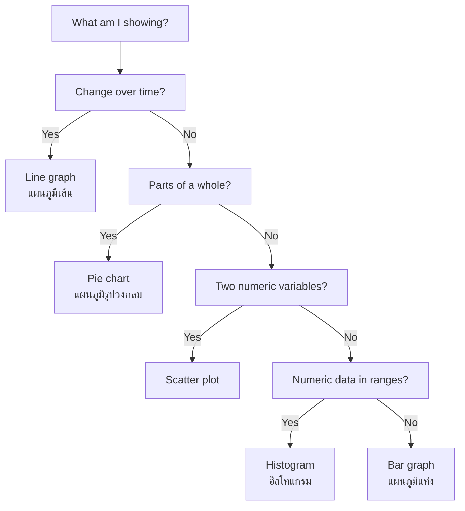

---
tags:
  - mathematics
  - cheatsheet
  - statistics
  - probability
level: "Reading the world"
sources:
  - "[[Fundamental/18_Statistics_Data_Handling]]"
  - "[[Fundamental/19_Probability]]"
  - "[[Advance/17_Probability]]"
  - "[[Advance/19_Statistics]]"
created: 2026-10-02
---

# Data, Probability & Statistics — Cheat Sheet

> The rulebook for turning raw numbers into decisions: collect data, describe it, then quantify uncertainty.

---

## 1 | Data Types & Collection (ข้อมูลและการเก็บรวบรวมข้อมูล)

**Rule 1.1: Classify data before choosing any method or graph.**

| Type | Subtype | Meaning | Example |
|---|---|---|---|
| Qualitative | : categories, no arithmetic | Names or labels | Favorite color, blood type |
| Quantitative | Discrete: countable whole numbers | Counts | Number of students |
| Quantitative | Continuous: any value in a range | Measurements | Height, temperature |

*When to use:* Discrete data suits bar graphs and frequency tables (ตารางแจกแจงควำถี่); continuous data suits histograms (ฮิสโทแกรม) and line graphs (แผนภูมิเส้น).

**Rule 1.2: Data collection (การเก็บรวบรวมข้อมูล) methods:**

| Method | Best for | Watch out for |
|---|---|---|
| Census: ask everyone | Small populations | Costly, slow |
| Survey/questionnaire | Opinions, large groups | Wording bias |
| Experiment | Cause-and-effect | Control conditions |
| Observation | Natural behavior | Observer bias |

*When to use:* Pick sampling over a census when the population (ประชากร) is large; the sample (กลุ่มตัวอย่าง) must be representative or results are biased.

**Rule 1.3: Sampling methods (advanced):** simple random (every member equally likely), stratified (proportional slices of subgroups), systematic (every $k$-th member), cluster (random whole groups).

*When to use:* Stratified when subgroups differ; cluster when the population is geographically spread.

---

## 2 | Graph Choice (แผนภูมิ)

**Rule 2.1: Match the graph to the question.**

| Graph | Thai | Best for | Example |
|---|---|---|---|
| Pictograph | แผนภูมิรูปภาพ | Simple counts, young audiences | 😊😊😊 = 3 students |
| Bar graph | แผนภูมิแท่ง | Comparing categories | Fruit sales by type |
| Histogram | ฮิสโทแกรม | Distribution of grouped numerical data | Test score ranges |
| Line graph | แผนภูมิเส้น | Trends over time | Temperature over a week |
| Pie chart | แผนภูมิรูปวงกลม | Parts of a whole (%) | Budget allocation |
| Scatter plot | : paired $(x, y)$ points | Correlation between two variables | Study hours vs score |
| Box plot | : built from quartiles (ควอร์ไทล์) | Spread, skew, outliers | Comparing two classes |

*When to use:* Bar for categories with gaps between bars; histogram for continuous ranges with touching bars.

**Rule 2.2: Reading graphs honestly.** Beware cherry-picked data, truncated/exaggerated axes, and small samples. Correlation ≠ causation (ควำสัมพันธ์ไม่ใช่สาเหตุ).

*When to use:* Every time you interpret someone else's chart.

---

## 3 | Central Tendency & Spread (ค่าเฉลี่ย มัธยฐาน ฐานนิยม พิสัย)

**Rule 3.1: Mean (ค่าเฉลี่ย):**

$$\bar{x} = \frac{\sum x_i}{n}$$

*Example:* $\{3, 7, 7, 8, 10\}$: $\bar{x} = (3+7+7+8+10)/5 = 35/5 = 7$.
*When to use:* Symmetric data with no outliers.

**Rule 3.2: Median (มัธยฐาน):** sort the data; take the middle value (or average the two middle values if $n$ is even).

*Example:* Sorted $\{3, 7, 7, 8, 10\}$: median $= 7$.
*When to use:* Skewed data or data with outliers: the median resists extreme values.

**Rule 3.3: Mode (ฐานนิยม):** the most frequent value.

*Example:* $\{3, 7, 7, 8, 10\}$: mode $= 7$ (appears twice).
*When to use:* Categorical data ("most popular color").

**Rule 3.4: Range (พิสัย):**

$$\text{Range} = \max - \min$$

*Example:* $10 - 3 = 7$.
*When to use:* Quick, rough measure of spread only.

**Rule 3.5: Choosing the measure:**

| Data situation | Best measure |
|---|---|
| Symmetric, no outliers | Mean |
| Outliers or skew | Median |
| Categorical | Mode |

**Rule 3.6: Missing-value trick:** if the mean of $n$ numbers is known, total sum $= n \times \bar{x}$.

*Example:* Mean of 5 numbers is 12; four are 10, 11, 13, 14. Fifth $= 5 \times 12 - 48 = 12$.
*When to use:* Any "find the missing score" problem.

**Rule 3.7: Grouped data:** compute the mean from a frequency table using class midpoints: $\bar{x} = \frac{\sum f_i m_i}{\sum f_i}$ where $m_i$ is each class midpoint.

*Example:* Scores 72 (×2), 78 (×1), 85 (×3), 90 (×1): $\bar{x} = (144 + 78 + 255 + 90)/7 = 567/7 = 81$.
*When to use:* Data already binned into a frequency table or histogram.

---

## 4 | Variance & Standard Deviation (ควำแปรปรวนและส่วนเบี่ยงเบนมาตรฐาน)

**Rule 4.1: Sample variance and standard deviation:**

$$s^2 = \frac{\sum (x_i - \bar{x})^2}{n - 1}, \qquad s = \sqrt{s^2}$$

For a population, divide by $N$ instead and write $\sigma^2$, $\sigma$.

*Example:* $\{4, 8, 6, 10, 2\}$: $\bar{x} = 30/5 = 6$. Deviations: $-2, 2, 0, 4, -4$; squared: $4, 4, 0, 16, 16$; sum $= 40$. $s^2 = 40/4 = 10$, $s = \sqrt{10} \approx 3.16$.
*When to use:* Measuring typical distance from the mean; comparing consistency of two data sets.

**Step-algorithm:** (1) find $\bar{x}$; (2) subtract $\bar{x}$ from each value; (3) square each deviation; (4) sum; (5) divide by $n-1$ (sample) or $n$ (population); (6) square root for $s$.

**Rule 4.2: Coefficient of variation:**

$$CV = \frac{s}{\bar{x}} \times 100\%$$

*Example:* $s = 3.16$, $\bar{x} = 6$: $CV \approx 52.7\%$.
*When to use:* Comparing spread across data sets with different units or means.

---

## 5 | Quartiles & Box Plots (ควอร์ไทล์)

**Rule 5.1: Quartiles split sorted data into four equal parts:**

| Measure | Position |
|---|---|
| $Q_1$ | 25th percentile |
| $Q_2$ | 50th percentile (= median) |
| $Q_3$ | 75th percentile |
| IQR | $Q_3 - Q_1$ |

**Rule 5.2: Outlier fences:** a value is an outlier if it lies below $Q_1 - 1.5 \times \text{IQR}$ or above $Q_3 + 1.5 \times \text{IQR}$.

*Example:* $Q_1 = 20$, $Q_3 = 40$: IQR $= 20$; fences at $20 - 30 = -10$ and $40 + 30 = 70$; any value above 70 is an outlier.
*When to use:* Drawing box plots; screening data for extremes.

---

## 6 | Normal Distribution & z-Scores

**Rule 6.1: Empirical rule (68-95-99.7):** for a normal distribution with mean $\mu$ and standard deviation $\sigma$:

| Within | Share of data |
|---|---|
| $\mu \pm 1\sigma$ | about 68% |
| $\mu \pm 2\sigma$ | about 95% |
| $\mu \pm 3\sigma$ | about 99.7% |

*Example:* $\mu = 100$, $\sigma = 15$: about 68% of values lie in $[85, 115]$.
*When to use:* Quick estimates without tables, and spotting unusual values.

**Rule 6.2: z-score (standardized value):**

$$z = \frac{x - \mu}{\sigma}$$

*Example:* $x = 53$, $\mu = 50$, $\sigma = 2$: $z = 1.5$, i.e. 1.5 standard deviations above the mean.
*When to use:* Comparing scores from different scales; looking up probabilities in the standard normal table.

**Rule 6.3: Central Limit Theorem:** for samples of size $n$ (typically $n \geq 30$) from a population with mean $\mu$ and SD $\sigma$:

$$\bar{X} \sim N\left(\mu, \frac{\sigma^2}{n}\right), \qquad \sigma_{\bar{x}} = \frac{\sigma}{\sqrt{n}}$$

*Example:* $\mu = 50$, $\sigma = 10$, $n = 25$: $\sigma_{\bar{x}} = 10/5 = 2$. $P(\bar{X} > 53)$: $z = (53-50)/2 = 1.5$, $P = 1 - 0.9332 = 0.0668$.
*When to use:* Any probability question about a sample mean.

---

## 7 | Correlation & Regression (สหสัมพันธ์และการถดถอย)

**Rule 7.1: Pearson correlation coefficient:**

$$r = \frac{n\sum xy - \sum x \sum y}{\sqrt{[n\sum x^2 - (\sum x)^2][n\sum y^2 - (\sum y)^2]}}$$

| $r$ | Meaning |
|---|---|
| $+1$ | Perfect positive |
| $0 < r < 1$ | Positive correlation |
| $0$ | No linear correlation |
| $-1 < r < 0$ | Negative correlation |
| $-1$ | Perfect negative |

*Example:* $n=10$, $\sum x = 50$, $\sum y = 80$, $\sum xy = 420$, $\sum x^2 = 300$, $\sum y^2 = 700$: $r = 200/\sqrt{500 \times 600} \approx 0.365$ (weak positive).
*When to use:* Judging the strength/direction of a linear relationship from a scatter plot.

**Rule 7.2: Least squares regression line:**

$$\hat{y} = a + bx, \qquad b = \frac{n\sum xy - \sum x \sum y}{n\sum x^2 - (\sum x)^2}, \qquad a = \bar{y} - b\bar{x}$$

*Example:* From the data above: $b = 200/500 = 0.4$, $a = 8 - 0.4(5) = 6$, so $\hat{y} = 6 + 0.4x$.
*When to use:* Predicting $y$ from $x$; $r^2$ gives the proportion of variation in $y$ explained by $x$.

---

## 8 | Counting Rules (หลักการนับ)

**Rule 8.1: Factorial (แฟกทอเรียล):** $n! = n \times (n-1) \times \cdots \times 2 \times 1$, with $0! = 1$.

*Example:* $5! = 120$.
*When to use:* Building blocks of every counting formula below.

**Rule 8.2: Multiplication rule:** if task 1 can be done in $m$ ways and task 2 in $n$ ways, both together in $m \times n$ ways.

*Example:* 3 shirts × 4 pants $= 12$ outfits.
*When to use:* Sequential independent choices ("and then").

**Rule 8.3: Permutation (การเรียงสับเปลี่ยน) : order matters:**

$$P(n, r) = \frac{n!}{(n-r)!}$$

*Example:* 5 people in 3 chairs: $P(5,3) = 5!/2! = 60$. President/secretary from 10: $P(10,2) = 90$.
*When to use:* Arrangements, rankings, positions with distinct roles.

**Rule 8.4: Combination (การจัดหมู่) : order does NOT matter:**

$$C(n, r) = \binom{n}{r} = \frac{n!}{r!(n-r)!}$$

*Example:* Committees of 4 from 10: $\binom{10}{4} = 210$. Choosing 3 students from 10: $\binom{10}{3} = 120$.
*When to use:* Selections, teams, hands of cards, lottery draws.

**Rule 8.5: Repetition allowed:** $n^r$ ways to fill $r$ slots from $n$ options.

*Example:* 3-digit codes from digits 0-9: $10^3 = 1000$.
*When to use:* Passwords, codes, dice rolled repeatedly.

```mermaid
flowchart TD
    START["Counting problem"] --> Q1["Does order matter?"]
    Q1 -->|No| COMB["Combination\nC&#40;n,r&#41; = n! / r!&#40;n-r&#41;!"]
    Q1 -->|Yes| Q2["All items used?"]
    Q2 -->|Yes| PERMALL["Full permutation\nn!"]
    Q2 -->|No| Q3["Repetition allowed?"]
    Q3 -->|Yes| REP["n^r"]
    Q3 -->|No| PERMPART["Partial permutation\nP&#40;n,r&#41; = n! / &#40;n-r&#41;!"]
```

*When to use:* Any "how many ways..." question: run this flow first.

---

## 9 | Probability Basics (ควำน่าจะเป็น)

**Rule 9.1: Classical/theoretical probability (ควำน่าจะเป็นเชิงทฤษฎี):**

$$P(A) = \frac{n(A)}{n(S)} = \frac{\text{favorable outcomes}}{\text{total outcomes}}$$

where $S$ is the sample space (แซมเปิลสเปซ / ปริภูมิตัวอย่าง) and $A$ an event (เหตุการณ์).

*Example:* Fair die: $P(4) = 1/6$; $P(\text{even}) = 3/6 = 1/2$. Bag with 5 red, 3 blue: $P(\text{red}) = 5/8 = 0.625$.
*When to use:* Equally likely outcomes (dice, cards, coins, fair draws).

**Rule 9.2: Probability properties:**

| Property | Formula |
|---|---|
| Bounds | $0 \leq P(A) \leq 1$ |
| Whole sample space | $P(S) = 1$ |
| Impossible event (เหตุการณ์ที่เป็นไปไม่ได้) | $P(\emptyset) = 0$ |
| Certain event (เหตุการณ์ที่แน่นอน) | $P = 1$ |

*When to use:* Sanity-checking every answer: a probability outside $[0,1]$ is wrong.

**Rule 9.3: Complement rule:**

$$P(A') = 1 - P(A)$$

*Example:* $P(\text{not a 6}) = 1 - 1/6 = 5/6$. $P(\text{rain}) = 0.3 \Rightarrow P(\text{no rain}) = 0.7$.
*When to use:* "At least one" problems: $P(\text{at least one}) = 1 - P(\text{none})$.

**Rule 9.4: Common sample spaces:**

| Experiment | $S$ | $n(S)$ |
|---|---|---|
| One coin | {H, T} | 2 |
| Two coins | {HH, HT, TH, TT} | 4 |
| One die | {1, 2, 3, 4, 5, 6} | 6 |
| Two dice | ordered pairs | 36 |

*When to use:* Write $S$ first, then count favorable outcomes.

**Rule 9.5: Experimental probability (ควำน่าจะเป็นเชิงการทดลอง):** $P(A) \approx \frac{\text{times } A \text{ occurred}}{\text{total trials}}$; it approaches the theoretical value as trials increase.

*Example:* 30 heads in 50 flips: experimental $P(H) = 0.6$ vs theoretical $0.5$.
*When to use:* When outcomes are not equally likely or unknown; estimate from data.

---

## 10 | Probability Rules (กฎควำน่าจะเป็น)

**Rule 10.1: Addition rule ("OR"):**

$$P(A \cup B) = P(A) + P(B) - P(A \cap B)$$

If mutually exclusive (เหตุการณ์ไม่เกิดร่วม, $A \cap B = \emptyset$): $P(A \cup B) = P(A) + P(B)$.

*Example:* Deck of 52: $P(\text{king or heart}) = 4/52 + 13/52 - 1/52 = 16/52 = 4/13$.
*When to use:* "Either event happens" questions; subtract the overlap unless events cannot occur together.

**Rule 10.2: Multiplication rule ("AND"), independent events (เหตุการณ์อิสระ):**

$$P(A \cap B) = P(A) \times P(B)$$

*Example:* Coin and die: $P(H \text{ and } 6) = 1/2 \times 1/6 = 1/12$.
*When to use:* Successive trials that do not affect each other (with replacement, separate devices).

**Rule 10.3: Multiplication rule, dependent events:**

$$P(A \cap B) = P(B) \cdot P(A|B)$$

*Example:* Bag: 4 red, 6 blue, draw two without replacement: $P(\text{both red}) = \frac{4}{10} \times \frac{3}{9} = \frac{2}{15}$.
*When to use:* Draws without replacement: the first outcome changes the second denominator.

**Rule 10.4: Conditional probability (ควำน่าจะเป็นแบบมีเงื่อนไข):**

$$P(A|B) = \frac{P(A \cap B)}{P(B)}, \qquad P(B) > 0$$

*Example:* $P(A) = 0.4$, $P(B) = 0.5$, $P(A \cup B) = 0.7$: $P(A \cap B) = 0.4 + 0.5 - 0.7 = 0.2$, so $P(A|B) = 0.2/0.5 = 0.4$.
*When to use:* "Given that B happened" wording; shrink the sample space to $B$.

**Rule 10.5: Independence test:** $A$ and $B$ are independent iff $P(A|B) = P(A)$, equivalently $P(A \cap B) = P(A)P(B)$.

*When to use:* Deciding between Rule 10.2 and Rule 10.3.

**Rule 10.6: Law of total probability:** if $B_1, ..., B_n$ partition $S$:

$$P(A) = \sum_{i=1}^{n} P(B_i) \cdot P(A|B_i)$$

*When to use:* Event $A$ can happen through several distinct routes.

**Rule 10.7: Bayes' Theorem (ทฤษฎีบทเบส์) : update beliefs with evidence:**

$$P(B_j|A) = \frac{P(B_j) \cdot P(A|B_j)}{\sum_{i=1}^{n} P(B_i) \cdot P(A|B_i)}$$

*Example:* Disease in 1% of population; test 95% accurate, 5% false positive:
$$P(D|+) = \frac{(0.01)(0.95)}{(0.01)(0.95) + (0.99)(0.05)} = \frac{0.0095}{0.059} \approx 0.161$$
Only about 16% chance of disease given a positive test.
*When to use:* "Given the result, which cause is responsible?" problems.

**Rule 10.8: Expected value:**

$$E(X) = \sum x_i \, P(x_i)$$

*Example:* Game: win 10 with $P = 0.2$, lose 2 with $P = 0.8$: $E = 10(0.2) + (-2)(0.8) = 0.4$: favorable on average.
*When to use:* Long-run average payoff; deciding whether a bet/game is fair ($E = 0$).

**Rule 10.9: Binomial-style counting shortcut:** exactly $k$ successes in $n$ independent trials with success probability $p$:

$$P(X = k) = \binom{n}{k} p^k (1-p)^{n-k}$$

*Example:* Exactly 2 heads in 3 fair coin tosses: $\binom{3}{2}(0.5)^2(0.5)^1 = 3 \times 0.125 = 0.375$.
*When to use:* Repeated identical trials with only success/failure outcomes.

---

## 11 | Tree Diagrams (แผนภาพต้นไม้) : Step Rules

**Step-algorithm for compound events (เหตุการณ์ประกอบ):**

1. Draw one branch per stage of the experiment, left to right.
2. Label each branch with its probability; probabilities from one node sum to 1.
3. Update probabilities along the way for dependent stages (without replacement).
4. Multiply probabilities along a path to get that outcome's probability ("AND").
5. Add the probabilities of all paths that satisfy the event ("OR").

*Example:* Bag 4 red / 6 blue, two draws without replacement, P(both red): path $= \frac{4}{10} \times \frac{3}{9} = \frac{2}{15}$.
*When to use:* Two- or three-stage experiments; visualizing independent vs dependent events and conditional probability.

---

## 12 | Hypothesis Testing (การทดสอบสมมติฐาน)

**Step-algorithm:**

1. State $H_0$ (สมมุติฐานว่าง) and $H_1$ (สมมุติฐานทางเลือก).
2. Choose significance level $\alpha$ (typically 0.05).
3. Calculate the test statistic.
4. Find the p-value (ค่า p) or critical value.
5. Reject $H_0$ if p-value $< \alpha$.

**Rule 12.1: z-test for a population mean ($\sigma$ known or $n$ large):**

$$z = \frac{\bar{x} - \mu_0}{\sigma / \sqrt{n}}$$

*Example:* Claim $\mu = 1000$ h; sample $n = 36$, $\bar{x} = 980$, $s = 60$: $z = \frac{980-1000}{60/6} = -2$; p-value $= P(Z < -2) = 0.0228 < 0.05$: reject $H_0$; evidence the mean is below 1000 h.
*When to use:* Testing a claim about a mean with sample data.

---

## 13 | Master Formula Card

| Topic | Formula |
|---|---|
| Mean | $\bar{x} = \frac{\sum x_i}{n}$ |
| Sample variance | $s^2 = \frac{\sum (x_i - \bar{x})^2}{n-1}$ |
| CV | $CV = \frac{s}{\bar{x}} \times 100\%$ |
| IQR | $Q_3 - Q_1$; fences at $Q_1 - 1.5\,\text{IQR}$, $Q_3 + 1.5\,\text{IQR}$ |
| z-score | $z = \frac{x - \mu}{\sigma}$ |
| Permutation | $P(n,r) = \frac{n!}{(n-r)!}$ |
| Combination | $C(n,r) = \frac{n!}{r!(n-r)!}$ |
| Repetition | $n^r$ |
| Basic probability | $P(A) = \frac{n(A)}{n(S)}$ |
| Complement | $P(A') = 1 - P(A)$ |
| Addition | $P(A \cup B) = P(A) + P(B) - P(A \cap B)$ |
| Multiplication | $P(A \cap B) = P(A)P(B)$ if independent |
| Conditional | $P(A\|B) = \frac{P(A \cap B)}{P(B)}$ |
| Bayes | $P(B\|A) = \frac{P(B)P(A\|B)}{P(A)}$ |
| Expected value | $E(X) = \sum x_i P(x_i)$ |
| Binomial | $P(X=k) = \binom{n}{k} p^k (1-p)^{n-k}$ |
| Regression | $\hat{y} = a + bx$ |
| z-test | $z = \frac{\bar{x} - \mu_0}{\sigma/\sqrt{n}}$ |

*When to use:* Exam warm-up: cover the right column and recall each formula.

---

## Chain Navigation

⬅ [[03_Geometry_and_Measurement]] · ➡ [[05_Sets_Logic_and_Processes]]
