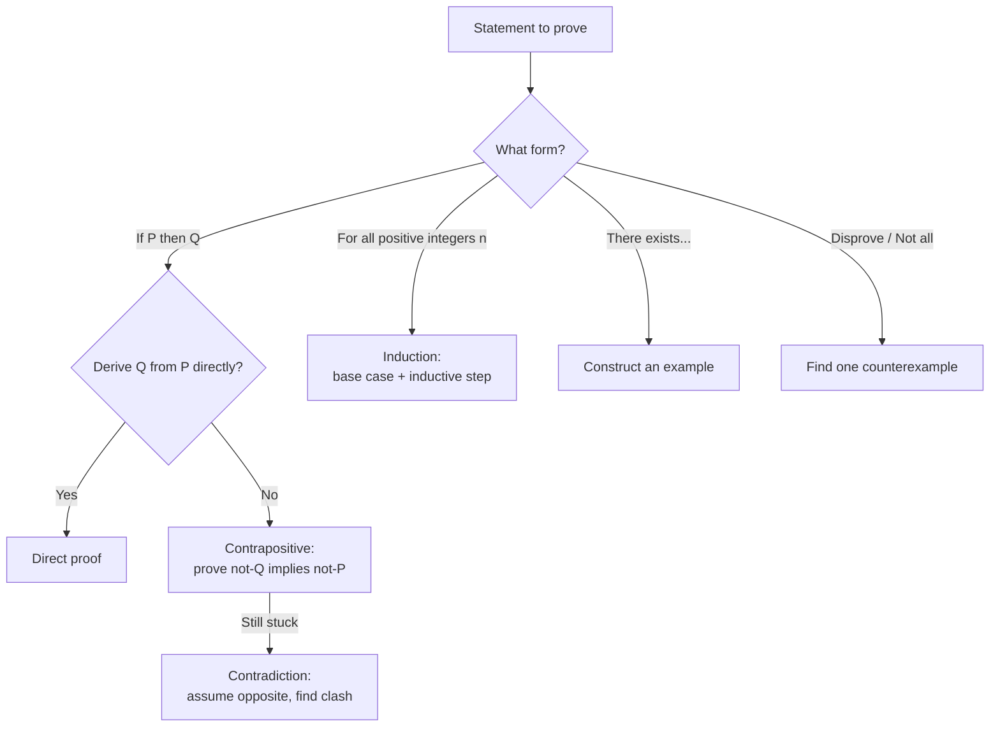

---
tags:
  - mathematics
  - cheatsheet
  - sets
  - logic
level: "The rulebook about rulebooks"
sources: ["[[Fundamental/17_Sets]]", "[[Fundamental/20_Mathematical_Processes]]", "[[Advance/01_Sets_and_Logic]]", "[[Advance/21_Mathematical_Reasoning]]"]
created: 2026-10-02
---

# Sets, Logic & Processes — Cheat Sheet

> The rulebook about rulebooks: how collections are described, how statements are reasoned about, and how problems get solved.

---

## 1 | Set Basics & Notation (เซต)

| Notation | Meaning | Example |
|---|---|---|
| $a \in A$ | $a$ is an element (สมาชิก) of $A$ | $3 \in \{1,2,3\}$ |
| $a \notin A$ | $a$ is NOT an element of $A$ | $5 \notin \{1,2,3\}$ |
| $A \subseteq B$ | $A$ is a subset (สับเซต) of $B$: every element of $A$ is in $B$ | $\{1,2\} \subseteq \{1,2,3\}$ |
| $A \subset B$ | Proper subset: $A \subseteq B$ and $A \neq B$ | $\{1,2\} \subset \{1,2,3\}$ |
| $A = B$ | Equal sets: $A \subseteq B$ and $B \subseteq A$ | $\{1,2\} = \{2,1\}$ |
| $\emptyset$ | Empty set (เซตว่าง): no elements | $\emptyset \subseteq A$ always |
| $U$ | Universal set (เอกภพสัมพัทธ์): the universe of discourse | $U = \{1,\dots,8\}$ |
| $n(A)$ | Cardinality (จำนวนสมาชิก): number of elements | $n(\{a,b,c\}) = 3$ |

**Two ways to write a set:**
- Roster form (การเขียนแบบแจกแจงสมาชิก): $A = \{1, 2, 3, 4, 5\}$
- Set-builder form (การเขียนแบบบอกเงื่อนไข): $A = \{x \mid x \in \mathbb{N},\ 1 \leq x \leq 5\}$

**Number sets hierarchy:** $\mathbb{N} \subset \mathbb{Z} \subset \mathbb{Q} \subset \mathbb{R}$

| Set | Contains | Example |
|---|---|---|
| $\mathbb{N}$ | Natural numbers | $1, 2, 3, \dots$ |
| $\mathbb{Z}$ | Integers | $\dots, -1, 0, 1, \dots$ |
| $\mathbb{Q}$ | Rationals ($a/b$, $b \neq 0$) | $\tfrac{1}{2},\ -3$ |
| $\mathbb{R}$ | Reals (all decimals) | $\sqrt{2},\ \pi$ |

*When to use:* Set-builder form when a set is large or infinite; roster form when it is small and finite.

**Cartesian product (ผลคูณคาร์ทีเซียน):** $A \times B = \{(a,b) \mid a \in A,\ b \in B\}$, and $n(A \times B) = n(A) \cdot n(B)$.
- Example: $A = \{1,2\}$, $B = \{x,y,z\}$: $n(A \times B) = 2 \times 3 = 6$.

*When to use:* Building sample spaces, coordinates, and relations.

---

## 2 | Set Operations (การดำเนินการของเซต)

Let $U = \{1,\dots,8\}$, $A = \{2,4,6,8\}$, $B = \{6,7,8\}$.

| Operation | Symbol | Rule | Example |
|---|---|---|---|
| Union (ยูเนียน) | $A \cup B$ | In $A$ OR $B$ OR both | $\{2,4,6,7,8\}$ |
| Intersection (อินเตอร์เซกชัน) | $A \cap B$ | In BOTH $A$ AND $B$ | $\{6,8\}$ |
| Complement (คอมพลีเมนต์) | $A'$ | In $U$ but NOT in $A$ | $\{1,3,5,7\}$ |
| Difference (ผลต่าง) | $A - B$ | In $A$ but NOT in $B$ | $\{2,4\}$ |

Core algebra rules:
- $A \cap B = \emptyset \iff$ $A$, $B$ are disjoint.
- $A - B = A \cap B'$.
- $A \cup B = B \cup A$ and $A \cap B = B \cap A$ (commutative).
- $\emptyset \subseteq A \subseteq U$ for every $A$.

*When to use:* "At least one" → union; "both" → intersection; "neither" → $(A \cup B)'$; "exactly one of" → difference.

---

## 3 | Venn Diagram Regions (แผนภาพเวนน์)

Venn diagrams cannot be drawn natively in tables of circles, so read regions by name. For two sets inside $U$:

| Region | Elements | Count formula |
|---|---|---|
| Only $A$ | In $A$, not $B$ | $n(A) - n(A \cap B)$ |
| Only $B$ | In $B$, not $A$ | $n(B) - n(A \cap B)$ |
| Overlap | In both | $n(A \cap B)$ |
| Outside | In neither | $n(U) - n(A \cup B)$ |

Reading rules:
- Shade $A \cup B$: all of $A$ plus all of $B$.
- Shade $A \cap B$: the overlap only.
- Shade $A'$: everything outside circle $A$ (inside $U$).
- Shade $A - B$: circle $A$ with the overlap removed.

**Example:** Of 100 students, 45 play football, 35 basketball, 20 both. Neither = $100 - (45 + 35 - 20) = 40$.

*When to use:* Survey/counting word problems; fill the innermost region (all-three overlap) first, then work outward.

---

## 4 | Cardinality & Inclusion-Exclusion (จำนวนสมาชิก)

Two sets:
$$n(A \cup B) = n(A) + n(B) - n(A \cap B)$$

Three sets:
$$n(A \cup B \cup C) = n(A) + n(B) + n(C) - n(A \cap B) - n(A \cap C) - n(B \cap C) + n(A \cap B \cap C)$$

**Power set (เพาเวอร์เซต):** $P(A)$ = set of all subsets of $A$. If $n(A) = k$ then
$$n(P(A)) = 2^k$$

**Example:** $A = \{1,2\}$: $P(A) = \{\emptyset, \{1\}, \{2\}, \{1,2\}\}$, so $n(P(A)) = 2^2 = 4$. If $n(A) = 5$: $2^5 = 32$ subsets.

*When to use:* Inclusion-exclusion for "how many in at least one group"; $2^k$ for any "how many subsets" question.

---

## 5 | Logic Connectives & Truth Table (ประพจน์ · ตารางค่าควำจริง)

A proposition (ประพจน์) is a statement that is either true (T) or false (F).

Full truth table:

| $p$ | $q$ | $p \land q$ (AND) | $p \lor q$ (OR) | $\sim p$ (NOT) | $p \to q$ (implies) | $p \leftrightarrow q$ (iff) |
|---|---|---|---|---|---|---|
| T | T | T | T | F | T | T |
| T | F | F | T | F | **F** | F |
| F | T | F | T | T | T | F |
| F | F | F | F | T | T | T |

Rules:
- $p \land q$ true only when BOTH true.
- $p \lor q$ true when AT LEAST ONE true.
- $p \to q$ false ONLY when $p$ is T and $q$ is F (the key insight).
- $p \leftrightarrow q$ true when $p$ and $q$ have the SAME truth value.
- Equivalence: $p \to q \equiv \sim p \lor q$.

**Example:** For $(p \to q) \land \sim p$: rows give F, F, T, T (not a tautology).

*When to use:* Translate "if...then", "and", "or", "if and only if" into symbols before evaluating anything.

---

## 6 | Converse, Inverse, Contrapositive (ข้อควำตรงกันข้าม)

Given $p \to q$:

| Form | Statement | Equivalent to $p \to q$? |
|---|---|---|
| Original | $p \to q$ | - |
| Converse | $q \to p$ | NO |
| Inverse | $\sim p \to \sim q$ | NO |
| Contrapositive (ข้อควำตรงกันข้าม) | $\sim q \to \sim p$ | **YES** |

Extra: converse $\equiv$ inverse (they are equivalent to each other, but not to the original).

**Example:** "If it rains, the ground is wet." Contrapositive: "If the ground is not wet, it did not rain" (valid). Converse: "If the ground is wet, it rained" (could be a sprinkler: invalid).

*When to use:* To prove $p \to q$, you may prove the contrapositive instead; never assume the converse is true.

---

## 7 | Negation, De Morgan & Quantifiers (ตัวบ่งปริมาณ)

**De Morgan's Laws, logic version:**
$$\sim(p \land q) \equiv \sim p \lor \sim q$$
$$\sim(p \lor q) \equiv \sim p \land \sim q$$

**De Morgan's Laws, set version:**
$$(A \cap B)' = A' \cup B'$$
$$(A \cup B)' = A' \cap B'$$

Negation of implication: $\sim(p \to q) \equiv p \land \sim q$.

**Quantifiers (ตัวบ่งปริมาณ):**

| Statement | Negation |
|---|---|
| $\forall x, P(x)$ "for all" | $\exists x, \sim P(x)$ |
| $\exists x, P(x)$ "there exists" | $\forall x, \sim P(x)$ |

**Example:** Negate "Every even number is divisible by 4": "There exists an even number not divisible by 4" (e.g. 6).

*When to use:* Flip the quantifier AND negate the predicate; negation of "all are" is "at least one is not".

**Tautology vs contradiction:**

| Term | Definition | Example |
|---|---|---|
| Tautology (สัจนิรันดร์) | Always true | $p \lor \sim p$ |
| Contradiction (ข้อขัดแย้ง) | Always false | $p \land \sim p$ |
| Equivalence (สมมูล, $\equiv$) | Identical truth tables | $p \to q \equiv \sim q \to \sim p$ |

*When to use:* Check an argument's logical form by building its truth table: tautology → valid.

---

## 8 | Valid Argument Forms (การให้เหตุผล)

| Form | Premises | Conclusion |
|---|---|---|
| Modus ponens | $p \to q$, $p$ | $\therefore q$ |
| Modus tollens | $p \to q$, $\sim q$ | $\therefore \sim p$ |

**Example (modus tollens):** "If it rains, the ground is wet. The ground is not wet. Therefore it did not rain."

Invalid patterns to reject:
- Affirming the consequent: $p \to q$, $q$ does NOT give $p$.
- Denying the antecedent: $p \to q$, $\sim p$ does NOT give $\sim q$.

Reasoning types:
- Inductive (อุปนัย): pattern → generalization. Example: $1+3=4$, $1+3+5=9$, $1+3+5+7=16$; conjecture: sum of first $n$ odds $= n^2$.
- Deductive (นิรนัย): general rule → specific case. Example: all squares have 4 right angles; X is a square; so X has 4 right angles.

*When to use:* Check an argument's shape first; induction gives conjectures, deduction gives proofs.

---

## 9 | Proof Methods (การพิสูจน์)

Selection guide:

| Method | Step-algorithm | Tiny example |
|---|---|---|
| Direct proof (การพิสูจน์ตรง) | 1) Assume $p$. 2) Apply definitions/algebra. 3) Arrive at $q$. | $n$ odd $\Rightarrow n = 2k+1 \Rightarrow n^2 = 2(2k^2+2k)+1$: odd. $\blacksquare$ |
| Contrapositive (พิสูจน์อ้อม) | 1) Rewrite as $\sim q \to \sim p$. 2) Assume $\sim q$. 3) Derive $\sim p$. | "If $n^2$ even then $n$ even": prove "if $n$ odd then $n^2$ odd". $\blacksquare$ |
| Contradiction (การขัดแย้ง) | 1) Assume negation of goal. 2) Derive logically. 3) Hit a contradiction. | Assume greatest integer $N$ exists; then $N+1 > N$. Contradiction. $\blacksquare$ |
| Induction (อุปนัยเชิงคณิตศาสตร์) | 1) Base: show $P(n_0)$. 2) Assume $P(k)$. 3) Show $P(k+1)$. | $1+3+\cdots+(2n-1) = n^2$: base $1=1^2$; step $k^2 + (2k+1) = (k+1)^2$. $\blacksquare$ |
| Counterexample (ตัวอย่างค้าน) | Find ONE case where "for all $x$, $P(x)$" fails. | $n^2+n+41$ prime? $n=41$: $41 \times 43$. No. |

Vocabulary: axiom (สัจพจน์) assumed true; theorem (ทฤษฎีบท) proven; lemma (บทแทรก) helper result; corollary (บทสืบเนื่อง) direct consequence.

Biconditional $p \leftrightarrow q$: prove BOTH directions ($\Rightarrow$ and $\Leftarrow$), often direct one way and contrapositive the other.

*When to use:* Direct first; if the hypothesis is a negation ("$n$ is not..."), use contrapositive; if stuck everywhere, use contradiction; "for all $n$" over integers → induction; to disprove → counterexample.

---

## 10 | Problem-Solving Process (กระบวนการทางคณิตศาสตร์)

**Polya's 4 steps (ขั้นตอนการแก้ปัญหาของโพลยา):**

| Step | Thai | Actions |
|---|---|---|
| 1. Understand | ทำควำเข้าใจปัญหา | Identify given vs asked; restate in your own words |
| 2. Plan | วางแผนการแก้ปัญหา | Pick a strategy (table below) |
| 3. Solve | ดำเนินการตามแผน | Execute; show every step |
| 4. Check | ตรวจสอบผล | Does the answer make sense? Verify another way |

**Strategy picker:**

| Strategy | When to use | Example trigger |
|---|---|---|
| Draw a picture | Spatial/geometric | "A rectangular garden..." |
| Make a table | Patterns, organized listing | "How many handshakes?" |
| Work backward | Known end, unknown start | "After spending half, I have..." |
| Guess and check | Limited possibilities | "Two numbers whose sum is..." |
| Write an equation | Algebraic relationships | "Three more than twice a number..." |
| Look for a pattern | Sequences, predictions | "What is the 10th term?" |
| Solve a simpler problem | Large/complex scale | Try smaller numbers first |

**Estimation & checking reasonableness:**
1. Round inputs to friendly numbers; compute a ballpark.
2. Check units and magnitude: does the answer fit the context?
3. Verify by a second method (substitute back, reverse the steps).

*When to use:* Every word problem: Understand → Plan → Solve → Check, and never report an answer that fails the ballpark test.

**Communication rule:** show all steps, label variables and units, use proper notation ($=$, $\approx$, $\therefore$, $\because$), state assumptions, end with a clear boxed answer.

**Representations (choose the best one):** concrete objects → pictorial → tabular → graphical → symbolic → verbal. Example for $y = 2x+1$: table $(0,1),(1,3),(2,5)$; graph = line, slope 2; equation $y=2x+1$; words = "output is one more than twice the input".

---

## Chain Navigation

⬅ [[04_Data_Probability_and_Statistics]] · ➡ [[06_Calculus]]
