---
tags:
  - mathematics
  - cheatsheet
  - calculus
level: "Beyond practical: the math of change"
sources: ["[[Advance/14_Limits_and_Continuity]]", "[[Advance/15_Differentiation]]", "[[Advance/16_Integration]]", "[[Advance/23_Differential_Equations]]"]
created: 2026-10-02
---

# Calculus — Cheat Sheet

> *The playbook of change: limits zoom in on the infinitely small, derivatives measure rates, integrals accumulate, and differential equations model it all.*

---

## 1 | Limits & Limit Laws (ลิมิตและกฎของลิมิต)

**Definition:** $\lim_{x \to a} f(x) = L$ means $f(x)$ gets arbitrarily close to $L$ as $x$ approaches $a$ (but $x \neq a$).

**Existence rule (one-sided limits, ลิมิตด้านซ้าย/ด้านขวา):** the limit exists if and only if both sides agree:

$$
\lim_{x \to a^-} f(x) = \lim_{x \to a^+} f(x) = L
$$

Example: for a step function at the jump, left limit $= 1$, right limit $= 3$, so $\lim$ does not exist.
*When to use:* check one-sided limits whenever the formula changes at $x = a$ (piecewise functions, absolute values).

**Limit laws (กฎของลิมิต):** if $\lim f(x)$ and $\lim g(x)$ exist, then:

| Law | Formula |
|---|---|
| Constant | $\lim c = c$ |
| Identity | $\lim_{x \to a} x = a$ |
| Sum / Difference | $\lim[f(x) \pm g(x)] = \lim f(x) \pm \lim g(x)$ |
| Product | $\lim[f(x) \cdot g(x)] = \lim f(x) \cdot \lim g(x)$ |
| Quotient | $\lim \frac{f(x)}{g(x)} = \frac{\lim f(x)}{\lim g(x)}$ if $\lim g(x) \neq 0$ |
| Power | $\lim [f(x)]^n = [\lim f(x)]^n$ |
| Root | $\lim \sqrt[n]{f(x)} = \sqrt[n]{\lim f(x)}$ |

*When to use:* split complicated limits into pieces you can evaluate directly; polynomials always obey these laws.

---

## 2 | Evaluating Limits (การหาค่าลิมิต)

**Indeterminate forms (รูปยังไม่กำหนด):** $0/0$, $\infty/\infty$, $\infty - \infty$ mean "keep working", not "no answer".

| Technique | Signal | Example |
|---|---|---|
| Direct substitution | Polynomial, no division by zero | $\lim_{x \to 2}(3x^2 - 5x + 1) = 12 - 10 + 1 = 3$ |
| Factoring (แยกตัวประกอบ) | $0/0$ with polynomials | $\lim_{x \to 3}\frac{x^2-9}{x-3} = \lim_{x \to 3}(x+3) = 6$ |
| Conjugate (คูณด้วยสังยุค) | $0/0$ with square roots | $\lim_{x \to 0}\frac{\sqrt{x+4}-2}{x} = \lim_{x \to 0}\frac{x}{x(\sqrt{x+4}+2)} = \frac{1}{4}$ |
| Special trig limit | $\sin$ or $\tan$ over $x$ near $0$ | $\lim_{x \to 0}\frac{\sin 5x}{3x} = \frac{5}{3}$ |

*When to use:* always try direct substitution first; $0/0$ tells you which repair tool to pick (factor polynomials, rationalize radicals, match the trig pattern).

**Special trigonometric limits:**

$$
\lim_{\theta \to 0} \frac{\sin\theta}{\theta} = 1 \qquad \lim_{\theta \to 0} \frac{\tan\theta}{\theta} = 1 \qquad \lim_{\theta \to 0} \frac{1 - \cos\theta}{\theta} = 0
$$

**Squeeze theorem (ทฤษฎีบท sandwich):** if $g(x) \leq f(x) \leq h(x)$ near $a$ and $\lim g(x) = \lim h(x) = L$, then $\lim f(x) = L$.
Example: $\cos\theta \leq \frac{\sin\theta}{\theta} \leq 1$ near $0$ proves $\lim_{\theta \to 0}\frac{\sin\theta}{\theta} = 1$.
*When to use:* functions trapped between two easy ones, especially oscillating terms like $\sin(1/x)$.

**Limits at infinity (ลิมิตอนันต์): leading-term analysis for rationals** $\frac{a_n x^n + \cdots}{b_m x^m + \cdots}$:

| Degrees | Limit |
|---|---|
| $n < m$ | $0$ |
| $n = m$ | $\frac{a_n}{b_m}$ |
| $n > m$ | $\pm\infty$ (does not exist) |

Example: $\lim_{x \to \infty}\frac{3x^2 + 2x - 1}{2x^2 - 5} = \frac{3}{2}$, so $y = \frac{3}{2}$ is the horizontal asymptote (เส้น asymptote แนวนอน).
*When to use:* end behavior and horizontal asymptotes; compare top and bottom degrees first.

---

## 3 | Continuity (ควำต่อเนื่อง)

**$f$ is continuous at $x = a$ when all three hold:**

1. $f(a)$ is defined
2. $\lim_{x \to a} f(x)$ exists
3. $\lim_{x \to a} f(x) = f(a)$

Example: make $f(x) = x^2 + 1$ for $x \leq 2$ and $f(x) = 3x + k$ for $x > 2$ continuous. Left limit: $5$. Right limit: $6 + k$. Set $6 + k = 5$, so $k = -1$.
*When to use:* piecewise-continuity problems: equate the two one-sided limits at the boundary.

**Types of discontinuity (จุดไม่ต่อเนื่อง):**

| Type | Failure | Example |
|---|---|---|
| Removable (hole) | Limit exists but $\neq f(a)$, or $f(a)$ undefined | $\frac{x^2-1}{x-1}$ at $x = 1$ |
| Jump | Left and right limits exist but differ | Step functions |
| Infinite | Function blows up to $\pm\infty$ | $\frac{1}{x}$ at $x = 0$ |

**Intermediate Value Theorem (ทฤษฎีบทค่ากลาง):** if $f$ is continuous on $[a,b]$ and $k$ lies between $f(a)$ and $f(b)$, some $c \in (a,b)$ has $f(c) = k$.
Example: $f$ continuous with $f(1) < 0$ and $f(2) > 0$ must cross zero somewhere in $(1,2)$.
*When to use:* proving an equation has a solution: find a sign change on a continuous function.

```mermaid
flowchart TD
    START["Is f&#40;a&#41; defined?"] -->|No| DISC1["Discontinuity at x = a"]
    START -->|Yes| Q2["Does lim x→a f&#40;x&#41; exist?"]
    Q2 -->|No| DISC2["Jump or Infinite\nDiscontinuity"]
    Q2 -->|Yes| Q3["Does lim x→a f&#40;x&#41; = f&#40;a&#41;?"]
    Q3 -->|No| REMOV["Removable\nhole in the graph"]
    Q3 -->|Yes| CONT["Continuous at x = a"]
```

---

## 4 | Derivative Rules (กฎการหาอนุพันธ์)

**Definition as a limit (อนุพันธ์):**

$$
f'(x) = \lim_{h \to 0} \frac{f(x+h) - f(x)}{h}
$$

$f'(a)$ is the slope of the tangent line (เส้นสัมผัส) at $x = a$ and the instantaneous rate of change (อัตราการเปลี่ยนแปลง).

**Tangent line equation:** $y - f(a) = f'(a)(x - a)$.
Example: tangent to $y = x^3 - 2x$ at $x = 1$: $f(1) = -1$, $f'(1) = 3(1)^2 - 2 = 1$, so $y + 1 = 1(x - 1)$, i.e. $y = x - 2$.
*When to use:* any "find the tangent line" problem: compute point and slope, plug into point-slope form.

**Core rules table:**

| Rule | Formula | Example |
|---|---|---|
| Constant | $\frac{d}{dx}[c] = 0$ | $\frac{d}{dx}[7] = 0$ |
| Power | $\frac{d}{dx}[x^n] = nx^{n-1}$ | $\frac{d}{dx}[x^5] = 5x^4$ |
| Constant multiple | $\frac{d}{dx}[kf] = kf'$ | $\frac{d}{dx}[3x^2] = 6x$ |
| Sum / Difference | $(f \pm g)' = f' \pm g'$ | $(5x^3 - 2x^2 + 7x - 3)' = 15x^2 - 4x + 7$ |
| Product (ผลคูณ) | $(fg)' = f'g + fg'$ | $(x^2 \sin x)' = 2x\sin x + x^2\cos x$ |
| Quotient (ผลหาร) | $\left(\frac{f}{g}\right)' = \frac{f'g - fg'}{g^2}$ | $\left(\frac{3x+1}{x^2+2}\right)' = \frac{3(x^2+2) - (3x+1)(2x)}{(x^2+2)^2}$ |
| Chain rule (กฎลูกโซ่) | $\frac{d}{dx}[f(g(x))] = f'(g(x)) \cdot g'(x)$ | $((3x^2+1)^5)' = 5(3x^2+1)^4 \cdot 6x = 30x(3x^2+1)^4$ |

*When to use:* product when factors multiply, quotient when they divide, chain whenever a function sits inside another ("outside derivative times inside derivative").

**Derivatives of common functions:**

| $f(x)$ | $f'(x)$ | $f(x)$ | $f'(x)$ |
|---|---|---|---|
| $e^x$ | $e^x$ | $\sin x$ | $\cos x$ |
| $a^x$ | $a^x \ln a$ | $\cos x$ | $-\sin x$ |
| $\ln x$ | $\frac{1}{x}$ | $\tan x$ | $\sec^2 x$ |
| $\log_a x$ | $\frac{1}{x \ln a}$ | $\cot x$ | $-\csc^2 x$ |
| $\sqrt{x}$ | $\frac{1}{2\sqrt{x}}$ | $\sec x$ | $\sec x \tan x$ |
| $\frac{1}{x}$ | $-\frac{1}{x^2}$ | $\csc x$ | $-\csc x \cot x$ |

Example: $\frac{d}{dx}[2^x] = 2^x \ln 2$. *When to use:* memorize the sign patterns: co-functions ($\cos$, $\cot$, $\csc$) all pick up a minus sign.

---

## 5 | Implicit Differentiation & Higher Derivatives (อนุพันธ์อ้อมและอนุพันธ์อันดับสูง)

**Implicit differentiation steps (อนุพันธ์อ้อม):**

1. Differentiate both sides with respect to $x$, treating $y$ as $y(x)$: every $y$-term picks up a $\frac{dy}{dx}$ factor.
2. Collect all $\frac{dy}{dx}$ terms on one side.
3. Factor out $\frac{dy}{dx}$ and solve.

Example: $x^2 + y^2 = 25$ gives $2x + 2y\frac{dy}{dx} = 0$, so $\frac{dy}{dx} = -\frac{x}{y}$.
Harder: $xy + y^2 = x^3$ gives $y + x\frac{dy}{dx} + 2y\frac{dy}{dx} = 3x^2$, so $\frac{dy}{dx} = \frac{3x^2 - y}{x + 2y}$.
*When to use:* equations where $y$ cannot be isolated (circles, mixed $xy$ terms).

**Higher derivatives:** differentiate repeatedly: $f''(x) = \frac{d^2y}{dx^2}$, $f'''(x) = \frac{d^3y}{dx^3}$, and so on.
Example: $f(x) = x^4$ gives $f' = 4x^3$, $f'' = 12x^2$, $f''' = 24x$.
*When to use:* $f''$ drives concavity and the second derivative test; in physics, position $\to$ velocity $\to$ acceleration.

---

## 6 | Applications of Derivatives (การประยุกต์ของอนุพันธ์)

**Critical points (จุดวิกฤต):** $x = c$ where $f'(c) = 0$ or $f'(c)$ is undefined.

**First Derivative Test:** check the sign of $f'$ around each critical point $c$:

| Sign change of $f'(x)$ at $c$ | Result |
|---|---|
| $+$ to $-$ | Local maximum (ค่าสูงสุด) |
| $-$ to $+$ | Local minimum (ค่าต่ำสุด) |
| No change | Neither (inflection candidate) |

**Second Derivative Test:** evaluate $f''$ at the critical point $c$:

| Value | Result |
|---|---|
| $f''(c) > 0$ | Local minimum (concave up) |
| $f''(c) < 0$ | Local maximum (concave down) |
| $f''(c) = 0$ | Inconclusive: fall back to the First Derivative Test |

Example: $f(x) = x^3 - 3x$. $f' = 3x^2 - 3 = 0$ at $x = \pm 1$. $f'' = 6x$: $f''(1) = 6 > 0$ so $x = 1$ is a local min; $f''(-1) = -6 < 0$ so $x = -1$ is a local max.
*When to use:* second test is faster at isolated critical points; first test always works and handles undefined derivatives.

**Optimization algorithm (ค่าสูงสุด/ค่าต่ำสุด):**

1. Write the objective function (quantity to maximize/minimize).
2. Use the constraint to express it in ONE variable.
3. Differentiate, set to $0$, find critical points.
4. Verify max/min (second derivative test or endpoints).

Example: 40 m of fencing, maximize rectangle area. Constraint $2l + 2w = 40$, so $w = 20 - l$. $A = l(20-l) = 20l - l^2$. $A' = 20 - 2l = 0$ gives $l = 10$, $w = 10$: a square, area $100$. $A'' = -2 < 0$ confirms maximum.
*When to use:* every "largest/smallest/cheapest" word problem.

**Related rates steps (อัตราส่วนที่เกี่ยวข้อง):**

1. Draw and label; list given rates and the unknown rate.
2. Write an equation relating the quantities.
3. Differentiate both sides with respect to $t$ (chain rule).
4. Substitute known values at the instant in question and solve.

Example: balloon radius grows at $2$ cm/s; how fast does volume grow at $r = 5$? $V = \frac{4}{3}\pi r^3$, so $\frac{dV}{dt} = 4\pi r^2 \frac{dr}{dt} = 4\pi(25)(2) = 200\pi$ cm³/s.
*When to use:* two or more quantities changing with time and linked by geometry; substitute values only AFTER differentiating.

---

## 7 | Integral Table (ตารางอินทิกรัล)

An **antiderivative (ฟังก์ชันปริพันธ์)** of $f$ is any $F$ with $F'(x) = f(x)$. The indefinite integral (อินทิกรัลไม่ประจำ) collects them all:

$$
\int f(x)\,dx = F(x) + C
$$

where $C$ is the constant of integration (ค่าคงตัวของการอินทิเกรต): derivatives of constants vanish, so it must come back.

**Basic integration rules (การอินทิเกรต):**

| Integral | Result | Condition |
|---|---|---|
| $\int k\,dx$ | $kx + C$ | constant |
| $\int x^n\,dx$ | $\frac{x^{n+1}}{n+1} + C$ | $n \neq -1$ |
| $\int \frac{1}{x}\,dx$ | $\ln\lvert x\rvert + C$ | the $n = -1$ case |
| $\int e^x\,dx$ | $e^x + C$ | |
| $\int a^x\,dx$ | $\frac{a^x}{\ln a} + C$ | $a > 0$, $a \neq 1$ |
| $\int \sin x\,dx$ | $-\cos x + C$ | |
| $\int \cos x\,dx$ | $\sin x + C$ | |
| $\int \sec^2 x\,dx$ | $\tan x + C$ | |
| $\int (f \pm g)\,dx$ | $\int f\,dx \pm \int g\,dx$ | linearity |
| $\int kf\,dx$ | $k\int f\,dx$ | linearity |

Example: $\int (6x^2 - 4x + 3)\,dx = 2x^3 - 2x^2 + 3x + C$. Also $\int e^{3x}\,dx = \frac{1}{3}e^{3x} + C$ (undo the chain rule's inner factor).
*When to use:* raise the power and divide by the new exponent, except $x^{-1}$ which becomes $\ln\lvert x\rvert$: the single most-missed case.

---

## 8 | Integration Techniques (เทคนิคการอินทิเกรต)

**u-substitution steps (การเปลี่ยนตัวแปร):**

1. Choose $u = g(x)$: usually the "inside" function whose derivative also appears.
2. Compute $du = g'(x)\,dx$ and solve for the leftover $dx$-piece.
3. Rewrite the whole integral in terms of $u$; nothing with $x$ may survive.
4. Integrate, then substitute $u = g(x)$ back.

Example: $\int 2x\sqrt{x^2+1}\,dx$. Let $u = x^2 + 1$, $du = 2x\,dx$:

$$
\int \sqrt{u}\,du = \frac{2}{3}u^{3/2} + C = \frac{2}{3}(x^2+1)^{3/2} + C
$$

Another: $\int (3x^2+1)(x^3+x)^4\,dx$ with $u = x^3 + x$, $du = (3x^2+1)\,dx$ gives $\frac{(x^3+x)^5}{5} + C$.
*When to use:* any composite function where the inner derivative is present as a factor; it is the chain rule run backwards.

**Integration by parts:**

$$
\int u\,dv = uv - \int v\,du
$$

**LIATE rule for choosing $u$** (pick the type appearing first):

| Priority | Type | Example |
|---|---|---|
| L | Logarithmic | $\ln x$ |
| I | Inverse trig | $\sin^{-1} x$ |
| A | Algebraic | $x^n$ |
| T | Trigonometric | $\sin x$ |
| E | Exponential | $e^x$ |

Example: $\int x e^x\,dx$. Choose $u = x$ (A before E), $dv = e^x\,dx$, so $du = dx$, $v = e^x$:

$$
\int x e^x\,dx = xe^x - \int e^x\,dx = e^x(x-1) + C
$$

*When to use:* products of two different families (polynomial times $e^x$, polynomial times trig, anything times $\ln x$).

```mermaid
flowchart TD
    START["Integral to evaluate"] --> Q1{"Composite with inner\nderivative as a factor?"}
    Q1 -->|Yes| SUB["u-substitution"]
    Q1 -->|No| Q2{"Product of two\ndifferent families?"}
    Q2 -->|Yes| PARTS["Integration by parts\n&#40;LIATE picks u&#41;"]
    Q2 -->|No| Q3{"Matches a table entry\nafter algebra or trig identity?"}
    Q3 -->|Yes| TABLE["Apply integral table directly"]
    Q3 -->|No| DEF["Definite integral?\nTry FTC with antiderivative"]
```

---

## 9 | Definite Integrals & the Fundamental Theorem (ทฤษฎีบทมูลฐานของแคลคูลัส)

The definite integral (อินทิกรัลประจำ) is the limit of Riemann sums: net signed accumulation on $[a,b]$.

**Fundamental Theorem of Calculus, Part 1:** if $F(x) = \int_a^x f(t)\,dt$, then $F'(x) = f(x)$.

**Part 2:** if $F$ is any antiderivative of $f$ on $[a,b]$:

$$
\int_a^b f(x)\,dx = F(b) - F(a)
$$

Example: $\int_1^3 (3x^2 + 2x)\,dx = [x^3 + x^2]_1^3 = (27+9) - (1+1) = 34$.
*When to use:* every definite integral: find an antiderivative, evaluate at top minus bottom; no $+C$ needed.

**Properties table:**

| Property | Formula |
|---|---|
| Reverse limits flip sign | $\int_a^b f\,dx = -\int_b^a f\,dx$ |
| Zero-width interval | $\int_a^a f\,dx = 0$ |
| Additivity of integrands | $\int_a^b (f+g)\,dx = \int_a^b f\,dx + \int_a^b g\,dx$ |
| Constant multiple | $\int_a^b kf\,dx = k\int_a^b f\,dx$ |
| Splitting intervals | $\int_a^c f\,dx = \int_a^b f\,dx + \int_b^c f\,dx$ |

Example: knowing $\int_0^5 f = 7$ and $\int_0^3 f = 4$ gives $\int_3^5 f = 7 - 4 = 3$.
*When to use:* combine or compare integrals without knowing $f$ explicitly.

---

## 10 | Area & Volume (พื้นที่และปริมาตร)

**Area under a curve (พื้นที่ใต้กราฟ):** $\int_a^b f(x)\,dx$ for $f \geq 0$; for area, take absolute value of pieces below the axis.

**Area between curves:** top minus bottom:

$$
\text{Area} = \int_a^b [f(x) - g(x)]\,dx \quad \text{where } f(x) \geq g(x) \text{ on } [a,b]
$$

Example: area between $y = x$ and $y = x^2$. Intersections at $x = 0, 1$; on $(0,1)$ the line is on top:

$$
\int_0^1 (x - x^2)\,dx = \left[\frac{x^2}{2} - \frac{x^3}{3}\right]_0^1 = \frac{1}{2} - \frac{1}{3} = \frac{1}{6}
$$

*When to use:* find intersection points first for the limits; subtract bottom from top (never the reverse, or you get a negative "area").

**Volume of revolution, disk method:** revolving $y = f(x)$ about the x-axis:

$$
V = \pi\int_a^b [f(x)]^2\,dx
$$

Example: revolve $y = \sqrt{x}$, $0 \leq x \leq 4$: $V = \pi\int_0^4 x\,dx = \pi\left[\frac{x^2}{2}\right]_0^4 = 8\pi$.

**Washer method** (gap between curve and axis): outer radius $R(x)$, inner radius $r(x)$:

$$
V = \pi\int_a^b \left([R(x)]^2 - [r(x)]^2\right)\,dx
$$

*When to use:* disk when the solid touches the axis, washer when there is a hollow core; square the radii BEFORE subtracting.

**Average value of a function:**

$$
f_{\text{avg}} = \frac{1}{b-a}\int_a^b f(x)\,dx
$$

Example: average of $f(x) = x^2$ on $[0,3]$: $\frac{1}{3}\int_0^3 x^2\,dx = \frac{1}{3}(9) = 3$.

---

## 11 | Differential Equations (สมการเชิงอนุพันธ์)

A differential equation (ODE) links a function to its derivatives. **Order** (อันดับ): highest derivative present. **General solution (คำตอบทั่วไป)** carries arbitrary constants; a **particular solution (คำตอบเฉพาะ)** satisfies initial conditions.

**Separable equations steps (การแยกตัวแปร):** for $\frac{dy}{dx} = g(x)h(y)$:

1. Separate: $\frac{1}{h(y)}\,dy = g(x)\,dx$
2. Integrate both sides: $\int \frac{1}{h(y)}\,dy = \int g(x)\,dx + C$
3. Solve for $y$ if required; apply initial conditions to fix $C$.

Example: $\frac{dy}{dx} = xy$. Separate: $\frac{dy}{y} = x\,dx$. Integrate: $\ln\lvert y\rvert = \frac{x^2}{2} + C_1$, so $y = Ce^{x^2/2}$.
*When to use:* whenever $x$-terms and $y$-terms can be pushed to opposite sides of the equals sign.

**First-order linear equations (ตัวคูณอินทิเกรต):** put in standard form $\frac{dy}{dx} + P(x)y = Q(x)$, then:

1. Integrating factor: $\mu(x) = e^{\int P(x)\,dx}$
2. Multiply through: the left side collapses to $(\mu y)' = \mu Q$
3. Integrate both sides and divide by $\mu$: $y = \frac{1}{\mu}\int \mu Q\,dx + \frac{C}{\mu}$

Example: $y' + 2y = e^x$. Here $\mu = e^{2x}$, so $(e^{2x}y)' = e^{3x}$, giving $e^{2x}y = \frac{e^{3x}}{3} + C$ and $y = \frac{e^x}{3} + Ce^{-2x}$.
*When to use:* any equation with $y'$ plus a $y$-term that cannot be separated; the integrating factor is the universal repair.

**Initial value problems (ปัญหาค่าเริ่มต้น):** integrate, then plug in the condition to solve for $C$.
Example: $\frac{dy}{dx} = 2x$ with $y(0) = 3$: $y = x^2 + C$, and $3 = 0 + C$, so $y = x^2 + 3$.

**Common models:**

| Model | ODE | Solution |
|---|---|---|
| Exponential growth/decay | $\frac{dP}{dt} = kP$ | $P(t) = P_0 e^{kt}$ ($k>0$ growth, $k<0$ decay) |
| Newton's law of cooling | $\frac{dT}{dt} = -k(T - T_s)$ | $T(t) = T_s + (T_0 - T_s)e^{-kt}$ |
| Mixing (tank) problems | $\frac{dQ}{dt} = \text{rate in} - \text{rate out}$ | first-order linear; solve with $\mu$ |

Example: population 1000 triples in 2 hours. $3000 = 1000e^{2k}$ gives $k = \frac{\ln 3}{2}$, so $P(5) = 1000 \cdot 3^{5/2} \approx 15{,}588$.
Cooling: object at 80°C in a 20°C room hits 50°C in 10 min. $e^{-10k} = 0.5$ gives $k = \frac{\ln 2}{10}$, so $T(20) = 20 + 60(0.25) = 35$°C.
*When to use:* "proportional to the amount present" always means $e^{kt}$; rate-in-minus-rate-out always means a linear ODE.

---

## Chain Navigation

⬅ [[05_Sets_Logic_and_Processes]] · ➡ [[00_Index]]
